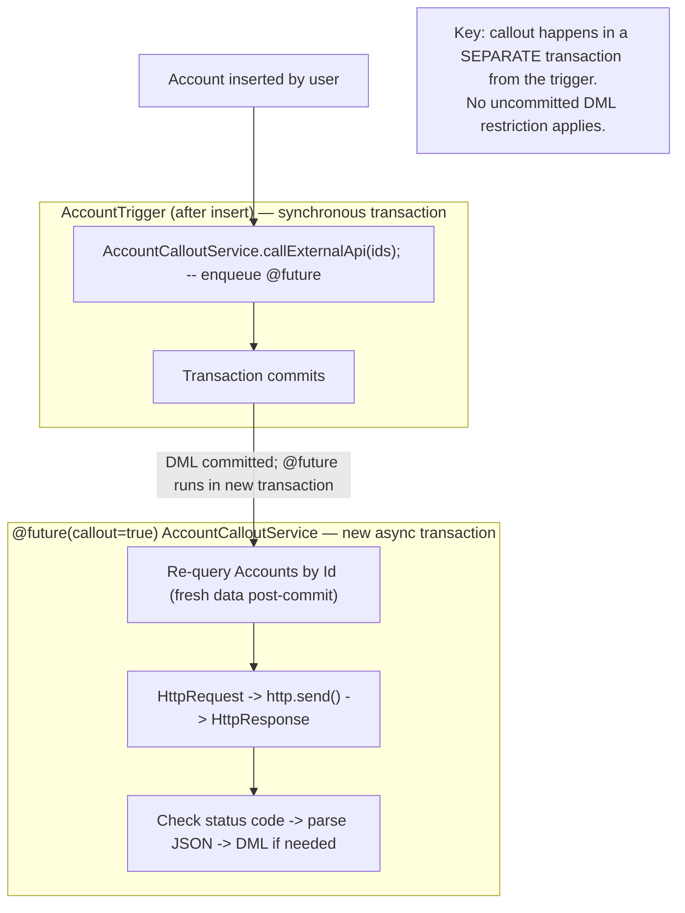

# Apex Integration & Callouts

## Exam Domain
Process Automation & Logic — 30% of exam weight

## Core Concepts

### The Three HTTP Classes
```apex
HttpRequest req = new HttpRequest();
req.setEndpoint('callout:MyService/api/accounts');  // Named Credential syntax
req.setMethod('POST');
req.setHeader('Content-Type', 'application/json');
req.setBody(JSON.serialize(myData));
req.setTimeout(30000);  // 30 seconds; max 120,000 ms

Http http = new Http();
HttpResponse res = http.send(req);

if (res.getStatusCode() == 200) {
    MyResponse data = (MyResponse) JSON.deserialize(res.getBody(), MyResponse.class);
} else {
    throw new CalloutException('HTTP ' + res.getStatusCode() + ': ' + res.getBody());
}
```

### Named Credentials vs Remote Site Settings
| Feature | Named Credentials | Remote Site Settings |
|---------|-------------------|---------------------|
| Stores credentials | Yes | No |
| URL management | Yes | Allowlist only |
| Code reference | `callout:Name` | Full URL in code |
| Auth types | OAuth, Basic, Cert | N/A |
| Best for | Production code | Dev/quick testing |

**Named Credentials** are the production-standard approach — credentials never appear in Apex code or version control.

### JSON Serialization and Deserialization
```apex
// Serialize Apex → JSON string
String jsonOut = JSON.serialize(myAccountObj);

// Deserialize typed: JSON string → Apex class
MyResponse resp = (MyResponse) JSON.deserialize(jsonBody, MyResponse.class);

// Deserialize untyped: JSON string → Map<String, Object>
Map<String, Object> rawData = (Map<String, Object>) JSON.deserializeUntyped(jsonBody);
String value = (String) rawData.get('fieldName');
```
Inner class for typed deserialization:
```apex
public class MyResponse {
    public String status;
    public Integer count;
    public List<ItemWrapper> items;
    public class ItemWrapper {
        public String id;
        public String name;
    }
}
```

### Callouts from Triggers — Cannot Call Directly
Salesforce blocks callouts during uncommitted DML transactions. A trigger ALWAYS has an open transaction. Solution: defer to `@future(callout=true)` or Queueable with `Database.AllowsCallouts`.
```apex
trigger AccountTrigger on Account (after insert) {
    Set<Id> ids = new Map<Id, Account>(Trigger.new).keySet();
    AccountCalloutService.callExternalApi(ids);  // @future method
}

public class AccountCalloutService {
    @future(callout=true)
    public static void callExternalApi(Set<Id> accountIds) {
        List<Account> accs = [SELECT Id, Name FROM Account WHERE Id IN :accountIds];
        // make callout here — transaction is committed
    }
}
```

### Callout Limits
- Max callouts per transaction: **100**
- Max timeout per individual callout: **120 seconds** (120,000 ms)
- Max response body size: **6 MB**
- Callout after uncommitted DML → runtime error (use @future or Queueable)

### Testing Callouts — HttpCalloutMock
Real callouts are blocked in test context. Must implement `HttpCalloutMock` and register with `Test.setMock()`.
```apex
@isTest
public class MockCallout implements HttpCalloutMock {
    public HttpResponse respond(HttpRequest req) {
        HttpResponse res = new HttpResponse();
        res.setStatusCode(200);
        res.setBody('{"status":"success","count":3}');
        return res;
    }
}

@isTest
static void testCallout() {
    Test.setMock(HttpCalloutMock.class, new MockCallout());
    // Now call the code that makes the callout
    AccountCalloutService.callExternalApi(new Set<Id>{'001xx000001'});
    // assert results
}
```

## PTA / SA Relevance

**In partner code reviews, watch for:**
- Hardcoded endpoints with credentials in Apex code — security review will fail; impossible to rotate credentials without code deploy
- Missing `Test.setMock()` in callout tests — test will error instead of running; discovered immediately
- Response body not checked for HTTP status code before parsing — `getStatusCode() != 200` means the body is likely an error message, not valid data; `JSON.deserialize` will throw
- Callout inside a batch execute() without `Database.AllowsCallouts` — will fail at runtime

**Enterprise-scale considerations:**
- Named Credentials + Permission Sets is the right security model: Named Credential defines the connection, Permission Set controls which users/profiles can call the credential-protected endpoint.
- For bidirectional integration (Salesforce calls external, external calls Salesforce), Salesforce Connected Apps + OAuth is the full pattern. External systems authenticate to Salesforce via JWT Bearer Flow or Web Server Flow.
- Integration architecture for high-reliability: add a custom `Integration_Log__c` object. Log every outbound callout: endpoint, method, request body, response status, response body, timestamp. This enables debugging without re-running the integration.
- Rate limiting from external APIs: design retry logic with exponential backoff in Queueable chains. Don't hammering the external API 100 times per batch.

**For CTO conversations:**
- "Can Salesforce connect to our on-premise systems?" — Yes, via Salesforce Connect (OData) for real-time queries, or via MuleSoft/Integration Platform for event-driven sync. Direct Apex callouts work for cloud APIs; on-prem requires an internet-accessible endpoint or integration middleware.
- "How do we handle API failures gracefully?" — Platform Events as error bus: publish error events from catch blocks, subscribe with Apex triggers to log/alert. More reliable than @future-based logging.

## Architecture / How It Works



**Limitations:**
- @future: primitives only in parameters; pass `Set<Id>`, re-query inside
- Cannot make a callout BEFORE DML in the same transaction — once DML occurs, callout blocked until new transaction
- Callout timeout max: 120,000 ms per call

**JSON Deserialization — Typed vs Untyped:**

TYPED (known schema — preferred):

```apex
// JSON: {"status":"ok","count":5,"items":[{"id":"1"}]}

public class ApiResponse {
    public String status;   // must match JSON key
    public Integer count;
    public List<Item> items;
    public class Item { public String id; }
}

ApiResponse r = (ApiResponse) JSON.deserialize(body, ApiResponse.class);
System.debug(r.status);  // 'ok'
```

UNTYPED (dynamic schema — use when structure is unknown):

```apex
Map<String, Object> raw = (Map<String, Object>) JSON.deserializeUntyped(body);
String status = (String) raw.get('status');
List<Object> items = (List<Object>) raw.get('items');
```

**Limitations:**
- JSON property names are case-sensitive during deserialization — Apex class field names must match JSON keys exactly
- `JSON.deserialize` throws exception if JSON structure doesn't match the class — wrap in try/catch
- Nested objects need nested Apex classes; primitive arrays map to `List<Type>`

| Limit | Value |
|-------|-------|
| Callouts per transaction | 100 |
| Timeout per callout (max) | 120,000 ms |
| Response body size | 6 MB |
| Concurrent @future callout jobs | 50 per transaction |

Named Credential syntax: `callout:CredentialName/path`
Test mock: `Test.setMock(HttpCalloutMock.class, mockInstance)`

**Limitations:**
- Callout limit (100) is separate from SOQL limit (100) — they don't share the same counter
- 6 MB response limit — large API responses (full record sets) need pagination

## Key Facts to Memorize
- HTTP classes: `HttpRequest` (configure) → `Http.send()` (execute) → `HttpResponse` (result)
- Named Credentials syntax in code: `callout:CredentialName`
- Callout from trigger: MUST use `@future(callout=true)` or `Queueable + Database.AllowsCallouts`
- JSON typed: `JSON.deserialize(body, MyClass.class)` — must cast to correct type
- JSON untyped: `JSON.deserializeUntyped(body)` → `Map<String, Object>`
- Testing: implement `HttpCalloutMock`, register with `Test.setMock()`
- Callout limits: **100/tx**, **120s max timeout**, **6 MB response**

## Customer Advisory Tips
- **Integration security standard:** Named Credentials for all production integrations. No credentials in Apex. Documented in integration architecture design.
- **Reliability:** Build integration logging from day one. `Integration_Log__c` with request/response details. Retry capability for transient failures.
- **AppExchange vs custom:** For common integrations (ERP like SAP/NetSuite, marketing tools, etc.), check AppExchange first. Many have certified connectors. Build custom only for proprietary APIs or unique requirements.

## Exam Traps
- Callout directly inside a trigger = **runtime error** — must use @future or Queueable
- `callout:Name` is Named Credential syntax — NOT Remote Site Settings
- Testing without `Test.setMock()` = test throws exception ("Callouts not supported in test context")
- `JSON.deserialize` requires explicit cast: `MyClass obj = (MyClass) JSON.deserialize(...)`
- `JSON.deserializeUntyped` returns `Object` that must be cast to `Map<String, Object>` before use
- Max callout timeout: **120 seconds** (not unlimited, not 60 seconds)

## Practice Questions

**Q:** A trigger needs to send Account data to an external REST API after insert. Which is the correct approach?
**A:** Create a `@future(callout=true)` static method, pass Account IDs (not sObjects), re-query inside @future, make the callout there. Or use a Queueable that implements `Database.AllowsCallouts`.

**Q:** What is the correct syntax to reference a Named Credential called `SAPSystem` in an endpoint URL?
**A:** `req.setEndpoint('callout:SAPSystem/api/orders')` — the `callout:` prefix followed by the Named Credential's developer name.

**Q:** A test calls Apex code that makes an HTTP callout. The test fails with an error. What is needed?
**A:** Implement `HttpCalloutMock`, register it: `Test.setMock(HttpCalloutMock.class, new MyMock())` before calling the code under test. The mock's `respond()` method returns a fake `HttpResponse`.
