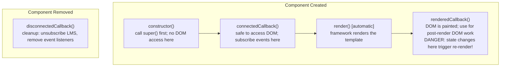

# LWC Fundamentals

## Exam Domain
User Interface — 25% of exam weight

## Core Concepts

### Component Bundle Structure
```
myComponent/
├── myComponent.html         ← template (required; single <template> root)
├── myComponent.js           ← JS class (required; extends LightningElement)
├── myComponent.css          ← scoped styles (optional)
├── myComponent.js-meta.xml  ← deployment config (required)
└── myComponent.svg          ← App Builder icon (optional)

All files MUST share the same name as the folder.
Folder: kebab-case → JS class: PascalCase (e.g., my-account-tile → MyAccountTile)
```

### The JavaScript Class
```javascript
import { LightningElement, api, track, wire } from 'lwc';

export default class MyComponent extends LightningElement {
    @api recordId;           // PUBLIC — parent can set this
    title = 'Hello';         // private, reactive (re-renders on change)

    connectedCallback() {
        // runs when component added to DOM
    }

    disconnectedCallback() {
        // runs when component removed — cleanup here
    }

    renderedCallback() {
        // runs after every render — avoid state changes here (infinite loop risk)
    }
}
```

### Decorators
| Decorator | Purpose |
|-----------|---------|
| `@api` | Public property/method — parent can set or call |
| `@track` | Deep reactivity for objects/arrays (rarely needed now — all props are reactive) |
| `@wire` | Declarative data binding (covered in L19) |
| No decorator | Private, reactive by default |

### Conditional Rendering
```html
<!-- Modern (Spring '23+) — preferred -->
<template lwc:if={isActive}>Active</template>
<template lwc:elseif={isPending}>Pending</template>
<template lwc:else>Inactive</template>

<!-- Legacy (still on exam) -->
<template if:true={isActive}>Active</template>
<template if:false={isActive}>Inactive</template>
```

### List Rendering
```html
<!-- for:each — key required on FIRST CHILD ELEMENT (not on template) -->
<template for:each={contacts} for:item="contact">
    <p key={contact.Id}>{contact.Name}</p>
</template>

<!-- iterator — access .first, .last flags -->
<template iterator:it={contacts}>
    <p key={it.value.Id}
       class={it.first ? 'first-item' : ''}>{it.value.Name}</p>
</template>
```
`key` attribute is required — must be unique string/ID. Omitting causes runtime warning.

### Shadow DOM and CSS Scoping
CSS in component's `.css` file applies ONLY to that component's template. Parent styles cannot penetrate child shadow boundaries. Use SLDS utility classes (available inside all shadow roots) for consistent styling.

### js-meta.xml — Deployment Configuration
```xml
<?xml version="1.0" encoding="UTF-8"?>
<LightningComponentBundle xmlns="http://soap.sforce.com/2006/04/metadata">
    <apiVersion>59.0</apiVersion>
    <isExposed>true</isExposed>        <!-- false = component only usable programmatically -->
    <targets>
        <target>lightning__RecordPage</target>
        <target>lightning__AppPage</target>
        <target>lightning__HomePage</target>
        <target>lightning__FlowScreen</target>
    </targets>
</LightningComponentBundle>
```

### Lifecycle Hooks
```
constructor()        → no DOM access; call super() first
connectedCallback()  → DOM ready; subscribe events, load data
renderedCallback()   → after every render; be careful of loops
disconnectedCallback()→ cleanup listeners, subscriptions, timers
errorCallback()      → catch errors from child components
```

## PTA / SA Relevance

**In partner code reviews, watch for:**
- `renderedCallback()` with state mutations — triggers re-render → infinite loop. Use a flag to guard.
- Not unsubscribing from LMS or event listeners in `disconnectedCallback()` — memory leaks in complex apps
- `@api` properties named with `on` prefix or named `class`/`slot` — compile error
- Missing `key` on `for:each` items — silent rendering bugs with list reordering

**Enterprise-scale considerations:**
- LWC component granularity matters. Enterprise apps often have too few or too many components. Aim for components that own one concern (a form, a data table, a header). Shared utility components go in a `c-lib-` namespace.
- `isExposed: false` in js-meta.xml for base components used only programmatically — prevents accidental admin drag-drop to record pages where they need context to work.
- Performance: LWC is client-side, so first render is fast; but `@wire` calls to Apex still count as SOQL. Design for pagination and limit the initial data load.

**For CTO conversations:**
- "Should we use Aura or LWC for new development?" — Always LWC for new components. Aura is legacy; LWC is faster, standards-based, and the investment direction.
- "Can LWC replace Visualforce?" — Yes for user-facing UI. Not for document generation (PDF output still needs VF). For email templates, VF is still used.

## Architecture / How It Works

```
LWC COMPONENT BUNDLE -- FULL ANATOMY

myAccountTile/
  myAccountTile.html           -- template
    <template>
      <lightning-card title={title}>
        <template lwc:if={account}>
          <p>{account.Name}</p>
        </template>
      </lightning-card>
    </template>

  myAccountTile.js             -- controller
    import { LightningElement, api } from 'lwc';
    export default class MyAccountTile extends LightningElement {
        @api accountId;
        account = null;
        connectedCallback() { /* load data */ }
    }

  myAccountTile.css            -- scoped styles (only THIS component)
    .card-header { font-weight: bold; }

  myAccountTile.js-meta.xml    -- deployment config
    <isExposed>true</isExposed>
    <targets><target>lightning__RecordPage</target></targets>
```

**Limitations:**
- All files must have the SAME name as the folder — misnamed files cause deploy errors
- Template must have a single `<template>` root element — no `<div>` or other root
- `@api` properties are reactive but cannot be mutated inside the component — they are owned by the parent



**Limitations:**
- `constructor()` cannot access DOM or child component elements
- `renderedCallback()` can cause infinite loops if it changes state — use a guard flag
- `@api` properties received from parent cannot be directly mutated in the child

**CSS Shadow DOM Encapsulation:**

`parent-component.css`: `.title { color: red; }` — applies to parent ONLY.

Child component is inside a shadow boundary — `parent-component.css` `.title` rule **cannot reach into** the child component's shadow DOM.

Cross-boundary styling options:
- SLDS utility classes (`slds-text-heading_small`, etc.) — work across shadow boundaries
- CSS custom properties (`--my-color: red`) — can cross shadow boundaries
- `:host` pseudo-class — styles the component root from inside

**Limitations:**
- Cannot use parent CSS classes to style child component internals
- SLDS utility classes work across shadow boundaries — use them for consistent design
- Global stylesheet injection into shadow DOM is not recommended and may break in future

## Key Facts to Memorize
- Component bundle: all files must have **same name as folder**
- Template root: single `<template>` tag (not `<div>`)
- `@api` = public; no decorator = private, reactive
- `for:each` key goes on **first child element** (not on `<template>` tag)
- `key` attribute is **required** in for:each — must be unique
- `isExposed: true` required for App Builder visibility
- `connectedCallback()` = safe initialization point
- `renderedCallback()` = post-render; avoid state mutations
- `disconnectedCallback()` = cleanup

## Customer Advisory Tips
- **Component standards:** Define naming conventions (`c-lib-` for shared utilities, `c-feature-` for feature-specific). Establish `isExposed` standards — most components should be `false` until designed for admin drag-drop.
- **LWC vs Aura migration:** For ISV partners, new managed package features should be LWC only. For enterprise customers, prioritize LWC migration for components on high-traffic pages.

## Exam Traps
- `key` attribute goes on the **first child inside for:each**, NOT on the `<template>` tag
- `isExposed: false` means the component CAN still be used programmatically by other components — just not in App Builder
- `@api` property mutation inside the child component is an anti-pattern — `@api` properties are owned by the parent
- Folder name and all file names must be **identical** — case matters
- `renderedCallback` runs after EVERY render — not just the first — state changes inside = infinite loop

## Practice Questions

**Q:** A for:each list renders Account cards. After reordering accounts, cards display in the wrong order. What's likely wrong?
**A:** The `key` attribute is probably using array index instead of a unique ID (`key={account.Id}`). Using index breaks virtual DOM diffing when order changes. Use a unique, stable key (record Id).

**Q:** A component should appear in App Builder for Lightning Home Pages. What must be in js-meta.xml?
**A:** `<isExposed>true</isExposed>` AND `<target>lightning__HomePage</target>` inside the `<targets>` block.

**Q:** Which lifecycle hook is the correct place to subscribe to a Lightning Message Service channel?
**A:** `connectedCallback()` — this is when the component is added to the DOM and ready to participate in communication. Always pair with `disconnectedCallback()` to unsubscribe.
