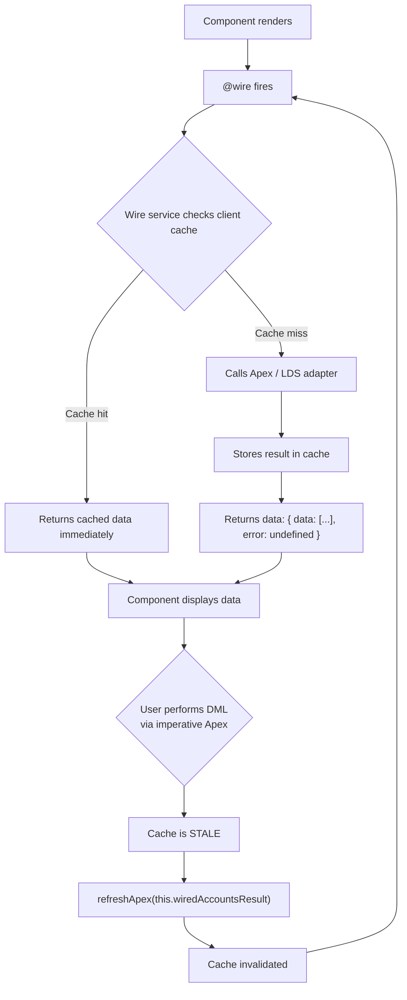

# LWC Wire Service & Apex

## Exam Domain
User Interface — 25% of exam weight

## Core Concepts

### @wire — Reactive Data Binding
Wire service connects component properties to Salesforce data sources. Data fetched automatically on load; re-fetched when reactive (`$`-prefixed) parameters change. Result always has `{ data, error }` structure.

### @wire with Salesforce LDS Adapters
```javascript
import { LightningElement, api, wire } from 'lwc';
import { getRecord, getFieldValue } from 'lightning/uiRecordApi';
import ACCOUNT_NAME from '@salesforce/schema/Account.Name';
import ACCOUNT_INDUSTRY from '@salesforce/schema/Account.Industry';

export default class AccountDetail extends LightningElement {
    @api recordId;

    @wire(getRecord, { recordId: '$recordId', fields: [ACCOUNT_NAME, ACCOUNT_INDUSTRY] })
    wiredAccount;

    get name() {
        return getFieldValue(this.wiredAccount.data, ACCOUNT_NAME);
    }
}
```
`'$recordId'` — `$` prefix makes parameter reactive. When `recordId` changes, wire re-fetches.

### @wire with Apex Methods
```javascript
import { LightningElement, wire } from 'lwc';
import getAccounts from '@salesforce/apex/AccountController.getAccounts';

export default class AccountList extends LightningElement {
    // Wired as property
    @wire(getAccounts) accounts;  // { data: [...], error: undefined }

    // Wired as function (for side effects)
    wiredAccountsResult;  // store for refreshApex
    @wire(getAccounts)
    wiredAccountsHandler(result) {
        this.wiredAccountsResult = result;  // MUST store full result
        if (result.data) {
            this.processedAccounts = result.data.map(a => ({ ...a, label: a.Name }));
        }
    }
}
```
Apex method MUST have `@AuraEnabled(cacheable=true)`. Non-cacheable methods cannot be wired.

### Imperative Apex — For DML and Conditional Calls
```javascript
import { LightningElement } from 'lwc';
import saveAccount from '@salesforce/apex/AccountController.saveAccount';
import { refreshApex } from '@salesforce/apex';

export default class AccountForm extends LightningElement {
    wiredResult;  // stored from @wire function

    async handleSave() {
        try {
            await saveAccount({ account: this.formData });  // imperative call — DML ok
            await refreshApex(this.wiredResult);             // refresh wired data after DML
        } catch (error) {
            this.errorMessage = error.body.message;
        }
    }
}
```

### refreshApex() — Invalidate Wire Cache After DML
After a write operation, wired cache is stale. `refreshApex()` forces re-fetch.
- Import: `import { refreshApex } from '@salesforce/apex'`
- Must pass the **entire wired result object** (the `{ data, error }` object), NOT just `data`
- For wired property: `refreshApex(this.wiredAccounts)`
- For wired function: store full result in instance variable, pass that

### NavigationMixin — Programmatic Navigation
```javascript
import { LightningElement } from 'lwc';
import { NavigationMixin } from 'lightning/navigation';

export default class MyComponent extends NavigationMixin(LightningElement) {
    navigateToRecord(recordId) {
        this[NavigationMixin.Navigate]({
            type: 'standard__recordPage',
            attributes: {
                recordId: recordId,
                actionName: 'view'
            }
        });
    }
}
```

### LDS Base Components — No Apex Needed
For standard single-record CRUD, use base components:
- `lightning-record-form` — full create/view/edit form
- `lightning-record-view-form` + `lightning-output-field` — display-only
- `lightning-record-edit-form` + `lightning-input-field` — edit with custom layout

### Data Access Decision Guide
| Need | Approach |
|------|---------|
| Standard single-record CRUD | LDS base components |
| Read with complex SOQL | `@wire` with `@AuraEnabled(cacheable=true)` Apex |
| DML / user-triggered write | Imperative Apex (non-cacheable) |
| Refresh after write | `refreshApex(wiredRef)` |
| Navigate programmatically | `NavigationMixin.Navigate` |

## PTA / SA Relevance

**In partner code reviews, watch for:**
- Passing only `wiredResult.data` to `refreshApex()` instead of `wiredResult` — common mistake, silently fails (refreshApex gets undefined)
- Calling a cacheable Apex method for DML — compile-time miss, runtime error when DML is attempted
- Mixing `@wire` and imperative calls to the same method without understanding they operate on different caches — can cause stale data

**Enterprise-scale considerations:**
- For lists with large data sets, don't wire unlimited SOQL queries. Apex methods should always have pagination or LIMIT in the SOQL. Client-side infinite scroll patterns use imperative calls with offset parameters.
- LDS wire adapters (getRecord) use the platform cache — multiple components querying the same record share one network call. This is a significant performance advantage over Apex for simple record reads.
- For high-frequency reactive updates (e.g., picklist selection changes triggering data re-fetch), debounce parameter updates to avoid flooding the server.

**For CTO conversations:**
- "How do our LWC components stay in sync after DML?" — `refreshApex()` + wire service cache invalidation is the standard pattern. For real-time multi-user sync, Streaming API or Platform Events are the answer.

## Architecture / How It Works



**Limitations:**
- `@wire` only works with `@AuraEnabled(cacheable=true)` methods — DML in cacheable methods throws
- `refreshApex()` requires the stored wired result reference — if not stored, cannot refresh
- `@wire` adapters fetch on every component render — use reactive parameters wisely

| Scenario | Use `@wire` | Imperative |
|----------|-------------|------------|
| Load data on component render | YES | Maybe |
| Reactive re-load on ID change | YES | No |
| DML (insert/update/delete) | No | YES |
| Load on button click | No | YES |
| Conditional load | No | YES |
| Load with complex params | YES (reactive `$` params) | YES |

**Limitations:**
- Wire cannot be conditionally prevented — it fires when the component renders
- Wire result is read-only — cannot mutate `wiredResult.data` directly

```
NavigationMixin PAGE REFERENCE TYPES

  // Record page (view/edit)
  { type: 'standard__recordPage',
    attributes: { recordId: id, actionName: 'view' } }

  // Object home page
  { type: 'standard__objectPage',
    attributes: { objectApiName: 'Account', actionName: 'list' } }

  // Named page (home, chatter, etc.)
  { type: 'standard__namedPage',
    attributes: { pageName: 'home' } }

  // VF page (legacy)
  { type: 'standard__webPage',
    attributes: { url: '/apex/MyPage?id=' + id } }
```

**Limitations:**
- `NavigationMixin` must be applied as `extends NavigationMixin(LightningElement)` — cannot be imported standalone
- Navigation in mobile Salesforce app has different behavior for some page reference types

## Key Facts to Memorize
- `@wire` with Apex: method MUST have `@AuraEnabled(cacheable=true)`
- `$` prefix on wire parameter = reactive (re-fetches when value changes)
- `@wire` result: always `{ data, error }` — handle both
- `refreshApex()`: pass the **entire wired result object** (not just `.data`)
- Imperative Apex for: DML, button-triggered, conditional calls
- `NavigationMixin`: `extends NavigationMixin(LightningElement)` — then `this[NavigationMixin.Navigate](pageRef)`
- LDS base components: `lightning-record-form` for no-code single-record CRUD

## Customer Advisory Tips
- **LDS first:** For standard record CRUD, use `lightning-record-form` before writing any Apex. Saves development time and leverages platform caching.
- **Pagination design:** Any Apex method wired to display a list should support LIMIT + OFFSET or cursor pagination. Never load unbounded lists.

## Exam Traps
- `refreshApex(this.wiredResult.data)` = wrong — must be `refreshApex(this.wiredResult)` (the whole object)
- `@wire` with non-cacheable Apex method = runtime error (not compile error)
- `@AuraEnabled(cacheable=true)` with DML = runtime error when called via @wire
- `$recordId` (wire param) vs `this.recordId` (JS) — `$` is only in the wire parameter declaration, not in JS code
- `NavigationMixin` must be applied as a mixin in the `extends` clause, not imported as a function

## Practice Questions

**Q:** After a user inserts a Contact via imperative Apex, the @wire-populated Contact list still shows old data. How do you fix it?
**A:** Call `refreshApex(this.wiredContactsResult)` — where `this.wiredContactsResult` is the stored wired result object (stored from a `@wire` function). This invalidates the wire cache and triggers a re-fetch.

**Q:** An Apex method needs to be used with the `@wire` decorator in LWC. What annotation is required on the Apex method?
**A:** `@AuraEnabled(cacheable=true)` — `cacheable=true` is required for `@wire`. The method must not perform DML.

**Q:** A developer imports `getRecord` from `lightning/uiRecordApi` and wires it with `{ recordId: '$recordId' }`. When will the wire re-fetch?
**A:** Whenever the `recordId` @api property changes — the `$` prefix makes it a reactive parameter. Any parent that changes `record-id` attribute triggers a re-fetch.
