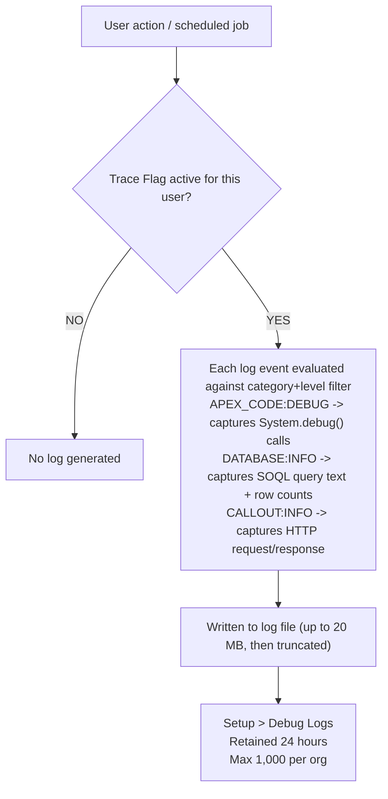

# Debugging Tools

## Exam Domain
Testing, Debugging & Deployment — 22% of exam weight

## Core Concepts

### Debug Logs — Configuration and Retention
Debug logs capture execution for a specific user or automated process. Configure via Setup > Debug Logs: add a trace flag for the user, set category levels, set duration (default 30 min), then trigger the code.

Key limits:
- Retained for **24 hours** or **1,000 logs per org** (whichever comes first)
- Maximum log size: **20 MB** (truncated with warning after that)
- Log categories: `APEX_CODE`, `APEX_PROFILING`, `CALLOUT`, `DATABASE`, `SYSTEM`, `VALIDATION`, `VISUALFORCE`, `WORKFLOW`

### Log Levels — Verbosity Scale
```
NONE → ERROR → WARN → INFO → DEBUG → FINE → FINER → FINEST
(lowest)                                            (highest)
```
Higher levels include all messages from lower levels. For most debugging: `APEX_CODE: DEBUG` + `DATABASE: INFO` covers 90% of needs. Add `CALLOUT: INFO` when debugging integrations.

### System.debug() and LoggingLevel
```apex
// Default: writes at DEBUG level under APEX_CODE
System.debug('Account Rating: ' + acct.Rating);

// Explicit level — only visible when log filter captures that level or higher
System.debug(LoggingLevel.WARN, 'Revenue below threshold: ' + acct.AnnualRevenue);
System.debug(LoggingLevel.FINE, 'Full record: ' + JSON.serialize(acct));

// Log line format:
// timestamp | APEX_CODE | DEBUG | [line#] | USER_DEBUG | message
```
Use `FINE` for routine trace output — it only appears during deep debugging sessions. Use `WARN` or `ERROR` for conditions that should always appear.

### Developer Console — Log Inspector
Access via gear icon → Developer Console. Key panels:
- **Execution Log** — chronological list of log events with timestamps
- **Stack Tree** — hierarchical view of method calls
- **Source** — jumps to the exact source line for the selected log event
- **Variables/View State** — shows variable values at the selected point
- **Query Editor** — run SOQL directly against the org
- **Execute Anonymous** — run Apex snippets without deploying

### Execute Anonymous — Quick Testing
Run Apex code immediately without creating a class. Perfect for: quick data fixes, exploring API behavior, prototyping logic before committing to a class.
```apex
// Quick test: does this SOQL return what I expect?
List<Account> accts = [SELECT Id, Name, Rating FROM Account WHERE AnnualRevenue > 1000000 LIMIT 5];
for (Account a : accts) {
    System.debug(a.Name + ' | ' + a.Rating);
}
```
Access: Developer Console → Debug → Open Execute Anonymous Window (`Ctrl+E`), or via CLI: `sf apex run --file script.apex`.
Anonymous Apex runs under the same governor limits as any other Apex — no relaxation.

### Checkpoints — Heap Inspection
Set in Developer Console's source gutter (left margin, or `Ctrl+Shift+K`). Maximum **5 checkpoints** per transaction. After execution, inspect the Checkpoints tab to see all variable values at that instant. Code does NOT pause — checkpoints capture a snapshot and execution continues.

### VS Code + Apex Replay Debugger
```bash
sf apex log list                     # list all logs in org
sf apex log get --log-id <id>        # download specific log
sf apex log tail                     # stream logs in real time
```
Apex Replay Debugger: download log → open in VS Code → set breakpoints → step through historical execution with full variable inspection. Available in scratch orgs and sandboxes.

## PTA / SA Relevance

**In partner code reviews, watch for:**
- `System.debug` calls left in production code at `DEBUG` level for highly sensitive data (PII, credentials) — these will appear in logs visible to admins
- Extensive `System.debug` everywhere with no `LoggingLevel` parameter — all debug output is at DEBUG level by default, which fills logs fast
- `seeAllData=false` missing in test classes makes log-based debugging misleading (org data vs test data confusion)
- No log management in high-volume production flows — leaving a trace flag on with FINEST on a high-traffic org can cause the 1,000-log limit to fill in minutes

**Enterprise-scale considerations:**
- In production orgs, enable debug logs only for targeted users for the shortest possible duration. Log `APEX_CODE: DEBUG` and `DATABASE: INFO` — never `FINEST` on all categories in production.
- The Apex Replay Debugger eliminates the need for extensive `System.debug` instrumentation in code. Download a production log, replay it locally with breakpoints.
- For complex batch job debugging, log the batch job ID (from `bc.getJobId()`) in `start()` and use it to filter logs to just that execution.
- Automated log retrieval in CI/CD: pipe `sf apex log get` output to log aggregators (Splunk, Datadog) for centralized observability.

**For CTO conversations:**
- "How do we debug issues in production Apex without live debugger access?" — Structured System.debug with LoggingLevel tiers, short-duration trace flags, Apex Replay Debugger for post-hoc step-through. For proactive observability, Platform Events + Event Monitoring for audit-level logging.
- "How much does debug logging impact performance?" — Minimal for well-configured logs. FINEST on all categories can noticeably slow execution; targeted DEBUG-level logging has negligible overhead.

## Architecture / How It Works



**Limitations:**
- 20 MB max per log — long batch jobs or FINEST-level logging on heavy transactions will truncate
- 1,000 log org limit — high-volume orgs cycle through this quota quickly; download logs before they expire
- Trace flags expire after the configured duration (default 30 min) — code that runs after expiry produces no log

| Message Level | NONE | ERROR | WARN | INFO | DEBUG | FINE | FINER | FINEST |
|---|---|---|---|---|---|---|---|---|
| ERROR message | no | YES | YES | YES | YES | YES | YES | YES |
| WARN message | no | no | YES | YES | YES | YES | YES | YES |
| INFO message | no | no | no | YES | YES | YES | YES | YES |
| DEBUG message | no | no | no | no | YES | YES | YES | YES |
| FINE message | no | no | no | no | no | YES | YES | YES |
| FINER message | no | no | no | no | no | no | YES | YES |
| FINEST message | no | no | no | no | no | no | no | YES |

`System.debug()` default = DEBUG level. `System.debug(LoggingLevel.WARN, ...)` = WARN level.

**Limitations:**
- A log filter set to WARN will NOT capture default `System.debug()` calls (those are at DEBUG)
- Setting all categories to FINEST is rarely useful in production — use targeted levels

**Developer Console — Log Inspector Panels:**

**Execution Log** (chronological events):
```
[0.00]  EXECUTION_STARTED
[0.01]  CODE_UNIT_STARTED  AccountTrigger
[0.02]  SOQL_EXECUTE_BEGIN  [SELECT Id FROM Account]
[0.03]  SOQL_EXECUTE_END   rows: 5
[0.04]  USER_DEBUG  [12]  DEBUG  Rating = Hot   <- click this line
```

**Source** (jumps to line 12 of the class):
```apex
System.debug('Rating = ' + acct.Rating);  // highlighted
```

**Variables at line 12:**
```
acct.Rating = 'Hot'
acct.AnnualRevenue = 15000000
```

**Limitations:**
- Developer Console can only inspect already-captured logs — not live execution
- Variables panel only shows local variables in scope at that event, not all class-level state
- Large logs (>10 MB) can make Developer Console slow to parse — download and use VS Code for large logs

## Key Facts to Memorize
- Debug log retention: **24 hours**, **1,000 per org**, **20 MB max per log**
- Log levels in order: `NONE → ERROR → WARN → INFO → DEBUG → FINE → FINER → FINEST`
- `System.debug()` default level = `DEBUG` under `APEX_CODE`
- Log filter set to `WARN` will NOT capture default `System.debug()` calls
- Max **5 checkpoints** per transaction in Developer Console
- Checkpoints capture heap snapshot — code does NOT pause
- Anonymous Apex = same governor limits as any other Apex (no relaxation)
- Apex Replay Debugger uses a **saved log** — not a live connection to the running process

## Customer Advisory Tips
- **Structured logging convention:** Adopt a convention for `System.debug` levels in your org: FINE for trace/verbose, INFO for state transitions, WARN for unexpected-but-handled situations, ERROR for exceptions. This makes targeted log capture much more effective.
- **Don't leave debug statements in managed packages:** They appear in subscriber org logs even when subscribers don't have trace flags set, which both clutters logs and can leak implementation details.
- **Apex Replay Debugger over extensive System.debug:** Train developers to download and replay logs rather than instrumenting code with dozens of debug statements before they understand the problem.

## Exam Traps
- Log level set to `WARN` does NOT capture `System.debug('message')` — that's at DEBUG level, which is higher verbosity than WARN
- The 24-hour retention and 1,000-log limit are independent — a log expires at whichever comes first
- Checkpoints do NOT pause execution — they capture a snapshot while code continues running
- Anonymous Apex runs under the **same** governor limits — no relaxed limits, no special context
- Apex Replay Debugger uses a **historical log** — it does not attach to a live running process

## Practice Questions

**Q:** A developer sets `APEX_CODE` log level to `WARN`. Which call appears in the log?
**A:** Only `System.debug(LoggingLevel.WARN, ...)` or `LoggingLevel.ERROR` calls. Default `System.debug()` is at DEBUG level, which is BELOW WARN on the scale and will not appear.

**Q:** How many checkpoints can be active in a single Apex transaction in the Developer Console?
**A:** 5. Checkpoints capture a heap snapshot at that code line but do not pause execution. The snapshot is inspectable in the Checkpoints tab after the transaction completes.

**Q:** A developer wants to immediately run a SOQL query against production data and see results without creating a class. What is the correct approach?
**A:** Execute Anonymous window in the Developer Console (Debug > Open Execute Anonymous Window). Run a SOQL query and `System.debug()` the results. No class is saved; output appears in the debug log immediately.

**Q:** The Apex Replay Debugger is described as "step-through debugging." What is it actually stepping through?
**A:** A downloaded debug log — not a live process. The debugger replays historical execution recorded in the log, allowing variable inspection at each step. A new execution is not triggered.
