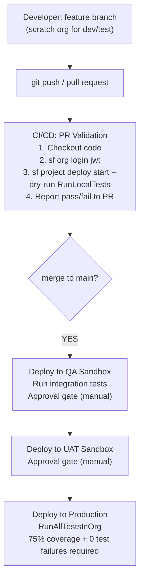

# Deployment & Change Management

## Exam Domain
Testing, Debugging & Deployment — 22% of exam weight

## Core Concepts

### Deployment Methods — Three Approaches
Salesforce has three ways to move metadata between environments: change sets (GUI), CLI (source-format), and packages (artifact-based).

| Method | Version Control | Rollback | Use Case |
|--------|----------------|----------|----------|
| Change Set | No | Manual | Small teams, occasional deploys |
| Salesforce CLI | Yes (git) | Git revert | Teams with source control |
| Unlocked Package | Yes (artifact) | Install prior version | Modular enterprise development |
| Managed Package | Yes | Version rollback | ISV/AppExchange distribution |

All production deployments require **75% Apex code coverage** and **zero test failures**.

### Change Sets — GUI-Driven Org-to-Org
```
Setup > Deploy > Outbound Change Sets > New
  → Add Components (select metadata types and members)
  → Upload to connected org

Target org > Setup > Deploy > Inbound Change Sets
  → Validate (runs tests without committing)
  → Deploy
```
- Requires **Deployment Connection** configured between source and target orgs
- Does NOT capture data — metadata only
- No version history, no rollback, no diff view
- Dependent components must be manually included

### Salesforce CLI — Source-Format Commands
```bash
# Authenticate to org
sf org login web --alias myDev

# Retrieve specific metadata from org
sf project retrieve start --metadata ApexClass:AccountService

# Deploy local directory to org
sf project deploy start --source-dir force-app

# Validate (dry run) — tests run, nothing committed
sf project deploy start --dry-run --test-level RunLocalTests --target-org myDev

# Deploy with explicit test level
sf project deploy start --source-dir force-app --test-level RunAllTestsInOrg
```

### Test Levels for Deployment
| Test Level | What Runs | When to Use |
|-----------|-----------|-------------|
| `NoTestRun` | Nothing | Sandboxes only — never production |
| `RunSpecifiedTests` | Named classes only | When those classes cover the deployed code |
| `RunLocalTests` | All non-package tests | Standard for CI/CD sandbox validation |
| `RunAllTestsInOrg` | Every test in org | Production deployments via API |

Default for production change sets: all local tests run automatically.

### Scratch Orgs and Source Tracking
Scratch orgs are temporary, disposable developer environments (expire in 1–30 days). Configured via `config/project-scratch-def.json`.

Source tracking: CLI automatically tracks which files changed between local and org.
```bash
sf org create scratch --definition-file config/project-scratch-def.json --alias myFeature

# Push local changes to scratch org
sf project deploy start

# Pull org changes back to local (e.g., flow built in UI)
sf project retrieve start
```
No production data in scratch orgs — seed test data via Apex scripts or plan files.

### Packages — Unlocked vs Managed
```bash
# Create unlocked package
sf package create --name "AccountFeature" --type Unlocked --path force-app

# Create a package version
sf package version create --package "AccountFeature" --installation-key-bypass --wait 10

# Install in target org
sf package install --package 04t... --target-org myProd --wait 10
```

| | Unlocked Package | Managed Package |
|---|---|---|
| Source visible to subscriber | Yes | No (obfuscated) |
| Namespace required | No | Yes |
| Subscriber can modify | Yes | Limited (config only) |
| AppExchange distribution | No | Yes |

### CI/CD with GitHub Actions and JWT Authentication
JWT Bearer Flow is required for CI/CD — no browser popup, no interactive login.
```yaml
# .github/workflows/deploy.yml
jobs:
  validate:
    runs-on: ubuntu-latest
    steps:
      - uses: actions/checkout@v3

      - name: Authenticate via JWT
        run: sf org login jwt
               --username ${{ secrets.SF_USERNAME }}
               --jwt-key-file server.key
               --client-id ${{ secrets.SF_CLIENT_ID }}
               --alias prodOrg

      - name: Validate deployment
        run: sf project deploy start
               --dry-run
               --test-level RunLocalTests
               --target-org prodOrg

      - name: Deploy on merge to main
        if: github.ref == 'refs/heads/main'
        run: sf project deploy start
               --test-level RunAllTestsInOrg
               --target-org prodOrg
```
Connected App must have a pre-authorized certificate. Secret `server.key` (private key) stored in GitHub Secrets.

## PTA / SA Relevance

**In partner code reviews, watch for:**
- Customer teams still using change sets for everything — no version history means no audit trail, no diff, no ability to understand what changed when a deployment caused an incident
- `NoTestRun` used in CI pipelines because "it's just a sandbox" — tests exist to be run; skipping them in CI defeats the purpose
- Hardcoded sandbox org IDs or Named Credentials in code that gets promoted to production — deployment fails or silently uses wrong endpoint
- Managed package components accidentally included in unlocked packages — creates namespace conflicts

**Enterprise-scale considerations:**
- For multi-org enterprises (multiple sandboxes, UAT, production), the deployment pipeline is a critical piece of architecture. Define environment hierarchy, deployment gates (who approves sandbox→UAT, UAT→prod), and rollback procedures before anything ships.
- Scratch org-based development is the Salesforce-recommended model for teams adopting package-based development. Each feature branch gets its own scratch org, verified in isolation, then the package version is promoted.
- JWT Bearer Flow is non-negotiable for CI/CD. Store the private key as a CI secret, not in the repo. Rotate certificates on the same schedule as other service account credentials.
- For large orgs with 1,000+ Apex classes, `RunAllTestsInOrg` can take 20–60 minutes. Use `RunLocalTests` for PR validation and reserve `RunAllTestsInOrg` for production deployments.

**For CTO conversations:**
- "How do we ensure deployments don't break production?" — Validation-only deploy (dry run) on every PR. Automated test runs in CI. Staged promotion: Dev → QA → UAT → Prod with approvals. Feature flags for risky changes.
- "What's the difference between our sandbox and scratch org strategy?" — Sandboxes are long-lived and share org configuration history; scratch orgs are disposable and start clean from a definition file. Scratch orgs are for development; sandboxes are for QA and UAT.
- "We had a deployment fail in production after passing in sandbox." — Usually: coverage gap exposed by org-wide test run, dependency missing from the change set, or production-specific data the tests relied on.

## Architecture / How It Works



**Limitations:**
- Production deployments require RunAllTestsInOrg or change set (all local tests) — no bypass
- 75% coverage is org-wide: one class at 0% can block deployment if org average drops below threshold
- Scratch orgs expire after maximum 30 days — don't build long-lived environments on them

| Dimension | Change Set | CLI (Source Format) |
|---|---|---|
| Version control | None (GUI-only) | Files in git — full history |
| Component selection | Manual, per-item | Entire directory or specific files |
| Diff view | None — blind addition | Git diff before deployment |
| Dry run | Validate available | `--dry-run` available |
| Rollback | None | Git revert + redeploy |
| Setup required | Works out of the box | CLI setup + auth |
| Team size fit | Fine for 1–2 person teams | Required for 3+ person teams |

**Limitations:**
- Change sets cannot deploy data (records) — metadata only
- Change sets require a pre-configured Deployment Connection between orgs
- CLI requires SFDX project structure (`sfdx-project.json`, `force-app/` directory)

**Test Level Decision Guide:**

- **Deploying to sandbox via CI pipeline** — `RunLocalTests` (fast, catches your code, skips managed package tests)
- **Validating before production deployment** — `RunLocalTests` or `RunAllTestsInOrg` (prefer RunAll for final validation)
- **Deploying to production via CLI/API** — `RunAllTestsInOrg` (required for 75% coverage check across entire org)
- **Quick metadata-only change in sandbox (no Apex)** — `NoTestRun` (ONLY valid for sandboxes, never production)
- **Deploying a hotfix with targeted coverage check** — `RunSpecifiedTests` (list the test classes that cover your change)

**Limitations:**
- `NoTestRun` is never valid for production — the platform rejects it
- `RunSpecifiedTests` requires that the specified classes actually cover the deployed Apex
- `RunAllTestsInOrg` in a large org can take 45+ minutes — plan for it in production deployment windows

## Key Facts to Memorize
- Production deployments: **75% coverage** + **0 test failures** — enforced by the platform, no bypass
- `NoTestRun` only valid for **sandbox** deployments, never production
- `RunLocalTests` = all tests NOT from installed packages
- `RunAllTestsInOrg` = every test in the org (required for production API deployments)
- Change set: **Outbound** (source org) → upload → **Inbound** (target org) → Validate → Deploy
- JWT Bearer Flow: required for CI/CD (no browser, pre-authorized Connected App + certificate)
- Scratch org: **Deployment Connections** not needed; expires in 1–30 days; source-tracked
- Unlocked package: subscriber CAN see and modify source; managed package: source is obfuscated

## Customer Advisory Tips
- **Change sets are a liability at scale:** Any team with more than 2 developers should be on CLI-based deployments with git. Change sets create no audit trail — when something breaks in production, you cannot answer "what changed?"
- **JWT + Connected App setup upfront:** The one-time effort of configuring JWT Bearer Flow for CI/CD pays for itself the first time a pull request catches a coverage failure before it reaches production. Set it up at project start, not mid-project.
- **Unlocked packages for modular enterprise orgs:** Large enterprises with multiple teams working on one org benefit from each team owning an unlocked package. Dependency management is explicit; rollback is one CLI command.
- **Validate, don't assume:** Always run a validation deploy to production before scheduling the actual deployment window. Validation uses production's test suite — what passes in your full-copy sandbox may fail due to production-specific data or configuration.

## Exam Traps
- `NoTestRun` is ONLY valid for sandbox deployments — the platform rejects it for production
- Change set **Validate** runs tests without deploying — this is safe to do before scheduling the real deployment window
- JWT Bearer Flow is for CI/CD (no browser); Web Server OAuth is for interactive user login — know which is which
- `RunLocalTests` skips managed package tests; `RunAllTestsInOrg` includes them
- Unlocked packages CAN be modified by the subscriber org; managed packages CANNOT (source is obfuscated)

## Practice Questions

**Q:** Which CLI flag validates a deployment without committing changes?
**A:** `--dry-run` (previously `--check-only`). Example: `sf project deploy start --dry-run --test-level RunLocalTests`. Tests run and compile errors are checked but no metadata is saved to the org.

**Q:** A CI pipeline needs to authenticate to Salesforce without a browser. Which OAuth flow is correct?
**A:** JWT Bearer Token Flow. It uses a pre-authorized Connected App with a certificate. The private key is stored as a CI secret. No browser interaction or user consent step required.

**Q:** Which test level runs all org tests EXCEPT those from installed managed packages?
**A:** `RunLocalTests` — it runs all tests defined directly in the org, skipping tests from installed packages. This is the recommended test level for CI/CD sandbox validation pipelines.

**Q:** A team wants to deploy to production but org-wide coverage is 74%. What must happen first?
**A:** Write additional test cases to bring org-wide coverage to at least 75%. Coverage cannot be bypassed. The gap may be in any class — review Setup > Apex Classes > Code Coverage to identify uncovered classes.
