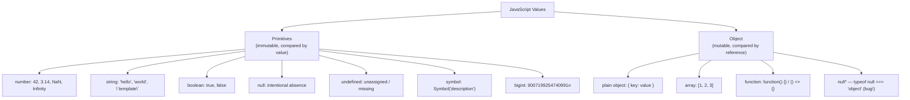
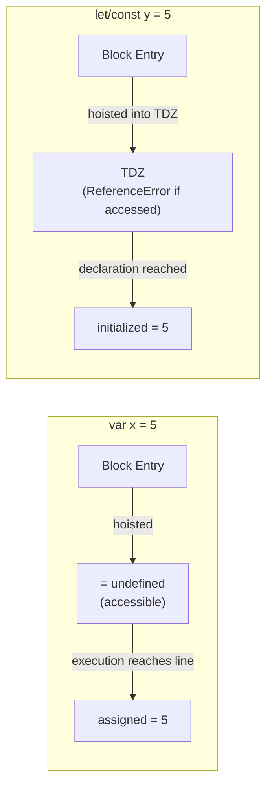
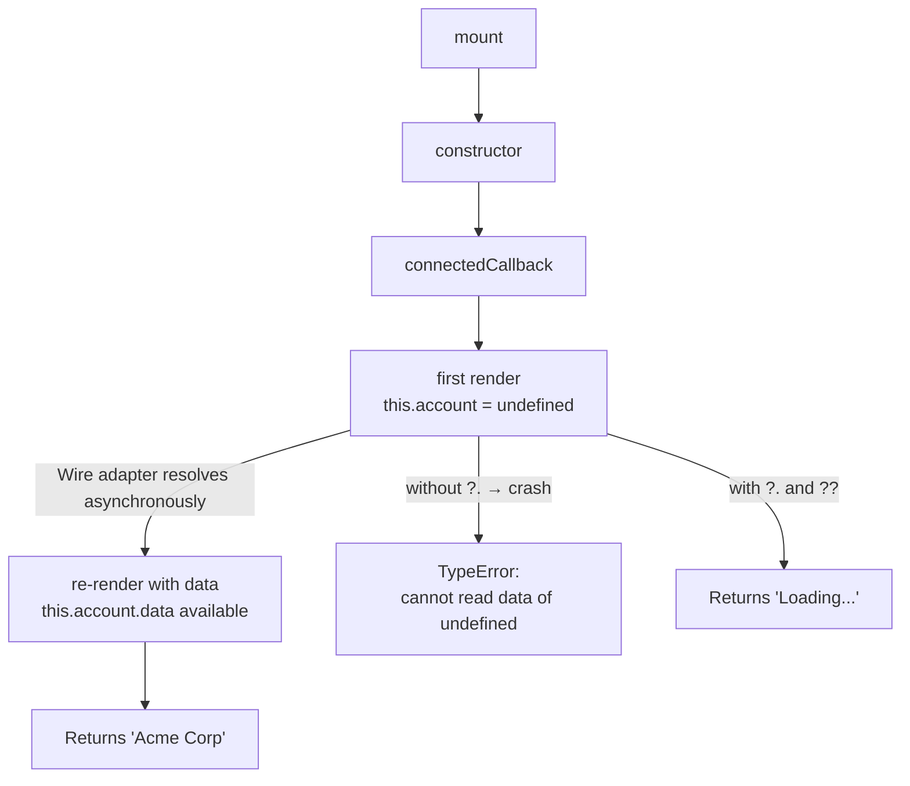

# Variables, Types & Operators

## Exam Domain
Variables, Types & Operators — ~7% of exam weight

## Core Concepts

### var / let / const

| Feature | `var` | `let` | `const` |
|---------|-------|-------|---------|
| Scope | Function-scoped | Block-scoped | Block-scoped |
| Hoisting | Initialized to `undefined` | TDZ until declaration | TDZ until declaration |
| Reassignment | Yes | Yes | No (binding locked) |
| Re-declaration | Yes | No | No |
| Recommendation | ⚠ AVOID | For mutable bindings | **Use by default** (LWC preferred) |
Rule: `const` everything. `let` only when you need to reassign. Never `var` in LWC.

### The Seven Primitive Types + Object


Primitives = compared by value. Objects = compared by reference. Two separate `{}` objects are never `===` even with identical contents.

### typeof — Traps to Memorize
| Expression | Result | Note |
|------------|--------|------|
| `typeof null` | `"object"` | **BUG** — not `"null"` |
| `typeof []` | `"object"` | arrays are objects |
| `typeof function(){}` | `"function"` | only exception |
| `typeof undefined` | `"undefined"` | |
| `typeof NaN` | `"number"` | NaN is a valid IEEE 754 value |

To check for null: `value === null`
To check for array: `Array.isArray(value)`
To check for NaN: `Number.isNaN(value)` — not the global `isNaN()` (it coerces first)

### == vs ===
Always use `===`. The only accepted `==` idiom: `value == null` to catch both null and undefined at once.

| Expression | `==` | `===` | Why |
|------------|------|-------|-----|
| `0 == false` | `true` | `false` | false coerces to 0 |
| `"" == false` | `true` | `false` | both coerce to 0 |
| `null == undefined` | `true` | `false` | special rule |
| `NaN == NaN` | `false` | `false` | NaN ≠ everything |
| `[] == false` | `true` | `false` | []→""→0, false→0 |

**Falsy values:** `0`, `""`, `null`, `undefined`, `NaN`, `false`, `0n`
**Truthy traps:** `[]`, `{}`, `"false"`, `"0"` — all truthy even though they look falsy

### Nullish Coalescing (??) and Optional Chaining (?.)
```javascript
// ?? — only replaces null or undefined (NOT 0, "", false)
const name = user.name ?? 'Anonymous';  // '' and 0 are preserved
const count = itemCount ?? 0;

// || — replaces ANY falsy value (0, "", false also get replaced)
const x = value || 'default';  // accidentally replaces 0 and ""

// ?. — short-circuits on null/undefined instead of throwing
const city = user?.address?.city;      // undefined if any step is null
const first = arr?.[0];                // safe array access
const result = obj?.method?.();        // safe method call

// LWC pattern — wire data arrives as undefined on first render:
return this.account?.data?.Name ?? 'Loading...';
```

## Architecture / How It Works

### Variable Declaration Timeline



### LWC Wire Data Pattern — Why ?. and ?? Matter



**Limitations:**
- `const` is shallow — the binding is locked, nested object properties are still mutable
- `typeof` cannot reliably detect null or arrays — need explicit `=== null` and `Array.isArray()`
- `??` only checks for null/undefined; if you need to replace any falsy value, use `||`
- `?.` returns `undefined` on short-circuit, never `null` — account for this in downstream checks

## PTA / SA Relevance

**In code reviews:** Flag any `var` usage in LWC components — it's a signal of either copy-paste from old code or a developer unfamiliar with modern JS. Also flag `||` used as a default operator when the value could legitimately be `0` or `""` (e.g., `item.quantity || 0` — if quantity is 0, this incorrectly replaces it with 0 from the right side).

**Architecture reviews:** When evaluating a partner's LWC implementation, check that they're using `?.` on all wire adapter data access. Missing optional chaining on wire data is the single most common cause of first-render crashes in LWC components.

**When advising on LWC vs Aura:** Aura's expression syntax automatically handles null navigation; LWC's JavaScript is direct — developers must handle null explicitly. Teams migrating from Aura to LWC often hit this as their first bug.

**Customer scenario:** A customer reports intermittent crashes on their record page only visible on slow network connections. Root cause: the `@wire` data hadn't resolved yet on first render, and `this.record.data.fields.Name.value` threw a TypeError. Fix: `this.record?.data?.fields?.Name?.value ?? ''`.

## Key Facts to Memorize
- `typeof null === "object"` — historical bug, never getting fixed
- `typeof NaN === "number"` — NaN is a valid IEEE 754 number value
- `const` prevents re-assignment of the binding, not mutation of the value
- Default parameters only trigger on `undefined`, not `null`
- `??` is NOT the same as `||` — `0` and `""` are NOT replaced by `??`
- `typeof` always returns a string — `typeof x === "number"`, not `=== number`
- `null == undefined` is `true`; `null === undefined` is `false`

## Exam Traps
- `typeof null` returns `"object"` — the #1 most tested typeof gotcha
- `NaN !== NaN` is `true` — use `Number.isNaN()`, never compare NaN directly
- `const arr = []; arr.push(1)` — legal! `const` only blocks re-assignment of the binding
- `[] == false` is `true` but `if ([])` takes the **true** branch (arrays are truthy)
- `typeof []` returns `"object"`, not `"array"` — always use `Array.isArray()`

## Practice Questions
**Q:** What does this print?
```javascript
console.log(typeof null === 'object');
console.log(0 == false);
console.log(0 === false);
```
**A:** `true`, `true`, `false`. `typeof null` is `"object"` (the bug). `0 == false` coerces false to 0. `0 === false` is false — different types.

**Q:** An LWC getter reads `return this.account.data.Name || 'Anonymous'`. It crashes on first render. Fix it AND preserve `""` as a valid name.
**A:** `return this.account?.data?.Name ?? 'Anonymous'`. Use `?.` to avoid the throw and `??` (not `||`) so an empty string name isn't replaced.

**Q:** What does this print?
```javascript
const a = 5;
let b = '5';
console.log(a == b);
console.log(a === b);
console.log(typeof a);
console.log(typeof b);
```
**A:** `true`, `false`, `"number"`, `"string"`. `==` coerces `'5'` to `5`. `===` requires same type.
