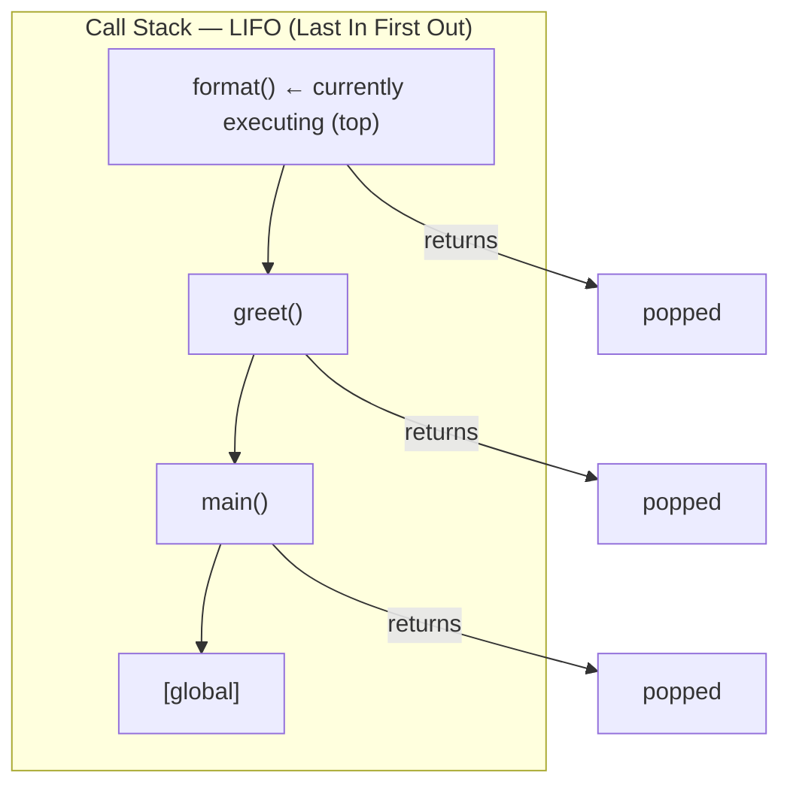
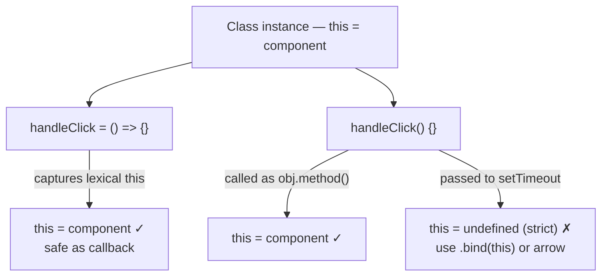

# Functions

## Exam Domain
Functions — ~11% of exam weight (combined with scope/closures)

## Core Concepts

### Function Declaration vs Expression vs Arrow

```javascript
// Declaration — hoisted in full (callable before line of definition)
function greet(name) { return `Hello, ${name}`; }

// Expression — hoisted as undefined (only the variable, not the function)
const greet = function(name) { return `Hello, ${name}`; };

// Named expression (useful in stack traces)
const greet = function greetFn(name) { return `Hello, ${name}`; };

// Arrow function — no own `this`, no `arguments`, cannot be constructor
const greet = (name) => `Hello, ${name}`;
```

**Key distinctions for exam:**
| Feature | Declaration | Expression | Arrow |
|---------|------------|------------|-------|
| Hoisted | YES (fully) | NO (TDZ/undefined) | NO |
| Own `this` | YES | YES | NO (lexical) |
| `arguments` object | YES | YES | NO |
| `new` constructor | YES | YES | NO |
| Method shorthand | N/A | YES | Avoid (no `this`) |

### Default Parameters
```javascript
function fetchData(url, method = 'GET', timeout = 3000) {
    // Default applies only when arg is undefined (not null)
    return fetch(url, { method, timeout });
}

fetchData('/api/contacts');         // method='GET', timeout=3000
fetchData('/api/contacts', null);   // method=null (null ≠ undefined!)
fetchData('/api/contacts', undefined); // method='GET'
```

### Rest Parameters & Spread
```javascript
// Rest — collects remaining args into a real array
function sum(...numbers) {
    return numbers.reduce((total, n) => total + n, 0);
}
sum(1, 2, 3, 4); // 10

// Spread — expands iterable into individual args
const nums = [1, 2, 3];
Math.max(...nums);  // same as Math.max(1, 2, 3)

// Spread for shallow copy
const copy = [...originalArray];
const merged = { ...obj1, ...obj2 };  // later keys win
```

### Higher-Order Functions
Functions that accept or return other functions.

```javascript
// Accept function as argument
[1, 2, 3].map(x => x * 2);               // [2, 4, 6]
[1, 2, 3, 4].filter(x => x % 2 === 0);   // [2, 4]
[1, 2, 3].reduce((acc, x) => acc + x, 0); // 6

// Return a function (factory pattern)
function multiplier(factor) {
    return (number) => number * factor;
}
const double = multiplier(2);
const triple = multiplier(3);
double(5); // 10
```

### IIFE — Immediately Invoked Function Expression
```javascript
(function() {
    const private = 'not accessible outside';
    // runs immediately — isolates scope
})();

// Arrow version
(() => {
    // ...
})();
```
IIFE creates an isolated scope. Used pre-modules; mostly obsolete in ES6+ but still appears on exam.

### Recursion
```javascript
function factorial(n) {
    if (n <= 1) return 1;    // base case — REQUIRED
    return n * factorial(n - 1);
}

// Tree traversal (common LWC pattern for nested menus)
function walkTree(node) {
    process(node);
    node.children?.forEach(child => walkTree(child));
}
```

## Architecture / How It Works

### Function Call Stack



### Arrow vs Regular Function `this`



**Limitations:**
- Arrow functions cannot be used as constructors (`new arrowFn()` throws TypeError)
- Arrow functions have no `arguments` object — use rest parameters instead
- `arguments` in arrow functions refers to the enclosing non-arrow function's arguments
- Default parameters trigger only on `undefined` — passing `null` does NOT trigger the default

## PTA / SA Relevance

**Code review flags:**
- Regular function used as event handler callback without `.bind(this)` — `this` will be `undefined` in strict mode, causing component state access to fail
- Missing base case in recursion over nested Salesforce data (e.g., category trees, org hierarchies)
- Using `arguments` object in an arrow function — it refers to outer scope's arguments, creating a subtle bug

**Architecture guidance:**
- When reviewing LWC components, `handleClick = () => {}` (class field arrow) is the correct event handler pattern. It guarantees `this` binding without explicit `.bind(this)` in the template.
- For Salesforce recursive data (hierarchical accounts, org charts, category trees), ensure there is always a depth limit or visited-set to prevent infinite loops on cyclical reference data from Apex.

**Customer scenario:** "Our component crashes when we pass the handler to a third-party library." Root cause: they passed `this.handleData` as a callback; the third-party library calls it without the component instance as context. Fix: bind at definition time — `this.handleData = this.handleData.bind(this)` in constructor, or use class field arrow syntax.

## Key Facts to Memorize
- Function declarations are fully hoisted; function expressions are NOT
- Arrow functions have no own `this`, no `arguments`, cannot be used with `new`
- Default parameters trigger only on `undefined`, NOT on `null`
- `arguments` is an array-like object (not a real array) — no `.map()` etc.; rest params give you a real array
- IIFE `(function(){})()` creates isolated scope immediately
- `reduce(callback, initialValue)` — always provide initial value to avoid errors on empty arrays

## Exam Traps
- Calling a function expression before its declaration: `fn()` before `const fn = () => {}` → ReferenceError (TDZ for const/let) or TypeError "fn is not a function" (if var-hoisted as undefined)
- Arrow function as object method: `obj = { val: 1, get: () => this.val }` → `this` is outer scope (likely `undefined`), not obj
- `null` as argument does NOT trigger default parameter — only `undefined` does
- `arguments` object is NOT a real array — `arguments.forEach(...)` throws
- Arrow functions inside class bodies declared as class fields use class `this`; arrow functions inside regular methods also capture the method's `this` — both patterns are valid

## Practice Questions
**Q:** What does this print?
```javascript
var x = 'global';
function outer() {
    var x = 'outer';
    const inner = () => {
        console.log(x);
    };
    inner();
}
outer();
```
**A:** `"outer"`. The arrow function captures `x` from the closest enclosing scope — the `outer` function's `x`.

**Q:** A developer writes this in an LWC component and `this` is undefined inside the handler. Fix it.
```javascript
connectedCallback() {
    window.addEventListener('resize', function() {
        this.handleResize();
    });
}
```
**A:** Replace the regular function with an arrow function: `window.addEventListener('resize', () => { this.handleResize(); });`. Or bind: `window.addEventListener('resize', this.handleResize.bind(this));`. The arrow function captures `this` from `connectedCallback`, which is the component instance.

**Q:** What is the output?
```javascript
function add(a, b = 10) {
    return a + b;
}
console.log(add(5));
console.log(add(5, null));
console.log(add(5, undefined));
```
**A:** `15`, `5`, `15`. `add(5)` → b defaults to 10 → 15. `add(5, null)` → null ≠ undefined, b = null, 5 + null = 5 (null coerces to 0). `add(5, undefined)` → undefined triggers default → 15.
