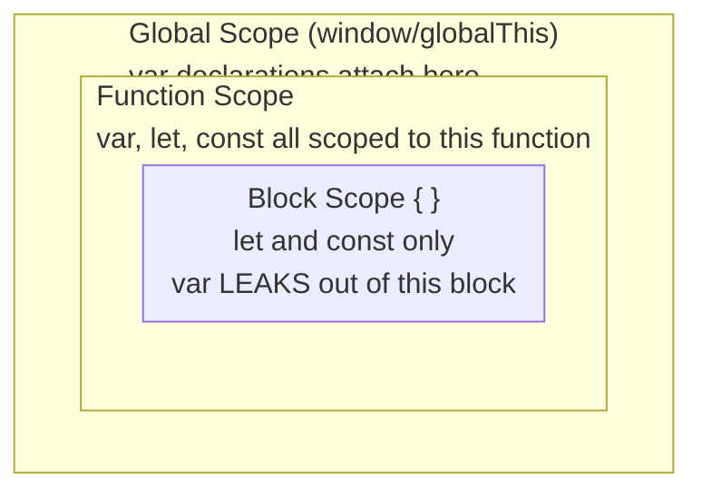
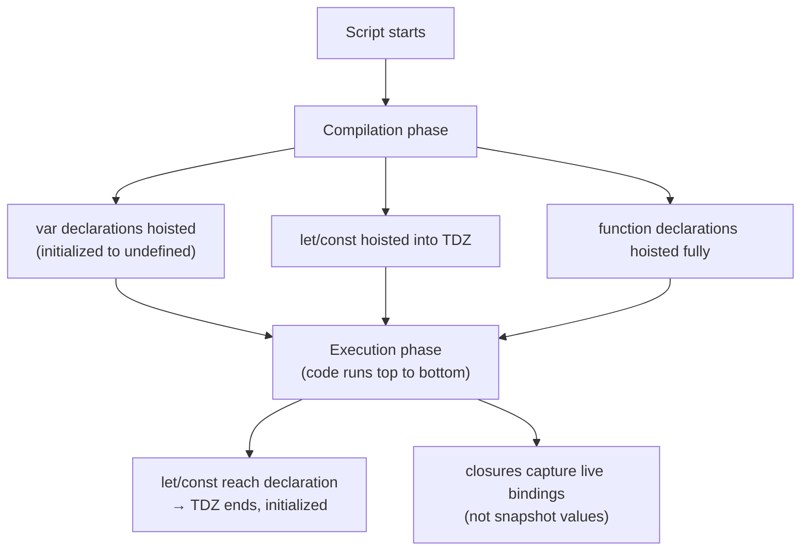

# Scope, Hoisting & Closures

## Exam Domain
Functions, Scope & Closures — ~11% of exam weight (combined with functions)

## Core Concepts

### Scope — Three Levels



```javascript
// var leaks out of blocks
if (true) {
    var leaked = 'visible outside';
    let contained = 'stays in block';
}
console.log(leaked);    // 'visible outside'
console.log(contained); // ReferenceError

// var does NOT leak out of functions
function isolated() {
    var x = 'inside';
}
console.log(x); // ReferenceError
```

### Hoisting
Variables and function declarations are moved to the top of their scope during compilation — but with different behavior:

**During compilation phase:**

| Declaration type | Hoisting behavior |
|-----------------|-------------------|
| `var` declarations | Hoisted, initialized to `undefined` |
| `let` / `const` | Hoisted, but in TDZ (Temporal Dead Zone) |
| Function declarations | Hoisted IN FULL (name + body) |
| Function expressions / arrows | NOT hoisted (follows `var`/`let`/`const` rules) |

```javascript
console.log(a); // undefined  (var hoisted, initialized to undefined)
console.log(b); // ReferenceError — TDZ for let
console.log(fn()); // 'works!' — declaration fully hoisted
console.log(fn2()); // TypeError: fn2 is not a function

var a = 5;
let b = 5;
function fn() { return 'works!'; }
var fn2 = function() { return 'works!'; };
// fn2 is hoisted as undefined → undefined() → TypeError
```

**TDZ (Temporal Dead Zone):** The period between the variable entering scope and its declaration line. Accessing a `let`/`const` in this zone throws `ReferenceError`.

### Scope Chain — How JS Resolves Variables
```
Inner function searches outward until found or ReferenceError:

function outer() {          // outer scope: x=1, y=2
    const x = 1;
    function middle() {     // middle scope: y=2
        const y = 2;
        function inner() {  // inner scope: z=3
            const z = 3;
            console.log(x, y, z); // 1, 2, 3 — chain walks up
        }
    }
}
// Search order: inner → middle → outer → global → ReferenceError
```

### Closures — Functions That Remember Their Scope
A closure is a function that retains access to its enclosing scope even after the enclosing function has returned.

```javascript
function makeCounter(start = 0) {
    let count = start;           // count is enclosed
    return {
        increment: () => ++count,
        decrement: () => --count,
        value: () => count
    };
}

const counter = makeCounter(10);
counter.increment(); // 11
counter.increment(); // 12
counter.value();     // 12
// count is not directly accessible — it's private via closure
```

**Classic exam trap — loop with var:**
```javascript
// WRONG — all three log '3' (var is function-scoped, shared)
for (var i = 0; i < 3; i++) {
    setTimeout(() => console.log(i), 0);
}

// FIX 1 — use let (block-scoped, new binding per iteration)
for (let i = 0; i < 3; i++) {
    setTimeout(() => console.log(i), 0);
}
// Outputs: 0, 1, 2

// FIX 2 — IIFE closure capture (pre-ES6 approach)
for (var i = 0; i < 3; i++) {
    ((j) => setTimeout(() => console.log(j), 0))(i);
}
// Outputs: 0, 1, 2
```

**Closure for private state (module pattern):**
```javascript
const bankAccount = (() => {
    let balance = 0;                    // private
    return {
        deposit: (amt) => balance += amt,
        withdraw: (amt) => balance -= amt,
        getBalance: () => balance       // read-only access
    };
})();
bankAccount.deposit(100);
bankAccount.getBalance(); // 100
// balance is inaccessible directly
```

## Architecture / How It Works

### LWC — Closures in Wire Handler Context
```
@wire(getRecord, { recordId: '$recordId' })
wiredRecord({ data, error }) {
    // this handler closes over `this` — component instance
    // `this.recordId` is accessible here via closure
    if (data) {
        this.record = data;
        this.processRecord(this.record);  // closure + class method
    }
}

// If this were a regular function passed as callback:
// setTimeout(function() { this.processData() }, 100)
//                          ↑ undefined in strict mode!
// Fix: setTimeout(() => this.processData(), 100) — arrow captures `this`
```

### Variable Lifecycle Diagram



**Limitations:**
- Closures capture **references** to variables, not copies — mutations affect all closures sharing that binding
- Deep closure chains can prevent garbage collection — each closure keeps its entire scope chain alive
- `var` hoisting in loops creates exactly one shared binding — every closure sees the final value
- TDZ error message varies by engine — in some JS environments the error message is misleading

## PTA / SA Relevance

**Code review flags:**
- `var` inside loops with async callbacks — classic closure/hoisting bug that produces wrong values silently
- Event handlers that reference loop variables captured at the wrong time
- Missing `'use strict'` in legacy code — without strict mode, undeclared variables become globals silently

**Architecture reviews:**
- LWC components use module-level closures implicitly — each import of a wire adapter creates a closure context. Understand this when debugging why a wire handler sees stale data.
- For stateful singleton services in LWC (e.g., a shared notification queue), use module-level closure state rather than class properties — it persists across component instances.

**Customer scenario:** "Our table renders all rows with the value from the last row." Root cause: `for (var i = 0; i < rows.length; i++)` with an async callback that reads `i`. All callbacks share the same `var i` reference. Fix: `for (const row of rows)` with destructured value, no index needed.

## Key Facts to Memorize
- `var` is function-scoped; `let`/`const` are block-scoped
- Function declarations are fully hoisted; `var` is hoisted to `undefined`; `let`/`const` are in TDZ
- A closure is a function that retains access to its enclosing lexical scope
- The loop-var bug: `var` in a for loop creates ONE binding; all callbacks share it
- `let` in for loops creates a NEW binding per iteration — fixes the bug automatically
- Closures capture live references, not snapshots — mutations after closure creation are visible

## Exam Traps
- `var` hoisted to `undefined` → logs `undefined`, not ReferenceError (common gotcha vs let/const)
- `let`/`const` in TDZ → `ReferenceError` (not `undefined`)
- `typeof undeclaredVar` → `"undefined"` (no TDZ error — typeof has special handling for undeclared vars)
- `typeof tdz_let` before declaration → still throws ReferenceError (TDZ)
- Loop with `var` + async callback → all callbacks see the final loop value, not per-iteration value
- Closure captures variable reference, not value — if the variable changes, all closures see the change

## Practice Questions
**Q:** What is the output and why?
```javascript
for (var i = 0; i < 3; i++) {
    setTimeout(() => console.log(i), 0);
}
```
**A:** `3`, `3`, `3`. All three arrow functions close over the same `var i`. By the time any setTimeout fires, the loop has finished and `i` is 3.

**Q:** Fix the above to output `0`, `1`, `2`.
**A:** Replace `var` with `let`. `let` creates a new binding per iteration, so each closure captures a distinct `i`.

**Q:** What is a closure? Give an LWC-relevant example.
**A:** A closure is a function that retains access to variables in its enclosing scope even after the enclosing function has returned. In LWC: a wire handler function closes over `this` (the component instance) — even though the framework calls it later during data resolution, the handler still has access to the component's properties and methods.
