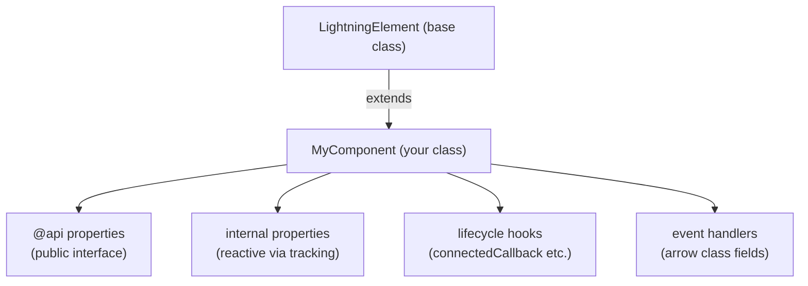
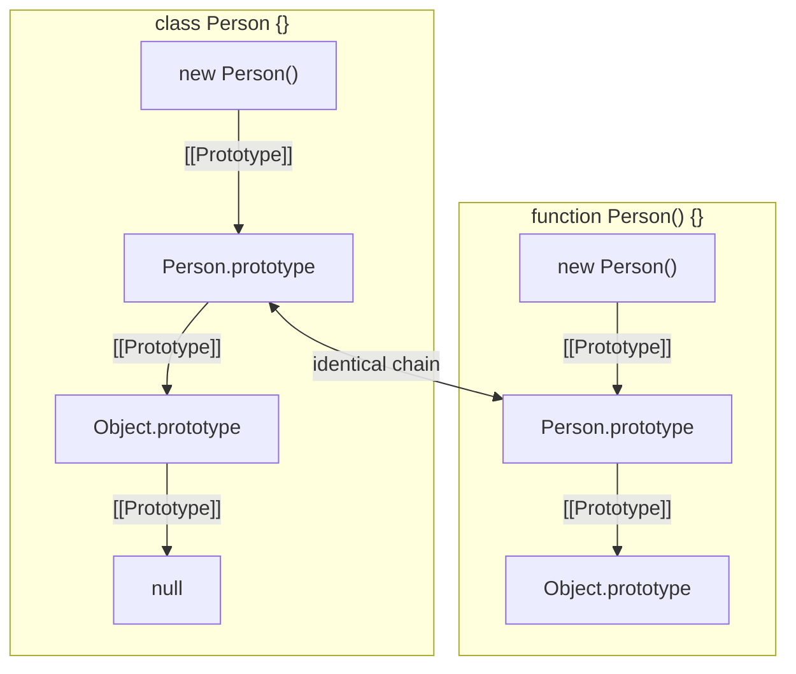

# Classes & Object-Oriented Programming

## Exam Domain
Objects, Arrays & Classes — ~16% of exam weight (combined with prototypes/modules)

## Core Concepts

### Class Declaration Syntax
```javascript
class Animal {
    #name;           // private field (ES2022) — only accessible inside class
    #sound;

    constructor(name, sound) {
        this.#name = name;
        this.#sound = sound;
    }

    // Instance method
    speak() {
        return `${this.#name} says ${this.#sound}`;
    }

    // Getter/setter pair
    get name() { return this.#name; }
    set name(value) {
        if (typeof value !== 'string') throw new TypeError('Name must be string');
        this.#name = value;
    }

    // Static method — called on the class, not instances
    static create(name, sound) {
        return new Animal(name, sound);
    }
}

const dog = new Animal('Rex', 'woof');
dog.speak();     // 'Rex says woof'
dog.name;        // 'Rex' (via getter)
dog.#name;       // SyntaxError — private, inaccessible outside class
Animal.create('Cat', 'meow');  // static factory
```

### Inheritance — extends & super
```javascript
class Dog extends Animal {
    #tricks = [];

    constructor(name) {
        super(name, 'woof');  // MUST call super() before accessing this
    }

    learn(trick) {
        this.#tricks.push(trick);
    }

    // Override parent method
    speak() {
        const base = super.speak();  // call parent's speak
        return `${base} (trained: ${this.#tricks.join(', ')})`;
    }
}

const rex = new Dog('Rex');
rex.learn('sit');
rex.speak(); // 'Rex says woof (trained: sit)'
rex instanceof Dog;    // true
rex instanceof Animal; // true
```

**Rules:**
- `extends` sets up both class AND prototype chain
- `super()` in constructor MUST come before first `this` access
- `super.method()` calls the parent class method
- Only one level of `extends` at a time; chains multiple levels

### Private Fields (#)
```javascript
class BankAccount {
    #balance = 0;          // private, per-instance
    static #count = 0;     // private static

    constructor(initial) {
        this.#balance = initial;
        BankAccount.#count++;
    }

    deposit(amt) { this.#balance += amt; }
    get balance() { return this.#balance; }

    static getCount() { return BankAccount.#count; }
}
```
- Private fields MUST be declared at class level before use
- Accessing `#field` from outside the class throws SyntaxError at parse time
- Check if private field exists: `#field in obj` → returns boolean

### Static Members
```javascript
class MathUtils {
    static PI = 3.14159;

    static add(a, b) { return a + b; }
    static multiply(a, b) { return a * b; }
}

MathUtils.PI;         // 3.14159
MathUtils.add(2, 3);  // 5
// new MathUtils() — valid but unnecessary; static-only classes are convention
```

### Class Expressions
```javascript
// Named class expression
const Foo = class FooClass {
    greet() { return FooClass.name; }  // 'FooClass'
};

// Anonymous
const Bar = class { };
```

## Architecture / How It Works

### LWC Class Pattern



```javascript
class MyComponent extends LightningElement {
    @api recordId;           // public — parent sets this
    _isLoading = false;      // internal state

    handleClick = () => {    // arrow field — bound `this`
        this._isLoading = true;
    }
}
```

### Class vs Constructor Function (Same Prototype Chain)



**Limitations:**
- Classes are NOT hoisted like function declarations — must declare before use
- `super()` must be called before `this` in derived class constructors — otherwise `this` is not initialized
- Private fields (#) are a hard boundary — no reflection, no external access even from subclasses
- `static` fields on the class are not inherited by instances; only on the class object itself

## PTA / SA Relevance

**Code review flags:**
- Forgetting `super()` in a subclass constructor — runtime ReferenceError accessing `this`
- Using `_underscore` convention for "private" fields (just convention, not enforced) vs. `#privateField` (language-enforced)
- Missing getter validation — exposing raw setters without type checks on public API properties

**Architecture guidance for LWC:**
- Use class fields (arrow functions) for event handlers to avoid manual `.bind(this)` in connectedCallback
- For shared business logic across LWC components, extract to ES module utility classes rather than duplicating logic in each component
- LWC component = class extending LightningElement — the exam asks about both LWC-specific (decorators, lifecycle) AND standard JS class features

**Customer advisory:** When advising on LWC component architecture, classes with private fields (`#`) are the correct approach for encapsulating business logic in helper classes. Prefer this over exposing all state as public properties on the component.

## Key Facts to Memorize
- Classes are NOT hoisted — unlike function declarations
- One constructor per class — two is SyntaxError
- `super()` required in derived constructor before accessing `this`
- `super.method()` calls parent's method (not constructor)
- Private fields (`#`) — declared at class body, SyntaxError if accessed outside
- `static` members belong to the class, not instances
- `instanceof` checks prototype chain — works with inheritance

## Exam Traps
- Class NOT hoisted → `new Foo()` before `class Foo` → ReferenceError
- `super()` called AFTER `this` access in derived class → ReferenceError
- Private field accessed from subclass → SyntaxError (subclass cannot access parent's `#field`)
- `static` method called on instance → TypeError (`dog.create()` fails; use `Dog.create()`)
- Getter defined without setter → assignment silently fails in non-strict mode, throws in strict

## Practice Questions
**Q:** What does this throw?
```javascript
class Vehicle {
    #speed = 0;
    accelerate() { this.#speed += 10; }
}
class Car extends Vehicle {
    turboBoost() { this.#speed += 50; }  // accessing Vehicle's #speed from Car
}
```
**A:** SyntaxError. Private fields are class-scoped — `Car` cannot access `Vehicle`'s `#speed`. The field would need to be exposed via a protected-style method or getter in `Vehicle`.

**Q:** What happens when `super()` is missing from a derived constructor?
**A:** ReferenceError: Must call super constructor in derived class before accessing 'this'. `this` is not initialized until `super()` completes.

**Q:** How do you call a parent class method that you've overridden in a subclass?
**A:** `super.methodName()` inside the subclass method. Example: in `speak()`, call `super.speak()` to get the parent's return value, then augment it.
