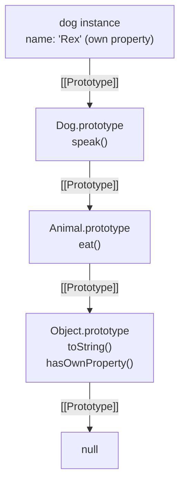

# Prototypes & Prototype-Based Inheritance

## Exam Domain
Objects, Arrays & Prototypes — ~25% of exam weight

## Core Concepts

### The Prototype Chain
Every JavaScript object has an internal `[[Prototype]]` slot pointing to another object (or `null`). Property lookup walks up this chain.



```javascript
// Accessing prototype chain
Object.getPrototypeOf(dog) === Dog.prototype;  // true
dog.__proto__ === Dog.prototype;               // true (legacy, avoid)

// Walking the chain manually
let proto = Object.getPrototypeOf(dog);
while (proto) {
    console.log(proto.constructor.name);
    proto = Object.getPrototypeOf(proto);
}
// Dog, Animal, Object
```

### Own vs Inherited Properties
```javascript
function Person(name) {
    this.name = name;       // own property
}
Person.prototype.greet = function() {
    return `Hi, I'm ${this.name}`;
};

const alice = new Person('Alice');

// Own property check
alice.hasOwnProperty('name');    // true
alice.hasOwnProperty('greet');   // false (inherited)

// for...in iterates OWN + INHERITED enumerable
for (const key in alice) {
    if (alice.hasOwnProperty(key)) {
        console.log('own:', key);      // 'name'
    }
}

// Object.keys() — own enumerable only
Object.keys(alice);  // ['name']
```

### Object.create() — Explicit Prototype Setting
```javascript
const animal = {
    breathe() { return `${this.name} breathes`; }
};

const dog = Object.create(animal);   // dog's prototype IS animal
dog.name = 'Rex';
dog.breathe(); // 'Rex breathes' — found via prototype chain

// Create with NO prototype (plain data dict)
const pureData = Object.create(null);
pureData.hasOwnProperty; // undefined — no Object.prototype methods
```

### Constructor Functions (Pre-ES6 Classes)
```javascript
function Animal(name) {
    this.name = name;              // own property on instance
}
Animal.prototype.speak = function() {
    return `${this.name} speaks`;  // shared via prototype
};

// Inheritance via prototype chain manipulation
function Dog(name, breed) {
    Animal.call(this, name);       // borrow constructor
    this.breed = breed;
}
Dog.prototype = Object.create(Animal.prototype);  // set prototype chain
Dog.prototype.constructor = Dog;                   // fix constructor ref

const rex = new Dog('Rex', 'Lab');
rex.speak();  // 'Rex speaks' (via chain)
rex instanceof Dog;    // true
rex instanceof Animal; // true
```

### Mixins — Simulating Multiple Inheritance
JavaScript only has single prototype chain. Mixins copy methods from multiple objects into one class.

```javascript
const Flyable = {
    fly() { return `${this.name} is flying`; }
};
const Swimmable = {
    swim() { return `${this.name} is swimming`; }
};

class Duck extends Animal {
    constructor(name) { super(name, 'quack'); }
}

// Mixin — copy methods onto prototype
Object.assign(Duck.prototype, Flyable, Swimmable);

const donald = new Duck('Donald');
donald.fly();   // 'Donald is flying'
donald.swim();  // 'Donald is swimming'
```

## Architecture / How It Works

### Property Lookup — Full Sequence
```
property access: obj.foo

1. Does obj have own property 'foo'? → return it
2. Does Object.getPrototypeOf(obj) have 'foo'? → return it
3. Keep walking [[Prototype]] chain...
4. Reach Object.prototype → check there
5. Reach null → return undefined (NOT an error for property access)

Performance note: long prototype chains slow property lookup.
ES6 classes create the same chain as constructor functions — same cost.
```

### `new` Keyword Internals
```
new Dog('Rex') does:
  1. Create empty object {}
  2. Set [[Prototype]] = Dog.prototype
  3. Call Dog() with `this` = new object
  4. If constructor returns non-primitive: return that
     Otherwise: return the new object
```

**Limitations:**
- `__proto__` is deprecated; use `Object.getPrototypeOf()` and `Object.setPrototypeOf()` instead
- Modifying `Object.prototype` affects ALL objects — never do this in application code
- `for...in` loops inherited enumerable properties — always guard with `hasOwnProperty()` if iterating only own
- Prototype chain lookup on every property access — very long chains have performance cost
- `Object.create(null)` creates an object with no prototype — cannot call `.toString()`, `.hasOwnProperty()` on it

## PTA / SA Relevance

**Code review flags:**
- `for...in` without `hasOwnProperty` check — may accidentally iterate prototype methods if a library has modified `Object.prototype`
- Manually modifying `SomeClass.prototype` in modern code — signals unfamiliarity with ES6 class syntax
- Deleting prototype methods at runtime — breaks all existing instances that inherited that method

**Architecture guidance:**
- When reviewing partner code for LWC, prototype chain issues rarely appear in LWC itself (ES6 classes handle it). They appear in shared utility modules, legacy code being migrated, or third-party library integrations.
- For LWC component inheritance: ES6 class `extends` is supported but kept shallow. Deep LWC class hierarchies create maintenance headaches — prefer composition (mixins or utility modules) over inheritance beyond 2 levels.

**Customer advisory:** Most customers don't need to know about prototypes directly. When they ask "why does modifying one array instance affect another?", the answer is usually shared object reference, not prototype chain. The prototype chain question comes up when a library adds methods to `Array.prototype` or `Object.prototype` that affect unexpected code.

## Key Facts to Memorize
- Every object has `[[Prototype]]` — the chain ends at `Object.prototype` → `null`
- Property lookup walks the chain; assignment always goes to OWN property (does not walk chain)
- `hasOwnProperty(key)` — checks only the object, not inherited
- `Object.keys()` — own enumerable properties only
- `for...in` — own AND inherited enumerable properties
- `Object.create(proto)` — creates object with specified prototype
- Mixins via `Object.assign(TargetClass.prototype, mixin1, mixin2)`

## Exam Traps
- Setting a property on an instance does NOT modify the prototype's property — it creates a new own property that shadows the prototype property
- `delete obj.method` — if method is on prototype, deletion does nothing visible (can't delete inherited properties via instance)
- `instanceof` checks the prototype chain, not constructor identity — can fool it by changing prototype
- `Object.create(null)` object has NO `hasOwnProperty` method — calling it throws TypeError
- `for...in` includes inherited enumerable props; `Object.keys()` does not — know which exam questions ask for

## Practice Questions
**Q:** What does this print?
```javascript
function Animal(name) { this.name = name; }
Animal.prototype.speak = function() { return this.name; };
const a = new Animal('Leo');
console.log(a.hasOwnProperty('name'));
console.log(a.hasOwnProperty('speak'));
```
**A:** `true`, `false`. `name` is set on the instance (own). `speak` is on `Animal.prototype` (inherited).

**Q:** What is the prototype of an empty object literal `{}`?
**A:** `Object.prototype`. All object literals have `Object.prototype` as their prototype by default.

**Q:** How do you create an object that inherits from `vehicleProto` using ES5-style?
**A:** `const car = Object.create(vehicleProto);`. This sets `vehicleProto` as `car`'s `[[Prototype]]` so all of `vehicleProto`'s methods are accessible via prototype chain.
