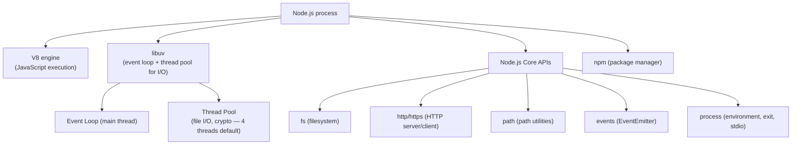
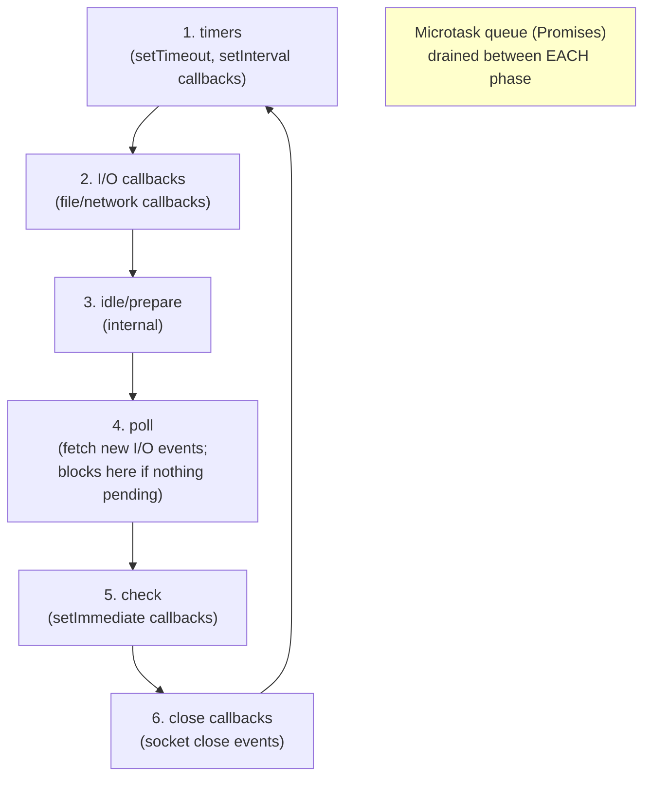

# Node.js Fundamentals

## Exam Domain
Browser & Node APIs — ~13% of exam weight

## Core Concepts

### Node.js Architecture
Node.js: JavaScript runtime built on V8 engine. Event-driven, non-blocking I/O. Single-threaded event loop (like browser, but no DOM — has OS-level I/O instead).



### process Object
```javascript
process.argv;          // command-line arguments array
// process.argv[0] = 'node', process.argv[1] = script path
// process.argv[2] onwards = your arguments
node script.js hello  → process.argv[2] = 'hello'

process.env.NODE_ENV;  // 'development', 'production', etc.
process.env.PORT;      // environment variable
process.cwd();         // current working directory
process.exit(0);       // exit gracefully (0 = success)
process.exit(1);       // exit with error
process.stdout.write('output');  // write to stdout
process.stderr.write('error');   // write to stderr
```

### fs Module — File System
```javascript
const fs = require('fs');
const fsPromises = require('fs/promises');  // Promise-based (modern)

// Synchronous (blocks entire process — avoid in servers)
const data = fs.readFileSync('file.txt', 'utf8');
fs.writeFileSync('output.txt', 'content');

// Async with promises (preferred)
const data = await fsPromises.readFile('file.txt', 'utf8');
await fsPromises.writeFile('output.txt', 'content');
await fsPromises.appendFile('log.txt', 'line\n');

// Check if file exists
try {
    await fsPromises.access('file.txt');
    // exists
} catch {
    // doesn't exist
}
```

### path Module
```javascript
const path = require('path');

path.join('/users', 'alice', 'docs');    // '/users/alice/docs'
path.resolve('./relative/path');          // absolute path from cwd
path.basename('/users/alice/file.txt');  // 'file.txt'
path.extname('file.txt');                // '.txt'
path.dirname('/users/alice/file.txt');   // '/users/alice'

// __dirname — directory of current file (CommonJS only)
path.join(__dirname, 'data', 'users.json');
```

### http Module — Basic HTTP Server
```javascript
const http = require('http');

const server = http.createServer((req, res) => {
    if (req.url === '/health' && req.method === 'GET') {
        res.writeHead(200, { 'Content-Type': 'application/json' });
        res.end(JSON.stringify({ status: 'ok' }));
    } else {
        res.writeHead(404);
        res.end('Not found');
    }
});

server.listen(3000, () => console.log('Server running on port 3000'));
```

### EventEmitter — Custom Events
```javascript
const { EventEmitter } = require('events');

class DataService extends EventEmitter {
    fetchData() {
        setTimeout(() => {
            this.emit('data', { records: [] });  // emit event
            this.emit('done');
        }, 100);
    }
}

const service = new DataService();
service.on('data', (payload) => console.log('Got:', payload));
service.on('done', () => console.log('Complete'));
service.once('done', () => console.log('First done only'));  // fires once

service.fetchData();

// Remove listener
service.off('done', handler);  // same as removeListener
service.removeAllListeners('data');
```

### Module System (CommonJS vs ESM in Node.js)
```javascript
// CommonJS (default in Node.js for .js files)
const fs = require('fs');
const { join } = require('path');
module.exports = { myFunction };
module.exports = singleExport;

// ESM in Node.js (use .mjs extension or "type": "module" in package.json)
import fs from 'fs';
import { join } from 'path';
export function myFunction() { }
export default myFunction;

// __dirname not available in ESM — use:
import { fileURLToPath } from 'url';
const __dirname = path.dirname(fileURLToPath(import.meta.url));
```

## Architecture / How It Works

### Node.js Event Loop Phases



### npm Package Lifecycle

**`package.json` structure:**

| Section | Purpose |
|---------|---------|
| `"dependencies"` | Production runtime packages |
| `"devDependencies"` | Test/build tools only (not in production bundle) |
| `"scripts"` | `npm run` commands |

**Commands:** `npm install` → all deps | `npm install pkg` → dependencies | `npm install -D pkg` → devDependencies | `npm test` → runs "test" script

**Limitations:**
- `fs.readFileSync` blocks the entire event loop — never use in HTTP server request handlers
- `process.exit()` stops the event loop immediately — pending I/O callbacks do not run
- EventEmitter listeners must be explicitly removed to prevent memory leaks
- CommonJS `require()` is synchronous — circular requires can give empty `{}` objects as the value
- Node.js's `http` module is low-level — use Express/Fastify for real servers

## PTA / SA Relevance

**Relevance to Salesforce work:**
- Node.js is the runtime for Salesforce DX (sfdx CLI, sf CLI) — understanding Node helps with custom CLI tools and CI/CD scripts
- Jest (the test framework for LWC) runs in Node.js
- Salesforce Functions (legacy) ran on Node.js — understanding Node.js async patterns was required
- npm scripts drive LWC builds, test runs, and deployment automation

**Code review flags:**
- `readFileSync` in a loop or server handler — blocking entire process
- Unhandled `'error'` event on EventEmitter — Node.js throws uncaught exception if no 'error' listener
- Missing `process.on('unhandledRejection')` handler in Node.js scripts — unhandled Promise rejections crash the process in Node.js >= 15

**Architecture guidance:**
- For Salesforce CI/CD scripts: prefer async fs.promises over sync fs methods
- `process.env` for all configuration — never hardcode credentials, URLs, or org-specific values

## Key Facts to Memorize
- `process.argv[0]` = node executable, `[1]` = script path, `[2]` onwards = user arguments
- `process.env.KEY` for environment variables; `process.exit(0)` success, `(1)` error
- `fs.readFileSync` = blocking; `fs.promises.readFile` = async (preferred)
- `path.join` constructs cross-platform paths; `path.resolve` gives absolute path
- EventEmitter: `.on()` persistent, `.once()` single-fire, `.off()` / `.removeListener()` to remove
- CommonJS: `require()` / `module.exports`; ESM: `import` / `export`

## Exam Traps
- `require('fs')` returns the module; `require('./myFile')` loads a local file (relative path REQUIRED for local files)
- `module.exports = fn` (single export) vs `module.exports = { fn }` (named) — callers must match
- `__dirname` is NOT defined in ES modules — only in CommonJS
- EventEmitter 'error' event — if no listener is attached, Node.js throws an uncaught exception

## Practice Questions
**Q:** What is the output of `process.argv` when running `node script.js --flag value`?
**A:** `['node', '/path/to/script.js', '--flag', 'value']`. Index 0 is the node executable, index 1 is the script path, then user arguments start at index 2.

**Q:** Why should `fs.readFileSync()` be avoided in an HTTP server request handler?
**A:** `readFileSync` is synchronous and blocks the entire Node.js event loop. While reading the file, no other requests can be processed. This completely breaks Node's non-blocking concurrency model. Use `fs.promises.readFile()` with `await` instead.

**Q:** What is EventEmitter's `.once()` method vs `.on()`?
**A:** `.on(event, listener)` registers a persistent listener — fires every time the event is emitted. `.once(event, listener)` registers a one-time listener — fires on the first emission and is automatically removed afterward.
