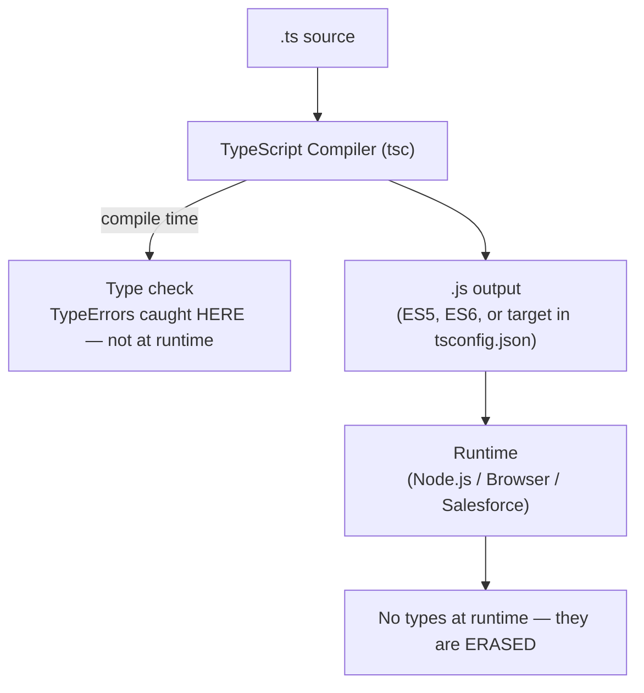

# TypeScript Basics

## Exam Domain
Objects, Arrays & Classes — ~5% of exam weight (TypeScript is a minor topic on CRT-600)

## Core Concepts

### TypeScript = JavaScript + Types
TypeScript is a superset of JavaScript. All valid JS is valid TS. TS adds a compile-time type system that catches bugs before runtime.

```typescript
// TypeScript: type annotations
let name: string = 'Alice';
let count: number = 42;
let active: boolean = true;
let nothing: null = null;
let missing: undefined = undefined;

// Any type — defeats TypeScript's purpose, avoid
let anything: any = 'could be anything';

// Union types — one of several types
let id: string | number = 'abc123';
id = 42;  // also valid

// Type inference — TypeScript figures it out
let city = 'London';  // inferred as string — no annotation needed
city = 42;  // Error: Type 'number' is not assignable to type 'string'
```

### Interfaces vs Type Aliases
```typescript
// Interface — defines object shape
interface Contact {
    id: string;
    name: string;
    email?: string;    // optional property
    readonly createdAt: Date;  // cannot be reassigned
}

// Type alias — more flexible
type StringOrNumber = string | number;
type Point = { x: number; y: number };
type Callback = (event: Event) => void;

// Key differences:
// Interface: can be extended/merged (declaration merging)
// Type alias: can use unions, intersections, mapped types, conditional types

interface Animal { name: string; }
interface Dog extends Animal { breed: string; }

type ID = string | number;  // cannot do this with interface
```

### Functions with Types
```typescript
function add(a: number, b: number): number {
    return a + b;
}

// Optional and default parameters
function greet(name: string, greeting: string = 'Hello'): string {
    return `${greeting}, ${name}`;
}

// Rest parameters
function sum(...numbers: number[]): number {
    return numbers.reduce((acc, n) => acc + n, 0);
}

// Function type annotations
type Handler = (event: MouseEvent) => void;
const onClick: Handler = (e) => console.log(e.target);
```

### Generics
```typescript
// Generic function — type parameter T is inferred or specified
function identity<T>(value: T): T {
    return value;
}
identity<string>('hello');   // T = string
identity(42);                // T = number (inferred)

// Generic interface
interface ApiResponse<T> {
    data: T;
    status: number;
    message: string;
}

type ContactResponse = ApiResponse<Contact[]>;
type AccountResponse = ApiResponse<Account>;

// Generic with constraint
function getLength<T extends { length: number }>(item: T): number {
    return item.length;
}
getLength('hello');   // 5
getLength([1,2,3]);   // 3
// getLength(42);     // Error: number has no .length
```

### Union & Intersection Types
```typescript
// Union — one of several types
type Status = 'active' | 'inactive' | 'pending';
function setStatus(status: Status) { ... }
setStatus('active');    // OK
setStatus('deleted');   // Error — not in union

// Intersection — combines types
type Timestamped = { createdAt: Date; updatedAt: Date };
type Named = { name: string };
type NamedWithTimestamp = Named & Timestamped;
// NamedWithTimestamp has: name, createdAt, updatedAt

// Discriminated union (common pattern)
type Shape =
    | { kind: 'circle'; radius: number }
    | { kind: 'square'; side: number };

function area(shape: Shape): number {
    switch (shape.kind) {
        case 'circle': return Math.PI * shape.radius ** 2;
        case 'square': return shape.side ** 2;
    }
}
```

### Enums
```typescript
enum Direction {
    Up = 'UP',
    Down = 'DOWN',
    Left = 'LEFT',
    Right = 'RIGHT'
}

Direction.Up;       // 'UP'
Direction['Up'];    // 'UP'

// Numeric enum (default if no values assigned)
enum Status { Active, Inactive, Pending }
Status.Active;   // 0
Status.Inactive; // 1
```

## Architecture / How It Works

### TypeScript Compilation



TypeScript types exist ONLY at compile time. At runtime, the code is plain JavaScript.

### tsconfig.json Key Options
```json
{
    "compilerOptions": {
        "target": "ES2020",           // output JS version
        "module": "ESNext",           // module system
        "strict": true,               // enable all strict checks (recommended)
        "noImplicitAny": true,        // error on any implicit `any`
        "strictNullChecks": true,     // null/undefined are distinct types
        "outDir": "./dist"            // output directory
    }
}
```

**Limitations:**
- TypeScript is erased at runtime — `any` type errors only show at compile time; no runtime type checking
- `strictNullChecks: false` (default in many setups) allows null/undefined anywhere — turn on strict mode
- Generics add complexity — excessive use of complex generics reduces code readability
- LWC doesn't natively use TypeScript in Salesforce orgs (as of recent releases, TS support is in preview)

## PTA / SA Relevance

**For Salesforce architecture:**
- TypeScript is used in Salesforce DX tooling and many ISV/partner LWC projects for type safety
- When reviewing a partner's LWC codebase, TypeScript adoption indicates a mature development team
- `@salesforce/lwc-jest` supports TypeScript components for testing

**Code review flags:**
- Heavy use of `any` type in TypeScript — defeats the purpose; look for `noImplicitAny: true` in tsconfig
- Missing `strictNullChecks` — allows null access that causes runtime errors

**Customer advisory:** For greenfield LWC projects, recommending TypeScript is valid — it catches type errors early, especially important for large teams. For existing Apex-heavy orgs migrating to LWC, TS may add ramp-up cost without proportional benefit. Assess team size and complexity.

## Key Facts to Memorize
- TypeScript = superset of JavaScript; all JS is valid TS
- Types are erased at compile time — no type checking at runtime
- Interface: object shape, extendable; Type alias: more flexible (unions, intersections, etc.)
- Generics: type parameters enable type-safe reusable code — `<T>` placeholder
- Union `|`: one of several types; Intersection `&`: combines all properties
- `any` defeats TypeScript — avoid; use `unknown` for truly unknown types
- Numeric enum: starts at 0; string enum: explicit values required

## Exam Traps
- Interfaces and type aliases are mostly interchangeable for object shapes — key diff: interfaces support declaration merging; type aliases don't
- `readonly` prevents reassignment of a property, similar to `const` for bindings
- Union type: a variable is ONE of the union members at any time (not all simultaneously)
- Intersection type: object MUST have ALL properties from ALL intersected types
- TypeScript errors are compile-time only — `JSON.parse('{"a":1}') as Contact` tells TS "trust me" — no runtime validation

## Practice Questions
**Q:** What is the TypeScript type for a function that accepts a string or number and returns void?
**A:** `(input: string | number) => void`

**Q:** What is a generic, and why use one?
**A:** A generic is a type parameter (e.g., `<T>`) that lets you write reusable, type-safe code. Instead of using `any` (which loses type info), a generic preserves the type through the function. `function identity<T>(val: T): T` returns the same type it receives — calling `identity<string>('hello')` returns a string, not `any`.

**Q:** What is the difference between a TypeScript `interface` and a `type` alias?
**A:** Both define shapes. Key differences: (1) Interfaces support declaration merging (same interface name twice merges them); type aliases do not. (2) Type aliases support union types (`type ID = string | number`) and complex types that interfaces cannot express. In practice, use `interface` for object shapes that might be extended; use `type` for everything else.
