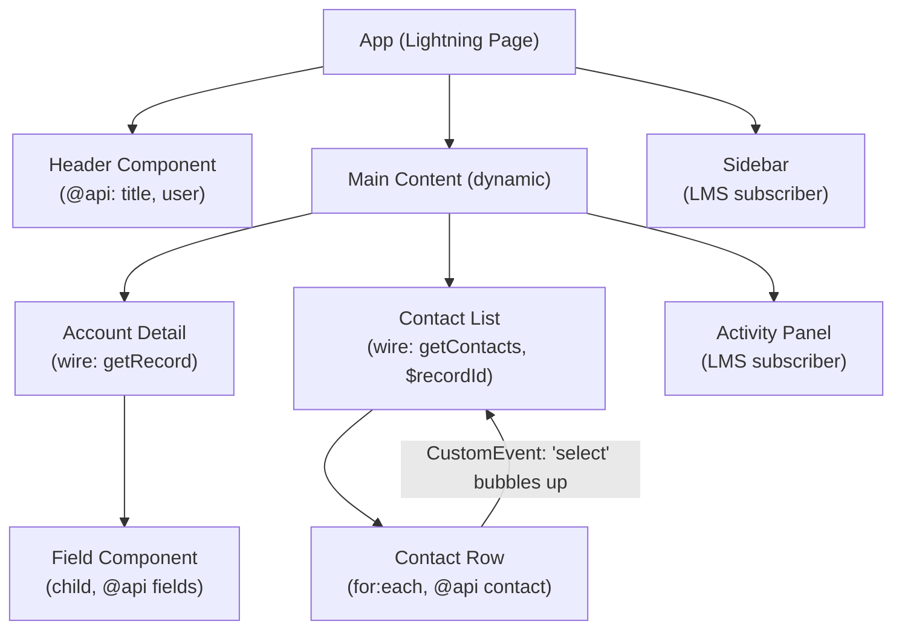

# LWC JavaScript

## Exam Domain
LWC JavaScript — ~15% of exam weight (woven through all sections; highest real-world relevance)

## Core Concepts

### Decorators — @api, @track, @wire

```javascript
import { LightningElement, api, track, wire } from 'lwc';
import getContacts from '@salesforce/apex/ContactController.getContacts';
import { getRecord, getFieldValue } from 'lightning/uiRecordApi';
import NAME_FIELD from '@salesforce/schema/Account.Name';

export default class MyComponent extends LightningElement {
    // @api — PUBLIC reactive property; parent sets it; triggers re-render on change
    @api recordId;
    @api title = 'Default Title';

    // @track — legacy deep-watch (not needed post-Spring '20 for shallow changes)
    // All properties are now reactive by default; @track adds deep watching for nested objects
    @track filterState = { status: 'active', type: 'contact' };

    // @wire — reactive Salesforce data binding
    @wire(getRecord, { recordId: '$recordId', fields: [NAME_FIELD] })
    wiredAccount;  // result: { data, error }

    // @wire with handler function (for transformation)
    @wire(getContacts, { accountId: '$recordId' })
    wiredContacts({ data, error }) {
        if (data) this.contacts = data;
        if (error) this.error = error;
    }

    // Getter using wire data safely
    get accountName() {
        return getFieldValue(this.wiredAccount.data, NAME_FIELD) ?? 'Loading...';
    }
}
```

**Decorator rules:**
- `@api` properties CANNOT be assigned inside the component (read-only from inside) — use internal property instead
- `@wire` with `$prop` prefix: `'$recordId'` makes the wire reactive to `recordId` changes
- Wire requires `@AuraEnabled(cacheable=true)` on Apex method; non-cacheable = use imperative call

### Lifecycle Hooks
```
constructor()
    → first to run; call super() first
    → DO NOT access this.template (DOM not ready)
    → Initialize state

connectedCallback()
    → component is in the DOM
    → DO: fetch data, subscribe to events, add window listeners
    → SAFE to access this.template

render() [auto - called by framework]
    → renders the template

renderedCallback()
    → fires after EVERY render
    → Use a flag for first-render-only logic
    → DO NOT cause state changes (infinite loop risk)
    → Use for: 3rd party lib init, DOM measurements

disconnectedCallback()
    → component removed from DOM
    → DO: remove event listeners, clear timers, unsubscribe from LMS

errorCallback(error, stack)
    → catches errors in CHILD components
    → implement for error boundary / graceful degradation
```

```javascript
export default class MyComponent extends LightningElement {
    _hasRendered = false;

    connectedCallback() {
        this._resizeHandler = () => this.handleResize();
        window.addEventListener('resize', this._resizeHandler);
    }

    renderedCallback() {
        if (this._hasRendered) return;  // first render only
        this._hasRendered = true;
        // Initialize third-party chart library
        const canvas = this.template.querySelector('canvas');
        this._chart = new ChartLib(canvas);
    }

    disconnectedCallback() {
        window.removeEventListener('resize', this._resizeHandler);
        this._chart?.destroy();
    }
}
```

### CustomEvent — Communication Patterns
```javascript
// Child → Parent: CustomEvent
this.dispatchEvent(new CustomEvent('save', {
    detail: { record: this.formData },
    bubbles: true,     // propagates up DOM tree
    composed: false    // does NOT cross shadow boundaries (preferred for parent-child)
}));

// Parent listens:
// <c-child onsave={handleSave}></c-child>
handleSave(event) {
    const { record } = event.detail;
}

// For events across unrelated components: Lightning Message Service
import { publish, subscribe, unsubscribe, MessageContext } from 'lightning/messageService';
import CONTACT_SELECTED_CHANNEL from '@salesforce/messageChannel/ContactSelected__c';

@wire(MessageContext) messageContext;

connectedCallback() {
    this._subscription = subscribe(
        this.messageContext,
        CONTACT_SELECTED_CHANNEL,
        (message) => this.handleMessage(message)
    );
}

disconnectedCallback() {
    unsubscribe(this._subscription);
    this._subscription = null;
}
```

### Imperative Apex
```javascript
import saveAccount from '@salesforce/apex/AccountController.saveAccount';

async handleSave() {
    this.isLoading = true;
    this.error = null;
    try {
        const result = await saveAccount({ accountData: this.accountRecord });
        this.accountId = result;
        this.dispatchEvent(new ShowToastEvent({
            title: 'Success', message: 'Saved!', variant: 'success'
        }));
    } catch (err) {
        this.error = err.body?.message ?? err.message ?? 'Unknown error';
    } finally {
        this.isLoading = false;
    }
}
```

### LWC Restrictions
```
ALLOWED in LWC:
  ES6+ JavaScript, fetch (CSP permitting), async/await
  this.template.querySelector() — own shadow tree
  Static Resources (third-party libs)

NOT ALLOWED / RESTRICTED:
  document.querySelector     — cannot see inside shadow roots
  window.document in secure context
  eval() / new Function()    — CSP violation
  Inline <script> in .html   — goes in .js file
  npm packages directly      — must use Static Resources
  @AuraEnabled non-cacheable with @wire — runtime error
```

## Architecture / How It Works

### LWC Component Architecture at Scale



- **Parent → Child:** `@api` properties (data down)
- **Child → Parent:** `CustomEvent` (events up)
- **Cross-tree:** Lightning Message Service (pub/sub)

### Shadow DOM & LWS (Lightning Web Security)
```
Browser shadow DOM:
  component DOM is isolated
  CSS doesn't leak in/out (without CSS custom properties)
  Events retarget when crossing boundaries

Lightning Web Security (LWS — replaces Locker Service):
  Enforces secure coding practices
  Restricts access to window, document, eval
  Components from different namespaces are isolated
  Managed packages get extra restriction layers
```

**Limitations:**
- `@api` properties are shallow-reactive — mutating a nested object property doesn't trigger re-render without `@track` or assignment of new reference
- Wire adapters run after first render — always guard wire data access with optional chaining
- `renderedCallback` fires on EVERY render (every state change) — use `_hasRendered` flag
- Shadow DOM prevents global CSS from styling component internals — intentional isolation

## PTA / SA Relevance

**Code review flags (most common LWC bugs):**
- `document.querySelector` instead of `this.template.querySelector`
- Missing `?.` on wire data access — crashes on first render
- `renderedCallback` without first-render guard — infinite re-render loop
- Not unsubscribing from LMS in `disconnectedCallback` — memory leak
- `@wire` on non-cacheable Apex — runtime error
- Missing `finally { this.isLoading = false; }` on imperative Apex

**Architecture reviews:**
- For parent-child in same component tree: `@api` + `CustomEvent`
- For sibling components: LMS (not direct DOM event chain)
- For bulk data display: use virtual scrolling / lazy load — never wire 10K records into one component
- For high-frequency updates (live data): consider Lightning Streaming (PushTopic/CDC) over polling

**Customer advisory:**
- LWC vs Aura: always recommend LWC for new development. Aura is legacy. LWC is faster (shadow DOM batched rendering), more standards-based, better tooling.
- Custom LWC vs AppExchange vs Standard: build custom LWC for domain-specific UI. Use standard Lightning components (lightning-record-edit-form etc.) for standard CRUD. Use AppExchange for horizontal solutions (document gen, e-sign) to avoid rebuilding.
- LWS restrictions feel limiting but are security features — especially important in ISV/AppExchange context where multiple packages share the same page.

## Key Facts to Memorize
- `@api` = public (parent sets it); `@wire` = reactive Salesforce data; `@track` = deep-watch (rarely needed)
- `$prop` prefix in `@wire` params makes the wire reactive to property changes
- Lifecycle order: constructor → connectedCallback → render → renderedCallback
- `disconnectedCallback` = cleanup; `errorCallback` = child error boundary
- `this.template.querySelector()` — own shadow root only
- `CustomEvent` with `bubbles:true, composed:true` to cross shadow DOM
- LMS for cross-tree component communication (different DOM branches)

## Exam Traps
- `@api` property modified inside the component → this is READ-ONLY from inside; use internal backing property
- Wire function handler `({ data, error })` — destructures the wire result; error is checked separately from data
- `renderedCallback` every render, not just first — always use a boolean flag for initialization
- `bubbles: true` alone is NOT enough to cross shadow DOM — need `composed: true` too
- `document.querySelector` in LWC — silently returns null or finds wrong element; always `this.template.querySelector`

## Practice Questions
**Q:** Which decorator makes a property accessible from a parent component?
**A:** `@api`. It makes the property part of the component's public interface. The parent sets it via HTML attribute or template binding. `@wire` connects to Salesforce data. `@track` watches nested changes.

**Q:** Which lifecycle hook is correct for subscribing to a message channel, and which for unsubscribing?
**A:** Subscribe in `connectedCallback` (component is in DOM, safe to set up). Unsubscribe in `disconnectedCallback` (component removed, clean up to prevent memory leak).

**Q:** A developer dispatches a `CustomEvent` from a deeply nested child, but the grandparent doesn't receive it. What is likely missing?
**A:** Either `bubbles: true` (event must propagate up the DOM tree) or `composed: true` (event must cross shadow DOM boundaries), or both. Without both options, the event stops at the shadow root of the dispatching component.
