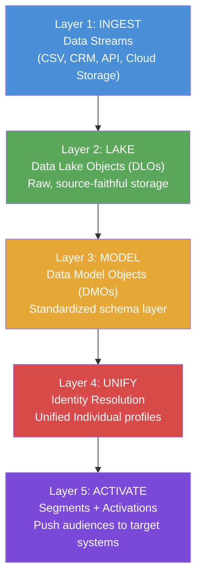

# Lab ADV-01 — Data Cloud Environment Setup and Orientation

## Learning Objectives
- Understand what Data Cloud is, how it differs from Salesforce CRM, and where it fits in the Salesforce ecosystem
- Navigate the five architectural layers of Data Cloud (ingest, lake, model, unify, activate) and explain what happens in each
- Identify and define the core Data Cloud terminology: DLO, DMO, Unified Individual, Segment, Activation Target
- Navigate the Data Cloud application within Salesforce and locate each functional area
- Understand how Data Cloud licensing works and what permissions are required
- Verify that your org has the prerequisites needed for subsequent labs

---

## Concept Deep Dive: What Is Data Cloud?

### Data Cloud vs. Salesforce CRM — The Fundamental Distinction

Before you touch a single UI element, you need to firmly understand what Data Cloud is — because it is genuinely different from Salesforce CRM, and conflating the two causes persistent confusion on the exam and in the real world.

Salesforce CRM (the Sales Cloud, Service Cloud, platform you already know) is a **transactional system of record**. It stores structured records — Accounts, Contacts, Opportunities — organized into objects with defined fields. It is optimized for creating, reading, updating, and deleting individual records. It answers questions like "What is the current stage of Opportunity 007?" or "Which cases are open for Account XYZ?" It is real-time in the sense that a rep can see an update the moment it's saved, but it is not designed to hold large volumes of behavioral or historical data, nor does it have a concept of "unifying" the same person appearing across multiple sources.

Data Cloud is a **Customer Data Platform (CDP)**. It was called Salesforce CDP before it was renamed to Data Cloud in 2022. A CDP has a fundamentally different job: it ingests data from many sources (your CRM, your website, your data warehouse, your marketing platform, your e-commerce system), links records that represent the same person across all those sources, and makes that unified profile available for segmentation and activation. It answers questions like "Show me every interaction Sarah Johnson has ever had with our company, across every channel, regardless of which system recorded it."

The key mental model: **CRM is a source of data for Data Cloud. Data Cloud is a downstream consumer and aggregator.** Data flows from CRM into Data Cloud, not the other way around (except when you activate back to CRM, which is a deliberate one-way write-back for specific use cases).

### Why a Separate System?

You might ask: why not just build this into the existing CRM? The answer comes down to data volume, data variety, and processing paradigm. A typical enterprise might have:
- 2 million CRM contact records
- 500 million website clickstream events
- 100 million email engagement events
- 50 million e-commerce transactions

CRM objects are not designed to store 500 million event records. Data Cloud uses a cloud data lake architecture underneath (built on Salesforce's Hyperforce infrastructure, which uses public cloud providers), allowing it to store and process petabyte-scale data efficiently.

### The Five-Layer Architecture

Data Cloud's processing pipeline moves through five conceptual layers. Understanding these layers is essential for the exam and for debugging real-world problems.

**Layer 1 — Ingest:** Data enters Data Cloud through Data Streams. A Data Stream is a configured connection to a data source. You tell Data Cloud where the data lives, how often to pull it, and which fields you want. The four source types are: Salesforce CRM connector, Cloud Storage (S3, Azure Blob, GCS), Direct API (real-time streaming), and File Upload (manual CSV or JSON). Nothing is processed or transformed at this layer — data is simply received.

**Layer 2 — Lake:** When a Data Stream runs, it writes raw data into a Data Lake Object (DLO). Think of a DLO as a table in a data lake. It stores data exactly as it came in from the source, with the source's field names and values, plus a few auto-generated system fields. DLOs are the "raw" layer — they are not yet standardized or deduplicated. Multiple DLOs can exist for the same conceptual entity (e.g., one DLO for CRM Contacts, another for CSV-uploaded contacts, another for website form submissions — all representing people).

**Layer 3 — Model:** DLOs are mapped to Data Model Objects (DMOs). A DMO is a standardized schema defined by Salesforce. Instead of every source having its own field names (CRM says "FirstName", your CSV says "first_name", your website says "given_name"), the DMO layer normalizes everything to a consistent schema. The most important standard DMOs are: Individual (a person), Contact Point Email, Contact Point Phone, Contact Point Address, Account, and Opportunity. This layer is what makes cross-source comparison possible.

**Layer 4 — Unify:** With multiple DLOs now mapped to the same DMO (e.g., two DLOs both mapped to Individual), the Identity Resolution engine can run. It compares records across all sources, looks for signals that two records represent the same real person (matching email, matching name+phone, etc.), and creates a Unified Individual — a single, merged profile that aggregates data from all matched source records. This is the heart of CDP functionality.

**Layer 5 — Activate:** With clean, unified profiles, you can now build Segments (filtered audiences: "all customers in California who purchased in the last 90 days") and push them to downstream systems via Activations. Activation Targets include Salesforce Marketing Cloud, Salesforce CRM, Google Ads, Meta, Amazon S3, and others.

### Core Terminology Reference

| Term | Definition |
|------|-----------|
| Data Stream | A configured connection to a data source that feeds data into Data Cloud |
| DLO (Data Lake Object) | The raw table in the data lake where ingested data is stored, source-faithful |
| DMO (Data Model Object) | A standardized schema object; DLOs are mapped to DMOs for normalization |
| Unified Individual | The merged profile created by Identity Resolution representing one real person |
| Segment | A saved filter on Unified Individual profiles producing an audience |
| Activation Target | A configured destination system where segment members are pushed |
| Identity Resolution | The process + ruleset that determines which records = same person |
| Calculated Insight | A ANSI SQL query saved in Data Cloud that creates new computed attributes |

### How Data Cloud Licensing Works

Data Cloud is a separately licensed product — it does not come with Sales Cloud, Service Cloud, or even Marketing Cloud automatically. Licensing has two main dimensions:

**Data Service Credits (DSC):** Data Cloud is consumption-based. Most operations consume DSC — ingestion, identity resolution, segmentation queries, activations. Your org receives an allocation of DSC with your contract. Running out of DSC doesn't break things immediately but will pause processing.

**Permission Sets:** Access is controlled by three primary permission sets that must be assigned to users: "Data Cloud Admin" (full access), "Data Cloud User" (can work with data streams, segments, etc., but not administer), and "Data Cloud Marketing Admin" (for Marketing Cloud integration scenarios). Some features require additional permission sets.

---

## Architecture Overview

```mermaid
flowchart LR
    subgraph Sources
        CRM["Salesforce CRM"]
        CSV["CSV / File Upload"]
        API["Direct API / Webhooks"]
        S3["Cloud Storage (S3)"]
    end

    subgraph DataCloud["Data Cloud (this lab)"]
        DS["Data Streams"]
        DLO["Data Lake Objects"]
        DMO["Data Model Objects"]
        IR["Identity Resolution"]
        UI["Unified Individual"]
        SEG["Segments"]
        ACT["Activations"]
    end

    subgraph Destinations
        MC["Marketing Cloud"]
        CRMOUT["Salesforce CRM"]
        GGL["Google Ads"]
        META["Meta / Facebook"]
    end

    Sources --> DS
    DS --> DLO
    DLO --> DMO
    DMO --> IR
    IR --> UI
    UI --> SEG
    SEG --> ACT
    ACT --> Destinations
```

---

## Prerequisites
- A Salesforce org with Data Cloud provisioned (Developer Edition orgs with Data Cloud enabled, or a dedicated sandbox/production org with the Data Cloud add-on license)
- Your user has been assigned the "Data Cloud Admin" permission set
- You have System Administrator profile or equivalent
- The Salesforce CRM connector is available (it should be by default in Data Cloud-enabled orgs)

---

## Lab Setup

No data needs to be loaded before this lab. This lab is purely navigational and configurational. You will orient yourself to the Data Cloud interface, verify your org's setup, and ensure all subsequent labs can proceed.

---

## Step-by-Step Instructions

### Step 1 — Navigate to the Data Cloud Application

From the Salesforce home page (after login):

1. Click the **App Launcher** (the 9-dot grid icon in the top-left navigation bar, also called the "waffle" icon)
2. In the search box that appears, type **Data Cloud**
3. You should see "Data Cloud" appear in the results — click it
4. The Data Cloud application loads. You should now see a new navigation bar at the top with tabs specific to Data Cloud

**What you should see:** A clean navigation bar with tabs including Home, Data Streams, Data Model, Identity Resolutions, Segments, Activations, Data Actions, and possibly others. The interface is distinct from standard Salesforce CRM pages.

**If you don't see Data Cloud in App Launcher:** Your org does not have Data Cloud provisioned, or your user does not have the required permission set. Verify with your org admin.

### Step 2 — Tour the Home Tab

Click the **Home** tab in the Data Cloud navigation bar.

The Home tab shows:
- **Data Cloud Summary Cards:** Counts of Data Streams, Unified Individual profiles, Segments, and Activations. These will all show zero in a fresh org.
- **Recent Activity:** A feed of recent processing jobs and events
- **Data Cloud Health:** Status indicators for identity resolution runs, ingestion jobs, and activation jobs

Take note of the top-right corner of the Data Cloud interface — you'll see your **org's Data Cloud instance name** displayed. It will look something like `cXX.salesforce.com` or a custom domain. This is important if you ever need to reference your org's Data Cloud endpoint.

### Step 3 — Explore the Data Streams Tab

Click the **Data Streams** tab.

On the Data Streams page:
- Click **New** (top right) to see what source types are available
- You should see options including: **Salesforce CRM**, **Cloud Storage**, **Marketing Cloud Connector**, **Ingestion API**, **Web / Mobile App Data**, and **File Upload**
- Do NOT click through any of these yet — just observe the options
- Click **Cancel** to close

Notice that the Data Streams list page shows columns: Name, Status, Source Type, Category, Last Run, and Rows Ingested. This is where you will come to monitor all your data ingestion pipelines.

### Step 4 — Explore the Data Model Tab

Click the **Data Model** tab (may also appear as part of a dropdown or submenu).

The Data Model section has two subsections:
- **Data Lake Objects (DLOs):** This will be empty in a fresh org. After you run data streams, DLOs appear here. Each DLO shows its source, field count, and row count.
- **Data Model Objects (DMOs):** This will show Salesforce's standard DMO library even in a fresh org. Click around to see the standard DMOs — you should find Individual, Contact Point Email, Contact Point Phone, Contact Point Address, Account, Opportunity, and others.

Click on the **Individual** DMO. Examine the field list:
- `IndividualId` (system-generated primary key)
- `FirstName`
- `LastName`
- `BirthDate`
- `GenderIdentity`
- And many more standard fields

This is the target schema that your CRM Contact data and your CSV data will both get mapped to in later labs. Note the field names carefully — they use PascalCase (Salesforce convention) rather than snake_case.

### Step 5 — Explore the Identity Resolutions Tab

Click the **Identity Resolutions** tab.

This will be empty in a fresh org. After Lab 5, you will have one Identity Resolution ruleset listed here. For now, understand the page structure:
- Each row represents a ruleset with its name, status, and last run time
- The **New** button opens the ruleset builder
- A ruleset defines the logic for matching and merging records

### Step 6 — Explore the Segments Tab

Click the **Segments** tab.

This will also be empty. Future segments you build will appear here with:
- Segment name
- Target entity (almost always Unified Individual)
- Member count
- Last refresh time
- Refresh type (Rapid or Full)

### Step 7 — Explore the Activations Tab

Click the **Activations** tab, then look for an **Activation Targets** sub-tab or link (it may be nested under a submenu depending on your org version).

On the Activation Targets page: these are the configured destinations where you can push segments. In a fresh org, you may see a pre-built "Salesforce CRM" activation target already present — this is the standard CRM write-back connector that comes with Data Cloud.

### Step 8 — Find Your Org's Data Cloud Instance Details

Navigate to **Setup** (gear icon in the top-right, then "Setup"):

1. In the Quick Find box (left sidebar), type **Data Cloud**
2. Look for a "Data Cloud" section in the Setup menu
3. Click **Data Cloud Setup** or **Data Cloud Admin** (the exact label varies by org version)
4. Here you will find:
   - Your **Data Cloud Tenant URL** (the API endpoint for your Data Cloud instance)
   - **Licensed Features** showing which Data Cloud modules are enabled
   - **Data Service Credits** showing your allocation and consumption

Record your Tenant URL — it will look like `https://[yourorgid].c360a.salesforce.com` or similar. This is needed for API integrations.

### Step 9 — Verify the CRM Connector Is Available

Return to the Data Cloud app (App Launcher → Data Cloud).

1. Click **Data Streams**
2. Click **New**
3. Select **Salesforce CRM** as the source type
4. You should see a screen that either:
   - Shows "Connected" with a checkmark (the CRM connector is already authorized)
   - Shows a button to authenticate/authorize (the connector needs to be set up)
5. If you see an "Authenticate" button, click it and complete the OAuth flow to authorize Data Cloud to read your CRM data. Use your System Administrator credentials.
6. Click **Cancel** — you will complete the actual CRM data stream setup in Lab 3

### Step 10 — Check Permission Sets

Navigate to **Setup → Users → Permission Sets**.

Verify the following permission sets exist in your org:
- **Data Cloud Admin** — grants full Data Cloud access
- **Data Cloud User** — grants standard user access
- **Data Cloud Marketing Admin** — for Marketing Cloud integration (may not be present if you don't have MC)

Check that your own user (Setup → Users → Users → click your name) has the **Data Cloud Admin** permission set assigned. If it's not assigned, click **Permission Set Assignments**, **Edit Assignments**, select "Data Cloud Admin", click **Add**, then **Save**.

### Step 11 — Verify Data Cloud Features Are Enabled

In Setup, search for **Data Cloud** in Quick Find:

1. Look for **Feature Settings** or **Data Cloud Setup**
2. Verify these are toggled ON (if visible):
   - Identity Resolution
   - Segmentation
   - Activation
   - Calculated Insights

If any features are off and you have admin rights, toggle them on. Note: some features may not be visible if your license tier doesn't include them.

### Step 12 — Return to Data Cloud and Confirm Navigation

Return to the Data Cloud app and confirm you can access all tabs without errors. Take a mental note of the navigation structure — you will use it constantly in subsequent labs:

- **Data Streams** → where all ingestion is configured
- **Data Model** → where DLOs and DMOs live
- **Identity Resolutions** → where match rulesets are built
- **Segments** → where audiences are defined
- **Activations** → where segment outputs are pushed to targets
- **Data Actions** → where event-triggered automations are configured
- **Calculated Insights** → where SQL-defined computed attributes live

---

## What You Built

In this lab, you did not create any data objects — this was an orientation lab. What you established:
- A mental model of Data Cloud's 5-layer architecture and how it differs from CRM
- Familiarity with the Data Cloud UI and all primary navigation tabs
- Verified that the Salesforce CRM connector is available and authorized
- Confirmed your user has the Data Cloud Admin permission set
- Located your org's Data Cloud tenant details
- Verified the standard DMO library exists (especially the Individual DMO that later labs depend on)

The org is now ready for data ingestion in Labs 2 and 3.

---

## Checkpoint Questions

1. What is the fundamental architectural difference between Salesforce CRM and Data Cloud, and why can't you simply use CRM for the CDP use case?
2. A Data Lake Object and a Data Model Object both represent "contacts." What is the key difference between them, and why do both need to exist?
3. In the five-layer Data Cloud architecture, which layer is responsible for deciding that `sarah.j@techcorp.com` and `s.johnson@gmail.com` are the same person? What is the output of that layer called?
4. What permission set must a user have to configure Data Streams and Identity Resolutions in Data Cloud?
5. If you have CRM Contact records and CSV-uploaded contact records, how many DLOs would you have for "contacts," and how many DMOs?

---

## Common Errors & Troubleshooting

**"Data Cloud not found in App Launcher"**
Cause: Data Cloud license not provisioned, or user lacks permission set.
Fix: Verify org has Data Cloud add-on. Assign "Data Cloud Admin" permission set to the user. Check Setup → Company Information → Licenses to confirm Data Cloud appears.

**"You don't have access to Data Cloud features"**
Cause: User has the permission set but feature toggles are off.
Fix: Navigate to Setup → Data Cloud Setup and enable required features. Some features require a support ticket to Salesforce to enable at the license level.

**"CRM Connector authentication failed"**
Cause: The OAuth connection between Data Cloud and CRM was not completed, or the connected app was revoked.
Fix: In Data Cloud → Data Streams → New → Salesforce CRM, click "Authenticate" and complete the OAuth flow. Ensure you're authenticating with an account that has API access enabled.

**"Data Cloud Home shows no stats / blank cards"**
Cause: This is expected for a fresh org with no data streams configured yet. Not an error.
Fix: Proceed with Labs 2 and 3 to ingest data. Stats will populate after the first successful data stream run.

**"Standard DMOs not visible in Data Model tab"**
Cause: Sometimes takes a few minutes after initial Data Cloud setup for the standard DMO library to populate.
Fix: Wait 5-10 minutes and refresh. If persists, check that Data Cloud Setup completed successfully in Setup.

---

## Exam Tips

- The exam loves to test whether you know that **Data Cloud is a separately licensed product** — it does not come bundled with any other Salesforce Cloud automatically. Watch for questions about licensing.
- Know the **difference between DLO and DMO precisely**: DLOs store raw source data; DMOs are standardized target schemas. A common distractor question asks which one stores the "unified" profile (neither — that's the Unified Individual, which comes from Identity Resolution running on DMO data).
- The **five layers** — Ingest, Lake, Model, Unify, Activate — appear in conceptual questions. Know what goes wrong if each layer is skipped or misconfigured.
- Data Cloud was formerly named **Salesforce CDP**. The exam may use both names in older question banks. They are the same product.
- **Data Service Credits (DSC)** is the consumption unit for Data Cloud. Exam questions about "what happens when you run out of credits" expect you to know that processing pauses, not that data is deleted.
- The **Unified Individual** is not a CRM Contact and is not stored in a CRM object. It is a Data Cloud-native construct. Activating a Unified Individual back to CRM creates/updates CRM records — the Unified Individual itself remains in Data Cloud.
