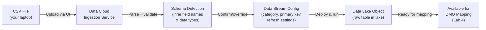
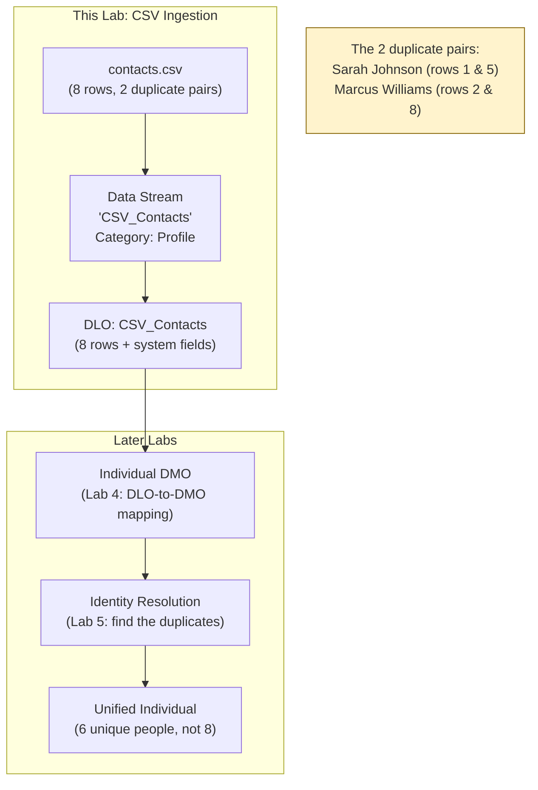

# Lab ADV-02 — CSV Data Stream Ingestion

## Learning Objectives
- Understand what a Data Stream is and how it acts as the entry point for all data into Data Cloud
- Distinguish between the four types of data sources and know when to use each
- Explain the three Data Categories (Profile, Engagement, Other) and why the choice affects downstream processing
- Understand what a Data Lake Object (DLO) is, what it stores, and how it differs from a Salesforce CRM object
- Trace the full ingestion pipeline from CSV file to queryable DLO
- Understand auto-generated system fields that Data Cloud adds to every DLO row

---

## Concept Deep Dive: Data Streams and the Ingestion Layer

### What Is a Data Stream?

A Data Stream is Data Cloud's configured connection to a data source. Think of it as a pipeline with two ends: one end connects to a source (a CRM org, an S3 bucket, a CSV file, a live API endpoint), and the other end writes into a Data Lake Object inside Data Cloud. The Data Stream definition includes:

- **What** to read (which object, which fields, or which file)
- **How often** to read it (real-time, hourly, daily, manual)
- **What category** the data is (Profile, Engagement, or Other)
- **Which DLO** to write into (usually auto-created with the stream)

Once a Data Stream is deployed and activated, it runs on its schedule and populates or appends to its target DLO. You can have dozens or hundreds of Data Streams pointing to different sources, all writing into separate DLOs. This is by design — the separation of raw sources is intentional so that you always have a faithful copy of what each source provided, before any transformation or normalization.

### The Four Data Source Types

Understanding the four source types is critical for both real-world implementation and the exam. Each has a different use case and different configuration requirements.

**1. Salesforce CRM Connector**
This is a pre-built connector that reads data directly from CRM objects (Contact, Lead, Account, Opportunity, Case, and custom objects) in your own Salesforce org. It uses a standard OAuth connection and does not require any middleware. It supports both full refresh (read everything from scratch) and incremental refresh (read only records changed since the last run). This is the most common source type for most Data Cloud implementations because virtually every Salesforce customer has CRM data they want to unify.

**2. Cloud Storage**
This connector reads files from cloud object storage: Amazon S3, Azure Blob Storage, or Google Cloud Storage. Files must be in CSV or JSON format with a consistent schema. This is used for bulk historical data loads, data from third-party vendors who drop files into a shared bucket, or data from on-premise systems that export files on a schedule. Cloud Storage sources support incremental loads by reading only files added since the last run (based on file timestamp or file naming conventions).

**3. Ingestion API (Direct API)**
This is a REST API endpoint that Data Cloud exposes. External systems can POST data directly to this endpoint in real time or near-real time. This is used for high-velocity event data: website clickstreams, mobile app events, IoT sensor readings. Unlike the other sources which are pull-based (Data Cloud reaches out to pull data), the Ingestion API is push-based (the source system pushes data to Data Cloud). This is the source type for true real-time data use cases.

**4. File Upload (Manual)**
This is the simplest source type: you manually upload a CSV or JSON file through the Data Cloud UI. There is no automated refresh schedule — you upload a file, it ingests once, and that's it (unless you upload again manually). This is used for one-time data loads, testing, proof-of-concept work, and small batch imports from systems that don't have a connector. This lab uses File Upload because it requires no external connectivity.

### Data Categories: Profile, Engagement, and Other

Every Data Stream must be assigned a Data Category. This is one of the most frequently tested concepts because its implications cascade through the entire Data Cloud pipeline.

**Profile Data** represents who a person is. It is semi-static information about individuals: name, email, phone number, address, demographic attributes, company affiliation, preferences. Profile data changes infrequently. When you set a stream's category to Profile, Data Cloud knows this data describes identities — it is the data that will be matched and merged during Identity Resolution.

**Engagement Data** represents what a person did. It is event-based, time-stamped, high-volume behavioral data: email opens, website page views, purchase transactions, support case interactions. Engagement data is immutable (you don't update a past email open — it happened and is permanent). Engagement data is typically much higher volume than Profile data. When you set a stream's category to Engagement, Data Cloud knows this data records events and handles it differently in storage and query optimization.

**Other Data** is a catch-all for data that doesn't fit either category: product catalogs, store locations, pricing tables, reference data, org charts. This data isn't about individuals, so it doesn't participate in Identity Resolution, but it can be referenced in Calculated Insights and Segments.

**Why does the category matter?** Two critical reasons:
1. **Identity Resolution only runs on Profile data.** If you miscategorize your contact CSV as "Engagement," the Identity Resolution engine will never look at it for matching. Your Unified Individual profiles will be incomplete.
2. **Retention and processing rules differ.** Engagement data has different storage tier behavior and is handled differently in query planning. Profile data is expected to be smaller and more frequently updated.

### What Is a Data Lake Object (DLO)?

A Data Lake Object is a table in Data Cloud's data lake that stores the raw output of one Data Stream. Key characteristics:

- **Source-faithful:** The DLO preserves the original field names and values from the source. If your CSV has a column called `first_name`, your DLO will have a field called `first_name`. No transformation happens at this layer.
- **Append-friendly:** For most source types, new data is appended to the DLO (not upserted). If your CRM has 1,000 contacts today and you add 10 more tomorrow, the DLO goes from 1,000 to 1,010 rows (for incremental refresh) or is fully rewritten (for full refresh).
- **Not an object in CRM:** A DLO is completely separate from Salesforce CRM. It does not appear in Schema Builder, it cannot be queried with SOQL, and it doesn't consume CRM data storage limits. It lives in Data Cloud's storage layer.
- **Auto-generated system fields:** Data Cloud adds several system fields to every DLO row automatically — these are discussed in detail in Step 7 below.

### The Ingestion Pipeline — From Upload to DLO

When you upload a CSV file as a File Upload Data Stream, here is exactly what happens under the hood:



The parsing step detects field names from the header row and infers data types (text, number, date). You can override the inferred types during setup. The schema is then locked for that DLO — future uploads to the same Data Stream must match this schema.

---

## Architecture Overview



---

## Prerequisites
- Lab ADV-01 completed: Data Cloud app is accessible, Data Cloud Admin permission set is assigned
- A text editor (any — Notepad, TextEdit, VS Code) to create the CSV file
- No external connectors needed — this lab uses manual file upload only

---

## Lab Setup

You will create a CSV file on your local machine before ingesting it. The CSV contains 8 rows with intentional duplicates — Sarah Johnson appears in rows 1 and 5 (same person, different email), and Marcus Williams appears in rows 2 and 8 (same person, different email). These duplicates will be the fuel for the Identity Resolution exercise in Lab 5.

Create a file named `contacts.csv` on your desktop (or any convenient location) with exactly the following content — copy it character for character including the header row:

```
first_name,last_name,email,phone,city,account_name,product_interest,last_purchase_date
Sarah,Johnson,sarah.j@techcorp.com,415-555-0101,San Francisco,TechCorp Inc,Sales Cloud,2025-11-15
Marcus,Williams,marcus.w@globalbank.com,312-555-0202,Chicago,Global Bank,Service Cloud,2025-12-01
Priya,Patel,priya.p@healthsys.com,212-555-0303,New York,Health Systems,Data Cloud,2026-01-10
Jordan,Lee,jordan.l@retailco.com,512-555-0404,Austin,RetailCo,Agentforce,2026-02-28
Sarah,Johnson,s.johnson@gmail.com,415-555-0101,San Francisco,TechCorp Inc,Marketing Cloud,2026-03-15
David,Chen,d.chen@manufact.com,206-555-0505,Seattle,Manufacturing Co,MuleSoft,2025-10-20
Aisha,Brown,a.brown@fintech.com,617-555-0606,Boston,FinTech Ltd,Revenue Cloud,2026-01-25
Marcus,Williams,mwilliams@gmail.com,312-555-0202,Chicago,Global Bank,Einstein Analytics,2026-04-01
```

Note the intentional design choices:
- Sarah Johnson (rows 1 and 5): same `phone` (415-555-0101) and `account_name` (TechCorp Inc), but different `email`. This simulates a person using a work email and a personal email.
- Marcus Williams (rows 2 and 8): same `phone` (312-555-0202) and `account_name` (Global Bank), but different `email`. Same pattern.
- The other 4 records (Priya, Jordan, David, Aisha) are unique — no duplicates.

---

## Step-by-Step Instructions

### Step 1 — Open the Data Streams Tab

From Salesforce, navigate to the Data Cloud app via the App Launcher.

Click **Data Streams** in the top navigation.

You should see an empty list (assuming a fresh org). The list page shows columns for Name, Status, Source Type, Category, Last Run, and Rows Ingested.

### Step 2 — Start a New Data Stream

Click the **New** button (top-right).

A "Select a Data Source" dialog or page appears showing the available source type options. Select **File Upload**.

Click **Next** (or the equivalent button to proceed).

### Step 3 — Upload the CSV File

On the file upload screen:

1. Click **Browse** (or drag-and-drop into the upload area)
2. Navigate to your desktop and select the `contacts.csv` file you created
3. Click **Open** to upload the file

Data Cloud will parse the file and display a preview of the data. You should see:
- 8 data rows (plus the header row)
- 8 columns: first_name, last_name, email, phone, city, account_name, product_interest, last_purchase_date
- A preview of the first few rows

If the parsing fails (you see an error about file format), the most common cause is invisible characters or BOM markers in the CSV. Re-create the file in a plain text editor (not Excel) and try again.

### Step 4 — Configure the Data Stream Name and Category

On the configuration screen:

1. **Name:** Enter `CSV_Contacts_Lab` (no spaces; underscores are fine)
2. **Description:** Enter `Lab contact data with intentional duplicates for identity resolution testing`
3. **Category:** Select **Profile**

The Category field is critical. Select "Profile" because this data describes people (who they are, their contact information). If you selected "Engagement" by mistake, Identity Resolution in Lab 5 would skip this data entirely.

Do not change the **Primary Key** field yet — we will address this in the next step.

### Step 5 — Review and Set Field Data Types

Data Cloud has auto-detected field types from your CSV. Review each field's inferred type:

| Field Name | Expected Type | Notes |
|-----------|--------------|-------|
| first_name | Text | Correct |
| last_name | Text | Correct |
| email | Email | Should be Email — if shown as Text, change it |
| phone | Phone | Should be Phone — if shown as Text, change it |
| city | Text | Correct |
| account_name | Text | Correct |
| product_interest | Text | Correct |
| last_purchase_date | Date | Must be Date, NOT Text |

For `last_purchase_date`: if Data Cloud detected it as Text rather than Date, click the type dropdown for that field and change it to **Date**. The date format in our CSV (`2025-11-15`) is ISO 8601 (YYYY-MM-DD), which Data Cloud handles natively.

For `email`: if shown as Text, change to **Email**. This is important — the Email type signals to Data Cloud that this field can be used as an identity match key.

### Step 6 — Set the Primary Key Field

A primary key uniquely identifies each row in your DLO. This is important for incremental updates — without a primary key, Data Cloud can't know whether an incoming row is a new record or an update to an existing one.

Look for a **Primary Key** dropdown or selector. For this CSV:
- There is no natural primary key — we don't have a unique ID column
- Select **email** as the primary key for now (even though we have duplicate emails across our two Sarah/Marcus records — we'll see the implications of this choice)

In a production scenario, you would want a true unique identifier (like a CRM ID or a system-generated UUID). The lack of a clean primary key in CSV data is a common real-world challenge. For this lab, using `email` as the primary key means the second Sarah Johnson record (with `s.johnson@gmail.com`) will be treated as a separate record from the first (with `sarah.j@techcorp.com`) — which is correct, since they have different emails.

### Step 7 — Deploy the Data Stream

Review your configuration:
- Name: `CSV_Contacts_Lab`
- Source Type: File Upload
- Category: Profile
- Primary Key: email
- 8 columns configured
- Data types reviewed

Click **Deploy** (or **Save & Deploy**, depending on your org version).

Data Cloud will:
1. Create the Data Stream definition
2. Immediately run the initial ingestion (for File Upload sources, this happens synchronously or within a few minutes)
3. Create the Data Lake Object (`CSV_Contacts_Lab`)
4. Write all 8 rows into the DLO

You will be redirected to the Data Stream detail page or returned to the Data Streams list. The status should show **Active** or **Running**, then transition to **Success** or **Active** once ingestion completes.

### Step 8 — Confirm the Data Stream Ran Successfully

On the Data Streams list page, find `CSV_Contacts_Lab`. Check:
- **Status:** Should show "Active" or a green checkmark
- **Last Run:** Should show a recent timestamp
- **Rows Ingested:** Should show **8**

If Rows Ingested shows 0 or the status shows "Error", click the Data Stream name to open its detail page. Look for a **Run History** or **Job Log** section that shows error details. Common errors are documented in the Troubleshooting section below.

### Step 9 — Navigate to the Data Lake Object

Click the **Data Model** tab in the Data Cloud navigation bar.

Click **Data Lake Objects** (this may be a sub-tab within Data Model).

You should now see `CSV_Contacts_Lab` listed as a DLO. Click on it to open the DLO detail page.

The DLO detail page shows:
- **Object Name:** CSV_Contacts_Lab
- **Source:** File Upload
- **Row Count:** 8
- **Field List:** all 8 fields from your CSV plus auto-generated system fields

### Step 10 — Examine the Auto-Generated System Fields

This step is conceptually important for the exam. When Data Cloud writes data to a DLO, it automatically adds several system fields to every row. On the DLO detail page, look at the full field list and find fields whose names start with `__` (double underscore) — these are system fields.

| System Field | Purpose |
|-------------|---------|
| `__dc_id` | Data Cloud's internal unique identifier for this row — guaranteed unique across all rows in all DLOs |
| `__source_sequence` | A sequence number used to determine ordering when multiple updates arrive for the same primary key record |
| `__source_object` | The name of the Data Stream that produced this row |
| `__created_date` | Timestamp when this row was written to the DLO (not the source record's created date — the DLO write timestamp) |
| `__updated_date` | Timestamp when this row was last updated in the DLO |

The `__dc_id` field is particularly important. It is the DLO's internal row identifier. When you map this DLO to a DMO in Lab 4, the `__dc_id` serves as the foreign key linkage between the DLO row and the resulting DMO record.

### Step 11 — Preview the Data in the DLO

On the DLO detail page, look for a **Data Preview** tab or button. Click it to see the actual rows stored in the DLO.

You should see all 8 rows with your original data plus the system fields. Verify:
- All 8 rows are present
- The `email` values are correct (check that Sarah Johnson appears with both `sarah.j@techcorp.com` AND `s.johnson@gmail.com` — two separate rows as expected)
- The `last_purchase_date` values look like dates, not text strings
- The `__dc_id` field shows unique values for each row

If you see only 7 rows or fewer, there may have been a primary key conflict issue during ingestion. See the Troubleshooting section.

### Step 12 — Understand What "Profile" Category Means in Practice

Return to the Data Streams list. Click **New**, select any source type, and look at the Category dropdown. Notice the three options: Profile, Engagement, Other. Then cancel — this is just to observe.

As a mental checkpoint: because you set `CSV_Contacts_Lab` to Profile, when you run Identity Resolution in Lab 5, the IR engine will look at the Individual records derived from this DLO and attempt to match them against Individual records from your CRM Contact DLO (Lab 3). The fact that Sarah Johnson and Marcus Williams each appear twice (from this single source) means the IR engine needs to handle intra-source deduplication as well as cross-source matching.

---

## What You Built

You now have:
- A deployed Data Stream named `CSV_Contacts_Lab` of type File Upload, category Profile
- A Data Lake Object named `CSV_Contacts_Lab` containing 8 rows
- A schema of 8 source fields plus auto-generated system fields
- A dataset with intentional duplicates (Sarah Johnson ×2, Marcus Williams ×2) that will be resolved in Lab 5
- A concrete understanding of the ingestion pipeline from file to DLO

The DLO is now ready to be mapped to the Individual Data Model Object in Lab 4.

---

## Checkpoint Questions

1. You need to ingest real-time website clickstream events (millions of events per day) into Data Cloud. Which data source type would you choose and why? Which category would you assign?
2. A colleague says "I'll set the contact upload to Engagement category — contacts are things that happen to our CRM, right?" What is wrong with this reasoning and what consequence would it have?
3. What is the difference between `__dc_id` and the `email` field you set as the primary key? When would each be used?
4. After uploading the CSV with 8 rows, you receive a corrected CSV with 10 rows (including 2 new contacts). How would you update the DLO — would you create a new Data Stream or upload to the existing one? What determines whether old rows are replaced or appended?
5. Why does Data Cloud store data in DLOs exactly as received from the source, rather than transforming it into the standardized DMO schema immediately on ingestion?

---

## Common Errors & Troubleshooting

**"File upload failed: invalid format"**
Cause: The CSV file has BOM (byte order mark) characters, Windows-style line endings that aren't handled, or was saved as Excel format (.xlsx) instead of CSV.
Fix: Open the file in a plain text editor (VS Code, Notepad, TextEdit in plain text mode), copy the content, paste into a new plain text file, save as UTF-8 encoded CSV with `.csv` extension. Never upload an Excel file directly.

**"Rows Ingested: 7 instead of 8" or missing rows**
Cause: A duplicate primary key value caused one row to overwrite another. If you had two rows with the same email (which we don't in this dataset, but is a common mistake), only one would survive.
Fix: Check your CSV for accidental duplicate email values. If all emails are unique (as in our dataset), this shouldn't occur. Also check the job log for specific row-level errors.

**"Date field shows as Text / last_purchase_date not recognized as Date"**
Cause: Date format in the CSV uses a non-standard format (MM/DD/YYYY instead of YYYY-MM-DD), or Data Cloud failed to auto-detect the date type.
Fix: During stream setup, manually change the field type to Date and confirm the format mask matches your data. ISO 8601 format (YYYY-MM-DD) is the most reliable format for Data Cloud CSV ingestion.

**"Data Stream deployed but status shows Error"**
Cause: Various — could be schema mismatch, permission issue, or processing error.
Fix: Click the Data Stream, find the Run History, click the failed run, read the error detail. Error messages are usually specific. Common sub-causes: field type conflict (a non-numeric value in a number column), file encoding issues, or a misconfigured primary key field type.

**"DLO not visible under Data Model"**
Cause: The DLO creation is asynchronous — it may take 2-5 minutes after the Data Stream runs successfully for the DLO to appear.
Fix: Wait a few minutes and refresh the Data Model page. If it still doesn't appear after 10 minutes, check that the Data Stream ran successfully (Status: Active, Rows Ingested > 0).

---

## Exam Tips

- Know the **four source types** cold: Salesforce CRM Connector, Cloud Storage, Ingestion API, File Upload. Exam questions will present a scenario and ask which source type is appropriate.
- **Category choice is irreversible after the DLO is created** (you'd have to delete and re-create the Data Stream). This fact appears in scenario-based exam questions about troubleshooting missing Unified Individuals.
- The exam tests whether you know that **Engagement data participates in Identity Resolution in a different way than Profile data** — specifically, Engagement data records are linked to Unified Individuals after IR runs, but the Engagement records themselves are not the inputs for matching.
- Know that **File Upload has no automated refresh** — it is one-time. If asked "which source type is best for nightly batch loads from a legacy system," the answer is Cloud Storage (S3), not File Upload.
- The **`__dc_id` field** is auto-generated and guaranteed unique — do not confuse it with the primary key you define. The primary key is used for deduplication at ingest time; `__dc_id` is Data Cloud's internal row identifier.
- **DLOs count against Data Cloud storage credits**, not CRM storage limits. This is important for licensing and capacity planning questions.
