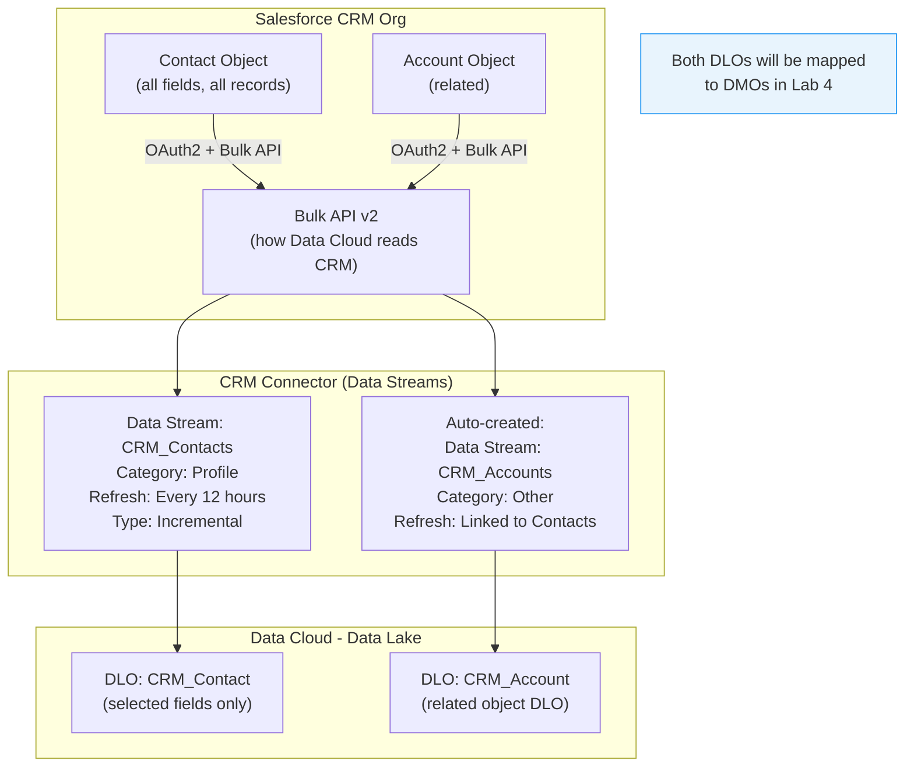

# Lab ADV-03 — CRM Connector and Data Stream Configuration

## Learning Objectives
- Understand what the Salesforce CRM connector is and why Data Cloud needs explicit authorization to read CRM data
- Know which CRM objects can be connected and under what conditions (standard vs. custom objects)
- Distinguish between full refresh and incremental refresh strategies and know when to choose each
- Configure a CRM Data Stream for the Contact object with selective field mapping
- Verify that related objects (like Account) are automatically brought in as separate DLOs
- Check row counts and confirm the DLO reflects the CRM data state

---

## Concept Deep Dive: The Salesforce CRM Connector

### Why Data Cloud Doesn't Automatically See CRM Data

This surprises many people when they first encounter it: Data Cloud lives in the same Salesforce ecosystem as your CRM, provisioned in the same org, yet it cannot automatically read your CRM Contacts or Accounts. Why?

The answer is architectural separation by design. Data Cloud is built on a different infrastructure layer than CRM. Even in a single Salesforce org, the CRM platform (built on the original Force.com architecture) and Data Cloud (built on Hyperforce with a data lake backend) are distinct systems with distinct data stores. They communicate via a connector layer, not via shared memory.

This separation is actually a feature, not a bug. It means:
- Changes to CRM schema don't automatically break Data Cloud (they're decoupled)
- Data Cloud can ingest CRM data at bulk scale without impacting CRM performance
- You have explicit control over which CRM data enters Data Cloud (you select specific objects and fields — you're not forced to sync everything)
- CRM data governance and Data Cloud data governance are managed independently

The Salesforce CRM Connector uses OAuth 2.0 to authorize Data Cloud to read your CRM data via Salesforce's Bulk API. This is the same API that tools like data loaders use to export large volumes of CRM data efficiently.

### Which CRM Objects Can Be Connected

The CRM connector supports a broad range of CRM objects:

**Standard Objects (always available):**
- Contact
- Lead
- Account
- Opportunity
- Case
- Campaign
- CampaignMember
- Task
- Event
- User
- Product2
- Order
- Contract

**Custom Objects:**
Custom objects created in your CRM are also available through the connector, as long as they have been enabled for API access. When you select a custom object, you'll see its API name (ending in `__c`).

**Related Object Behavior:**
When you select an object that has lookup or master-detail relationships to other objects, Data Cloud can optionally bring in the related object's fields. For example, when you select Contact, you can choose to also include fields from the related Account. Importantly, Data Cloud creates a **separate DLO for each related object** — it does not denormalize everything into one flat DLO. This preserves the relational structure.

### Full Refresh vs. Incremental Refresh

This distinction is fundamental for performance, cost, and data freshness.

**Full Refresh** reads every record from the CRM object from scratch every time the sync runs. If your Contact object has 500,000 records and you run full refresh twice a day, Data Cloud reads 500,000 records twice a day. The DLO is completely rebuilt on each run. Full refresh is appropriate when:
- The source object doesn't have reliable change tracking (no SystemModstamp or equivalent)
- You need to be certain about deletes (if a CRM record is deleted, full refresh will reflect that; incremental won't know about the deletion)
- The data volume is small enough that the overhead is acceptable

**Incremental Refresh** reads only records where `SystemModstamp` is greater than the last successful sync timestamp. If 50 records changed since yesterday's run, Data Cloud reads only those 50 records. Incremental is appropriate when:
- Your data volume is large (millions of records)
- You only need to capture creates and updates (not deletes)
- You want to minimize CRM API consumption and Data Cloud credit consumption

**The Delete Problem with Incremental:**
A critical limitation of incremental refresh is that it cannot detect deleted CRM records. If a Contact is hard-deleted in CRM, the CRM Data Stream using incremental refresh will never know it's gone — the DLO will still have the old row. To handle deletes with incremental refresh, you need to either: (a) use full refresh periodically as a reset, (b) use soft deletes in CRM (mark records inactive rather than deleting them), or (c) build a custom deletion mechanism. This is a common exam trap.

### Field-Level Mapping Choices

When configuring a CRM Data Stream, you select which fields from the CRM object to include. You do not have to include all fields — in fact, you should be selective for two reasons:
1. **Performance:** Fewer fields = less data to read, transfer, and store
2. **Governance / Privacy:** Sensitive fields (SSN, passport numbers, detailed health information) should only be brought into Data Cloud if you have a specific, justified use case

For the Contact object, the fields most commonly selected for CDP use cases are:
- `FirstName`, `LastName` — for identity
- `Email` — for identity matching
- `Phone`, `MobilePhone` — for identity matching
- `AccountId` — to link Contact to Account
- `MailingCity`, `MailingState`, `MailingCountry` — for geographic segmentation
- `LeadSource` — for campaign analysis
- `CreatedDate`, `LastModifiedDate` — for recency analysis
- Custom fields relevant to your business (subscription tier, customer status, etc.)

---

## Architecture Overview

---

## Prerequisites
- Lab ADV-01 completed: Data Cloud Admin permission set assigned, CRM Connector authenticated
- Lab ADV-02 completed: You understand DLO concepts from the CSV exercise
- Your CRM org has at least a few Contact records (ideally 5-10 for this lab to be meaningful)
- If your org has no Contacts, create 3-5 manually in Salesforce CRM first: Setup is not required — just go to the Contacts tab in Sales Cloud and click New

---

## Lab Setup

Before starting, verify your CRM has test data:
1. Open the App Launcher, click **Sales** (or **Service**) app
2. Click **Contacts** tab
3. Confirm you have at least 3 Contact records with Email addresses filled in

If you have no contacts, create at minimum these 3 (use the New button on the Contacts tab):
- First: **Alex Rivera**, Email: `alex.r@testco.com`, Account: Create a new Account called "TestCo"
- Second: **Maria Santos**, Email: `m.santos@enterprise.com`, Account: Create "Enterprise Corp"
- Third: **James Kim**, Email: `j.kim@startup.io`, Account: Create "StartupIO"

Having contacts with email addresses is important — Lab 5 (Identity Resolution) will use email as a primary match key to cross-reference these CRM contacts against the CSV contacts from Lab 2.

---

## Step-by-Step Instructions

### Step 1 — Navigate to Data Streams and Begin a New Stream

Open the Data Cloud app via App Launcher.

Click **Data Streams** in the top navigation.

Click **New** (top-right).

### Step 2 — Select Salesforce CRM as the Source Type

On the "Select a Data Source" screen, click **Salesforce CRM**.

You will see an authentication status screen. It should show your CRM org's name and a "Connected" status if you authenticated in Lab 1. If it shows "Not Connected," click **Authenticate**, complete the OAuth flow, and return.

Click **Next**.

### Step 3 — Select the Contact Object

Data Cloud will display a list of available CRM objects. This list includes standard and custom objects from your org.

In the search field, type **Contact** to filter the list.

Select **Contact** by clicking the checkbox next to it.

Look for a section labeled **Related Objects** or notice that after selecting Contact, the screen may show related objects like Account. For now, leave the related object (Account) selected if it is pre-selected — Data Cloud recommends including it.

Click **Next**.

### Step 4 — Select Fields to Include

You are now on the field selection screen for the Contact object. You see all available fields from the CRM Contact object.

Select (or confirm selected) the following fields:
- `FirstName`
- `LastName`
- `Email`
- `Phone`
- `MobilePhone`
- `AccountId` (this is the lookup field to Account — important for relationship)
- `MailingCity`
- `MailingState`
- `MailingCountry`
- `LeadSource`
- `CreatedDate`
- `LastModifiedDate`
- `Id` (the CRM Contact ID — this should be auto-selected as the primary key)

If the Account object is also being configured (it may appear as a separate field selection section), select at minimum:
- `Id`
- `Name`
- `Industry`
- `BillingCity`
- `BillingState`

Click **Next**.

### Step 5 — Configure Refresh Settings

On the refresh configuration screen:

1. **Refresh Type:** Select **Incremental** (since we want efficient ongoing syncs)
2. **Refresh Frequency:** Select **Every 12 hours** (or the closest available option — some orgs offer 1 hour, 6 hours, 12 hours, 24 hours)
3. **Start Time:** Leave as default (Data Cloud will choose the initial run time)

Note: For a developer org with only a handful of contacts, "Every 12 hours" vs "Daily" doesn't matter much. For production orgs with millions of contacts, frequency choice has significant Data Service Credit implications.

### Step 6 — Set the Data Stream Name and Category

On the configuration/naming screen:

1. **Name:** Enter `CRM_Contact_Lab`
2. **Description:** Enter `CRM Contact object — selected fields for identity resolution testing`
3. **Category:** Verify it is set to **Profile**

The Category should default to Profile for Contact records since Salesforce recognizes this as person-level data. If it shows a different category, change it to Profile.

For the related Account stream (if it appeared as a separate configuration):
1. **Name:** `CRM_Account_Lab` (auto-generated name is usually fine)
2. **Category:** Select **Other** — Account data is about organizations, not individuals. It does not participate in Identity Resolution directly.

### Step 7 — Review and Deploy

Review the summary screen:
- Object: Contact
- Fields selected: ~12 fields
- Refresh Type: Incremental
- Refresh Frequency: Every 12 hours
- Category: Profile
- Related object Account: will also be synced

Click **Deploy**.

Data Cloud will:
1. Create the `CRM_Contact_Lab` Data Stream (and `CRM_Account_Lab` for the related object)
2. Execute the initial sync immediately (first run is always a full refresh, even for incremental streams, since there's no prior sync timestamp to reference)
3. Create two DLOs: `CRM_Contact_Lab` and `CRM_Account_Lab`

### Step 8 — Monitor the Initial Sync

Return to the Data Streams list. You should see `CRM_Contact_Lab` (and `CRM_Account_Lab`) in the list.

Wait 2-5 minutes and refresh the page. You should see:
- **Status:** Active
- **Last Run:** a recent timestamp
- **Rows Ingested:** a number matching the count of Contact records in your CRM

Click on `CRM_Contact_Lab` to open its detail page. Look at the **Run History** section. You should see one completed run with:
- Run Type: Full Refresh (even though you configured Incremental — the first run is always full)
- Status: Success
- Rows Processed: same as your Contact count
- Duration: a few seconds for a small org

### Step 9 — Verify the DLO Was Created for Contact

Click **Data Model** in the top navigation, then **Data Lake Objects**.

You should now see two new DLOs:
- `CRM_Contact_Lab`
- `CRM_Account_Lab`

Click **CRM_Contact_Lab** to open it.

Examine the field list. You will see:
- All the fields you selected (FirstName, LastName, Email, etc.)
- The CRM Contact `Id` field — this is important: the CRM's native `Id` field (18-character Salesforce ID) is present in the DLO and will serve as the primary key for deduplication
- System fields (`__dc_id`, `__source_sequence`, etc.) — same system fields you saw in Lab 2

Click the **Data Preview** tab. Verify your CRM Contact records appear with the correct field values.

### Step 10 — Verify the DLO Was Created for Account

Return to the Data Lake Objects list and click **CRM_Account_Lab**.

This DLO contains your Account records. Even though you configured the Contact stream, the Account DLO was created automatically because Contact has a lookup relationship to Account, and Data Cloud pulled in the related data.

Note: The Account DLO has category "Other" — it is not Profile data and will not participate in Identity Resolution. It is available for enrichment and as a reference in Calculated Insights.

### Step 11 — Check the Row Counts Align with CRM

To verify data fidelity, compare:
- DLO row count (visible on the DLO detail page or Data Lake Objects list)
- CRM Contact count (go to Salesforce CRM, click Contacts, check the total record count in the list view)

They should match. If the DLO has fewer rows than CRM:
- Some rows may have had errors during ingestion (check the Run History's error log)
- If you used incremental refresh and re-ran, some rows may have been deduped on the `Id` primary key
- If using a non-developer production org, GDPR/data protection rules may have excluded some records

### Step 12 — Observe the CRM-Specific Fields in the DLO

Open the `CRM_Contact_Lab` DLO detail and compare the field names to your CSV DLO from Lab 2:

| CSV DLO (Lab 2) | CRM DLO (Lab 3) | Real-World Meaning |
|----------------|----------------|---------------------|
| first_name | FirstName | Person's first name |
| last_name | LastName | Person's last name |
| email | Email | Primary email address |
| phone | Phone | Phone number |
| city | MailingCity | City |

Notice the field naming differences: CSV used snake_case (`first_name`), CRM uses PascalCase (`FirstName`). Both DLOs exist, both have the same real-world information, but they use different field names. This is exactly why the DMO mapping layer (Lab 4) exists — to normalize these into a common schema.

---

## What You Built

You now have:
- A deployed CRM Data Stream (`CRM_Contact_Lab`) configured for incremental refresh every 12 hours
- A DLO named `CRM_Contact_Lab` containing your CRM Contact records with 12 selected fields
- A second DLO named `CRM_Account_Lab` containing related Account records
- A complete second source of person-level data alongside the CSV DLO from Lab 2
- Visibility into the schema differences between sources (snake_case CSV vs PascalCase CRM)

You now have two separate DLOs representing people: `CSV_Contacts_Lab` (from Lab 2) and `CRM_Contact_Lab` (from this lab). Both will be mapped to the same Individual DMO in Lab 4, which enables Identity Resolution to compare them in Lab 5.

---

## Checkpoint Questions

1. Your CRM has 50,000 Contact records. You configure incremental refresh running every 6 hours. How many records will the FIRST sync read? How about the second sync if 200 records were modified in those 6 hours?
2. A CRM Contact record is permanently deleted (hard delete). Your CRM Data Stream uses incremental refresh. What happens to the corresponding row in the DLO? What would you need to do to handle this correctly?
3. Why is the Account DLO set to category "Other" rather than "Profile"? What practical consequence does this have?
4. You are configuring a CRM Data Stream and want to include custom fields from a custom object `Subscription__c`. Is this possible? What requirement must be met?
5. The CRM Contact DLO has a field called `Id` (the 18-character Salesforce ID). The CSV DLO from Lab 2 has no equivalent field. Why doesn't the CSV have a similar unique system ID? What did you use as the primary key instead, and what are the tradeoffs?

---

## Common Errors & Troubleshooting

**"Authentication failed / CRM connector not connecting"**
Cause: The OAuth token used for the CRM connector has expired or the connected app was revoked.
Fix: Navigate to Data Streams → select the CRM stream → find the "Re-authenticate" option. Complete the OAuth flow again. Alternatively, in CRM Setup, check Connected Apps → OAuth Usage and verify Data Cloud has an active token.

**"Object not found / Contact not in the object list"**
Cause: The user performing the authentication does not have "View All" or equivalent permissions on the Contact object, so the CRM connector can't see it.
Fix: Ensure the authenticated CRM user has at minimum "Read" permission on all objects you want to sync. "View All Data" system permission is ideal for the connector user.

**"Row count in DLO is less than CRM Contact count"**
Cause: Records with missing required fields (if you set a non-nullable field), records the connector user can't see due to sharing rules, or ingestion errors for specific rows.
Fix: Open the Run History for the Data Stream, find the specific run, and look for an error report. It will list specific CRM record IDs that failed and why.

**"Related Account DLO not created"**
Cause: You deselected the Account related object during field selection, or your Account object has API access disabled.
Fix: Open the CRM Contact Data Stream settings, find the Related Objects section, and enable the Account object. Re-deploy.

**"Data Stream shows Active but no rows after 30 minutes"**
Cause: The initial bulk read from CRM is still in progress (large orgs can take a while), or there was a silent failure in the CRM bulk job.
Fix: In Salesforce CRM Setup, go to Apex Jobs or Bulk Data Load Jobs and look for any failed jobs initiated by Data Cloud. Also check Data Cloud's Run History for the specific stream.

---

## Exam Tips

- **Incremental refresh cannot detect hard deletes** — this is a classic exam scenario. Know that to handle deletes you need periodic full refresh or a soft-delete pattern.
- The exam distinguishes between the **CRM Connector and the Ingestion API**. The CRM Connector is pull-based and works with CRM objects; the Ingestion API is push-based and works for real-time external events.
- Know that **the first sync of an incremental stream is always a full refresh** — this is by design so Data Cloud has a baseline. Subsequent syncs read only changes.
- **Custom objects** from CRM can be included in a CRM Data Stream, but the object must have API access enabled and the connector user must have field-level security allowing read access to each field you select.
- When a Contact DLO is created from CRM, the **CRM `Id` field becomes the primary key** in the DLO — this 18-character Salesforce ID uniquely identifies each Contact and is used for incremental upserts.
- The exam may ask about **which Data Category to assign to CRM objects**: Contact = Profile, Account = Other, Case = Engagement or Other (Case represents an interaction event), Opportunity = Other (financial record, not a person's identity record). Know the reasoning, not just the answers.
