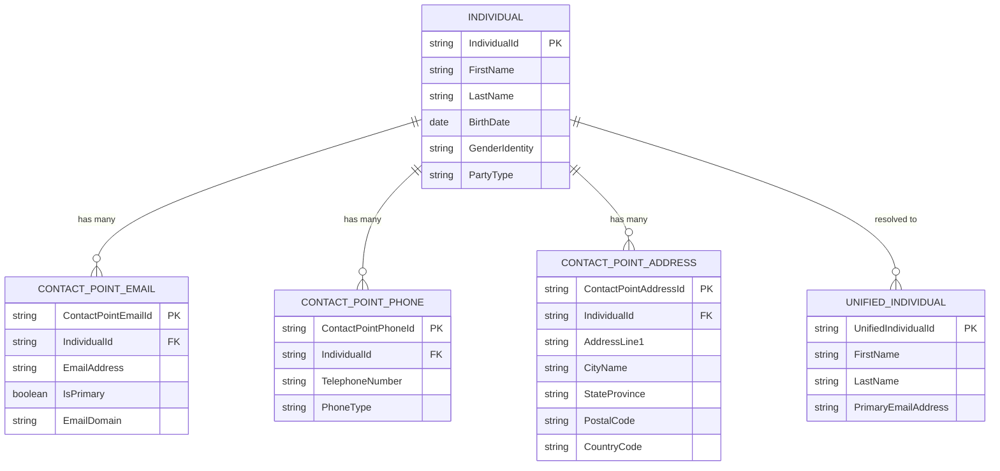
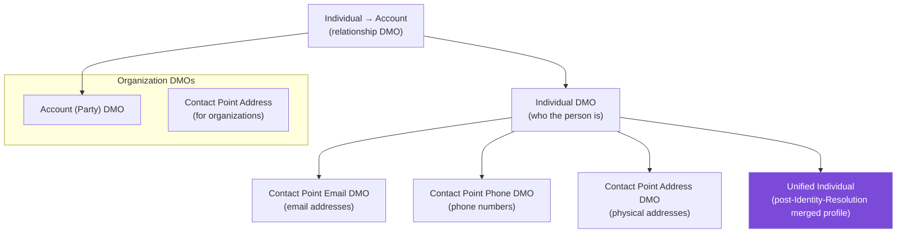
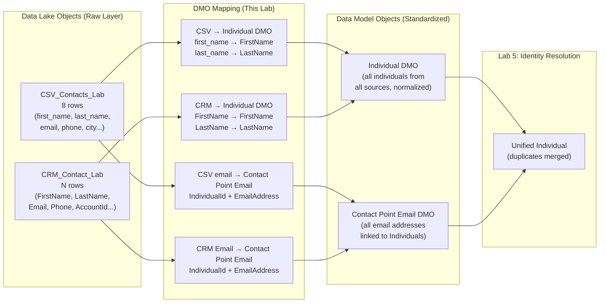

# Lab ADV-04 — DLO to DMO Mapping

## Learning Objectives
- Understand what Data Model Objects (DMOs) are and why the standardization layer exists
- Explain the Party Data Model concept and how the Individual, Contact Point Email, Contact Point Phone, and Contact Point Address DMOs relate to each other
- Understand why mapping to standard DMOs (rather than custom schemas) is required for Identity Resolution to work
- Map the CSV DLO from Lab 2 to the Individual DMO with correct field-level assignments
- Map the CRM Contact DLO from Lab 3 to the same Individual DMO
- Map the email field to the Contact Point Email DMO to enable email-based identity matching
- Understand required vs. optional field mappings and what happens when required fields are missing

---

## Concept Deep Dive: The Data Model Object Layer

### Why Does the Standardization Layer Exist?

Imagine you're a large retailer with data coming from five sources:
- Salesforce CRM: contacts with `FirstName`, `LastName`, `Email`
- Your e-commerce platform: customers with `given_name`, `family_name`, `email_address`
- Your loyalty program: members with `fname`, `lname`, `member_email`
- Your call center system: callers with `FIRST_NM`, `LAST_NM`, `EMAIL_ADDR`
- A marketing tool: subscribers with `contact.firstName`, `contact.lastName`, `contact.email`

Five sources, five different field naming conventions, all meaning the same thing. If Identity Resolution tried to match across these sources by field name, it would fail completely — `FirstName` and `fname` would not be recognized as the same concept.

The Data Model Object (DMO) layer solves this. It provides a standardized, canonical schema. Every source, regardless of its original field names, maps its fields to the DMO's standard field names. After mapping:
- CRM `FirstName` → Individual `FirstName`
- e-commerce `given_name` → Individual `FirstName`
- loyalty `fname` → Individual `FirstName`

Now all five sources are speaking the same language, and Identity Resolution can compare them effectively.

### The Party Data Model Concept

Salesforce Data Cloud's standard DMO schema is based on the **Party Data Model** — an industry-standard pattern for representing entities (people, organizations) and their contact information.

The Party Data Model separates the concept of a "person" from their "contact points." This is deliberate and important:

- A **person** (the "party") has a stable identity: a name, a birth date, a gender identity
- A person has multiple **contact points**: they may have a work email AND a personal email, a home phone AND a mobile phone, a billing address AND a shipping address
- Each contact point can change over time without the person "changing"
- Multiple contact points for the same person are all associated with the same party record

### Why This Architecture Enables Identity Resolution

Here is the critical insight: because email addresses are stored in the **Contact Point Email DMO** (not directly on the Individual DMO), and because each Contact Point Email has a foreign key pointing to an Individual, the Identity Resolution engine can do something powerful:

**It can say: "If two Individual records have Contact Point Emails that match, those two Individuals are probably the same person."**

If Sarah Johnson's CRM Contact has Email `sarah.j@techcorp.com`, that becomes a Contact Point Email record linked to an Individual record (Sarah from CRM). If Sarah's CSV entry also has Email `sarah.j@techcorp.com`, that becomes a Contact Point Email record linked to another Individual record (Sarah from CSV). The IR engine finds both Contact Point Email records match → concludes the two Individuals are the same person → creates a Unified Individual merging both.

This only works if BOTH sources have been mapped to the Contact Point Email DMO correctly. If you map email to a custom DMO or a non-standard field, the IR engine won't know to use it for matching.

### Standard DMO Hierarchy

### Required vs. Optional Field Mappings

When you map a DLO to a DMO, some DMO fields are **required** — if you don't provide a value, the mapping will fail or the record will be rejected. Others are **optional** — nice to have but not blocking.

For the **Individual DMO**, the effectively required fields are:
- `IndividualId` — must be populated; this is the unique identifier for the record in the DMO. Map this from the DLO's primary key field (CRM `Id` for the CRM stream, or `email` for the CSV stream since that's what we used as primary key).

For the **Contact Point Email DMO**, the required fields are:
- `ContactPointEmailId` — unique identifier for this contact point record
- `IndividualId` — the foreign key linking back to the Individual (this is how you connect the email record to the person)
- `EmailAddress` — the actual email address value

If `IndividualId` is missing on a Contact Point Email record, Data Cloud cannot link the email to a person — the record is orphaned and useless for identity matching.

---

## Architecture Overview

---

## Prerequisites
- Lab ADV-02 completed: `CSV_Contacts_Lab` DLO exists with 8 rows
- Lab ADV-03 completed: `CRM_Contact_Lab` DLO exists with your CRM contacts
- Data Cloud Admin permission set assigned

---

## Lab Setup

No additional data setup needed. This lab works entirely within the Data Cloud UI, mapping existing DLOs to DMOs. Ensure both DLOs are visible under Data Model → Data Lake Objects before starting.

---

## Step-by-Step Instructions

### Step 1 — Navigate to Data Model

Open the Data Cloud app via App Launcher.

Click the **Data Model** tab in the top navigation.

If you see sub-tabs, click **Data Lake Objects** first to verify your two DLOs are present:
- `CSV_Contacts_Lab` — should show 8 rows
- `CRM_Contact_Lab` — should show your CRM Contact count

### Step 2 — Open the CSV DLO for Mapping

Click on **CSV_Contacts_Lab** to open its detail page.

Look for a **Map to Data Model Object** button, or a **Data Mappings** tab. The exact location varies by org version:
- In newer Data Cloud versions: look for a "Data Mappings" tab within the DLO detail
- In older versions: look for a "Map" or "Map to Standard Object" button

Click the appropriate button to start the mapping process.

### Step 3 — Select the Target DMO: Individual

In the mapping dialog or screen, you are asked to select a target Data Model Object.

In the search field, type **Individual** and select **Individual** from the results.

Do NOT select "Unified Individual" — Unified Individual is the output of Identity Resolution, not something you map to directly. "Individual" is the standard pre-resolution DMO.

Click **Next** or **Confirm**.

### Step 4 — Map Fields from CSV DLO to Individual DMO

You are now on the field mapping screen. On the left, you see the CSV DLO fields. On the right (or in a dropdown), you see the Individual DMO fields.

Create these field-level mappings:

| CSV DLO Field | Individual DMO Field | Notes |
|--------------|---------------------|-------|
| email | IndividualId | Map email as the identifier since it's the CSV primary key |
| first_name | FirstName | Direct name mapping |
| last_name | LastName | Direct name mapping |
| city | (skip for now) | City goes to Contact Point Address, not Individual |
| phone | (skip for now) | Phone goes to Contact Point Phone DMO (optional for this lab) |
| account_name | (skip for now) | Account-level data — not mapped at Individual level |
| product_interest | (skip for now) | Can be mapped to a custom Individual attribute if needed |
| last_purchase_date | (skip for now) | Better suited for a Calculated Insight |

**Critical mapping — IndividualId:** You are mapping `email` to `IndividualId`. This means each person's email address will serve as their Individual DMO identifier. This is a pragmatic choice for our CSV dataset since email is the primary key we defined. In a production scenario, you'd map a true unique system ID to IndividualId.

The mapping screen may show required fields (often marked with a red asterisk). At minimum, `IndividualId` must be mapped.

### Step 5 — Save the Individual DMO Mapping

After creating the field mappings above, click **Save** (or **Deploy Mapping**).

Data Cloud will:
1. Process all 8 rows in the CSV DLO through this mapping
2. Create 8 Individual DMO records with the mapped field values
3. Assign each Individual a standardized `IndividualId` based on the mapped `email` field

This processing may take a minute. Refresh the DLO detail page — you should see the mapping status update to "Active" or "Mapped."

### Step 6 — Create a Second DMO Mapping for Contact Point Email

Return to the `CSV_Contacts_Lab` DLO detail. Click **Map to Data Model Object** again (or add a second mapping via the Data Mappings tab).

This time, select **Contact Point Email** as the target DMO.

Map the fields:

| CSV DLO Field | Contact Point Email DMO Field | Notes |
|--------------|------------------------------|-------|
| email | EmailAddress | The actual email value |
| email | IndividualId | ALSO map email to IndividualId — this is the foreign key linking this email record back to the Individual |
| email | ContactPointEmailId | Map email as the unique ID for this contact point record |

**Wait — are you mapping email to THREE different Contact Point Email fields?** Yes, in this simplified scenario. The `email` field serves triple duty:
- As the **EmailAddress** (the actual value to store)
- As the **IndividualId** (the link back to the Individual whose IndividualId is ALSO their email)
- As the **ContactPointEmailId** (the unique identifier for this specific contact point record)

This works because in our dataset, email is both the primary key AND the value. In a real production system, you'd have a separate generated ID for `ContactPointEmailId` and a separate field for `IndividualId`.

Click **Save**.

### Step 7 — Map the CRM Contact DLO to Individual DMO

Navigate to Data Lake Objects and click **CRM_Contact_Lab**.

Click **Map to Data Model Object**.

Select **Individual** as the target DMO.

Create these field mappings:

| CRM DLO Field | Individual DMO Field | Notes |
|--------------|---------------------|-------|
| Id | IndividualId | CRM's 18-char Salesforce ID is the unique identifier |
| FirstName | FirstName | Direct mapping — same name in both |
| LastName | LastName | Direct mapping — same name in both |
| MailingCity | (skip — goes to Contact Point Address) | |
| LeadSource | (skip or map to custom attribute) | |

Click **Save**.

### Step 8 — Map the CRM Contact DLO to Contact Point Email DMO

From the `CRM_Contact_Lab` DLO, add another mapping — this time to **Contact Point Email**.

| CRM DLO Field | Contact Point Email DMO Field | Notes |
|--------------|------------------------------|-------|
| Email | EmailAddress | The actual email value |
| Id | IndividualId | The CRM Contact ID links this email back to the Individual |
| Email | ContactPointEmailId | Use email as the unique identifier for this contact point |

Click **Save**.

**Why does IndividualId here use the CRM `Id` field, not the Email?**
Because the Individual DMO record for CRM contacts was created with `IndividualId = Id` (the Salesforce 18-char ID). To link the Contact Point Email record to that Individual, we must use the SAME value: the CRM Id. If we used a different value, the relationship would be broken — the Contact Point Email would not be associated with any Individual.

This is the most conceptually challenging part of DMO mapping: the `IndividualId` in both the Individual DMO and any Contact Point DMOs must use the SAME field from the source DLO to create a valid foreign key relationship.

### Step 9 — Verify Both DLOs Are Mapped

Navigate to **Data Model** → look for a **Data Mappings** view or navigate to the standard DMOs to see their populated records.

Click on the **Individual** DMO. You should see:
- A count of records (should be 8 from CSV + number of CRM contacts)
- A "Sources" section showing `CSV_Contacts_Lab` and `CRM_Contact_Lab` as contributing sources

Click on **Contact Point Email** DMO. You should see:
- A similar count of email records
- Sources from both CSV and CRM

### Step 10 — Understand Why Both DLOs Now Map to the SAME Individual DMO

This step is conceptual — pause and think through it.

You have 8 rows from the CSV DLO and (let's say) 5 rows from the CRM DLO. Both are now mapped to the Individual DMO. Does that mean the Individual DMO has 13 records?

**Yes, it does — for now.** Before Identity Resolution runs, the Individual DMO aggregates all records from all mapped sources. Sarah Johnson appears twice (once from CSV with `IndividualId = sarah.j@techcorp.com`, once from CRM with `IndividualId = [CRM Id]`). They are not yet recognized as the same person — they are two separate Individual records.

After Identity Resolution runs (Lab 5), the matching engine will look at Contact Point Email records, find that two Individuals share the same email (`sarah.j@techcorp.com`), and merge them into a single Unified Individual.

**This is why DMO mapping must be done before Identity Resolution.** IR works on DMO data, not DLO data.

### Step 11 — Review the Mapping Diagram in Data Cloud

Many Data Cloud org versions provide a visual mapping diagram. Look for a **Data Model** or **Lineage** view that shows a graphical representation of:
- Which DLOs map to which DMOs
- Which fields are connected

If this view is available in your org, navigate to it and take a moment to verify your mapping looks correct:
- `CSV_Contacts_Lab` → Individual (with first_name, last_name, email mapped)
- `CSV_Contacts_Lab` → Contact Point Email (with email mapped)
- `CRM_Contact_Lab` → Individual (with FirstName, LastName, Id mapped)
- `CRM_Contact_Lab` → Contact Point Email (with Email, Id mapped)

---

## What You Built

You now have:
- The `CSV_Contacts_Lab` DLO mapped to the Individual DMO (8 records flowing into Individual)
- The `CSV_Contacts_Lab` DLO also mapped to the Contact Point Email DMO (8 email records linked to their Individuals)
- The `CRM_Contact_Lab` DLO mapped to the Individual DMO (CRM contacts flowing into Individual)
- The `CRM_Contact_Lab` DLO also mapped to the Contact Point Email DMO (CRM emails linked to their Individuals)
- A properly structured Party Data Model in Data Cloud ready for Identity Resolution

The Individual DMO now contains records from two different sources, some of which are the same person. The Contact Point Email DMO has the email records with correct IndividualId foreign keys. Lab 5 will run Identity Resolution to find and merge the duplicates.

---

## Checkpoint Questions

1. You mapped the `CSV_Contacts_Lab` DLO to both the Individual DMO and the Contact Point Email DMO. Why does the email address appear in BOTH mappings, and what purpose does it serve in each?
2. After mapping two DLOs to the Individual DMO, how many Individual DMO records exist for Sarah Johnson? Will Identity Resolution change this number? If so, what will it change?
3. Why is the `IndividualId` foreign key in the Contact Point Email DMO critically important? What happens to an email record if its `IndividualId` doesn't match any Individual DMO record?
4. You have a new data source: your company's e-commerce platform, which has a "customers" table with fields `customerid`, `email`, `first_nm`, `last_nm`, `city`. Which DMOs would you map this to, and how would you map `customerid` and `email`?
5. Why can't you simply map everything to a custom DMO (instead of Individual, Contact Point Email, etc.) and still have Identity Resolution work correctly?

---

## Common Errors & Troubleshooting

**"IndividualId is required but not mapped"**
Cause: You saved the Individual DMO mapping without assigning any field to `IndividualId`.
Fix: Re-open the mapping, assign a field to IndividualId (use the DLO's primary key field), and save again.

**"Contact Point Email shows 0 records after mapping"**
Cause: The mapping was saved but not yet processed, or the `IndividualId` field in the Contact Point Email mapping points to a value that doesn't exist in the Individual DMO.
Fix: Verify the IndividualId mapping in Contact Point Email uses the SAME source field as the IndividualId mapping in Individual. Wait 5 minutes and refresh row counts.

**"Individual DMO shows fewer records than expected"**
Cause: Duplicate IndividualId values within a single DLO — if two rows from the same DLO have the same mapped IndividualId value, only one record will be created in the DMO.
Fix: This is actually expected behavior if your DLO genuinely has duplicates on the primary key field. Check the raw DLO to confirm row count vs. DMO record count.

**"Mapping screen doesn't show all DLO fields"**
Cause: Data Cloud sometimes only shows fields that match the expected data type of the DMO field. For example, if a DMO field expects type Email, only DLO fields with type Email will appear in the dropdown.
Fix: Return to the DLO schema and change the field's type to the correct type (e.g., change the `email` field type from Text to Email) before attempting the mapping.

**"Data Model tab doesn't show standard DMOs"**
Cause: Standard DMO library hasn't loaded yet (fresh org), or there's a display bug.
Fix: Wait 10 minutes and refresh. If the problem persists, navigate directly to the Individual DMO via URL or search for it in the Data Model search field.

---

## Exam Tips

- Know the **Party Data Model structure** precisely: Individual holds the person's attributes; Contact Point Email, Phone, and Address hold contact details as separate, linked records. The exam tests whether you understand this separation.
- The `IndividualId` foreign key relationship between Contact Point DMOs and the Individual DMO is **the most tested concept in this topic area**. A broken IndividualId means email matching won't work in Identity Resolution.
- **Two DLOs can both map to the same DMO** — this is the entire point of the DMO layer. The exam may ask whether this is possible (yes) and what the result looks like (records from both sources appear in the DMO, potentially with duplicates before IR runs).
- Know that **mapping a DLO to a DMO does not modify the DLO** — the DLO always retains its original raw data. The DMO is a view/projection of the data into a standardized schema.
- **Custom DMOs** can be created in Data Cloud, but Identity Resolution only works with the standard Individual → Contact Point hierarchy. If you map everything to custom DMOs, IR will not match records across sources.
- The exam tests whether you understand the **sequence**: first ingest (Data Streams → DLOs), then model (DLO → DMO mapping), then unify (Identity Resolution). Trying to run IR before DMO mapping is complete will yield no results.
