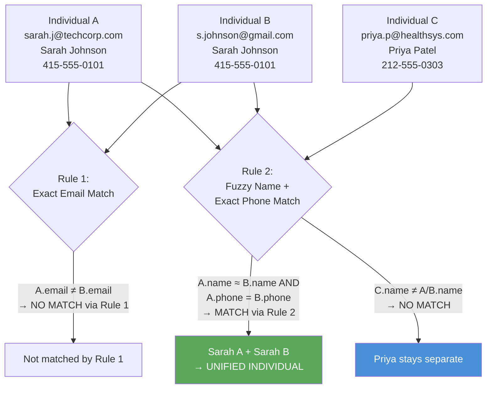
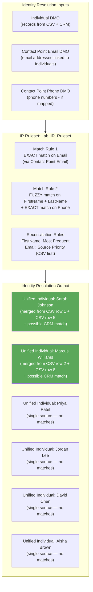

# Lab ADV-05 — Identity Resolution Deep Dive

## Learning Objectives
- Understand what Identity Resolution is and why it is the central capability of a Customer Data Platform
- Explain the three components of an Identity Resolution ruleset: match rules, reconciliation rules, and the resulting Unified Individual
- Distinguish between exact matching and fuzzy matching, and know when to use each
- Understand how match rule priority order affects which records get merged
- Explain the three reconciliation rule strategies: most frequent, most recent, and source priority
- Understand that Data Cloud does not delete source records — it creates a unified view while preserving all originals
- Create and run an Identity Resolution ruleset and interpret the results

---

## Concept Deep Dive: Identity Resolution

### What Problem Does Identity Resolution Solve?

Consider what you have after Labs 2-4: the Individual DMO contains records from two sources. Some of those records represent the same real person — Sarah Johnson appears twice (once from CSV, once potentially from CRM), Marcus Williams appears twice (same pattern). A customer looking at their CDP would see 10 or 12 Individual records when there are really only 6 or 8 unique people.

This is called the **identity fragmentation problem**, and it is endemic to multi-source customer data. Different systems give different IDs to the same person. A person's name might be spelled differently in different systems. They might use a work email in one system and a personal email in another.

Identity Resolution (IR) is the systematic process of:
1. **Matching** — determining which records likely represent the same person
2. **Merging** — combining the matched records into a single unified profile
3. **Reconciling** — deciding which value to use for each attribute when matched records disagree

The output of Identity Resolution is the **Unified Individual** — the gold standard customer profile that represents one real person and aggregates all known data about them from all sources.

### What Data Cloud Does NOT Do

This is a key exam concept: **Data Cloud does not delete source records during Identity Resolution.** The DLOs remain intact. The Individual DMO records remain intact. IR does not modify any source data.

Instead, IR creates a new layer — the Unified Individual — that is a view aggregating matched records. The two Sarah Johnson Individual records still exist in the Individual DMO. But there is now ONE Unified Individual that links to both of them and presents a single, reconciled profile.

This is important for several reasons:
- **Auditability:** You can always trace back to which source records contributed to a Unified Individual
- **Reversibility:** If you change your match rules, you can re-run IR and the Unified Individuals change — but the underlying data is unaffected
- **Source of truth preservation:** Each source system's data remains authoritative within its own context

### The Three Components of an IR Ruleset

#### 1. Match Rules

Match rules define the criteria for deciding that two Individual records represent the same person. Each match rule specifies:
- **Which fields to compare** (e.g., compare the EmailAddress from Contact Point Email DMO)
- **How to compare** (exact match or fuzzy match)
- **The priority of this rule** (rule 1 is evaluated first, then rule 2, etc.)

**Exact Match** means the compared values must be character-for-character identical (case-insensitive by default). Email address is a classic exact match field — `sarah.j@techcorp.com` either equals `sarah.j@techcorp.com` exactly, or it doesn't. Exact match has no false positives: if two emails match exactly, they're almost certainly the same person.

**Fuzzy Match** uses similarity algorithms to compare values. It is used for fields like names, where two records for the same person might have slightly different spellings: `Sara Johnson` vs `Sarah Johnson`, or `Marcus` vs `Marc`. Fuzzy matching uses algorithms like Jaro-Winkler or Levenshtein distance to compute a similarity score and match if the score exceeds a threshold. Fuzzy matching is more powerful for handling data quality issues but can produce false positives (matching different people who have similar names).

**Match Rule Priority:** When multiple match rules are defined, a pair of records is considered a match if they satisfy ANY rule (OR logic, not AND logic). However, the order of rules affects how conflicts are handled: if Rule 1 says records A and B match, and Rule 2 says records B and C match, then A, B, and C may all be merged into one Unified Individual depending on rule priority and transitivity settings.

#### 2. Reconciliation Rules

Once two records are matched, there is a new problem: the two matched records may have different values for the same field. Which value should the Unified Individual show?

For example, Sarah from the CSV has `city = San Francisco` and `product_interest = Sales Cloud`. Sarah's second CSV record has `city = San Francisco` and `product_interest = Marketing Cloud`. After matching, what should the Unified Individual's `product_interest` be?

Reconciliation rules define the strategy for picking a "winner" value when multiple matched source records have different values for the same attribute. Data Cloud offers three strategies:

**Most Frequent (Mode):** Look at all matched records' values for this field. Pick the value that appears most often. Example: if 3 out of 4 matched records have `city = Chicago`, use `Chicago`. Good for stable attributes that should reflect the consensus across sources.

**Most Recent:** Among matched records, pick the value from the record with the most recent timestamp (usually `LastModifiedDate` or `CreatedDate`). Example: if the most recently updated record has `city = Austin`, use `Austin`. Good for attributes that change over time where you want the latest known value.

**Source Priority:** Rank your data sources in order of trust. Always use the value from the highest-ranked source that has a non-null value. Example: if Source Priority is "CRM first, then CSV," and the CRM has `phone = 415-555-0101`, use that regardless of what the CSV says. Good for fields where one source is known to be more reliable.

#### 3. The Unified Individual

After matching and reconciliation, Data Cloud creates a Unified Individual record. This record:
- Has its own unique `UnifiedIndividualId`
- Contains the reconciled attribute values (using the reconciliation strategies you defined)
- Maintains a list of all source Individual records that were merged into it (the "contributing records")
- Is the entity that Segments and Activations work against — you always query Unified Individuals, never raw Individual DMO records

### How Identity Resolution Runs

IR can run in two modes:
- **Scheduled:** You configure a recurring schedule (hourly, daily, etc.) and IR runs automatically. After each run, Unified Individuals are updated to reflect any new matches.
- **Manual Trigger:** You can manually trigger an IR run from the Identity Resolutions tab. This is useful for testing and for the first run.

**Full Run vs. Incremental Run:**
- The first run of an IR ruleset is always a full run — it compares every Individual record against every other Individual record.
- Subsequent runs can be incremental — comparing only newly ingested records against the existing pool.

**Processing Time:** For small datasets (our lab's 8-13 records), IR runs in seconds. For enterprise datasets with millions of records, IR can take hours. This is why scheduling is important — you want IR to run during off-peak hours.

---

## Architecture Overview

---

## Prerequisites
- Labs ADV-01 through ADV-04 completed
- Both DLOs (`CSV_Contacts_Lab` and `CRM_Contact_Lab`) mapped to Individual and Contact Point Email DMOs
- Data Cloud Admin permission set assigned

---

## Lab Setup

Verify the state of your Individual DMO before starting:
1. Navigate to Data Model → Data Model Objects → Individual
2. Confirm the record count shows more than 8 records (the 8 from CSV plus however many CRM contacts you have)
3. Navigate to Contact Point Email DMO — confirm it has records with `IndividualId` values populated

If the Individual DMO shows 0 records, return to Lab 4 and verify your DMO mappings were saved correctly.

---

## Step-by-Step Instructions

### Step 1 — Navigate to Identity Resolutions

Open the Data Cloud app via App Launcher.

Click **Identity Resolutions** in the top navigation.

The page will be empty (no rulesets yet). Click **New** to create your first Identity Resolution ruleset.

### Step 2 — Name the Ruleset

On the "New Identity Resolution" screen:

1. **Ruleset Name:** Enter `Lab_IR_Ruleset`
2. **Description:** Enter `Lab ruleset using email exact match and name+phone fuzzy match`
3. **Primary Individual Object:** This should default to **Individual** — leave it as is. This is telling the IR engine which DMO contains the records to match.

Click **Next**.

### Step 3 — Add Match Rule 1: Exact Email Match

You are now on the match rules configuration screen.

Click **Add Match Rule** (or the "+ Add Rule" button).

Configure Rule 1:

1. **Rule Name:** `Exact_Email_Match`
2. **Match Method:** Select **Exact**
3. **Source Object:** Select **Contact Point Email** (we're matching on email addresses stored in this DMO)
4. **Field to Match:** Select **EmailAddress**
5. **Priority:** Leave as 1 (the first and highest-priority rule)

**Why Contact Point Email, not Individual directly?**
Individual DMO doesn't have an email field — email addresses are stored in the Contact Point Email DMO. Match rules that operate on email must reference Contact Point Email. Data Cloud automatically uses the IndividualId foreign key to connect back to the Individual records being matched.

Click **Save Rule** or **Add**.

### Step 4 — Add Match Rule 2: Fuzzy Name + Phone

Click **Add Match Rule** again to add a second rule.

Configure Rule 2:

1. **Rule Name:** `Fuzzy_Name_Phone_Match`
2. **Match Method:** Select **Fuzzy** (or in some UI versions, you'll add multiple conditions)
3. For a combined rule (Name + Phone), you may need to add two conditions within this rule:
   - Condition A: **FirstName** from Individual DMO, method: **Fuzzy**
   - Condition B: **LastName** from Individual DMO, method: **Fuzzy**
   - Condition C: **Phone** from Contact Point Phone DMO (if you mapped phone to Contact Point Phone in Lab 4) or a phone field on Individual, method: **Exact**
4. **Priority:** 2 (lower priority than Rule 1)

**How multi-condition rules work:** Within a single match rule, conditions use AND logic. Both the name fuzzy match AND the phone exact match must be true for Rule 2 to declare a match. This reduces false positives — a fuzzy name match alone might match the wrong person, but a fuzzy name match PLUS exact phone match is very likely correct.

**Note on fuzzy matching:** If the UI asks for a **Similarity Threshold** for fuzzy matching, set it to **0.85** (85% similarity). This is a reasonable threshold that catches minor typos and abbreviations while avoiding false matches on similar but different names.

### Step 5 — Set the Ruleset Behavior for Multiple Matching Rules

After defining both rules, look for a setting that governs how multiple rules interact. This may be labeled:
- **Match All Rules** vs **Match Any Rule** — select **Match Any Rule** (OR logic). A record pair should be merged if it satisfies Rule 1 OR Rule 2, not necessarily both.

Also look for a **Transitivity** setting:
- If Record A matches Record B (via Rule 1), and Record B matches Record C (via Rule 2), should A and C be merged even though they didn't directly match each other?
- Set this to **Enabled** / **Yes**. This is the standard behavior for a CDP — if A=B and B=C, then A=B=C (all the same person).

### Step 6 — Configure Reconciliation Rules

After the match rules, you'll find a **Reconciliation Rules** section. These govern which value wins when matched records disagree.

Set the following reconciliation rules:

**FirstName — Most Frequent:**
1. Find `FirstName` in the reconciliation field list
2. Select strategy: **Most Frequent**
3. Why: Names should reflect what the person is most commonly known as across your systems

**Email — Source Priority (CSV first):**
1. Find the email-related field in reconciliation (this may be in Contact Point Email context, or as `PrimaryEmail` on Unified Individual)
2. Select strategy: **Source Priority**
3. Set source priority order: `CSV_Contacts_Lab` first, then `CRM_Contact_Lab`
4. Why: For our lab, the CSV email was the primary key and is considered more authoritative for the person's canonical email

**LastName — Most Frequent:**
1. Find `LastName`
2. Select **Most Frequent**

**For all other fields not explicitly configured:** the default reconciliation strategy will apply (usually "Most Recent"). Leave them at default.

### Step 7 — Review and Deploy the Ruleset

Review your ruleset configuration:
- Ruleset Name: `Lab_IR_Ruleset`
- Match Rule 1: Exact Email Match (Priority 1)
- Match Rule 2: Fuzzy Name + Phone Match (Priority 2)
- Match logic: Any rule (OR)
- Transitivity: Enabled
- Reconciliation: FirstName = Most Frequent, Email = Source Priority

Click **Deploy** (or **Save and Run** if available).

Data Cloud will deploy the ruleset. If there is a separate "Run" button, click it to trigger the first execution.

### Step 8 — Monitor the IR Run

The Identity Resolutions page will show the ruleset you created. Look for status indicators:
- **Deploying** → **Running** → **Success/Active**

For our small dataset, this should complete within a minute or two. For production orgs, this can take much longer.

If the status shows "Error," click the ruleset to see the error detail. Common errors include misconfigured field mappings (field doesn't exist in the DMO) and permission issues.

### Step 9 — Navigate to Unified Individuals

After the IR run completes, look for a way to view Unified Individuals. This may be:
- A **Unified Individual** tab or section under Identity Resolutions
- A separate **Profiles** tab in the main Data Cloud navigation
- In some org versions: Data Model → Data Model Objects → Unified Individual

Navigate to the Unified Individual list.

You should see **6 Unified Individual records** (not 8 — because Sarah Johnson's two CSV records merged into one, and Marcus Williams' two CSV records merged into one).

Count them and confirm:
1. Sarah Johnson (merged from 2 CSV records + possibly CRM match)
2. Marcus Williams (merged from 2 CSV records + possibly CRM match)
3. Priya Patel (single record — no match found)
4. Jordan Lee (single record — no match found)
5. David Chen (single record — no match found)
6. Aisha Brown (single record — no match found)

If your CRM also had some of these people (e.g., if you created contacts in Lab 3 setup with emails matching the CSV), those CRM records would also be merged into the appropriate Unified Individual.

### Step 10 — Inspect Sarah Johnson's Unified Individual Profile

Click on the Unified Individual record for **Sarah Johnson**.

The detail page shows:
- **UnifiedIndividualId:** A system-generated unique ID for this unified profile
- **FirstName:** Sarah (reconciled via Most Frequent rule — "Sarah" appeared in both CSV rows, so it wins)
- **LastName:** Johnson
- **Contributing Records:** A section showing the source Individual DMO records that were merged. You should see 2 entries: one for `sarah.j@techcorp.com` (from CSV row 1) and one for `s.johnson@gmail.com` (from CSV row 5)
- **Contact Points:** The Unified Individual should show BOTH email addresses: `sarah.j@techcorp.com` and `s.johnson@gmail.com`. This is the power of unification — you now know Sarah has both emails, and marketing can reach her on either.
- **Attributes:** The reconciled attribute values (product_interest will show the value from whichever row won per the reconciliation strategy)

### Step 11 — Inspect Marcus Williams' Unified Individual Profile

Click on the **Marcus Williams** Unified Individual.

Confirm:
- Contributing records: `marcus.w@globalbank.com` (CSV row 2) and `mwilliams@gmail.com` (CSV row 8)
- Both email addresses visible as contact points
- Phone number: `312-555-0202` (same in both source records — no reconciliation conflict)
- `account_name`: `Global Bank` (consistent across both rows — easy reconciliation)

### Step 12 — Verify Priya, Jordan, David, and Aisha Are Separate

For each of the four unique individuals (no duplicates), confirm their Unified Individual has:
- Only ONE contributing record
- Their data as provided in the CSV
- No unexpected merges with other records

If any of these four are incorrectly merged with each other (a false positive), it indicates the fuzzy matching threshold is too loose. You would address this by adjusting the similarity threshold in the match rule.

---

## What You Built

You now have:
- An Identity Resolution ruleset named `Lab_IR_Ruleset` with two match rules (exact email + fuzzy name/phone) and configured reconciliation strategies
- 6 Unified Individual profiles instead of 8 Individual DMO records — the duplicates have been resolved
- Sarah Johnson's profile now shows both email addresses (`sarah.j@techcorp.com` and `s.johnson@gmail.com`) as known contact points
- Marcus Williams' profile shows both his email addresses
- A concrete understanding of how match rules, reconciliation rules, and the resulting Unified Individual work together

The Unified Individuals are now the foundation for building Segments in Lab 6.

---

## Checkpoint Questions

1. After running Identity Resolution, the Individual DMO still shows 8 records, but Unified Individuals shows 6. Is the Individual DMO broken or incorrect? Explain what happened.
2. Sarah Johnson's two CSV records have different `product_interest` values: "Sales Cloud" (row 1) and "Marketing Cloud" (row 5). If the reconciliation rule for `product_interest` is set to "Most Recent," which value will the Unified Individual show, and how does Data Cloud determine "most recent"?
3. You add a third match rule: Exact Match on Phone. Marcus Williams' two records both have phone `312-555-0202`. Would this new rule also match them? Would it change the result (they're already matched by Rule 2)?
4. You re-run Identity Resolution after adding 5 new CRM contacts. Data Cloud says the run is "incremental." What does this mean, and what work does Data Cloud avoid doing?
5. A stakeholder asks: "Does Data Cloud permanently merge/overwrite our source Contact records during Identity Resolution?" What is the technically accurate answer, and why does this matter for data governance?

---

## Common Errors & Troubleshooting

**"Identity Resolution ran but Unified Individual count equals Individual DMO count — no merges happened"**
Cause: The match rules didn't find any matches. Most common reason: the Contact Point Email DMO has no records, or the IndividualId foreign key in Contact Point Email doesn't match the IndividualId values in the Individual DMO.
Fix: Return to Lab 4 and verify the Contact Point Email mapping has IndividualId populated with the correct source field. Check that Contact Point Email has records: Data Model → Contact Point Email → Data Preview.

**"Identity Resolution status: Error — Field 'EmailAddress' not found"**
Cause: The match rule references a field that doesn't exist in the DMO, possibly due to a field naming typo during rule setup or a DMO mapping issue.
Fix: Re-open the IR ruleset, check the match rule field configuration, and ensure the field names exactly match what exists in the Contact Point Email DMO.

**"Fuzzy match created unexpected merges — unrelated people merged"**
Cause: The fuzzy match similarity threshold is too low (e.g., 0.5), allowing names like "James Smith" and "Jane Smith" to match.
Fix: Increase the similarity threshold to 0.85 or higher. Add a second condition (like phone) to the fuzzy match rule so it requires both name similarity AND another matching field.

**"IR ruleset shows Deploying status for more than 10 minutes"**
Cause: Large dataset in a shared environment — IR jobs queue behind other jobs. Or the initial DMO processing is still completing.
Fix: Wait up to 30 minutes for initial runs. Check the Data Cloud health page for any system-wide delays. If still stuck, refresh the page — sometimes the status display doesn't auto-update.

**"Unified Individual shows a Contributing Records count of 1 for everyone"**
Cause: All records are treated as unique — no matches found. Could be the match rules are too strict, the Contact Point data isn't linked correctly, or the IR run used incremental mode and had no new records to compare.
Fix: Manually trigger a full IR run (find a "Run Full" button or setting), and verify Contact Point Email records have valid IndividualId values.

---

## Exam Tips

- The exam heavily tests the **distinction between Individual DMO records and Unified Individual records**. After IR runs: Individual DMO count stays the same; Unified Individual count is equal to or less than Individual count (less if merges occurred).
- Know the **three reconciliation strategies** and their appropriate use cases: Most Frequent for stable demographics, Most Recent for attributes that change over time, Source Priority when you know one source is more authoritative.
- **Transitivity** is a commonly tested concept: if A matches B and B matches C, transitivity merges A+B+C. Without transitivity, only direct matches are merged. Know that Data Cloud enables transitivity by default.
- The exam may present a scenario where "IR is running but no Unified Individuals are being created." The most common cause is **missing or broken Contact Point DMO records** — specifically, the IndividualId foreign key not being populated.
- Know that **fuzzy matching can produce false positives** and that the remediation is either increasing the similarity threshold or adding additional match conditions (requiring more signals to agree before merging).
- Data Cloud IR supports **custom match rules using formulas** in addition to the standard field-level match rules. The exam may mention this as an option for complex matching logic.
