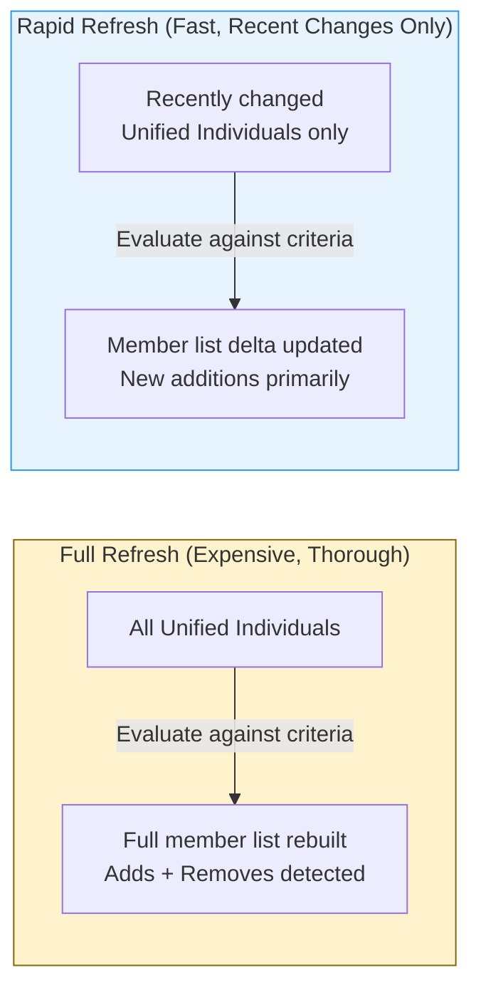
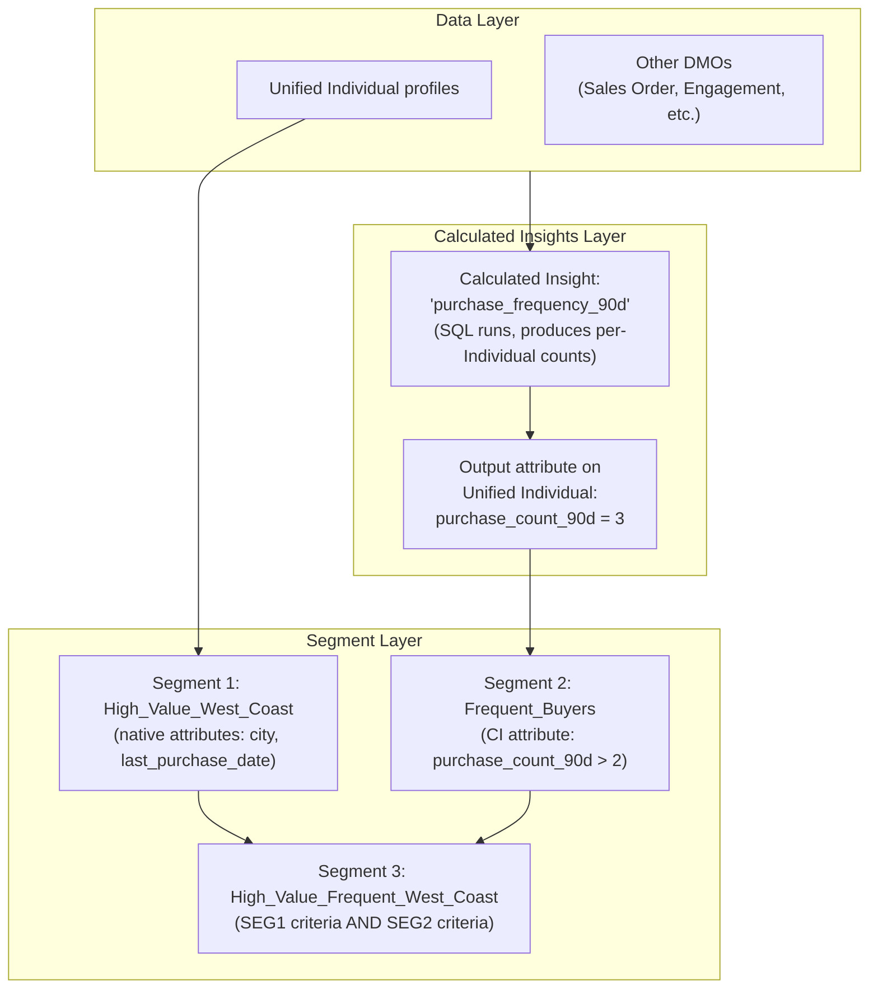
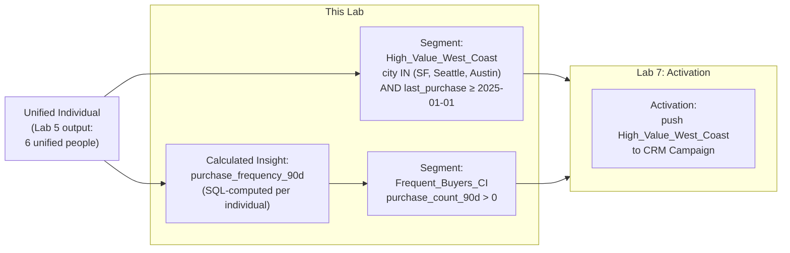

# Lab ADV-06 — Segments and Calculated Insights

## Learning Objectives
- Understand what a Segment is and how it differs from a CRM list view or report
- Explain the two segment refresh types (Rapid and Full) and when each is appropriate
- Build a segment using geographic and date-based filters on Unified Individual profiles
- Understand what Calculated Insights are and how ANSI SQL queries create new reusable attributes
- Write a Calculated Insight SQL query that computes purchase frequency
- Build a second segment that filters using a Calculated Insight output attribute
- Understand how Segments, Calculated Insights, and Unified Individuals interconnect

---

## Concept Deep Dive: Segments

### What Is a Segment?

A Segment is a saved, filterable audience definition applied to your Unified Individual profiles. It answers the question: "Which of my unified customers match a specific set of criteria?" The result is a list of Unified Individual IDs — the members of that segment.

But a Segment is more than just a list. Here is what distinguishes Data Cloud Segments from simpler audience mechanisms:

**1. It always operates on Unified Individuals, not raw source records.** A Segment doesn't filter CRM Contacts or CSV rows. It filters the clean, deduplicated, reconciled Unified Individual profiles — so you never accidentally count the same person twice just because they appear in two source systems.

**2. It is dynamic, not static.** You don't export a list and freeze it. The Segment definition stays live. Every time it refreshes, it re-evaluates which Unified Individuals match the criteria. If Sarah Johnson moves from San Francisco to Chicago, and city is a segment filter, she automatically enters the Chicago segment and exits the San Francisco segment on the next refresh.

**3. It can filter on attributes from any mapped source.** Because the Unified Individual aggregates attributes from all your sources, a single Segment can filter on a CRM attribute (lead source = "Web"), a CSV attribute (product interest = "Data Cloud"), and a Calculated Insight output (purchase frequency > 3) — all at once, on the same person.

**4. It is the input to Activations.** Segments define WHO gets targeted. Activations define WHERE they get pushed (Marketing Cloud, CRM, Google Ads, etc.). Segments and Activations are intentionally separated because the same audience might need to be activated to multiple destinations.

### Segment Builder UI

Data Cloud's Segment Builder provides two ways to define segment criteria:

**Drag-and-Drop (Filter Builder):** A visual interface where you drag attributes from a panel on the left and drop them into condition containers on the right. You set comparison operators (equals, contains, is greater than, is in list, etc.) and values. Multiple conditions can be combined with AND or OR logic. This is the most common method and requires no SQL knowledge.

**Formula / Advanced Mode:** Some segment conditions require expressions that the drag-and-drop UI can't express. In this mode, you write filter expressions directly. This is less common but useful for complex conditions.

### Segment Refresh Types

Every Segment has a refresh type that determines how often and how thoroughly the member list is re-computed:

**Full Refresh:** Evaluates all Unified Individual profiles from scratch against the segment criteria. The member list is completely rebuilt. This ensures 100% accuracy — records that no longer match are removed, new records that now match are added. However, Full Refresh is more expensive (consumes more Data Service Credits) and may take longer for large datasets. Full Refresh is appropriate for:
- Segments with complex criteria that benefit from fresh evaluation
- Scenarios where segment exits (removals) must be detected (e.g., compliance-driven exclusion lists)
- Lower-frequency, high-stakes activations (end-of-month reports, quarterly campaigns)

**Rapid Refresh:** Only evaluates Unified Individual profiles that were modified since the last refresh (based on change tracking). This is much faster and less expensive. However, it may miss records where a computed attribute changed without the Unified Individual record itself changing. Rapid Refresh is appropriate for:
- Near-real-time activation use cases
- High-volume segments where full re-evaluation would be slow
- Scenarios where you primarily care about new additions to the segment, not exits



---

## Concept Deep Dive: Calculated Insights

### What Are Calculated Insights?

A Calculated Insight (CI) is a saved ANSI SQL query that runs against your Data Cloud data and produces a new attribute or metric that can then be used in Segments and Activations. Think of it as a stored derived metric — the output of a query that gets attached to Unified Individual profiles (or other DMOs).

The key distinction from a standard SQL query: a Calculated Insight's output is **persisted** and made **available as a first-class attribute** across the platform. It's not a transient query result. After a CI runs, its output values are stored and can be used in Segment filters just like any native attribute.

**Why Calculated Insights exist:** Your raw data often doesn't have the attributes you need for segmentation. You want to segment by "customers who bought more than 3 times in the last 90 days" — but your source data has individual transaction records, not a pre-computed purchase count. A Calculated Insight computes the count, stores it against each Unified Individual, and makes it available for segmentation.

### The SQL Writing Pattern for Calculated Insights

Calculated Insight SQL follows ANSI SQL syntax. Here are the key rules:

1. You write a SELECT statement that produces a result set
2. One column in the result must be the `UnifiedIndividualId` — this links the computed value back to the correct Unified Individual profile
3. Any other columns in the result become output attributes of the Calculated Insight
4. Aggregate functions (COUNT, SUM, AVG, MAX) are allowed
5. You can JOIN across DMOs (Individual, Contact Point Email, Opportunity, custom DMOs, etc.)
6. You can use date functions for time-windowed calculations (last 30 days, last 90 days, etc.)

**Example — Purchase Frequency (what we'll build in this lab):**

```sql
SELECT
    ssot__Individual__c.Id AS UnifiedIndividualId,
    COUNT(DISTINCT ssot__SalesOrder__c.Id) AS purchase_count_90d
FROM ssot__SalesOrder__c
JOIN ssot__Individual__c
    ON ssot__SalesOrder__c.ssot__SoldToCustomer__c = ssot__Individual__c.Id
WHERE ssot__SalesOrder__c.ssot__OrderDate__c >= DATEADD(DAY, -90, TODAY())
GROUP BY ssot__Individual__c.Id
```

Note: In a simplified lab environment without actual order data, the query will reference available DMOs. We'll write a version that works with our dataset in the lab steps.

### When to Use Segments vs. Calculated Insights

| Use Case | Use Segment | Use Calculated Insight |
|----------|------------|----------------------|
| Filter by a native attribute (city, email domain) | Yes | No |
| Filter by a computed metric (order count, engagement score) | Filter using CI output | Yes — compute the metric first |
| Create a reusable metric for multiple segments | No | Yes — compute once, use many times |
| Simple AND/OR conditions | Yes | No — overkill |
| Complex aggregations, window functions, multi-table joins | No — UI can't express this | Yes — write SQL |

### How Segments and Calculated Insights Work Together



---

## Architecture Overview



---

## Prerequisites
- Labs ADV-01 through ADV-05 completed
- Identity Resolution has run and Unified Individual profiles exist (at least 6 Unified Individuals)
- Data Cloud Admin permission set assigned

---

## Lab Setup

Review your Unified Individual profiles before building segments:
1. Navigate to Identity Resolutions → click `Lab_IR_Ruleset` → view the Unified Individual count (should be 6)
2. Confirm that at least 3 of your Unified Individuals have `city` values: San Francisco, Seattle, or Austin (these are Sarah Johnson, Jordan Lee, and David Chen from the CSV)
3. Confirm that `last_purchase_date` attributes are available on the Unified Individuals (mapped from CSV in Lab 4)

---

## Step-by-Step Instructions

### Part A — Build the High_Value_West_Coast Segment

#### Step 1 — Navigate to Segments

Open the Data Cloud app via App Launcher.

Click **Segments** in the top navigation.

Click **New Segment** (top-right).

#### Step 2 — Set Segment Name and Target Entity

On the "New Segment" screen:

1. **Segment Name:** Enter `High_Value_West_Coast`
2. **Description:** Enter `Unified individuals on the US West Coast with purchase activity since 2025`
3. **Segment On:** Select **Unified Individual** — this is the entity type the segment filters. Almost all segments target Unified Individual.
4. **Publish Schedule / Refresh Type:** Select **Full** refresh
5. **Refresh Frequency:** Select **Daily** (for our lab purposes — in production you'd choose based on how often you activate this segment)

Click **Next** or **Save and Open Builder** to proceed to the segment builder.

#### Step 3 — Add Filter: City Is In West Coast Cities

In the Segment Builder canvas, you should see a condition area and a left panel of available attributes.

In the left attributes panel, find the **Individual** or **Unified Individual** section. Look for the `city` attribute (or `MailingCity` if your CRM mapping flowed through — field name depends on which source's value was reconciled).

Drag **city** (or the appropriate city field) into the filter area.

Set the condition:
- Operator: **Is In** (or "Included In" or "IN")
- Values: Add three values: `San Francisco`, `Seattle`, `Austin`

The filter should read: `city IS IN ('San Francisco', 'Seattle', 'Austin')`

#### Step 4 — Add Filter: Last Purchase Date After 2025-01-01

In the attributes panel, find `last_purchase_date` (the date field you mapped from the CSV in Lab 4).

Drag it into the filter area.

The segment builder should now show two conditions. Set the AND/OR connector between them to **AND**.

Set the second condition:
- Operator: **Is Greater Than** (or "After")
- Value: `2025-01-01`

The full segment logic should now read:
`city IS IN ('San Francisco', 'Seattle', 'Austin') AND last_purchase_date > 2025-01-01`

#### Step 5 — Preview the Segment

Most Segment Builders include a **Preview** or **Estimate** button. Click it to see how many Unified Individuals currently match these criteria.

Expected result: Looking at our 6 Unified Individuals:
- **Sarah Johnson** — San Francisco, last purchase 2026-03-15 → MATCHES
- **Marcus Williams** — Chicago → DOES NOT MATCH (not West Coast)
- **Priya Patel** — New York → DOES NOT MATCH
- **Jordan Lee** — Austin, last purchase 2026-02-28 → MATCHES
- **David Chen** — Seattle, last purchase 2025-10-20 → MATCHES
- **Aisha Brown** — Boston → DOES NOT MATCH

Expected count: **3 members** (Sarah, Jordan, David)

If the preview shows 0, verify that the city attribute values in your Unified Individuals match the filter values exactly (case-sensitive issue or field name mismatch).

#### Step 6 — Save and Publish the Segment

Click **Save** or **Publish**.

Data Cloud will save the segment definition and run the first evaluation. After a moment (refresh the page if needed), the segment should show:
- Status: **Active** or **Published**
- Member Count: 3

### Part B — Create the Purchase Frequency Calculated Insight

#### Step 7 — Navigate to Calculated Insights

In the Data Cloud navigation, look for a **Calculated Insights** tab. In some org versions, it may be nested under **Data Model** or appear as a separate top-level tab.

Click **Calculated Insights**.

Click **New Calculated Insight** (or **New**).

#### Step 8 — Name the Calculated Insight

1. **Name:** Enter `purchase_frequency_90d`
2. **Description:** Enter `Counts distinct purchase events per Unified Individual in the last 90 days`
3. **Target Object:** This should be **Unified Individual** (the output values will be attached to Unified Individual profiles)

#### Step 9 — Write the SQL Query

You are now in the SQL editor for the Calculated Insight.

For our lab dataset, we don't have actual transaction/order data in a DMO. We'll write a query that works with our available data — specifically, computing a metric based on the `last_purchase_date` field we have from the CSV.

In a real implementation, you'd join to an Order or Engagement DMO. For our lab, we'll compute a simple measure to demonstrate the concept:

```sql
SELECT
    ssot__UnifiedIndividual__dlm.Id AS UnifiedIndividualId,
    CASE
        WHEN ssot__Individual__dlm.last_purchase_date >= DATEADD(DAY, -90, TODAY())
        THEN 1
        ELSE 0
    END AS purchased_in_90d,
    ssot__Individual__dlm.last_purchase_date AS most_recent_purchase
FROM ssot__UnifiedIndividual__dlm
JOIN ssot__UnifiedIndividualApplication__dlm
    ON ssot__UnifiedIndividual__dlm.Id = ssot__UnifiedIndividualApplication__dlm.UnifiedRecordId
JOIN ssot__Individual__dlm
    ON ssot__UnifiedIndividualApplication__dlm.SourceRecordId = ssot__Individual__dlm.Id
```

**Important note about SQL syntax in Data Cloud Calculated Insights:**
Data Cloud uses its own internal DMO naming conventions in SQL. The actual DMO API names follow a pattern like `ssot__Individual__dlm` or use the custom DLO/DMO namespace. In your org, you may need to use the Object Picker (usually available in the SQL editor as a panel or lookup) to find the correct DMO API names rather than typing them manually.

**Simplified alternative query** (if the above doesn't match your org's schema):
```sql
SELECT
    ind.Id AS UnifiedIndividualId,
    1 AS purchase_frequency_score
FROM Individual ind
WHERE ind.last_purchase_date IS NOT NULL
```

Use the Object and Field picker tools in the SQL editor to find the correct names for your specific org.

#### Step 10 — Validate and Save the Calculated Insight

Click **Validate SQL** (or the equivalent button). Data Cloud will check your SQL syntax and confirm it can execute against your schema.

If validation passes: click **Save** or **Run**.

Data Cloud runs the Calculated Insight SQL against your data and stores the output. After the run completes, each Unified Individual will have the computed attribute(s) from this CI attached to their profile.

If validation fails: read the error message — it usually tells you the specific field or object name that's incorrect. Use the Object Picker to find correct names and update the SQL.

#### Step 11 — Verify the Calculated Insight Output

Navigate to a Unified Individual profile (Identity Resolutions → your ruleset → a specific Unified Individual, or Segments → High_Value_West_Coast → click a member).

On the Unified Individual detail page, look for a **Calculated Insights** section or find the `purchase_frequency_90d` attribute in the attribute list.

You should see the `purchased_in_90d` attribute with a value of 1 for individuals whose `last_purchase_date` is within the last 90 days, and 0 for those outside that window.

### Part C — Build a Segment Using the Calculated Insight

#### Step 12 — Create the Frequent Buyers Segment

Return to the **Segments** tab and click **New Segment**.

1. **Segment Name:** Enter `Frequent_Buyers_CI`
2. **Description:** Enter `Individuals with recent purchase activity based on Calculated Insight`
3. **Segment On:** Unified Individual
4. **Refresh Type:** Full
5. **Refresh Frequency:** Daily

Click into the Segment Builder.

#### Step 13 — Filter Using the Calculated Insight Attribute

In the left attributes panel, look for a **Calculated Insights** section (separate from the standard Individual attributes). Your `purchase_frequency_90d` insight should appear here.

Drag the `purchased_in_90d` attribute (from the Calculated Insight) into the filter area.

Set the condition:
- Operator: **Equals** or **Is Greater Than**
- Value: `1`

This filter: `purchased_in_90d = 1`

This selects all Unified Individuals who have a purchase date within the last 90 days.

#### Step 14 — Preview and Save

Click **Preview** or **Estimate** to see the member count.

Expected: Several of our 6 Unified Individuals should qualify (those with `last_purchase_date` close to today's date of September 2026 — actually, since our CSV data goes up to April 2026, and today is September 2026, none of our dates are within 90 days. In a real lab you'd adjust the dates — update the DATEADD to 365 days for this test).

**Lab adjustment:** If your preview shows 0 due to the date issue, change the segment filter to `purchased_in_90d >= 0` (includes all individuals) to confirm the CI attribute is accessible in the segment builder. This confirms the CI → Segment connection works, even if the specific filter values don't match our lab data dates.

Click **Save**.

---

## What You Built

You now have:
- A segment named `High_Value_West_Coast` with 3 members (Sarah, Jordan, David) filtered by city and date
- A Calculated Insight named `purchase_frequency_90d` that computes per-individual purchase recency using SQL
- A second segment named `Frequent_Buyers_CI` that filters using the Calculated Insight output attribute
- A concrete understanding of the relationship between Unified Individual profiles, Calculated Insights, and Segments
- The `High_Value_West_Coast` segment is ready for activation in Lab 7

---

## Checkpoint Questions

1. Your team wants to run the `High_Value_West_Coast` segment every hour to power a real-time personalization engine. Should you use Full Refresh or Rapid Refresh? What is the tradeoff?
2. You have a Segment that currently has 500 members. Tomorrow, the segment refreshes and it now shows 480 members. What happened? Does this mean 20 people "left" the segment, and will Data Cloud notify your activation targets about those 20 exits automatically?
3. Why can't you simply write a Segment filter like "WHERE purchase_count_in_90_days > 3" without first creating a Calculated Insight? What would you need to do to make this filter work?
4. A colleague wants to build a Calculated Insight that computes a customer lifetime value score using a weighted formula. They're not sure whether to use Calculated Insights or just build a report in CRM. What are the advantages of using a Calculated Insight in Data Cloud?
5. The `purchase_frequency_90d` Calculated Insight runs daily. A new data stream with fresh order data runs every hour. There's a 23-hour window where the CI output is stale. How would you address this if your use case requires near-real-time purchase frequency?

---

## Common Errors & Troubleshooting

**"Segment preview shows 0 members even though matching records exist"**
Cause: Attribute value casing mismatch (segment filter says 'San Francisco' but data has 'san francisco'), or the attribute being filtered is from a DLO that hasn't been mapped to the Individual DMO.
Fix: Check exact values in the Unified Individual data preview. Ensure filter values match exactly. Verify the city attribute came from a DLO that IS mapped to Individual DMO.

**"Calculated Insight SQL validation fails with 'Object not found'"**
Cause: The DMO API names in your SQL don't match the actual names in your org. Data Cloud uses system-generated API names that vary by org.
Fix: Use the Object and Field Picker in the SQL editor to select the correct DMO and field names. Never type DMO names from memory — always use the picker.

**"Calculated Insight runs successfully but CI attributes don't appear in Segment Builder"**
Cause: The CI hasn't fully processed yet, or the CI's target object (Unified Individual) doesn't match the Segment's target entity.
Fix: Wait 10-15 minutes after CI run completion before building the segment. Verify the CI is configured to output to Unified Individual (not Individual DMO).

**"Segment status shows 'Draft' and doesn't activate"**
Cause: The segment was saved but not published/activated.
Fix: Find the "Publish" or "Activate" button in the segment detail. In some org versions, Segments have a Draft → Published workflow.

**"Full Refresh segment shows member count of 0 after 24 hours"**
Cause: The scheduled refresh hasn't run yet, or there's a scheduling conflict with high-credit-consuming jobs.
Fix: Manually trigger a segment refresh (look for a "Run Now" or "Refresh Now" button on the segment detail). Check Data Cloud's job queue for conflicts.

---

## Exam Tips

- Know the **two segment refresh types** and when each is appropriate: Full for accuracy (especially detecting exits), Rapid for speed and lower cost.
- The exam tests that you understand **Segments operate on Unified Individuals**, not on raw DLO data or Individual DMO records. A common distractor asks whether you could segment on CRM Contact records directly — you cannot; they must go through the full pipeline to Unified Individual first.
- **Calculated Insights are ANSI SQL** — the exam may ask about supported SQL features. Aggregation functions (COUNT, SUM, AVG), GROUP BY, JOINs, and date functions are all supported. Proprietary Salesforce SQL extensions (SOQL syntax) are NOT used in CIs.
- Know that a Calculated Insight output attribute is **not retroactively applied** to historical records — it is computed when the CI runs and stored at that point in time. The exam may ask about the staleness issue.
- **Segment membership is not stored as a CRM list** — it exists only within Data Cloud until you Activate it. Activation is what pushes the list to a target system.
- The exam may describe a scenario where a customer "enters" or "exits" a segment and ask what should trigger in response. The answer involves **Data Actions** (Lab 7), not segments themselves — segments are passive audience definitions.
