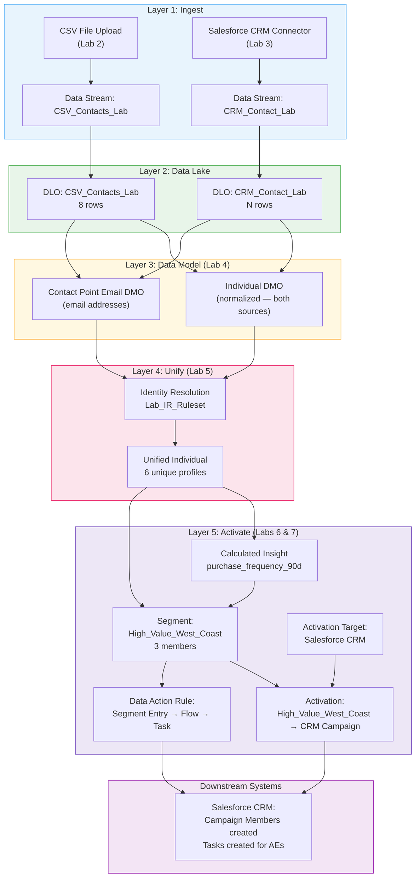

# Lab ADV-07 — Activations and Data Actions

## Learning Objectives
- Understand what Activations are and how they differ from simply querying Data Cloud
- Know the full list of supported Activation Targets and when to use each
- Distinguish between full and incremental activation and the tradeoffs of each
- Configure an Activation Target pointing to Salesforce CRM
- Create an Activation from the `High_Value_West_Coast` segment to CRM as Campaign Members
- Understand what Data Actions are and how they differ from Activations
- Configure a Data Action Rule that fires a Flow when a profile enters a segment
- Trace the complete end-to-end Data Cloud pipeline from raw data ingestion to downstream action

---

## Concept Deep Dive: Activations

### What Is an Activation?

An Activation is the mechanism that takes a Segment (an audience definition — a list of Unified Individual IDs) and pushes those individuals to a specific destination system so something can be done with them: send them an email, target them with an ad, create CRM records for them, add them to a campaign.

Think of the relationship this way:
- **Segment** = the "who" (which customers are in the audience)
- **Activation Target** = the "where" (which system receives the audience)
- **Activation** = the "how" (the specific configuration connecting a segment to a target, including what data to send and how often)

Without Activations, Data Cloud is a very sophisticated data warehouse — valuable for analytics, but its outputs don't move. Activations are what make Data Cloud operational and actionable.

### Activation Targets: The Supported Destinations

An Activation Target is a pre-configured connection to a destination system. You create the Activation Target once, and then multiple Activations can use the same target. Data Cloud supports these Activation Target types:

**Salesforce Marketing Cloud:** Sends segment members (and their attributes) to Marketing Cloud as Contact records or as entries into a Journey. This is the most common use case for enterprise Salesforce customers — use Data Cloud to build smart audiences, then execute campaigns in Marketing Cloud. Requires a connected Marketing Cloud org.

**Salesforce CRM:** Writes segment members back to Salesforce CRM as Campaign Members (associating them with a specific CRM Campaign), or updates/creates custom object records. This is useful for sales enablement: when a prospect matches a high-value segment, add them to a CRM Campaign so sales reps can see prioritized outreach lists.

**Google Ads Customer Match:** Sends hashed email addresses or phone numbers to Google Ads to create or update a Customer Match audience. Ads are then targeted to matched Google users. This requires Google Ads API connectivity and advertiser consent.

**Meta (Facebook) Ads Custom Audience:** Sends hashed PII to Meta's Audiences API to build or update a Custom Audience. Similar to Google — ads are then served to Facebook/Instagram users who match the hashed profiles.

**Amazon S3:** Exports segment members as CSV files to an S3 bucket on a schedule. The most flexible option — any system that can read from S3 can consume the output. Useful for data warehouses (Snowflake, Redshift), external marketing platforms, and custom downstream systems.

**Amazon Redshift, Snowflake, Azure Blob:** Direct database/storage activations for analytics platforms.

**MuleSoft:** Sends segment data to any connected system via MuleSoft Anypoint Platform. The most flexible connectivity option for complex integration scenarios.

### Full vs. Incremental Activation

Like Data Streams, Activations support two modes that have significant operational implications:

**Full Activation:** Every time the activation runs, it sends the complete current member list to the destination. If your segment has 50,000 members, full activation sends 50,000 records to the target every run. This is appropriate when:
- The destination system has no way to detect changes (it needs the full list every time)
- The segment is small and the overhead is acceptable
- You're sending to a system that replaces its list rather than appending (Google Ads Customer Match, for example, can replace the full audience)

**Incremental Activation:** Only sends records that are NEW to the segment (newly entered members) and optionally records that EXITED the segment since the last run. This is more efficient for large segments. It requires that the destination system can handle incremental additions and removals. Salesforce CRM and Marketing Cloud both support incremental activation well.

**The "delta" concept:** For incremental activation, Data Cloud tracks the previous state of the segment and compares it to the current state. Records in the "added" delta go to the target. Records in the "removed" delta can optionally trigger a removal action (e.g., remove from CRM Campaign). This delta capability is critical for use cases where exits from a segment have business meaning (e.g., "if a customer downgrades their tier, remove them from the premium offers list").

---

## Concept Deep Dive: Data Actions

### What Is a Data Action?

A Data Action is an event-triggered automation. Where an Activation is a scheduled batch push ("every day, send the segment to this target"), a Data Action is reactive and near-real-time: "when a specific event occurs, immediately trigger this response."

The events that Data Actions respond to are:
- **Segment Entry:** A Unified Individual just entered a segment (they now match the segment criteria when they didn't before)
- **Segment Exit:** A Unified Individual just exited a segment (they no longer match criteria)
- **Streaming Insight Change:** A Calculated Insight value crossed a threshold (e.g., engagement score dropped below 50)

The responses that Data Actions can trigger are:
- **Salesforce Flow:** Invoke any Autolaunched Flow in your CRM org. This is the most powerful option — a Flow can create records, send emails, update fields, call external APIs, anything.
- **Platform Event:** Publish a Platform Event, which can be subscribed to by any system listening (Apex triggers, external webhooks, etc.)
- **Webhook:** POST data to an external HTTPS endpoint directly

### Data Action vs. Activation: The Key Difference

This distinction is frequently tested on the exam:

| Dimension | Activation | Data Action |
|-----------|-----------|-------------|
| Trigger | Scheduled (time-based) | Event-based (record entry/exit) |
| Execution | Batch | Near-real-time |
| Output | Record list pushed to target | Single response per event |
| Use case | Campaign audiences, ad targeting, CRM list sync | Real-time alerts, task creation, journey entry triggers |
| Volume | Can handle millions of records per run | Intended for individual record events |

A concrete example: you have a "High Value Customers" segment. You use an **Activation** to sync the full segment to Marketing Cloud every day for weekly email campaigns. You ALSO use a **Data Action** so that the instant a new customer enters the "High Value Customers" segment, a Salesforce Flow immediately creates a Task for that customer's assigned Account Executive to make a priority call. The Activation handles the batch use case; the Data Action handles the real-time response.

---

## Architecture Overview — Full End-to-End Data Cloud Pipeline

---

## Prerequisites
- Labs ADV-01 through ADV-06 completed
- The `High_Value_West_Coast` segment exists with at least 3 members
- A CRM Campaign record exists (or you'll create one in this lab)
- A Salesforce Flow that creates Tasks exists (or you'll create a basic one)
- Data Cloud Admin permission set assigned

---

## Lab Setup

Before starting, create a CRM Campaign to activate into:
1. Open the App Launcher → Sales app (or Service app)
2. Click the **Campaigns** tab
3. Click **New**
4. Campaign Name: `West Coast High Value Q4 2026`
5. Status: `Planned`
6. Type: `Email`
7. Click **Save**
8. Note the Campaign record ID from the URL (you'll need it to configure the Activation)

If you don't see a Campaigns tab, go to Setup → App Manager → find Sales app → Edit → add Campaigns to the navigation.

---

## Step-by-Step Instructions

### Part A — Create an Activation Target for Salesforce CRM

#### Step 1 — Navigate to Activation Targets

Open the Data Cloud app via App Launcher.

Click **Activations** in the top navigation. Look for an **Activation Targets** sub-tab or button. In some UI versions, Activation Targets is a separate tab at the same level as Activations.

#### Step 2 — Check if a CRM Activation Target Already Exists

Look at the Activation Targets list. In many Data Cloud orgs, a default "Salesforce CRM" Activation Target is pre-created because the CRM is in the same org.

If you see a "Salesforce CRM" target listed, click on it and verify:
- **Status:** Active/Connected
- **Org:** Your CRM org name

If the status is Active, you can use this existing target — skip to Step 4.

#### Step 3 — Create a New CRM Activation Target (if needed)

Click **New Activation Target**.

1. **Target Type:** Select **Salesforce CRM**
2. **Name:** Enter `Lab_CRM_Target`
3. **Description:** `Salesforce CRM in this org — for lab activations`
4. **Authentication:** For same-org CRM, this may auto-connect. If it asks for OAuth, click **Authenticate** and authorize using your admin credentials.

Click **Save**.

The target status should show **Active** or **Connected**.

#### Step 4 — Navigate to Activations

Click the **Activations** tab (the main Activations list, not Activation Targets).

Click **New Activation** (or **New**).

#### Step 5 — Configure the Activation: Segment and Target

On the new Activation screen:

1. **Activation Name:** Enter `WestCoast_to_CRM_Campaign`
2. **Description:** `Activates High_Value_West_Coast segment as CRM Campaign Members`
3. **Source Segment:** Select `High_Value_West_Coast` (the segment you built in Lab 6)
4. **Activation Target:** Select `Lab_CRM_Target` (or the pre-existing Salesforce CRM target)

Click **Next**.

#### Step 6 — Configure the CRM-Specific Settings

For a Salesforce CRM Activation Target, you need to configure what CRM action to take:

1. **Activation Type:** Select **Campaign Member** (this creates Campaign Member records in CRM, associating contacts with a campaign)
2. **Campaign:** Search for and select `West Coast High Value Q4 2026` (the campaign you created in Lab Setup)
3. **Contact Matching:** Set how Data Cloud should find the corresponding CRM Contact for each Unified Individual. Select: **Match by Email Address** — Data Cloud will look up the CRM Contact with a matching email and create a Campaign Member for them.

**Why "Match by Email Address"?** The Unified Individual has email addresses from their Contact Point Email records. The CRM Contact has an Email field. Data Cloud uses these to find the right CRM record to associate with the Campaign Member. If no match is found, the Unified Individual is skipped (not forced into CRM as a new Contact).

#### Step 7 — Select Attributes to Include

On the attribute selection screen, choose what Unified Individual data to send alongside the Campaign Member record:

Select at minimum:
- `FirstName`
- `LastName`
- `EmailAddress` (from Contact Point Email)
- `city`

These attributes may map to Campaign Member custom fields if you have any, or can simply be included for reporting purposes.

Click **Next**.

#### Step 8 — Set the Activation Schedule

1. **Activation Mode:** Select **Incremental** — only send new segment members on each run (not the full list every time)
2. **Schedule:** Select **Daily** at a convenient time (e.g., 2:00 AM)
3. **First Run:** Click **Run Now** to execute the activation immediately (in addition to the scheduled runs)

Click **Save** and then **Activate** (some UI versions require a separate Activate step).

#### Step 9 — Monitor the Activation Run

Return to the Activations list. Find `WestCoast_to_CRM_Campaign`.

Watch the Status column:
- **Scheduled** → **Running** → **Success**

After the activation completes, click on the activation to see the run details:
- **Records Activated:** Should show 3 (Sarah Johnson, Jordan Lee, David Chen)
- **Records Skipped:** May show some if those individuals don't have matching CRM Contacts

#### Step 10 — Verify Campaign Members in CRM

Return to the CRM (App Launcher → Sales app).

Navigate to the `West Coast High Value Q4 2026` Campaign record.

Click the **Campaign Members** related list.

You should see Campaign Member records for the individuals whose emails matched CRM Contacts. If your CRM contacts from Lab 3 setup include Sarah, Jordan, or David, they should appear here.

**If no Campaign Members were created:** The most likely cause is that the Unified Individual email addresses don't match any CRM Contact emails. This is expected in a fresh lab where the CSV contacts (Sarah, Jordan, David) may not have corresponding CRM Contact records with the same email. To test this: go to CRM Contacts and manually create a Contact with email `sarah.j@techcorp.com`, then re-run the activation.

---

### Part B — Create a Data Action Rule

#### Step 11 — Create a Simple Flow in CRM (Prerequisite)

Before creating the Data Action, you need a Flow that Data Cloud can invoke. You'll create a minimal Autolaunched Flow that creates a Task.

In Salesforce CRM (not Data Cloud):
1. Go to **Setup** (gear icon)
2. Search for **Flows** in Quick Find
3. Click **Flows**
4. Click **New Flow**
5. Select **Autolaunched Flow (No Trigger)**
6. Click **Create**
7. In the Flow Builder, click the **+** to add an element
8. Select **Create Records**
9. Configure the Create Records element:
   - Label: `Create Prospect Task`
   - Object: `Task`
   - Set fields:
     - Subject: `High Value Prospect - Data Cloud Alert`
     - Priority: `High`
     - Status: `Not Started`
     - Description: `This contact entered the High Value West Coast segment in Data Cloud`
10. Click **Done**
11. Click the **Start** element, then draw a connection from Start to Create Records
12. Click **Save** — name it `DC_High_Value_Segment_Entry_Task`
13. Click **Activate** to make the Flow available for invocation

#### Step 12 — Navigate to Data Actions

Return to the Data Cloud app.

In the top navigation, click **Data Actions** (may also be called "Data Action Targets" and "Data Action Rules" as separate tabs, similar to Activations).

First, create a **Data Action Target** (the Flow connection):

Click **New Data Action Target** (or navigate to Data Action Targets → New).

1. **Target Type:** Select **Salesforce Flow**
2. **Name:** Enter `Lab_Flow_Target`
3. **Flow:** Search for and select `DC_High_Value_Segment_Entry_Task`

Click **Save**.

#### Step 13 — Create the Data Action Rule

Navigate to **Data Action Rules** tab and click **New Data Action Rule** (or **New**).

1. **Rule Name:** Enter `High_Value_Entry_Alert`
2. **Description:** `When a Unified Individual enters High_Value_West_Coast, create a Task for follow-up`
3. **Source Segment:** Select `High_Value_West_Coast`
4. **Trigger:** Select **Segment Entry** — this fires when a new individual enters the segment (not when they exit)
5. **Action Target:** Select `Lab_Flow_Target`
6. **Attributes to Pass:** Select the attributes to send to the Flow:
   - `UnifiedIndividualId`
   - `FirstName`
   - `LastName`
   - `EmailAddress`

Click **Save** and **Activate**.

#### Step 14 — Test the Data Action

To test a Data Action rule, you need a Unified Individual to enter the segment after the rule is activated.

Since our segment already has 3 members (they entered BEFORE the rule was activated), the rule won't fire for them. To trigger the rule:

Option A: Add a new contact to your CSV or CRM who meets the segment criteria (West Coast city + recent purchase), ingest it through the full pipeline, wait for IR to run, and see if the rule fires.

Option B: Temporarily add a less restrictive condition to the segment (e.g., add "OR city = 'Boston'" — this would cause Aisha Brown to enter the segment), save the segment, wait for the next segment refresh, and observe whether the Data Action fires.

For demonstration purposes, use Option B:
1. Open the `High_Value_West_Coast` segment
2. Add a second city filter condition with OR logic: `city = 'Boston'`
3. Save the segment
4. Wait for the next refresh (or manually trigger it)
5. Aisha Brown should now enter the segment
6. Check CRM Tasks — a new Task should have been created

#### Step 15 — Verify the Data Action Fired

In Salesforce CRM, navigate to **Tasks** (either via App Launcher or by looking in a User's activity timeline).

If the Flow ran successfully, you should see a Task with:
- Subject: `High Value Prospect - Data Cloud Alert`
- Priority: High
- Status: Not Started
- Description: `This contact entered the High Value West Coast segment in Data Cloud`

If no Task was created: Check the Data Action Rule's run history, verify the Flow is Activated (not Draft), and confirm the segment membership changed (Aisha's profile now matches).

---

## What You Built

You now have a complete, end-to-end Data Cloud implementation:

- **Lab 2:** Raw CSV data ingested into `CSV_Contacts_Lab` DLO (8 rows, intentional duplicates)
- **Lab 3:** CRM Contact data ingested into `CRM_Contact_Lab` DLO (incremental, every 12 hours)
- **Lab 4:** Both DLOs mapped to Individual and Contact Point Email DMOs (standardized schema)
- **Lab 5:** Identity Resolution ran on the mapped DMOs, resolving 8 rows into 6 Unified Individuals (Sarah and Marcus each deduplicated)
- **Lab 6:** `High_Value_West_Coast` segment built with 3 members; `purchase_frequency_90d` Calculated Insight computed
- **Lab 7 Part A:** `WestCoast_to_CRM_Campaign` Activation pushes segment members to a CRM Campaign daily
- **Lab 7 Part B:** `High_Value_Entry_Alert` Data Action Rule fires a Flow creating a Task every time a new individual enters the segment

The full pipeline: data in → lake → model → unify → activate is now operational end-to-end.

---

## Checkpoint Questions

1. A new customer signs up on your website and their data is ingested via the Ingestion API. Within minutes, they match the `High_Value_West_Coast` segment criteria. Will the Data Action Rule fire immediately? What factors determine how quickly the response happens?
2. You use Full Activation to sync a segment of 200,000 members to Marketing Cloud every day. Your colleagues propose switching to Incremental Activation. What would they gain and what would they risk?
3. A customer complains they keep receiving emails for a promotion they no longer qualify for. The `Premium_Subscribers` segment has them as a member even though their subscription lapsed last month. What is the most likely configuration problem, and how do you fix it?
4. Your company wants to activate a segment to both Google Ads AND Marketing Cloud using the same segment. Do you need two separate Activations or two separate Activation Targets? Explain the relationship.
5. A Data Action Rule is configured to fire when individuals enter a segment. The segment refreshes at 2:00 AM daily. At what time would you expect the Data Action to execute for customers who newly entered the segment?

---

## Common Errors & Troubleshooting

**"Activation completes but 0 Campaign Members created in CRM"**
Cause: No Unified Individual had an email that matched a CRM Contact record. The CRM Activation uses email to look up the target Contact — if no Contact exists with that email, the individual is skipped.
Fix: Manually create CRM Contacts with the same email addresses as your segment members. Or change the Activation matching strategy if your org supports matching on other fields (like phone number or a custom external ID field).

**"Activation Target shows Authentication Failed"**
Cause: The OAuth token for the CRM connection expired or was revoked.
Fix: Re-authenticate the Activation Target by navigating to it and clicking "Re-authenticate." Complete the OAuth flow. For same-org connections, this should auto-renew, but manual re-authentication sometimes resolves display issues.

**"Data Action Rule: Activation Failed / Flow invocation error"**
Cause: The referenced Flow is in Draft status (not Activated), the Flow has a runtime error (e.g., trying to create a record with a required field not provided), or the Data Action passed an unexpected data format.
Fix: Navigate to the Flow in CRM Setup, activate it. Check Flow Fault Emails or the Flow Error logs in Setup for specific runtime errors. Verify the attribute names passed from the Data Action match what the Flow expects.

**"Data Action Rule activated but no tasks created after segment entry"**
Cause: The segment refresh hasn't run yet (Data Actions fire based on change detection from segment refreshes, not continuously), or the rule is configured for "Segment Exit" when you meant "Segment Entry."
Fix: Manually trigger a segment refresh. Verify the rule trigger type is "Segment Entry." Check the Data Action Rule's run history for execution records.

**"Activation shows 'Partial Success' with some records skipped"**
Cause: Some Unified Individuals in the segment couldn't be matched to target records (CRM Contacts), or had data validation errors in the target system.
Fix: Check the Activation run detail for an error report. It lists which Unified Individual IDs were skipped and why. Common reasons: no matching email in CRM, contact has "Do Not Email" flag, or a required Campaign Member field is blank.

---

## Exam Tips

- Know the **complete list of Activation Target types**: Marketing Cloud, Salesforce CRM, Google Ads, Meta, Amazon S3, and potentially others (MuleSoft, Snowflake). The exam presents scenarios and asks which target type is appropriate.
- **Full vs. Incremental Activation** is heavily tested. Full sends all members every run (accurate, expensive). Incremental sends only delta (efficient, requires the target to handle additions and removals).
- The difference between **Activations and Data Actions** is a guaranteed exam topic. Activations = scheduled batch. Data Actions = event-triggered real-time. Know both the trigger types (Segment Entry, Segment Exit, Insight change) and the response types (Flow, Platform Event, Webhook).
- When activating to **Salesforce CRM**, the output is Campaign Members — not Contacts, not custom object records by default. The Activation creates/updates Campaign Member records in a specified Campaign. This is a specific detail the exam may test.
- Know that **Activation Targets are reusable** — you create one Salesforce CRM target and multiple Activations (for different segments) can use the same target. You don't need a new target for each segment.
- The exam may ask about **consent management in Activations**. Data Cloud can suppress individuals based on consent records (if the individual has opted out of a channel). Suppression happens automatically if properly configured — individuals with "Do Not Email = true" are excluded from email-channel activations.
