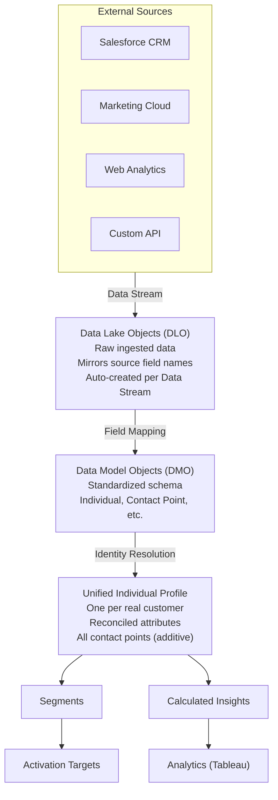
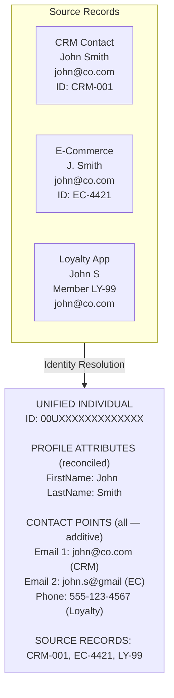

# Data Cloud Architecture & Platform Overview

## Exam Domain
Data Cloud Fundamentals — 13% of exam weight

## Core Concepts

### What Data Cloud Is
Salesforce Data Cloud is the real-time data platform built natively on Salesforce. It ingests data from any source, resolves customer identities across systems, and creates a Unified Customer Profile. It is licensed and provisioned separately from core Salesforce CRM — it does not replace the CRM, it complements it.

**Product rename history:** Customer 360 Audiences → Salesforce CDP → Salesforce Data Cloud → exam renamed to "Salesforce Certified Data 360 Consultant" (CRT-251) in 2024. All three older names appear in docs. The current exam is the Data 360 Consultant.

### The Unified Customer Profile
The Unified Individual is the central output of Data Cloud. It represents one real-world customer resolved across all source systems — with reconciled profile attributes, all linked contact points (emails, phones), and references to all source records that were merged into it. Everything downstream (segments, activation, AI) works off the Unified Individual.

### Data Cloud vs. Salesforce CRM
CRM is transactional and operational — sales pipelines, service cases, user-managed records. Data Cloud is analytical and unified — ingested data, modeled schemas, resolved profiles. Data Cloud ingests CRM data via the Salesforce Connector and can write insights back via Data Actions. Neither replaces the other.

---

## Architecture

### Full Data Cloud Pipeline

**Limitations:**
- Full pipeline latency ranges from seconds (streaming ingestion) to hours (large batch loads + IR run)
- Segmentation and activation work on DMOs and Unified Individual only — DLOs are inaccessible in Segment Builder
- Segment refresh schedule (12h or 24h) is independent of ingestion refresh — both affect data currency

---

### Key Terminology Reference

| Term | Definition |
|---|---|
| **Data Stream** | Pipeline config: source, schedule, field selection |
| **Data Lake Object (DLO)** | Raw storage; data lands here first in exact source form |
| **Data Model Object (DMO)** | Structured, standardized layer used for IR, segmentation, activation, analytics |
| **Unified Individual** | Resolved single customer profile; OUTPUT of Identity Resolution — not created manually |
| **Identity Resolution** | Matches + merges Individual records → Unified Individual |
| **Activation Target** | Destination where segments are published (MC, CRM, Ad Platforms) |

**Limitations:**
- One Data Stream = one source object → one DLO (though multiple streams can feed one DLO)
- Unified Individual can only be produced by running an IR ruleset — no manual creation path

---

### The Unified Customer Profile Detail

**Limitations:**
- Contact Points are additive — reconciliation rules do NOT apply to them; all emails/phones from all sources always appear
- Unified Individual count will be less than the sum of all source Individual records (expected — merges happened)
- Cannot manually edit a Unified Individual record — must fix match/reconciliation rules and re-run IR

---

## Key Facts to Memorize

- Data Cloud was called **Customer Data Platform (CDP)** and before that **Customer 360 Audiences** — all three may appear on the exam
- **Segmentation and activation = DMO layer only** — never raw DLOs
- The Unified Individual is a **standard DMO** produced by IR — not something you configure from scratch
- DLOs are auto-created when a Data Stream first runs
- Data Cloud does NOT replace the CRM — they complement each other via Salesforce Connector (ingest) and Data Actions (write back)
- Data Cloud requires **separate licensing and provisioning** from core Salesforce CRM

---

## Exam Traps

- "Data Cloud replaces the Salesforce CRM" — False. They complement each other.
- "The Unified Individual is manually created by configuring field mappings" — False. It's the output of Identity Resolution.
- Confusing a **Data Stream** (pipeline config) with a **DLO** (storage destination) — they are different objects
- "You can segment directly on DLO fields" — False. Segment Builder only sees DMO-layer data.
- "The Salesforce Connector provides real-time streaming" — False. It is batch only.

---

## Practice Questions

**Q:** A consultant finds that CRM contact records arrived in Data Cloud but are not visible in the Segment Builder. What is the most likely cause?
**A:** The DLO fields have not been mapped to a DMO. Segmentation uses DMO-layer data only. Data landing in a DLO is not automatically available in Segment Builder — field mapping to a DMO is required.

**Q:** Which statement about the relationship between a Data Stream and a Data Lake Object is correct?
**A:** A Data Stream is the pipeline configuration (source, schedule, field selection). The DLO is the raw storage destination where data lands. They are two distinct objects. A Data Stream creates and populates a DLO when it runs for the first time.

**Q:** A consultant explains that after Identity Resolution, the Unified Individual count is lower than the total number of Individual records across all sources. Is this expected?
**A:** Yes — this is the correct, expected behavior. Customers who appear in multiple source systems are merged into a single Unified Individual. The merged count will always be less than the total source record count in a healthy multi-source implementation.
