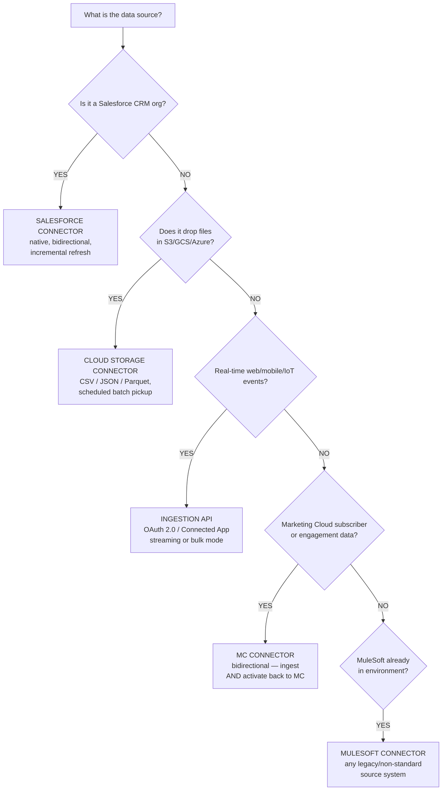
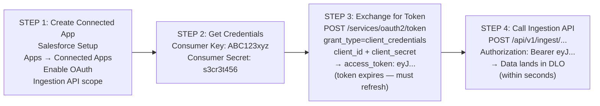

# Data Streams & Ingestion Methods

## Exam Domain
Data Ingestion — 17% of exam weight (second-highest, tied with Data Modeling & Use Cases)

## Core Concepts

### What a Data Stream Is
A Data Stream is the configuration object that defines how data flows from a source into Data Cloud. It specifies the source connection, the object/table to pull, field selection, refresh type, and refresh schedule. Every piece of data in Data Cloud arrived through a Data Stream — no data bypasses this layer. Each Data Stream creates and populates one corresponding DLO.

### Batch vs. Streaming Ingestion
Batch = Salesforce pulls data on a schedule. Streaming = source system pushes data in near-real-time. Batch is for regular, structured data loads (CRM records, nightly exports). Streaming is for real-time events (web clicks, mobile actions, IoT). When a client says "same-minute freshness," that's a streaming requirement — the Ingestion API is the only answer.

### Ingestion API Authentication
The Ingestion API requires OAuth 2.0 Client Credentials flow via a Connected App. The source system exchanges a Consumer Key + Consumer Secret for a Bearer token, then includes that token in all API calls. This is machine-to-machine, no user login involved. Do not confuse with named credentials or username/password — those are not supported.

---

## Architecture

### Connector Decision Tree

**Limitations:**
- Batch connectors (Salesforce, S3/GCS/Azure, MC) cannot deliver real-time data — minimum latency = configured schedule interval
- Batch schedule options are preset: **1h, 6h, 12h, 24h** — no custom intervals, no 15-minute option
- Cloud Storage connectors only support CSV, JSON, and Parquet — NOT Excel (.xlsx)
- The Marketing Cloud Connector is batch-oriented for engagement data; it does not replace the Ingestion API for real-time web events

---

### Batch vs. Streaming Timeline

| | Batch Ingestion | Streaming Ingestion |
|---|---|---|
| **Pattern** | Pull on schedule — large periodic blocks | Push as events occur — continuous individual events |
| **Sources** | Salesforce Connector, S3/GCS/Azure, Marketing Cloud | Ingestion API (streaming mode) |
| **Latency** | Up to 24 hours (depends on schedule) | Seconds to minutes |
| **When to use** | Regular, structured data loads; nightly exports | Real-time events (web clicks, mobile actions, IoT) |

**Limitations:**
- Streaming ingestion via Ingestion API does NOT update Unified Individual profiles or segment membership in real time — those still run on their own schedules
- Streaming data lands in a DLO quickly but downstream processing (field mapping → DMO → IR → Segment) still runs on schedule

---

### Ingestion API Authentication Flow

**Limitations:**
- Tokens expire — the calling application must implement token refresh logic
- Only Client Credentials flow is supported (machine-to-machine) — no user-level OAuth web flow
- Schema must be defined as a DLO before data can be sent — cannot push arbitrary JSON without a pre-defined schema

---

## Key Facts to Memorize

- **Salesforce Connector** supports incremental refresh (only changed records after first full load) — always prefer incremental for performance
- **Cloud Storage connectors** support CSV, JSON, Parquet only — NOT Excel. This is a favorite trick answer.
- **Ingestion API** = push from source system; **Salesforce Connector** = pull by Data Cloud
- **MC Connector is bidirectional:** ingests MC subscriber/engagement data AND activates segments back to MC journeys
- **MuleSoft Connector** = when source has no native connector but MuleSoft is already in environment
- Batch schedule options: **1h, 6h, 12h, 24h** — no other intervals available
- When scenario says "real-time web events" or "IoT sensor data" → **Ingestion API**
- Multiple connector types can run simultaneously — most implementations use 3+ connectors

---

## Exam Traps

- "Use the Salesforce Connector for real-time events" — wrong, it's batch only
- Ingestion API authentication via "username and password" or "named credential" — wrong; it's **OAuth 2.0 via Connected App**
- "Set a custom 45-minute refresh interval" — wrong; batch options are only 1h, 6h, 12h, 24h
- "CSV and Excel files work with the Cloud Storage Connector" — wrong; Excel (.xlsx) is NOT supported
- Confusing Ingestion API Bulk mode with the Salesforce Bulk API — they are different things
- "The Marketing Cloud Connector provides real-time streaming of email events" — wrong; MC Connector is batch-oriented

---

## Practice Questions

**Q:** A retail company needs to stream real-time web clickstream events into Data Cloud for same-session personalization. Which connector type is correct?
**A:** Ingestion API in streaming mode. The source system (website) POSTs events to the Ingestion API endpoint. Authentication uses OAuth 2.0 via a Connected App. Salesforce Connector and S3 connectors are batch-only and cannot meet same-session latency requirements.

**Q:** A developer builds server-to-server integration to push IoT sensor data to Data Cloud. What authentication mechanism is required for the Ingestion API?
**A:** OAuth 2.0 Client Credentials flow using a Connected App. The application exchanges Consumer Key and Consumer Secret for a Bearer token, which it includes in all Ingestion API calls. Username/password, API keys, and named credentials are not valid authentication methods for the Ingestion API.

**Q:** A consultant needs to ingest nightly transaction CSV exports from a data warehouse that are dropped into Amazon S3. Which connector and schedule is appropriate?
**A:** Amazon S3 Cloud Storage Connector with a 24-hour refresh schedule. The files are already in S3 in CSV format — the native S3 connector picks them up on schedule. The Ingestion API Bulk mode could technically work but would require additional custom development; the S3 connector is the correct native solution.
