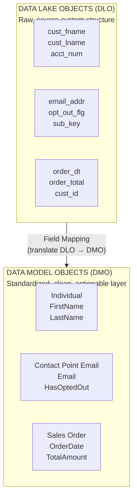
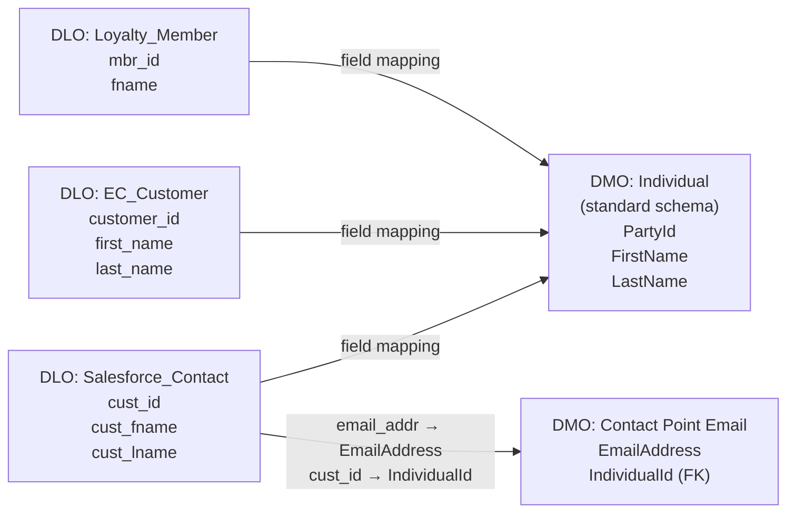

# Data Lake Objects vs. Data Model Objects

## Exam Domain
Data Modeling & Identity Resolution — 17% of exam weight (tied for highest)

## Core Concepts

### The Two-Layer Model
Data Cloud has two distinct data layers. DLOs (Data Lake Objects) are raw staging — they store data exactly as it came from the source, with the same field names and structure. DMOs (Data Model Objects) are the standardized, modeled layer with fixed schemas that Data Cloud uses for identity resolution, segmentation, and activation. Field mapping is the bridge that connects raw DLO fields to the standard DMO fields.

### Why DLOs Exist
DLOs preserve the source structure intact so you can re-map or re-process data without re-ingesting. If you set up a field mapping incorrectly, you fix the mapping and reprocess — the raw data in the DLO is still there. DLOs are auto-created when a Data Stream first runs. They are read-only — you cannot manually edit DLO records.

### Standard vs. Custom DMOs
Standard DMOs are pre-built by Salesforce with fixed schemas — they cannot be deleted and fully support Identity Resolution. Custom DMOs are created by the implementer for business-specific entities (vehicle ownership, insurance policy, subscription plan). Custom DMOs support segmentation but have limited Identity Resolution support. Never create a custom "Person" DMO — always use the standard Individual DMO for person records. Using a custom person DMO breaks Identity Resolution.

---

## Architecture

### The Two-Layer Data Model

**Limitations:**
- Without field mapping, DLO data is completely invisible to Segment Builder — it exists in storage but cannot be used
- DLOs are read-only — you cannot edit, filter, or query them in the Segment Builder
- DMO records are derived from DLO data via field mapping — they are not separate copies stored twice

---

### Key Standard DMOs

| DMO Name | Purpose & Key Fields |
|---|---|
| **Individual** | Core person record — IR INPUT. Fields: FirstName, LastName, BirthDate, etc. |
| **Contact Point Email** | Email addresses linked to Individual. Fields: EmailAddress, HasOptedOutOfEmail (consent), IndividualId (FK) — IR MATCHING |
| **Contact Point Phone** | Phone numbers linked to Individual. Fields: TelephoneNumber, HasSmsOptedOut, IndividualId (FK) |
| **Unified Individual** | OUTPUT of IR — merged profile. Not an input DMO — do not map to it manually |
| **Sales Order** | Purchase/transaction header. Fields: OrderDate, TotalAmount, IndividualId (FK) |
| **Sales Order Product** | Line items within a Sales Order. Fields: ProductCategory, Quantity, Price |
| **Web Engagement** | Web clickstream / behavioral events |
| **Email Engagement** | MC email open/click events |

**Note:** Unified Individual is OUTPUT of IR — not an input to map to manually.

**Limitations:**
- Standard DMO schemas are fixed — you cannot add or remove standard fields
- Custom DMOs support segmentation but have limited IR support — cannot replace Individual for person records
- Web Engagement and Email Engagement DMOs are for analytics/segmentation only — not for IR matching

---

### Field Mapping: Multiple DLOs → One DMO

**Limitations:**
- One DLO field CANNOT map to two different fields on the same DMO
- Data types must be compatible — text cannot map to date without a formula transformation
- Calculated/formula fields on DMOs cannot receive direct DLO mappings
- Primary Key field MUST always be mapped — missing PK causes the entire mapping to fail

---

### Field Mapping Rules Summary

**Allowed:**
- Multiple DLOs → same DMO (consolidation from multiple sources)
- One DLO → multiple DMOs (if data covers multiple entity types)
- Partial mapping (not all DLO fields need to be mapped)
- Formula transformation (type conversion at mapping time)

**Not Allowed:**
- One DLO field → two different fields on the same DMO
- Incompatible data types without formula transformation
- Mapping to formula/calculated fields on DMOs

**Required:**
- Primary Key field must always be mapped

---

## Key Facts to Memorize

- DLOs are **auto-created** when a Data Stream first runs — you don't create them manually
- **Contact Point Email** DMO (not the email field on Individual) must be populated for email-based IR matching
- The **Unified Individual** is the OUTPUT of Identity Resolution — you do NOT map to it as an input
- Multiple DLOs CAN map to the same DMO — this is how cross-source consolidation works
- Partial mapping is fine — unmapped DLO fields stay in the DLO and can be mapped later without re-ingesting
- Custom DMOs support segmentation but have **limited Identity Resolution support**
- Always use standard **Individual** DMO for person records — custom person DMOs break IR

---

## Exam Traps

- "Map the email address to the Individual DMO for IR email matching" — wrong; map to **Contact Point Email** DMO
- "Create a custom Person DMO to hold customer records" — wrong; always use standard Individual DMO
- "The Unified Individual is a DMO you create and configure manually" — wrong; it's the OUTPUT of IR
- "Data type mismatches are auto-corrected by Data Cloud" — wrong; incompatible types without a formula transformation cause mapping failures
- "After field mapping, DLOs are deleted" — wrong; DLOs persist as the raw staging layer
- "One DLO field can map to two different DMO fields on the same DMO" — wrong; one-to-one only

---

## Practice Questions

**Q:** Customer email addresses are ingested from an e-commerce DLO but Identity Resolution is not matching records by email even though the same emails exist in the CRM. What is most likely missing?
**A:** The email field is mapped to the Individual DMO but not to the Contact Point Email DMO. Identity Resolution uses Contact Point Email DMO for email matching — the email field on the Individual DMO is not used for IR matching. The fix is to add a mapping from the e-commerce DLO's email field to the ContactPointEmail.EmailAddress field, with the customer ID mapped to ContactPointEmail.IndividualId.

**Q:** Which statement about custom Data Model Objects is correct?
**A:** Custom DMOs support segmentation (you can filter on their fields in Segment Builder) but have limited Identity Resolution support. You should never replace the standard Individual DMO with a custom person DMO — IR requires the standard Individual. Custom DMOs are manually created by admins, not auto-generated.

**Q:** A DLO field "order_date" is stored as text (e.g., "2024-03-15") but the Sales Order DMO expects a Date type. What should the consultant do?
**A:** Apply a formula transformation in the field mapping to convert the text to a Date type. Data Cloud does not auto-convert incompatible types. Creating a custom DMO just to work around the type issue is poor practice. The formula transformation is the correct Data Cloud approach for type conversion at mapping time.
