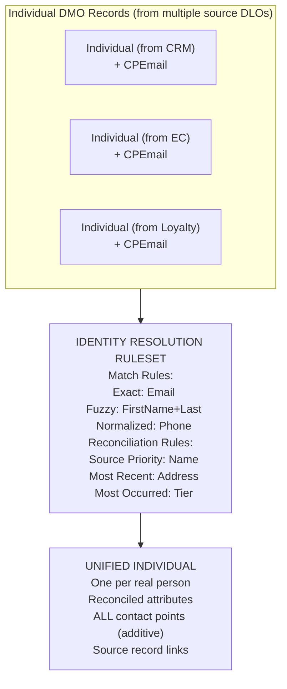

# Identity Resolution

## Exam Domain
Data Modeling & Identity Resolution — 17% of exam weight (tied for highest)

## Core Concepts

### The Identity Problem
Most enterprises have the same customer in 3–10+ systems with different IDs and no shared key. CRM has one ID, e-commerce has another, the loyalty app has a third. Without resolution, you're doing data analysis on fragments, not whole customers. Identity Resolution (IR) finds these fragments and merges them into a single Unified Individual, giving every downstream system a complete picture.

### How IR Works
IR operates on Individual DMO records and their associated Contact Point DMO records. It runs a configured Ruleset containing Match Rules (who to link) and Reconciliation Rules (whose field value wins when sources disagree). IR runs on demand or on schedule and outputs/updates Unified Individual records. Input: Individual + Contact Point DMOs. Output: Unified Individuals.

### Contact Points Are Additive
This is the most-tested IR nuance. Reconciliation rules (Source Priority, Most Occurred, Most Recent) apply to attribute fields on the Unified Individual (FirstName, BirthDate, etc.). They do NOT apply to Contact Points. All email addresses and phone numbers from all linked source records always appear on the Unified Individual — none are discarded. A customer with 3 emails across 3 sources will have 3 emails on their Unified Individual.

---

## PTA / SA Relevance

### When This Comes Up in Engagements
IR quality determines the value of the entire Data Cloud investment. A CDO or Chief Data Officer will often ask "how many unique customers do we really have?" — the Unified Individual count is your answer, and it's only trustworthy if IR is configured correctly. When scoping a Data Cloud project, IR configuration and data quality remediation are typically 30–40% of total implementation effort.

### Common Partner Mistakes
- Mapping email only to the Individual DMO and wondering why IR won't match on email (Contact Point Email DMO must be populated separately)
- Setting fuzzy match threshold too low for a financial services client — merging two different customers is catastrophic in regulated industries
- Running IR before verifying Contact Point DMOs have records — the IR process runs but creates zero matches, leading to incorrect conclusions about data quality
- Not planning for the re-ingestion problem in GDPR deletion scenarios: deleting a Unified Individual without also suppressing re-ingestion means the record comes back on the next Data Stream run

### Enterprise Scale Considerations
At 100M+ Individual records, IR runtime can be significant. For large implementations: run IR on off-peak schedules, use incremental IR runs (only processes newly changed records where supported), monitor match group sizes (very large match groups indicate a "super-matcher" problem — one email/phone shared across thousands of records like a shared corporate email), and separate IR rulesets by data domain if processing time is prohibitive.

### When NOT to Use IR
Don't configure complex multi-field fuzzy match rules for a B2B account-based implementation where each account is a single legal entity with a known CRM ID. Simple exact match on account ID is cleaner and faster. Also don't use IR to try to match records with fundamentally different entity types (e.g., trying to match B2B Account records against B2C Individual records in the same ruleset).

---

## Architecture

### Identity Resolution Flow

**Limitations:**
- IR runs on a schedule — it is NOT real-time; a new customer record ingested at 2 PM may not become a Unified Individual until the next IR run
- Maximum match rules per ruleset: consult current Salesforce limits documentation (this changes with releases)
- IR does not support real-time lookup during Agentforce interactions — it relies on the most recently completed IR run
- IR cannot merge records across different Data Spaces

---

### Match Rules — Type Comparison

| Match Type | Use For | How It Works |
|---|---|---|
| **Exact** | Email, Loyalty ID, Government ID | Character-for-character match (email auto-lowercased before compare) |
| **Fuzzy** | First name, Last name (typos, nicknames) | Similarity algorithm (Levenshtein). Threshold % = minimum similarity. Higher % = fewer matches, fewer errors |
| **Normalized** | Phone numbers, Addresses | Strip formatting → exact compare. "(555) 123-4567" = "5551234567". Removes dashes, spaces, country codes |

**NEVER** use Fuzzy for email — would match "john@co.com" with "jane@co.com". **ALWAYS** use Exact or Normalized for email and phone.

**Limitations:**
- Fuzzy matching is computationally more expensive than exact matching — use sparingly at enterprise scale
- Fuzzy threshold tuning requires testing: start at 85–90% for names, adjust based on false positive/negative review
- Normalized match does not change stored data — normalization is only applied at comparison time

---

### Reconciliation Rules

Example: Source A (CRM) has FirstName "Jon" (updated 2022-01-15); Source B (Loyalty) has "John" (updated 2024-06-20).

| Strategy | How It Works | Winner in Example | Best For |
|---|---|---|---|
| **Source Priority** | Manually ranked trust order | CRM = rank 1 → "Jon" wins | When one source is the definitive system of record |
| **Most Occurred** | Value appearing in most sources wins | "John" in 2/3 sources → "John" wins | When no single source is authoritative |
| **Most Recent** | Newest update wins | Loyalty updated 2024 → "John" wins | Frequently changing data (address, preferences) |

**REMEMBER:** Reconciliation applies to attribute fields only. Contact Points are additive — the Unified Individual gets ALL emails from ALL sources regardless of reconciliation.

**Limitations:**
- Source Priority requires you to know and rank all source systems at configuration time — hard to maintain as new sources are added
- Most Recent depends on data refresh timing; if batch runs are staggered, "most recent" may reflect stale data
- No reconciliation rule covers the case where all sources have null for a field — field will be null on Unified Individual

---

### IR Troubleshooting Quick Reference

| Symptom | Most Likely Cause | Fix |
|---|---|---|
| 0 match groups | Contact Point DMOs empty | Fix field mapping for ContactPointEmail DMO |
| Too many merges (false positives) | Fuzzy threshold too low | Increase threshold; add qualifying criteria |
| Too few merges (false negatives) | CPEmail not populated; threshold too high | Map email to CPEmail DMO; lower threshold slightly |
| No Unified Individuals at all | Individual DMO is empty; Ruleset not active | Check field mapping saved; activate the ruleset |
| Wrong field value on Unified Individual | Reconciliation rule misconfigured | Review + fix rule; re-run ruleset |

**Review tool:** Data Cloud UI → Identity Resolution → Match Groups

---

## Key Facts to Memorize

- IR uses **Individual DMO + Contact Point DMOs** as input — not DLOs, not Unified Individual
- **Contact Point Email** must be mapped separately — mapping email to Individual.EmailAddress does NOT enable IR email matching
- Three match rule types: **Exact** (email/ID), **Fuzzy** (names), **Normalized** (phone formatting)
- Three reconciliation strategies: **Source Priority**, **Most Occurred**, **Most Recent**
- **Contact Points are additive** — all emails/phones from all sources appear on Unified Individual
- Reconciliation rules apply to **attribute fields only** (FirstName, BirthDate, etc.)
- If IR produces 0 Unified Individuals → check that Individual DMO has records AND ruleset is active
- You **cannot manually edit** a Unified Individual — fix the rules and re-run

---

## Exam Traps

- "Contact Point reconciliation: only the highest-priority source's email appears on Unified Individual" — False; Contact Points are additive, not reconciled
- "Fuzzy match should be used for email addresses to catch typos" — dangerous and wrong; email is an exact identifier, fuzzy on email merges different people
- "Identity Resolution creates Unified Individual records immediately when new data is ingested" — wrong; IR runs on schedule, not in real time
- "Configure reconciliation rules on Contact Point Email DMO fields" — wrong; reconciliation applies to Individual attribute fields, not Contact Points
- "Zero match groups means the identity resolution configuration is wrong" — not necessarily; with only one source, zero cross-source matches is expected

---

## Practice Questions

**Q:** A consultant configures IR to match on phone number but the same phone appears as "(800) 555-0100" in one source and "800-555-0100" in another. Which match type handles this correctly?
**A:** Normalized Match. It strips formatting differences (dashes, parentheses, spaces, country codes) before comparing, then performs an exact match on the cleaned digit strings. This correctly identifies the two numbers as identical despite formatting differences.

**Q:** After running IR, two customers with similar names but different email addresses are incorrectly merged. What is the most appropriate fix?
**A:** Increase the fuzzy match threshold for the name-based match rule. The incorrect merge was caused by a name similarity score that fell above the current threshold despite the records being different people. Increasing the threshold requires a higher similarity score before declaring a match, reducing false positives.

**Q:** An organization uses Source Priority reconciliation with CRM ranked first. The Unified Individual shows email addresses from the e-commerce system. Why?
**A:** Contact Points are additive — all emails from all linked source records appear on the Unified Individual. Reconciliation rules apply to Individual attribute fields (like FirstName), not to Contact Points. The Source Priority rule affects which name/address value appears on the Unified Individual, but all emails always appear regardless.
