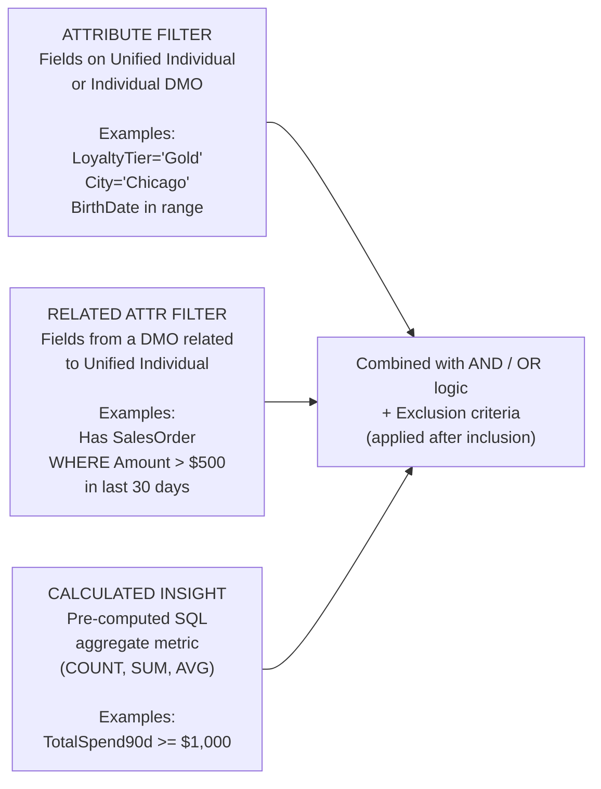
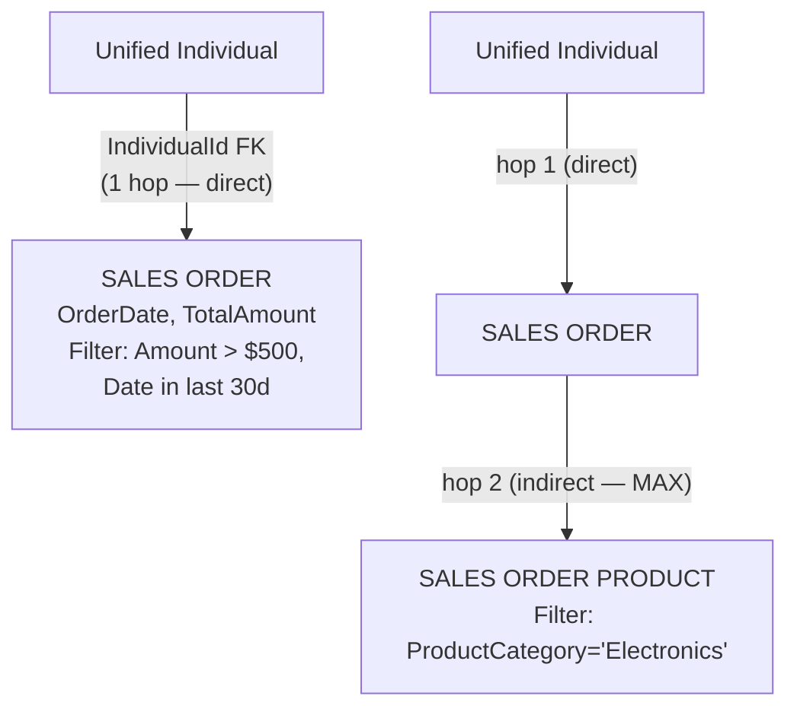
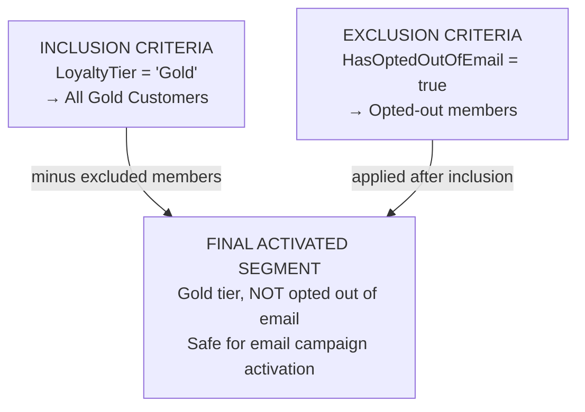

# Segmentation Basics

## Exam Domain
Segmentation & Insights — 13% of exam weight

## Core Concepts

### What a Segment Is
A segment is a dynamic, filtered subset of Unified Individual records. It answers "which customers meet these criteria right now?" Segment membership is not static — it recalculates on a configured schedule (12h or 24h) and changes as customer data changes. Customers enter segments when they meet criteria; they exit when they no longer meet criteria (e.g., fall outside a time window).

### Three Criteria Types
**Attribute filter:** filter on a field directly on the Unified Individual or Individual DMO (LoyaltyTier, City, Gender). **Related attribute filter:** filter on a field from a DMO linked to the Unified Individual via a relationship (e.g., has a Sales Order where Amount > $500 in last 30 days). **Calculated Insight filter:** filter on a pre-computed aggregate metric (TotalSpend90d >= $1000). Most production segments combine all three types.

### Draft vs. Published
Segments start as Draft. A Draft segment can be built and previewed but CANNOT be added to an Activation Target. You must click Publish to make a segment activatable. This is one of the most-tested operational details on the exam.

---

## PTA / SA Relevance

### When This Comes Up in Engagements
Segmentation is where business users feel the value of Data Cloud. The conversation moves from "we have unified profiles" to "we can now target the right 50,000 customers for this campaign instead of blasting 2 million." For a CDO conversation, lead with: "your marketing team can build precise audiences in minutes instead of waiting days for IT to pull a list from the data warehouse."

### Common Partner Mistakes
- Building segments before Identity Resolution is properly configured — segment sizes are wrong because they're counting source records, not unified customers (double-counting)
- Forgetting to include consent exclusion in outbound marketing segments — this is both a compliance risk and an exam question
- Not coordinating segment refresh schedules with Data Stream refresh — marketing team builds a segment for an "active last 30 days" campaign, but the segment counts don't reflect yesterday's purchases because the segment refreshed before the ingestion job completed
- Deploying a segment to production in Draft status and then troubleshooting "why isn't the activation getting any records"

### Enterprise Scale Considerations
For large customer bases (10M+ Unified Individuals), complex segment criteria with multiple indirect relationship hops and CI filters can have significant refresh times. Design patterns: pre-compute frequently used combinations as CIs rather than building complex related-attribute chains; use simpler attribute filters for initial candidate selection, then apply complex filters; monitor segment refresh duration in the Job Scheduler.

### When NOT to Use Segmentation
Don't use segments for one-off ad-hoc reports — use CRM Analytics or Tableau instead. Don't create dozens of narrow segments for the same campaign — build one wider segment with activation attributes that drive personalization within the campaign. Don't use segments as a real-time eligibility check for web personalization — segments refresh on schedule, not in real time.

---

## Architecture

### Segment Population and Membership

A segment is a filtered subset of the full pool of Unified Individuals. For example, a "High-Value 30d" segment with 12,450 members is a subset drawn from your entire Unified Individual population. Members who meet the criteria are included; those who don't are excluded. Membership is dynamic — it recalculates on the 12h or 24h refresh schedule as data changes.

**Limitations:**
- Segment refresh schedule options: **12 hours or 24 hours** only — no real-time, no sub-12h option
- Segment population always builds from Unified Individuals — if IR hasn't run recently, segments reflect stale identity data
- Segment membership is an estimate until the full segment run completes

---

### Segment Criteria Types

**Limitations:**
- Indirect relationship filters support a maximum of **2 hops** from Unified Individual
- More complex filter chains (indirect relationships + multiple CI conditions) increase segment refresh time
- Segment Builder only exposes DMO-layer data — DLOs are never accessible in Segment Builder

---

### Direct vs. Indirect Relationships

**Max 2 hops** from Unified Individual. "Customers who bought Electronics in last 90 days" = 2-hop indirect relationship filter.

**Limitations:**
- **Maximum 2 hops** from Unified Individual — 3-hop relationships cannot be used in segment criteria
- Indirect relationship filters are more computationally expensive — use CI pre-aggregation instead for performance at scale
- Relationship must be explicitly configured on the DMO before it can be used in segment criteria

---

### Consent Exclusion Pattern

**Always** include HasOptedOutOfEmail exclusion in email activation segments. HasOptedOutOfEmail lives on the Contact Point Email DMO — not on Individual.

---

## Key Facts to Memorize

- Segments are always built on **Unified Individual** records — not on DLOs, not on raw DMOs
- Segments must be **Published** (not Draft) before they can be added to an Activation Target
- Refresh schedule options: **12 hours or 24 hours** only
- Segment refresh is **separate from Data Stream refresh** — both affect data currency; check both when troubleshooting
- Indirect relationship filters support up to **2 hops** from Unified Individual
- **Exclusion criteria are evaluated AFTER inclusion criteria**
- AND narrows the segment (fewer records); OR widens it (more records)
- A segment size discrepancy with the Activation Target is expected — activation only includes members with valid, non-opted-out contact points

---

## Exam Traps

- "Segments can be built on DLO data directly" — False; Segment Builder only uses DMO-layer data
- "A Draft segment can be activated" — False; segments must be Published first
- "Segment membership updates in real time as new data arrives" — False; it recalculates on the 12h or 24h schedule
- "If a segment shows 8,000 members but Marketing Cloud only gets 6,500, something is wrong" — not necessarily; 1,500 may have no valid email or have opted out. This is expected behavior.
- "You can use a related attribute filter for any DMO regardless of hop count" — False; max 2 hops from Unified Individual

---

## Practice Questions

**Q:** A marketing team wants to segment customers who bought in the Electronics product category in the last 60 days. Electronics data is in Sales Order Product DMO, which links to Sales Order, which links to Individual. Is this possible and how?
**A:** Yes — using an indirect relationship filter. Sales Order Product is 2 hops away from Unified Individual (Individual → Sales Order → Sales Order Product). This is within the supported 2-hop limit. The consultant configures the relationship path and then filters on ProductCategory = "Electronics" and OrderDate in last 60 days.

**Q:** A consultant publishes a segment and activates it but the Marketing Cloud Data Extension only has 13,200 records when the segment shows 15,000 members. No errors in the Activation Log. What is most likely?
**A:** 1,800 segment members don't have a valid email contact point or have HasOptedOutOfEmail = true on their Contact Point Email record. Activation membership is always equal to or less than segment membership. Only members with valid, non-opted-out contact points for the activation channel are included.

**Q:** Which statement about segment membership refresh is correct?
**A:** Segment membership is recalculated on a configured refresh schedule with options of 12 or 24 hours. It is not real-time even if data is streamed in via the Ingestion API. It does not update only when an activation is triggered. It is not static after publishing.
