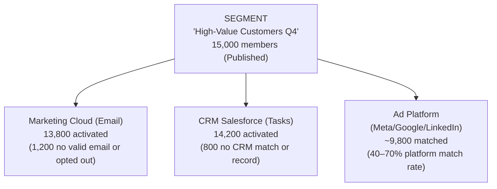
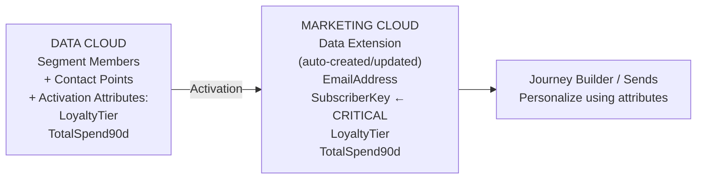
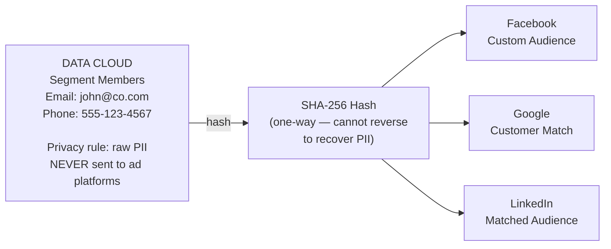

# Activation Targets & Engagement

## Exam Domain
Activation & Engagement — 10% of exam weight

## Core Concepts

### What an Activation Target Is
An Activation Target (AT) is the configuration that defines WHERE and HOW a segment is published to a destination system. It is the "exit ramp" of Data Cloud — where unified, segmented customer data leaves Data Cloud and reaches the systems that communicate with customers. ATs receive Published segments (never Draft). Multiple Activation Targets can receive the same segment simultaneously.

### Activation Membership vs. Segment Membership
This is the most-tested activation concept. Segment membership = all Unified Individuals meeting the segment criteria. Activation membership = segment members who actually get sent to the destination, which may be less. The difference: some members may have no valid contact point for the channel (no email address), or have HasOptedOutOfEmail = true. This reduction is expected and not an error.

### Publish Schedules
ATs have their own publish schedule independent of the segment refresh schedule: Continuous (publishes as soon as segment refreshes), 12 hours, 24 hours, or Manual. The full chain matters: Data Stream → DMO → CI → Segment refresh → Activation publish. New segment members can't appear in the destination until ALL steps complete.

---

## PTA / SA Relevance

### When This Comes Up in Engagements
Activation is where Data Cloud's value becomes tangible to marketing stakeholders. The question "how do we get these segments into our email tool?" is answered here. For multi-channel campaigns (email + ads + CRM outreach), one segment activating to three targets simultaneously is a compelling architecture story versus the traditional "export list, upload to each system" approach.

### Common Partner Mistakes
- Activating a segment that's still in Draft status and then spending time troubleshooting why nothing appears in the destination
- Incorrect Subscriber Key mapping in Marketing Cloud activation — results in duplicate MC subscriber records (one per contact point) instead of updating the existing subscriber
- Not adding Activation Attributes — sending a bare list of email addresses to Marketing Cloud without the customer's loyalty tier or purchase metrics, forcing MC to do a separate data fetch
- Expecting activation to provide real-time audience updates for programmatic advertising — advertising platform activation has a multi-hour latency (hash, upload, platform processing)

### Enterprise Scale Considerations
For large segments (1M+ members), full activation publish runs can take significant time. Use incremental publish where available (only sends new/changed members rather than the full list). For advertising platform activations, understand that match rates are 40–70% of activated records — not all customers are identifiable on ad platforms. Build this into campaign ROI expectations.

### Customer Advisory: Channel Strategy
Data Cloud's ability to activate one segment to multiple destinations simultaneously is foundational to omnichannel campaign strategy. Advise customers to think about activation in terms of the customer journey: the same "high-value at-risk" segment can simultaneously trigger an outbound call task in CRM, an email sequence in Marketing Cloud, and an ad suppression in Facebook (don't advertise to customers you're already calling). This is the integrated engagement model Data Cloud enables.

---

## Architecture

### Activation Flow: Segment to Destinations

One Published segment activates to multiple Activation Targets simultaneously.

**Limitations:**
- Advertising platform match rates are 40–70% of uploaded records — not all activated members are identifiable on the platform
- Activation latency varies by destination type — CRM Campaign Member creation is fast; advertising platform audience upload can take hours
- Activation Target creation is restricted to Data Cloud Admin permission set — not all users can create new destinations

---

### Marketing Cloud Activation — Critical Details

**Subscriber Key mapping is required.** It maps the Data Cloud contact identifier to the MC Subscriber Key. Wrong mapping creates duplicate MC subscriber records.

**Limitations:**
- Subscriber Key mapping is required and must be correct — incorrect mapping creates duplicate subscribers in MC
- Marketing Cloud activation is batch-oriented — it does not update MC in real time
- Data Extension is auto-created/updated but schema changes in DC may require MC Data Extension updates

---

### Advertising Platform Activation — Privacy Model

Match rate: 40–70% (not all users identifiable on platform). Use cases: Suppression (don't show ads to existing customers), Lookalike (find similar users), Retargeting (re-engage browsed-but-didn't-buy).

**Limitations:**
- SHA-256 hashing is one-way — ad platforms cannot reverse it to obtain PII
- Match rates vary by platform and data quality — expect 40–70%, not 100%
- Advertising platform audiences take time to process after upload (typically 24–48 hours before ads begin running against the new audience)

---

### Publish Schedule and Full Chain

**Publish Schedule Options:**
- **Continuous** — activates changes as soon as segment refreshes
- **12 hours** — publishes twice daily
- **24 hours** — publishes once daily
- **Manual** — triggered by admin action only

**Full Chain (every step has its own schedule):**

Data Stream → DMO update → CI refresh → Segment refresh → Activation publish

**End-to-end lag example:** New customer qualifies at 8 PM. With daily schedules (Data Stream 2 AM, CI 4 AM, Segment 6 AM, Publish 7 AM) — customer appears in destination at 7 AM the next day: **11-hour lag**. This is expected and must be communicated to stakeholders.

---

## Key Facts to Memorize

- Segments must be **Published** (not Draft) before they can be added to an Activation Target
- **Activation membership ≤ Segment membership** — always; contact point filtering and consent reduce the count
- Advertising platform activations use **SHA-256 hashed** email/phone — never raw PII
- MC activation requires proper **Subscriber Key mapping** — incorrect mapping creates duplicate MC subscriber records
- **One segment can activate to multiple Activation Targets** simultaneously — no need for separate segments
- Activation attributes (DMO fields + CI measures) travel alongside segment membership to enrich the destination
- Activation Target creation is **Data Cloud Admin only** — governance safeguard against unauthorized data egress
- Check the **Activation Log** first when troubleshooting — it shows last publish time, member count, and errors

---

## Exam Traps

- "If segment has 15,000 members but MC gets 13,200, there's an error" — wrong; expected behavior due to contact point and consent filtering
- "Each Activation Target requires its own separate segment" — wrong; one segment activates to multiple ATs
- "Advertising platforms receive raw email addresses" — wrong; SHA-256 hashed emails only
- "Draft segments appear in Activation Targets" — wrong; must be Published
- "Activation Attributes determine segment membership criteria" — wrong; attributes are extra data sent alongside membership; criteria are in the segment definition

---

## Practice Questions

**Q:** A segment has 15,000 members. After activation to MC, the Data Extension only has 13,200 records. No error messages in the Activation Log. What is the most likely reason?
**A:** 1,800 segment members don't have a valid email contact point or have HasOptedOutOfEmail = true on their Contact Point Email record. Activation membership is always equal to or less than segment membership. This is expected behavior — not an error — because activation only includes members with valid, non-opted-out contact points for the channel.

**Q:** How does Data Cloud transmit customer identity to Facebook for Custom Audiences targeting?
**A:** Data Cloud sends SHA-256 hashed email addresses or phone numbers. Hashing is one-way and protects raw PII while still allowing Facebook to match users within its own systems. Raw PII is never transmitted to ad platforms.

**Q:** A consultant includes TotalSpend90d (a CI measure) as an Activation Attribute in a Marketing Cloud AT. What does this enable?
**A:** Marketing Cloud receives the TotalSpend90d value alongside each customer's segment membership, enabling MC to use it in personalization strings, Journey decision splits, or dynamic email content — for example, showing different offers to customers with different spending levels. Activation Attributes do not determine segment membership; they enrich the data sent to the destination.
