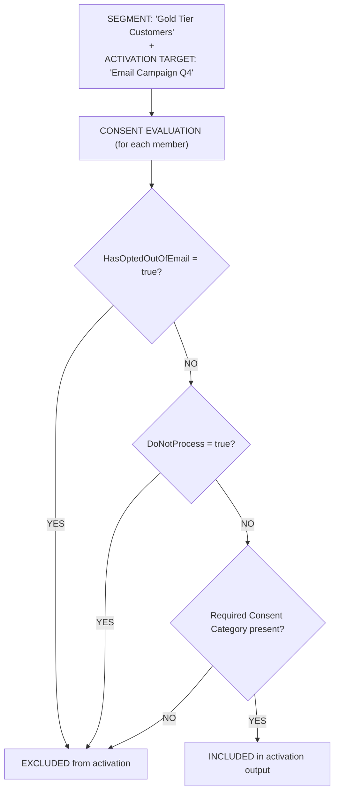
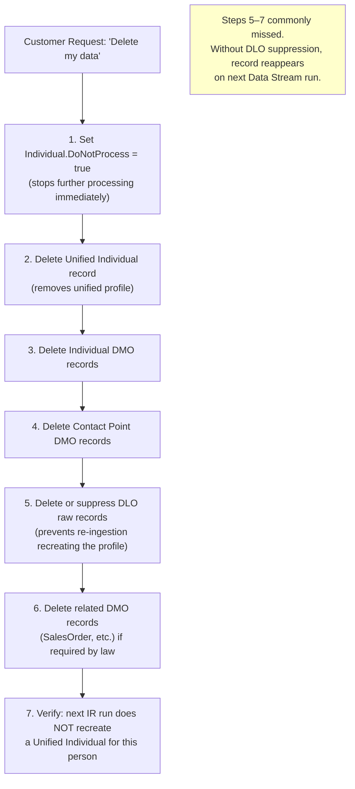

# Consent & Privacy

## Exam Domain
Data Governance & Compliance — 12% of exam weight

## Core Concepts

### The Three Consent Fields
Data Cloud has three primary consent fields you must know: **HasOptedOutOfEmail** (Boolean, on Contact Point Email DMO) — the standard email unsubscribe flag. **DoNotProcess** (Boolean, on Individual DMO) — the GDPR right-to-erasure / stop-all-processing flag. **HasOptedOutOfSharing** (Boolean, on Individual DMO) — the CCPA do-not-sell / do-not-share flag. Each maps to a different law and lives on a different object. Getting them mixed up is the #1 exam consent question trap.

### Consent Categories
Data Cloud Consent Categories go beyond individual field-level flags. They let you model purpose-based consent: "this person consented to marketing communications but not to sharing data with third parties." Consent Categories are attached to segments and activation targets to automate compliance filtering. When a segment is activated, members without the required consent category are excluded automatically.

### Streaming Consent vs. Batch Consent
Consent signals must be acted upon quickly to avoid compliance violations. Data Cloud supports streaming consent ingestion (via Ingestion API) so that an unsubscribe at 3 PM can be reflected in the next activation (hours, not days). Batch consent ingestion (via Data Stream) also works but has higher latency — acceptable only if the activation schedule is daily or less frequent.

---

## PTA / SA Relevance

### When This Comes Up in Engagements
Every regulated-industry customer (financial services, healthcare, retail in EU) will ask about GDPR and CCPA compliance in the initial discovery call. The CDO or General Counsel wants to know: "If a customer says 'delete my data,' how does Data Cloud handle it?" and "Can we prove consent at activation time?" The consent architecture is a prerequisite to going live in any regulated market.

### Common Partner Mistakes
- Putting the consent flag on the wrong object: using HasOptedOutOfEmail on the Individual DMO instead of the Contact Point Email DMO — this breaks automated consent enforcement at activation
- Treating DoNotProcess as "just another marketing opt-out" — it means STOP ALL PROCESSING, which in a strict GDPR interpretation means not even Identity Resolution should run against this person's data
- Not planning for Right to Erasure: deleting a Unified Individual doesn't delete the source Individual DMO records or DLO records — without a complete deletion cascade, the customer reappears on the next ingestion run
- Building Consent Categories without legal review — the category names and scopes should be aligned with what was actually disclosed in the customer privacy notice

### Enterprise Scale Considerations
For a large retail enterprise with 20M+ customers, consent data is often managed in a Preference Center or Consent Management Platform (OneTrust, TrustArc). The integration pattern: Preference Center fires an event → Ingestion API endpoint → Data Cloud updates consent fields in real time → next activation excludes updated records. Plan for the latency window: even with streaming ingestion, activation may not pick up the consent change until the next segment refresh.

### Customer Advisory: Privacy-by-Design
Advise customers to treat consent as a first-class data stream, not an afterthought. The GDPR Article 17 (right to erasure) requirement means the Data Cloud implementation must include a deletion workflow from day one. Post-implementation cleanup of consent architecture is far more expensive than designing it correctly up front.

---

## Architecture

### Consent Fields Reference Diagram

| DMO | Consent Field | Law | Meaning |
|---|---|---|---|
| **Individual DMO** | `DoNotProcess = true` | GDPR | Stop all processing / right to erasure |
| **Individual DMO** | `HasOptedOutOfSharing = true` | CCPA | Do not sell / do not share with third parties |
| **Contact Point Email DMO** | `HasOptedOutOfEmail = true` | CAN-SPAM, CASL | Email unsubscribe |
| **Contact Point Phone DMO** | `HasSmsOptedOut = true` | TCPA | SMS unsubscribe |

**Limitations:**
- Consent flags on the WRONG DMO are NOT automatically enforced at activation — the mapping must be exact
- Deleting a Unified Individual does NOT automatically delete underlying DLO/DMO records — additional data deletion workflows are required for full GDPR erasure
- There is no built-in cross-org consent sync between a Data Cloud instance and an MC or CRM Org — consent must be ingested explicitly

---

### Consent in the Activation Flow

Result: Segment members ≥ Activation members (consent exclusion reduces count).

---

### GDPR Right to Erasure Workflow

**Limitations:**
- Data Cloud does not have a single-click "full erasure" workflow — each step must be orchestrated (manually or via API)
- Backup copies or data exports outside Data Cloud are NOT managed by this workflow
- Right to erasure does NOT necessarily mean deletion in all cases — some data may be retained for legal reasons (consult legal counsel)

---

## Key Facts to Memorize

- **HasOptedOutOfEmail** = Contact Point Email DMO (email unsubscribe)
- **DoNotProcess** = Individual DMO (GDPR — stop all processing)
- **HasOptedOutOfSharing** = Individual DMO (CCPA — do not sell/share)
- Consent Categories model purpose-based consent and are enforced at activation automatically
- Streaming consent ingestion (Ingestion API) provides faster consent propagation than batch
- Deleting a Unified Individual does NOT delete source DLO/DMO records — they must be cleaned up separately
- GDPR erasure requires suppressing re-ingestion or the record will reappear

---

## Exam Traps

- "HasOptedOutOfEmail is a field on the Individual DMO" — wrong; it's on Contact Point Email DMO
- "Setting DoNotProcess = true handles CCPA compliance" — wrong; DoNotProcess = GDPR; HasOptedOutOfSharing = CCPA
- "Deleting a Unified Individual fully erases the customer from Data Cloud" — wrong; DLO and DMO records remain and will recreate the Unified Individual on next IR run
- "Consent Category enforcement requires custom Apex or Flow logic" — wrong; Consent Categories are a native Data Cloud feature that enforces exclusions automatically at activation
- "SMS opt-out is tracked with HasOptedOutOfEmail" — wrong; SMS opt-out is HasSmsOptedOut on Contact Point Phone DMO

---

## Practice Questions

**Q:** A European customer submits a GDPR right-to-erasure request. Which fields and objects must the consultant address to ensure the customer is not re-ingested and re-identified?
**A:** Set Individual.DoNotProcess = true; delete the Unified Individual record; delete the Individual DMO record; delete Contact Point DMO records; delete or suppress the DLO raw data to prevent re-ingestion. Without suppressing the DLO, the next Data Stream run will re-create the Individual DMO and IR will re-create the Unified Individual.

**Q:** A segment has 10,000 members but the Activation Target for an email campaign only receives 7,200 records. Consent checking is in place. Which combination of factors most likely explains the difference?
**A:** Some segment members have HasOptedOutOfEmail = true on their Contact Point Email DMO records, some have no Contact Point Email record at all (no deliverable email address), and some may have DoNotProcess = true. The consent evaluation at activation time excludes all of these, producing fewer records in the destination than in the segment.

**Q:** What is the difference between DoNotProcess and HasOptedOutOfSharing?
**A:** DoNotProcess maps to GDPR right-to-stop-processing — it signals that this person has exercised their right to have their data no longer processed. HasOptedOutOfSharing maps to CCPA do-not-sell/do-not-share — it signals that this person does not consent to their personal information being shared with or sold to third parties. Both are Boolean fields on the Individual DMO.
