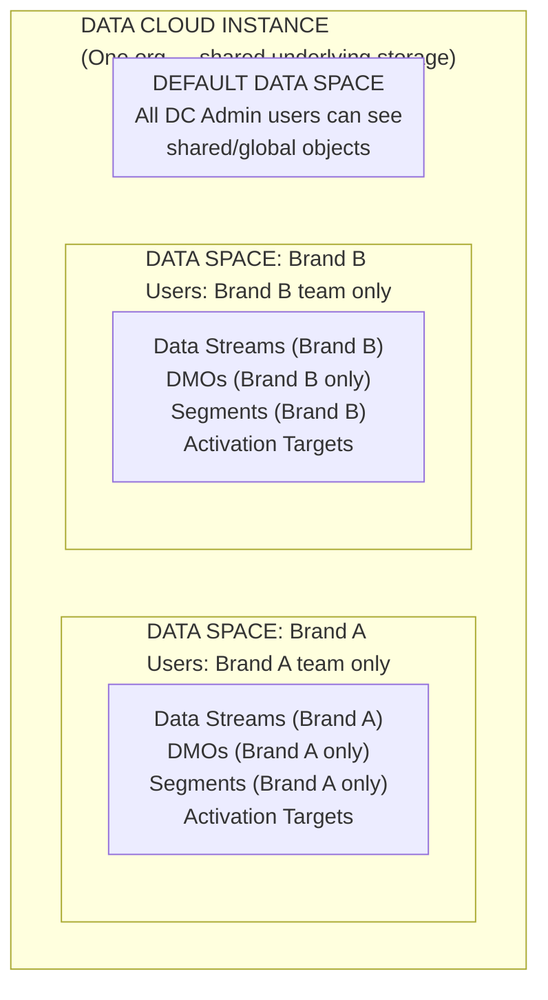
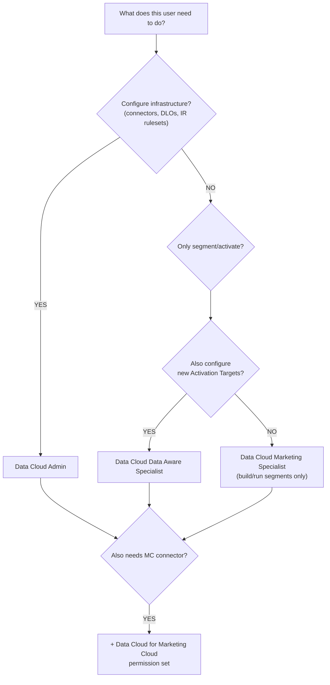

# Data Governance & Data Spaces

## Exam Domain
Data Governance & Compliance — 12% of exam weight

## Core Concepts

### Data Spaces: Logical Partitions, Not Physical
Data Spaces are the primary governance tool in Data Cloud. A Data Space is a logical partition — it's access control, not physical data separation. All Data Spaces share the same underlying Data Cloud storage. Data Spaces determine which objects, segments, and activations a given user or team can see and interact with. Think of it as "views with permissions" rather than "separate databases."

### Permission Sets
Data Cloud uses dedicated Permission Sets (not standard Salesforce profiles alone) for access control. The four key permission sets: **Data Cloud Admin** (full configuration access — create connectors, ATs, segments, IR rulesets); **Data Cloud Data Aware Specialist** (can work with data models and segmentation but not admin functions); **Data Cloud Marketing Specialist** (marketing-focused — segment and activation access without admin or data model access); **Data Cloud for Marketing Cloud** (used when configuring the MC Connector — specific to MC integration tasks).

### Least Privilege Principle
Grant users the minimum permission set required for their role. A campaign manager who builds and publishes segments doesn't need Data Cloud Admin. An analyst querying data doesn't need segment or activation access. Assigning Data Cloud Admin to all users is a governance failure and a frequent exam "what's wrong with this setup" scenario.

---

## PTA / SA Relevance

### When This Comes Up in Engagements
Data Spaces are critical for multi-brand, multi-region, or multi-business-unit enterprise deployments. A holding company with 5 brands, each with their own marketing team, needs Data Spaces so Brand A's marketing team can't see or activate Brand B's customer data. The governance conversation with a CDO or CISO will always include: "How do we ensure data isolation between our business units?"

### Common Partner Mistakes
- Treating Data Spaces as physically separate databases and over-promising isolation guarantees to legal teams — they are logical partitions with access controls; the underlying storage is shared
- Not planning for the Default Data Space — all objects in the default Data Space are visible to all Data Cloud Admin users; objects in custom Data Spaces are visible only to users with that Data Space permission
- Failing to include Data Space access in user story acceptance criteria — finding out at UAT that Brand A's segment builder can see Brand B's customers is a project-blocking issue
- Creating too many narrow Data Spaces — each Data Space adds administrative overhead; find the right granularity (one per business unit, not one per campaign)

### Enterprise Scale Considerations
In a large holding company deployment (5+ brands, 20+ marketing teams), govern Data Spaces as part of the CoE (Center of Excellence) operating model: define a Data Space architecture diagram in the solution design, create a RACI for who can create/modify objects in each Data Space, and establish a naming convention for Data Space names, segments, and activation targets that includes the brand/region identifier.

### Customer Advisory: Multi-Org vs. Multi-Space
Customers often ask whether they should use multiple Salesforce Orgs (each with their own Data Cloud) or one Org with Data Spaces for brand isolation. The rule of thumb: if brands share customers (the same person shops at multiple brands), use Data Spaces within one instance to enable cross-brand unification while still maintaining team-level access control. If brands have completely separate customer bases with no overlap and separate legal entities requiring true data isolation, separate Org/Data Cloud instances may be warranted.

---

## Architecture

### Data Spaces: Access Control Model

**Limitations:**
- Data Spaces are logical — underlying storage is physically shared; not a substitute for separate org-level isolation
- An object (Data Stream, DMO, segment) can only belong to ONE Data Space
- Objects in the Default Data Space are visible to ALL DC Admin users — use care when placing shared objects there
- Data Spaces do not encrypt data differently per space — encryption is at the org level

---

### Permission Set Reference

| Permission Set | Can Do | Cannot Do |
|---|---|---|
| **Data Cloud Admin** | Everything — connectors, data streams, DMOs, IR, segments, ATs, CI, admin UI | N/A — full access |
| **Data Cloud Data Aware Specialist** | Work with data models, field mapping, segmentation, view CI | Configure connectors, create Activation Targets |
| **Data Cloud Marketing Specialist** | Build and publish segments, configure activations (if AT already exists) | Modify data model, create IR rulesets, admin configuration |
| **Data Cloud for Marketing Cloud** | Configure Marketing Cloud Connector and related objects | General DC administration outside MC integration |

**Assign minimum required permission set.** Campaign manager → Marketing Specialist. Data engineer/admin → Data Cloud Admin. Analytics user → Data Aware Specialist.

**Limitations:**
- Permission Sets layer on top of standard Salesforce profile-based access — the profile must also grant access to the Data Cloud app and tabs
- System Administrator profile + no Data Cloud Permission Set = cannot use Data Cloud features
- Data Cloud Permission Sets do NOT automatically grant access to specific Data Spaces — Data Space membership is configured separately

---

### User Access Decision Tree

---

## Key Facts to Memorize

- Data Spaces are **logical** partitions — not physical database separation
- An object can only belong to **one** Data Space
- Four key permission sets: **Admin, Data Aware Specialist, Marketing Specialist, Data Cloud for Marketing Cloud**
- **Least privilege**: assign minimum required permission set
- Campaign managers → Marketing Specialist (NOT Admin)
- Data Spaces support multi-brand or multi-region access isolation within a single Data Cloud org
- Default Data Space objects are visible to **all** Data Cloud Admin users

---

## Exam Traps

- "Data Spaces physically separate customer data into different databases" — wrong; they are logical access partitions
- "A single Data Stream can belong to multiple Data Spaces" — wrong; one object belongs to one Data Space only
- "A System Administrator profile grants full Data Cloud access automatically" — wrong; Data Cloud Permission Sets must be assigned separately
- "The Data Cloud Marketing Specialist permission set allows creating new Activation Targets" — typically no (AT creation usually requires admin-level access)
- "Data Spaces encrypt data differently per space" — wrong; encryption is org-level, not per Data Space

---

## Practice Questions

**Q:** A holding company has three separate brands with distinct marketing teams who should not see each other's customer data. They want these three teams to work in the same Salesforce org. What Data Cloud feature supports this requirement?
**A:** Data Spaces. Each brand gets its own Data Space, and users are assigned to specific Data Spaces. A Brand A marketing user can only see and interact with objects (segments, data streams, DMOs) in the Brand A Data Space — they cannot see Brand B or Brand C objects.

**Q:** A campaign manager needs to build and publish segments and run activations but should not be able to create new Activation Targets or modify field mappings. Which permission set is most appropriate?
**A:** Data Cloud Marketing Specialist. This permission set provides access to segment building and activation of existing Activation Targets without exposing admin-level configuration like creating new ATs or modifying the data model.

**Q:** After setting up Data Spaces for two business units, an admin notices that objects in the Default Data Space are visible to both teams' administrators. Why?
**A:** The Default Data Space is visible to all Data Cloud Admin users across the org. Objects placed in the Default Data Space have no Data Space-based access restriction for admins. Objects that should be restricted to one business unit must be placed in that unit's specific Data Space, not in the Default Data Space.
