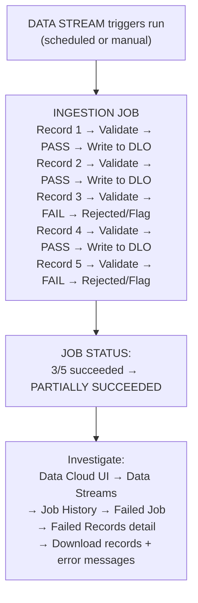
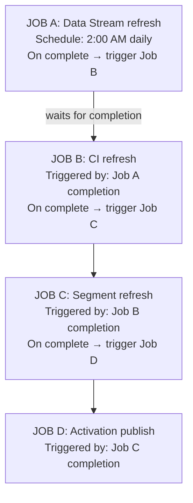

# Performance Monitoring & Troubleshooting

## Exam Domain
Administration & Monitoring — 10% of exam weight

## Core Concepts

### Ingestion Job Statuses
When a Data Stream runs, the resulting ingestion job has one of four statuses: **Success** (all records processed without errors), **Failed** (job failed entirely — no records processed), **Partially Succeeded** (some records processed, some failed — this is the trickiest status), **Running** (job in progress). "Partially Succeeded" is the most common troubleshooting scenario — it means some records were silently dropped, and you need to investigate which records and why.

### Data Quality Rules
Data Cloud provides three types of Data Quality Rules applied at ingestion time: **Flag** (records that violate the rule are tagged but still ingested — they go through), **Reject** (records violating the rule are dropped entirely — they never reach the DLO), **Transform** (violations are corrected on the fly — e.g., normalize phone format, default null field). Rules are configured per Data Stream and applied before the data lands in the DLO.

### Job Scheduler and Chaining
The Job Scheduler is the centralized place to schedule and chain all Data Cloud background jobs: Data Stream refreshes, CI refreshes, Segment refreshes, Activation publishes. Job chaining enforces execution order — you tell Job Scheduler "run CI only after this Data Stream completes." Without chaining, jobs run on independent timers and the dependency is not enforced.

---

## PTA / SA Relevance

### When This Comes Up in Engagements
Monitoring is the ongoing operational cost that customers consistently underestimate. In a go-live post-mortem, the most common complaint is: "we didn't know there was a problem until marketing found that activations were wrong." A healthy Data Cloud implementation needs a monitoring runbook: who checks Job Scheduler daily, what thresholds trigger escalation, and how ingestion failures are triaged.

### Common Partner Mistakes
- Treating "Partially Succeeded" as success — partially succeeded means some customers didn't get processed, which silently corrupts downstream segments and activations
- Not investigating failed records in the Data Stream detail view — the error messages are specific and actionable but consultants often move on without checking
- Setting up job scheduling without chaining, then wondering why CI data is sometimes stale
- Ignoring Data Quality Rule violations at go-live — launching with many "Flag" violations and no process to review them means data quality silently degrades

### Enterprise Scale Considerations
For a 50+ Data Stream implementation, manual monitoring of individual job statuses is unsustainable. Build monitoring automation: use Data Cloud's API to pull job status and alert on failures; set up Salesforce Flow or external alerting (PagerDuty, Slack) to notify the operations team when any job fails or partially succeeds; create a weekly data quality report from flagged records. Consider assigning a dedicated Data Cloud Operations owner as part of the CoE.

### Customer Advisory: Operational Readiness
Build a formal operational playbook before go-live covering: (1) daily monitoring checklist, (2) SLA targets for ingestion freshness, (3) escalation path when ingestion fails, (4) quarterly data quality review cadence, (5) change management process for adding new Data Streams or modifying IR rulesets. Customers who skip this see avoidable data quality incidents within 60 days of go-live.

---

## Architecture

### Ingestion Job Status Flow

**Limitations:**
- Partially Succeeded does not trigger an error notification by default — you must proactively monitor
- Failed record error messages are available in the UI and via API but not automatically sent anywhere
- Job history retention period: check current Salesforce limits documentation

---

### Data Quality Rules

| Rule Type | Behavior | Use When |
|---|---|---|
| **Flag** | Record passes through to DLO but is tagged as a quality issue | Identify problems without dropping records; monitor first |
| **Reject** | Record is dropped entirely — does NOT land in DLO; counts against job success % | Strict quality gate — invalid records should never be ingested (e.g., missing required PK) |
| **Transform** | Rule corrects the value on ingest — record lands in DLO cleaned | Known, fixable formatting issues (e.g., lowercase email, strip special chars from phone) |

**Example Transform rules:** Phone — remove non-numeric chars: "(555) 123-4567" → "5551234567". Email — auto-lowercase: "JOHN@CO.COM" → "john@co.com". State — expand abbreviation: "CA" → "California".

**Limitations:**
- Reject rules can cause significant data loss if incorrectly configured — test in a sandbox first
- Transform rules apply at ingestion time — they do not retroactively clean previously ingested data
- Data Quality Rules are configured per Data Stream — there is no org-wide rule that applies across all streams

---

### Job Scheduler and Dependency Chain

**Without chaining (bad):** 1:00 AM — CI refresh runs (DMO not yet updated). 2:00 AM — Data Stream runs → DMO updated. 3:00 AM — Segment refresh runs (stale CI data).

**Limitations:**
- Job chaining is configured manually in the Job Scheduler — no automatic dependency detection
- If Job A partially succeeds, Job B still runs on its schedule unless the chain is configured to halt on non-success
- No built-in alerting when a chained job fails — external monitoring is required for enterprise SLAs

---

## Key Facts to Memorize

- Four job statuses: **Success, Failed, Partially Succeeded, Running**
- **Partially Succeeded** = some records were dropped — investigate failed records, don't ignore this
- Three Data Quality Rule types: **Flag** (tag + pass), **Reject** (drop), **Transform** (clean + pass)
- Job Scheduler handles scheduling and chaining; correct order: **Data Stream → CI → Segment → Activation**
- Job chaining is **configured manually** — it does not auto-detect dependencies
- Failed records detail is available in: Data Cloud UI → Data Streams → [Stream] → Job History → [Job] → Failed Records
- Reject rules can cause data loss — **test in sandbox first**

---

## Exam Traps

- "Partially Succeeded means the job succeeded with minor warnings" — wrong; Partially Succeeded means records were dropped and needs investigation
- "Data Quality Rules are configured globally across all Data Streams" — wrong; they're configured per Data Stream
- "Job chaining automatically detects when a CI depends on a Data Stream" — wrong; chaining must be manually configured
- "Flag rules prevent records from entering the DLO" — wrong; Flag tags records but still allows them through; only Reject prevents ingestion
- "Failed records are automatically retried on the next scheduled run" — wrong; failed records from a past run don't automatically retry; fix the issue and re-run or wait for the next schedule

---

## Practice Questions

**Q:** A Data Stream job shows "Partially Succeeded" status. The downstream segment is showing lower member counts than expected. What should the consultant investigate first?
**A:** Navigate to Data Cloud UI → Data Streams → [the Data Stream] → Job History → click on the Partially Succeeded job → review the Failed Records section. The error messages there will indicate why records were rejected (missing primary key, data type mismatch, constraint violation). The failed records did not land in the DLO and are therefore not in the DMO or visible to IR/segments.

**Q:** Which Data Quality Rule type should be used when records with invalid phone formats should still be ingested but should be identified for later review?
**A:** Flag. The Flag rule allows the record to pass through to the DLO while tagging it as a quality violation. This is appropriate when you don't want to drop records (which Reject would do) but you want to identify them for remediation. Reject would drop the records entirely; Transform would auto-clean them.

**Q:** A consultant schedules a CI refresh job to run at 3 AM daily and a Data Stream refresh at 4 AM daily. After a week, users report that segments are always reflecting yesterday's data, not today's. What is the problem?
**A:** The CI refresh runs at 3 AM before the Data Stream completes at 4 AM. The CI computes against the prior day's DMO data because the Data Stream hasn't finished yet. The fix is to use the Job Scheduler to chain the jobs: Data Stream first, then CI, then Segment. The CI should only run after the Data Stream completes.
