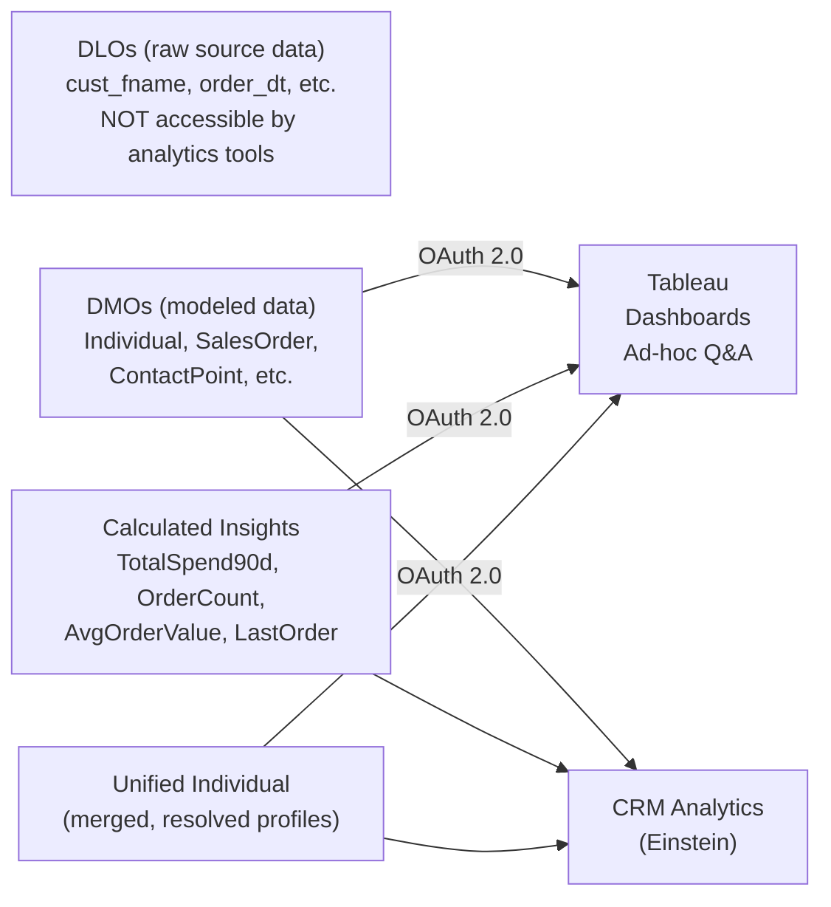

# Analytics: Tableau & CRM Analytics

## Exam Domain
Analytics & Insights — 8% of exam weight

## Core Concepts

### Data Cloud as an Analytics Data Source
Data Cloud can serve as a data source for analytics tools. Tableau connects to Data Cloud using OAuth 2.0 credentials — it accesses DMOs and Calculated Insights but NOT DLOs (raw staging data). This is intentional: DLOs store unmodeled source data that isn't ready for analytical consumption. DMOs and CIs represent clean, standardized, and enriched data ready for analysis.

### CRM Analytics Integration
CRM Analytics (Einstein Analytics / Salesforce Analytics) also connects to Data Cloud. The Unified Individual becomes the analytical grain — the "who" behind every metric. CIs serve double duty: they're both segment criteria inputs AND analytics measures. A "TotalRevenue90d" CI can power a segment filter ("customers with >$1000 spend") and simultaneously populate a CRM Analytics dashboard ("average customer revenue by region").

### What Analysts Can See
With analytics connectivity, an analyst can query: all DMOs (Individual, Sales Order, Email Engagement, etc.), all Calculated Insights, and Unified Individual profiles. They cannot query DLOs (raw source data), cannot modify segments or activations, and cannot trigger IR runs. The analytics role in Data Cloud is read-only access to the modeled, enriched data layer.

---

## PTA / SA Relevance

### When This Comes Up in Engagements
The analytics integration question typically comes from the VP of Analytics or BI team lead: "Can our Tableau team connect directly to Data Cloud and analyze unified customer profiles?" The answer is yes, with Tableau via OAuth 2.0, and the value proposition is that they're working with already-unified, identity-resolved data rather than duplicated source data.

### Common Partner Mistakes
- Promising DLO data access to analysts — Tableau cannot query DLOs, only DMOs and CIs. If analysts need raw source data, they need a separate data warehouse connection.
- Not planning Tableau credential management — each Tableau user or service account needs a Connected App with OAuth 2.0. Enterprise Tableau deployments typically use a service account credential, not individual user credentials.
- Failing to co-design CIs with the analytics team — if the BI team builds their own aggregate queries in Tableau against Sales Order DMO and the segmentation team builds CIs, they end up with inconsistent numbers. The right design is: one CI definition, used by both segmentation and analytics.

### Enterprise Scale Considerations
For enterprise analytics architectures, Data Cloud CIs can serve as the semantic layer — pre-defined business metrics (Customer Lifetime Value, NPS score, churn probability) computed once in CI and consumed by both Tableau dashboards and Segment Builder. This single source of truth pattern eliminates metric inconsistency between marketing and analytics teams.

### Customer Advisory: Single Source of Truth
The most compelling analytics story for a CDO: "Your BI team and marketing team will be working from the same customer metrics definition. There will no longer be a '12% discrepancy' between the marketing dashboard and the analytics dashboard because they query the same pre-computed CIs." This is a real pain point in nearly every enterprise and Data Cloud's CI layer solves it.

---

## Architecture

### Analytics Data Access Diagram



**Limitations:**
- Tableau cannot access DLO data — only DMO + CI layer
- OAuth 2.0 authentication is required — no username/password basic auth for Tableau connections
- CRM Analytics connector requires additional configuration and appropriate CRM Analytics license
- Large analytical queries against DMO data may compete with ingestion and segment refresh jobs for compute

---

### CI as Dual-Purpose: Segments + Analytics

**Calculated Insight: Customer_Revenue_90d** — SQL defined once, consumed by both teams:

```sql
SELECT IndividualId, SUM(Amount) AS TotalRev90d, COUNT(OrderId) AS OrderCount90d
FROM SalesOrder__dlm
WHERE OrderDate >= DATEADD(day, -90, CURRENT_DATE)
GROUP BY IndividualId
```

| Consumer | How It's Used |
|---|---|
| **Segment Builder** | `TotalRev90d >= $1,000` filters segment population |
| **Tableau / Analytics** | Chart TotalRev90d by region / loyalty tier |

**Result:** Marketing team and BI team always work from the same metric definition — no discrepancies.

**Limitations:**
- CI is pre-computed — Tableau sees the cached value at last CI refresh, not live transactional data
- For truly real-time analytics, direct Tableau query to a Snowflake/BigQuery DW may be needed instead
- CI schema changes (adding measures) require republishing — dependent Tableau workbooks may break

---

### Tableau OAuth 2.0 Connection Setup

**Prerequisites:**
1. Create Connected App in Salesforce Org
2. Enable OAuth scopes: `api` (perform requests), `full` (access and manage data), `cdp_query_api` (Data Cloud query scope — required)
3. Obtain Consumer Key + Consumer Secret
4. In Tableau Desktop: Data → Connect → Salesforce Data Cloud → Enter Consumer Key + Consumer Secret → Authorize via OAuth browser redirect

**What you can query:**
- DMOs (Individual, SalesOrder, ContactPointEmail, etc.)
- Calculated Insights (all published CIs)
- Unified Individual
- NOT DLOs (raw source data)
- NOT Draft or unpublished objects

---

## Key Facts to Memorize

- Tableau accesses Data Cloud via **OAuth 2.0** — requires Connected App with `cdp_query_api` scope
- Tableau can access **DMOs and CIs** — NOT DLOs
- **Unified Individual** is the analytics grain — the "who" for every metric
- CIs serve **dual purpose**: segment criteria AND analytics measures — one definition, consistent numbers
- CRM Analytics also connects to Data Cloud — same DMO + CI access rules apply
- Analytics access is **read-only** — analysts cannot modify segments, activations, or data models

---

## Exam Traps

- "Tableau can query DLO data for raw source analysis" — wrong; Tableau can only query DMOs and CIs
- "Each user needs individual OAuth credentials for Tableau" — enterprise deployments use a service account
- "If CRM Analytics and Segment Builder are using the same CI, they'll see different numbers" — wrong; CI is a single definition, so they always show the same computed values
- "Tableau users need Data Cloud Admin permission to run queries" — wrong; read access for analytics is available at lower permission levels

---

## Practice Questions

**Q:** An analytics team wants to use Tableau to analyze customer purchasing behavior using Data Cloud data. They want to see Sales Order records and the pre-computed average order values per customer. What can they access?
**A:** The analytics team can access the Sales Order DMO (record-level purchase data) and any Calculated Insights that contain the average order value metric (e.g., AvgOrderValue90d). They connect Tableau using OAuth 2.0 via a Connected App with the cdp_query_api scope. They cannot access the underlying DLOs.

**Q:** A marketing team uses a CI called "TotalSpend90d" for segment criteria. The BI team wants to use the same metric in their Tableau dashboard. What is the recommended approach?
**A:** Connect Tableau to Data Cloud using OAuth 2.0 and query the same TotalSpend90d Calculated Insight. Both teams will see the same pre-computed values because CIs are computed once and used by both Segment Builder and analytics tools. This is the recommended "single source of truth" pattern — no need to create a separate metric definition in Tableau.
