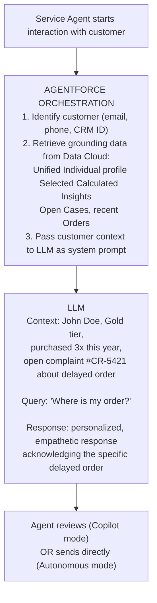
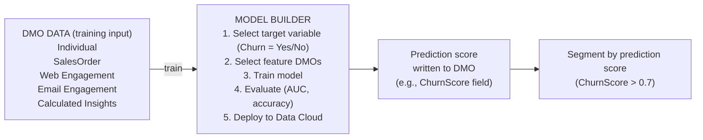

# AI & Personalization (Agentforce + Model Builder)

## Exam Domain
AI, Analytics & Insights — 8% of exam weight

## Core Concepts

### Grounding: Why Data Cloud + AI
AI language models hallucinate when they don't have factual context about a specific customer. "Grounding" is the process of giving the AI model factual, real-time (or near-real-time) customer data before it generates a response. Data Cloud provides this grounding by retrieving the customer's Unified Individual profile and relevant Calculated Insights, then passing that context to the LLM. Without grounding, Agentforce doesn't know if John Doe is a VIP or has an open complaint.

### Vector Database and Semantic Search
Data Cloud includes vector database capability for semantic search over unstructured content (product descriptions, knowledge articles, case notes). Unlike keyword search (must match exact words), semantic search understands meaning — searching for "water resistant jacket" finds articles about "waterproof outerwear" even though the words are different. Vectors are numeric embeddings of text meaning. This enables Agentforce to find relevant content to include in responses.

### Agentforce: Two Modes
Agentforce operates in two modes. **Copilot (assistant)** mode: human asks a question, Agentforce drafts a response with grounded customer context; human reviews and sends. **Autonomous agent** mode: Agentforce monitors conditions and takes actions independently (send a message, create a task, update a record) without human approval for each action. Autonomous agents require careful scope definition — a badly scoped autonomous agent can take unintended actions.

---

## PTA / SA Relevance

### When This Comes Up in Engagements
Every enterprise customer is now asking about AI. The Data Cloud + Agentforce story is: "Your AI is only as good as the data you give it. Data Cloud is what makes Agentforce intelligent about your specific customers." This is the primary justification for Data Cloud investment in 2024–2026 for customers who wouldn't historically care about a CDP.

### Common Partner Mistakes
- Describing Agentforce as "real-time" without caveat — grounding retrieves data from the most recent Data Cloud state, which is as fresh as the last ingestion/IR run (not truly real-time in sub-second terms)
- Not addressing consent for AI: processing customer data for AI grounding is a data processing activity that must be covered by the customer's privacy notice and appropriate consent (DoNotProcess = true should exclude a customer from AI grounding as well)
- Underestimating the data preparation work for grounding — the Unified Individual must be complete and recent; a poorly configured IR means Agentforce is working with fragmented customer profiles

### Enterprise Scale Considerations
For a large enterprise deploying Agentforce for 5,000 service agents handling 100,000 daily customer interactions, the grounding retrieval performance is critical. Each grounding call retrieves Unified Individual + relevant CIs — design the CI layer to include the 5–10 most relevant metrics per use case (purchase history, open cases, satisfaction score, etc.) rather than retrieving all possible data. Smaller, targeted grounding payloads = faster response times.

### Customer Advisory: Consent and AI
Advise customers to include AI data usage in their privacy notice and consent framework before deploying Agentforce. Customers who submitted GDPR erasure requests or set DoNotProcess = true must also be excluded from AI-grounded interactions. This is both a legal requirement and a trust issue — grounding an interaction with data from someone who asked to be forgotten is a significant compliance risk.

---

## Architecture

### Agentforce Grounding Flow

**Limitations:**
- Grounding is as fresh as the most recent Data Cloud ingestion + IR run — not true real-time sub-second
- Grounding retrieval has a token/payload limit — cannot pass the entire customer history
- Agentforce autonomous mode requires careful action scope definition to prevent unintended actions
- Consent: customers with DoNotProcess = true should be excluded from AI grounding workflows

---

### Vector Database: Semantic vs. Keyword Search

| | Keyword Search | Semantic Search (Vector DB) |
|---|---|---|
| **Query** | "waterproof jacket" | "waterproof jacket" |
| **Mechanism** | Matches exact words | Converts to vector embedding `[0.82, -0.31, 0.15, ...]`, finds all semantically similar content |
| **Finds** | Only documents containing "waterproof" AND "jacket" | "water resistant outerwear", "hydrophobic breathable coat", "rain gear for outdoor activities", "waterproof jacket" (exact match also works) |
| **Misses** | "water resistant outerwear", "hydrophobic coat", "rain gear" | Nothing semantically similar |

**Use cases in Data Cloud:** Agent searching knowledge base; finding similar product descriptions for recommendation; surfacing related case notes without exact keyword match; "What has this customer complained about before?" → semantic search over case text.

**Vector search = meaning-based, not keyword-based.**

**Limitations:**
- Vector database stores embeddings — the unstructured content must first be embedded (processed into vectors) before it can be searched
- Embedding generation has latency and compute cost — not every document should be embedded
- Vector search relevance is probabilistic — results are ranked by similarity, not boolean match

---

### Model Builder: Custom ML on DMO Data

Model predictions stored back in Data Cloud as DMO fields — segment on ChurnScore, PersonalizationScore, CLV, etc.

**Limitations:**
- Model Builder requires sufficient training data — sparse DMO data produces unreliable models
- Models are retrained on schedule, not in real time — prediction scores are as fresh as the last model run
- Model Builder is for supervised ML (classification, regression) — unsupervised clustering is not supported in the same way

---

## Key Facts to Memorize

- **Grounding** = passing customer's Unified Individual + CI data to the LLM as context before it responds
- Grounding improves AI response relevance by providing factual customer-specific context
- **Vector database** = semantic search over unstructured content; finds meaning, not just keywords
- Agentforce **Copilot** = human reviews before sending; **Autonomous** = acts without per-action human approval
- **Model Builder** trains ML models on DMO/CI data; predictions stored back in Data Cloud as fields
- DoNotProcess = true customers should be **excluded from AI grounding** workflows
- Grounding is as fresh as the last Data Cloud ingestion/IR cycle — not sub-second real time

---

## Exam Traps

- "Agentforce uses keyword search to find relevant knowledge articles" — wrong; uses semantic (vector) search
- "Grounding provides the LLM with the customer's complete transaction history in real time" — wrong; grounding retrieves a targeted summary (Unified Individual + selected CIs); it has payload limits and is as fresh as the last DC refresh cycle
- "Model Builder can run predictions in real time as new events occur" — wrong; model runs on schedule
- "Vector database stores the original text documents" — wrong; it stores vector embeddings of the text
- "An autonomous Agentforce agent requires human approval for every action" — wrong; that describes Copilot mode; autonomous agents act without per-action approval

---

## Practice Questions

**Q:** A service agent using Agentforce receives a customer inquiry. What does Data Cloud provide to make Agentforce's response relevant to that specific customer?
**A:** Data Cloud provides grounding — it retrieves the customer's Unified Individual profile (name, tier, history summary) and relevant Calculated Insights (total spend, recent orders, open cases) and passes this context to the LLM as part of the prompt. The LLM then generates a personalized response informed by the customer's actual data rather than a generic response.

**Q:** A customer searches a product knowledge base for "outdoor footwear for wet conditions" but all relevant articles are tagged with "waterproof boots" and "rain hiking shoes." What technology ensures the search returns relevant results?
**A:** Vector database with semantic search. Semantic search converts both the query and the knowledge article content into vector embeddings that represent meaning. It then finds articles that are semantically similar to "outdoor footwear for wet conditions" even if they don't contain those exact words.

**Q:** A company uses Model Builder to create a churn prediction model. After the model is deployed, how can the predictions be used in segmentation?
**A:** Model Builder writes prediction scores (e.g., ChurnProbability) back to Data Cloud as a field on the relevant DMO. That field is then available in Segment Builder as an attribute filter: "ChurnProbability >= 0.7 (high churn risk)" can be used as segment criteria to target at-risk customers for retention campaigns.
