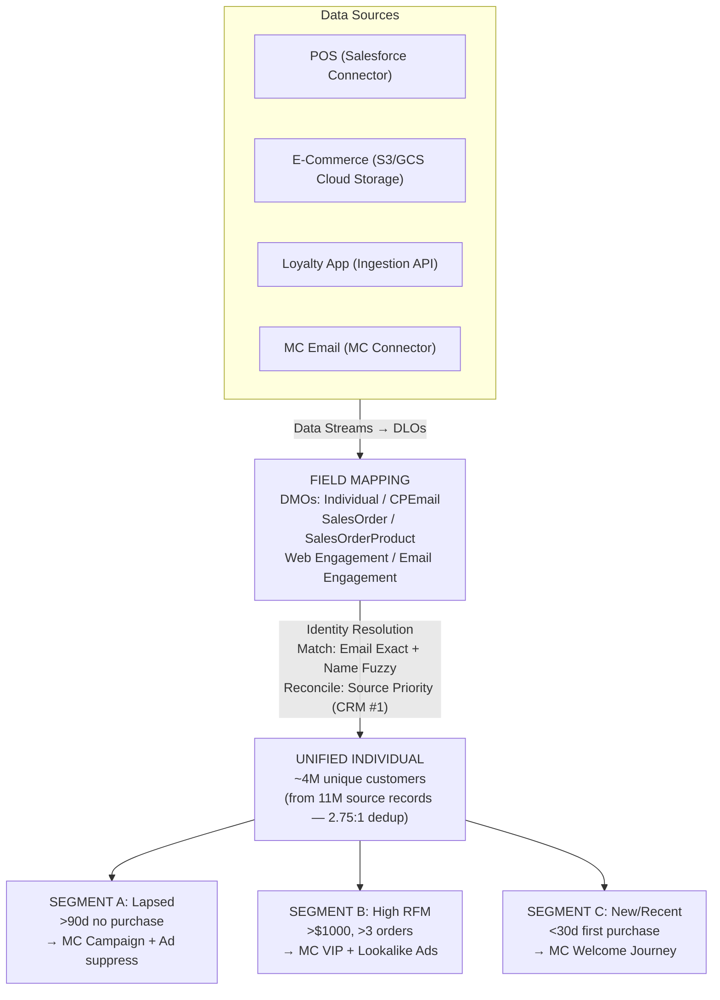
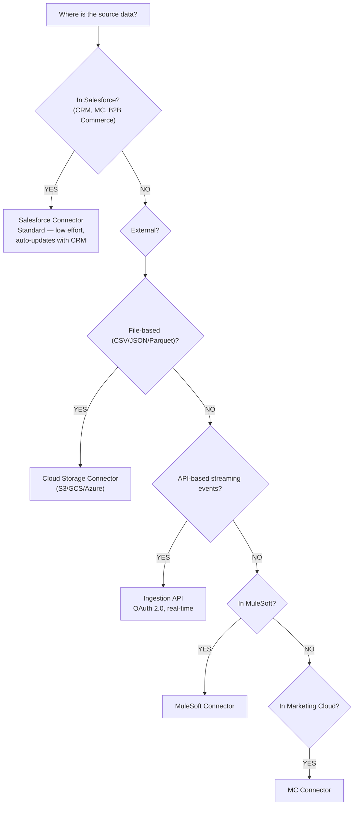
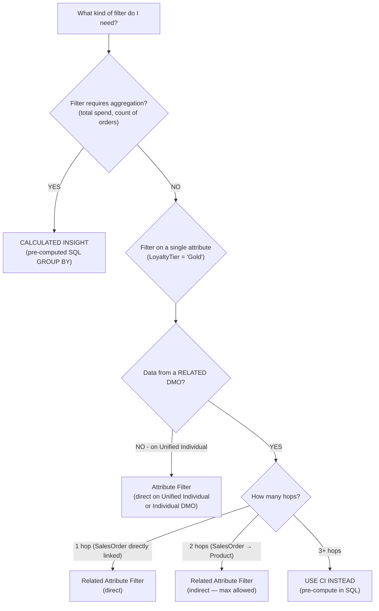

# Real-World Use Cases & Exam Scenarios

## Exam Domain
Covers all domains — scenario questions appear throughout the exam

## Core Concepts

### The 4-Step Exam Scenario Strategy
When the exam presents a business scenario question, apply this mental framework: (1) **Identify the goal** — is the question about ingestion, modeling, identity, segmentation, activation, or governance? (2) **Identify the constraint** — what makes this non-trivial (batch vs. streaming, consent, data type, hop count, permission)? (3) **Eliminate wrong answers** — cross out options that contain known-wrong statements (real-time IR, Tableau DLO access, Draft segment activation). (4) **Select the answer that matches Data Cloud architecture exactly**.

### Industry Patterns to Recognize
Exam scenarios tend to cluster around specific industries. **Retail:** multi-source ingestion (POS + e-commerce + loyalty), IR by email/loyalty ID, segmentation by purchase recency+frequency+value (RFM), activation to MC for email + advertising for acquisition. **Financial Services:** strict identity matching (Exact match only — no fuzzy due to false merge risk), consent for GDPR/CCPA compliance, no cross-account data sharing. **Healthcare:** HIPAA considerations, strict consent, patient profile unification only with appropriate governance. Recognizing the industry sets expectations for the correct configuration choices.

### The Six Most Common Exam Traps
Across all domains, six misunderstandings appear most frequently as wrong answers: (1) Draft segments can be activated; (2) IR is real-time; (3) Contact Points are reconciled (not additive); (4) Tableau can query DLOs; (5) CI GROUP BY is optional; (6) Email field on Individual DMO enables IR email matching. If you see any of these in an answer choice, cross it out.

---

## PTA / SA Relevance

### When This Comes Up in Engagements
For a PTA doing deal reviews or architecture assessments, real-world use case fluency is essential for qualifying and scoping deals. When a customer describes their scenario, you should immediately map it to: which Data Streams do they need, which DMOs, which IR configuration, which segment criteria type, which activation targets. The mental model is "Data Cloud isn't a product — it's an outcome architecture."

### Common Partner Mistakes in Use Case Design
- Scoping Data Cloud for a use case it can't do well (real-time personalization requiring sub-second latency — Data Cloud is not a real-time API)
- Under-scoping identity resolution in discovery — "we'll figure out IR later" leads to project failure because IR requires significant data quality work upfront
- Designing segments before validating that the required DMOs have data — common discovery failure
- Proposing Data Cloud when a simpler Salesforce CDP or Marketing Cloud-only solution would suffice

### Enterprise Architecture Patterns
**Multi-brand CDP:** One Data Cloud instance, multiple Data Spaces, shared unified Individual across brands (enables cross-sell), separate segment + activation per brand. **Customer Service Intelligence:** Data Cloud + Agentforce; all support interactions, purchase history, and complaint data unified in Unified Individual; grounding enables service agents to see complete customer context. **Marketing + Sales Alignment:** Data Cloud → MC for outbound email campaigns + Data Cloud → CRM Campaign Member for sales team follow-up on the same segment simultaneously.

---

## Architecture

### Retail Use Case — End-to-End

---

### Connector Decision Tree

---

### Segment Criteria Decision Tree

---

### Activation Target Decision Tree

| | Salesforce CRM | Marketing Cloud | Advertising Platform |
|---|---|---|---|
| **What it does** | Adds as Campaign Members | Creates/updates Data Extension + subscriber | Sends SHA-256 hashed email/phone for Custom Audience upload |
| **Use for** | CRM-based outreach, sales tasks, service | Email campaigns, journey trigger | Social ads, suppression, lookalike |
| **Critical requirement** | Segment must be Published | Subscriber Key mapping required | Raw PII never sent — SHA-256 only |

---

## Six Non-Negotiable Facts

These are the most commonly tested wrong-answer traps. Know these cold:

1. **Trap:** "Draft segments can be activated" — **Truth:** Segments must be PUBLISHED first
2. **Trap:** "Identity Resolution is real-time" — **Truth:** IR runs on schedule; Unified Individuals update after the next IR run, not instantly
3. **Trap:** "Contact Points are reconciled like attribute fields" — **Truth:** Contact Points are ADDITIVE — ALL emails/phones from ALL source records appear on Unified Individual
4. **Trap:** "Tableau can query DLO data" — **Truth:** Tableau only accesses DMOs and CIs — never DLOs
5. **Trap:** "GROUP BY is optional in CI SQL" — **Truth:** GROUP BY is REQUIRED in every CI query
6. **Trap:** "Map email to Individual DMO for IR email matching" — **Truth:** Map to Contact Point Email DMO — not Individual

---

## Industry-Specific Pattern Summary

| Industry | Key Patterns |
|---|---|
| **Retail** | Multi-source: POS + E-Commerce + Loyalty. IR: Email Exact + Name Fuzzy. Segments: RFM, churn, acquisition. Activation: MC email + Ads. |
| **Financial Services** | Strict identity: Exact only — no Fuzzy (false merge risk is catastrophic). Consent: GDPR + CCPA strict compliance. No third-party data sharing. |
| **Healthcare** | HIPAA considerations. Strict consent framework. DoNotProcess = critical. Patient data: purpose-based consent categories. |
| **B2B** | Account-based, not person-based. IR by Account ID (Exact only). Contacts link to Accounts. Custom DMOs for B2B entities. Lower IR complexity than B2C. |

---

## Key Facts to Memorize

- **4-step scenario strategy**: identify goal → identify constraint → eliminate wrong answers → match to architecture
- Learn to recognize the 6 most common exam traps — see them in an answer choice, cross them out
- Retail: Salesforce Connector + Cloud Storage + Ingestion API, Fuzzy name + Exact email IR
- Financial services: Exact match ONLY for IR (no fuzzy for regulated identities)
- Healthcare: purpose-based Consent Categories, strict DoNotProcess governance
- **Data Cloud is NOT a real-time API** — all operations have schedule-based latency

---

## Practice Questions

**Q:** A retail company ingests customer data from a POS system (via Salesforce CRM Connector), an e-commerce platform (via Cloud Storage S3), and a loyalty app (via Ingestion API). Customer records have different IDs in each system but many share the same email. What IR configuration best matches these customers across systems?
**A:** Use an Exact Match rule on email address (via Contact Point Email DMO). Email is a reliable, exact identifier that appears consistently across all three source systems. The Salesforce Connector, Cloud Storage S3, and Ingestion API Data Streams all map their email fields to the Contact Point Email DMO. IR then matches records that share the same email, creating Unified Individuals.

**Q:** A financial services company wants to configure Identity Resolution but is concerned about false merges (two different customers incorrectly identified as the same person). Which match rule type should they avoid?
**A:** Fuzzy match. Fuzzy matching uses similarity algorithms that match names like "Jonathan" and "John" — a financial services firm with multiple clients named "John Smith" could incorrectly merge their accounts. For financial services, use only Exact match (on full SSN or account number) or Normalized match (on standardized phone format). Never use fuzzy match for regulated identity verification.

**Q:** A campaign manager wants to target customers who haven't made a purchase in the last 90 days. She uses a Related Attribute Filter checking for no Sales Order in the last 90 days. When she publishes the segment, it shows 0 members despite knowing many customers haven't purchased recently. What is most likely wrong?
**A:** Related attribute filters check for the PRESENCE of matching records. "Has a SalesOrder in last 90 days" finds customers who have purchased — but she wants the opposite (no purchase). She needs to use an EXCLUSION filter: include all customers, then EXCLUDE those who have a SalesOrder in the last 90 days. Alternatively, a Calculated Insight with MAX(OrderDate) and filtering on LastOrderDate before 90 days ago would work correctly.
