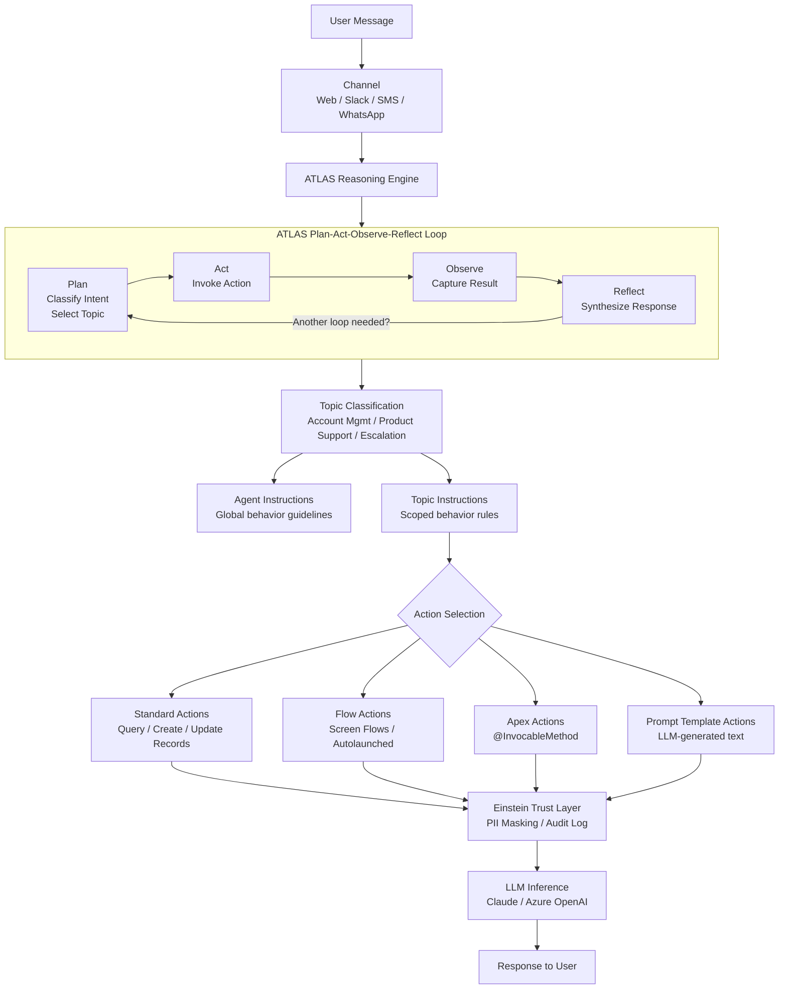

# Lab ADV-01 — Agent Anatomy and Concepts: Understanding Agentforce from First Principles

## Learning Objectives
- Understand what an AI Agent is and how it fundamentally differs from a chatbot, a Flow, and a human agent
- Explain the ATLAS reasoning engine and its plan-act-observe-reflect loop
- Identify the four core building blocks of every Agentforce agent: Topics, Actions, Instructions, and Channels
- Describe the pre-built agent types available in Agentforce and their intended use cases
- Trace the full lifecycle of a single user message from receipt through LLM inference to response
- Navigate the Agentforce section of Salesforce Setup and interpret the Agent Builder UI

---

## Concept Deep Dive: What Is an AI Agent?

### The Fundamental Question

Before you can build Agentforce agents, you need a clear mental model of what an "agent" actually is — because the word gets misused constantly. An agent is not a fancier chatbot. It is not a smarter Flow. It is something categorically different.

A **chatbot** is deterministic and scripted. You define every branch of the conversation tree. The bot follows decision paths you pre-programmed. If a user says something outside those paths, the bot fails or falls back to a human. Chatbots are essentially interactive menus dressed up with text.

A **Flow** is automation. It executes a predefined sequence of steps — create a record, send an email, update a field — triggered by an event. Flows don't "decide" anything; they process. A Flow has no understanding of context, nuance, or meaning.

A **human agent** exercises judgment. They read a situation, assess what's needed, choose from their repertoire of capabilities, take action, observe the result, and adjust. They escalate when something is beyond their scope. They handle novel situations they've never encountered before. This is the bar an AI agent is trying to approximate.

An **AI Agent** is a software system that perceives its environment (incoming messages, Salesforce records, conversation history), reasons about what to do (using a large language model as its reasoning engine), selects and executes actions (querying records, running flows, calling APIs), observes the results, and generates a response — all without following a fixed script.

The critical insight: an AI agent's behavior is emergent, not programmed. You don't write `if user_says("reset password") then do_X`. Instead, you write descriptions and instructions, and the LLM figures out what to do at runtime. This means Agentforce agents can handle questions they've never seen before, as long as their topics and instructions are well-defined.

### The ATLAS Reasoning Engine

ATLAS (Autonomous Trusted Language Agent System) is the reasoning framework that powers Agentforce. Understanding ATLAS explains why agents behave the way they do.

Every time a user sends a message, ATLAS runs through a four-stage loop:

**1. Plan** — The LLM analyzes the incoming message plus the entire conversation history. It classifies the user's intent, identifies which Topic is most relevant, and drafts a plan: which action (if any) needs to be invoked, what information is missing, what clarifying questions might be needed.

**2. Act** — If an action is needed (query a record, run a Flow, call Apex), ATLAS invokes it. This is function-calling: the LLM generates a structured JSON payload matching the action's input schema, and Salesforce executes the action server-side.

**3. Observe** — The result of the action is returned to the LLM as additional context. If the action returned Case records, the LLM can now "see" those records and use them in reasoning.

**4. Reflect** — The LLM synthesizes everything — the original message, conversation history, action results — and generates the final response. It also evaluates whether the task is complete or whether another loop is needed.

This loop can repeat multiple times within a single user turn. A complex request might trigger: Plan (need account data) → Act (query Account) → Observe (got account) → Plan (need case history too) → Act (query Cases) → Observe (got cases) → Reflect (now I can answer). The user sees only the final response; all the intermediate loops happen behind the scenes.

### The Four Building Blocks

Every Agentforce agent is constructed from exactly four types of components:

**Topics** — A Topic is a scoped domain of conversation. Think of it as a "skill" or "specialty." An Account Management topic knows how to handle billing and password questions. A Product Support topic knows how to handle bugs and feature requests. Topics contain instructions (what to do within this domain) and a list of available actions. The ATLAS engine classifies each user message to the most appropriate topic.

**Actions** — An Action is a capability the agent can invoke. Actions are how the agent reaches outside the conversation and interacts with Salesforce data, external systems, or business logic. Examples: Query Records, Create Case, Run a Flow, Call an Apex method, Generate text using a Prompt Template.

**Instructions** — Instructions are natural language directives that shape agent behavior. There are two levels: Agent-level instructions (apply globally — tone, persona, escalation rules) and Topic-level instructions (apply within that topic — what to check, how to behave, when to call which action). Instructions are the primary lever you have over agent behavior.

**Channels** — A Channel is where the agent is deployed. Messaging for Web (chat widget), In-App Messaging, SMS, WhatsApp, Experience Cloud, Slack, Email. The same agent can be deployed to multiple channels simultaneously.

### Agentforce vs Einstein Bots

Salesforce had Einstein Bots before Agentforce. Understanding the difference matters for the exam:

| Dimension | Einstein Bots | Agentforce |
|---|---|---|
| Conversation flow | Scripted decision trees | Emergent, LLM-driven |
| Handling novel input | Falls back / transfers | Attempts to handle |
| Action selection | Hard-coded per dialog step | LLM decides at runtime |
| Configuration unit | Dialog steps | Topics + Instructions |
| Customization language | Dialog components | Natural language instructions |
| Reasoning | None — it's a router | Full LLM reasoning loop |

Einstein Bots are still available. Agentforce is the next generation. Some customers run both — Bots for highly structured workflows, Agentforce for open-ended support.

### Pre-Built Agent Types

Salesforce ships several pre-built agent templates:

- **Service Agent** — Handles inbound customer support inquiries. Answers questions, looks up orders/cases, creates cases, routes to humans.
- **Sales Agent** — Assists sales reps. Summarizes accounts, preps for meetings, drafts follow-up emails.
- **SDR Agent** — Outbound sales development. Researches prospects, drafts outreach emails, qualifies leads.
- **Coaching Agent** — Supports managers. Analyzes rep performance, suggests coaching talking points.
- **Retail Execution Agent** — Field sales and retail. Helps reps complete store visits, log activities, check planogram compliance.

These templates are starting points — pre-configured with relevant topics and standard actions for their use case. You can deploy them as-is or customize extensively.

---

## Architecture Overview

---

## Prerequisites
- Salesforce org with Agentforce enabled (Einstein for Service, Agentforce add-on, or Developer Edition with Agentforce)
- System Administrator profile or equivalent permissions
- Einstein feature settings enabled (covered in Lab Setup below)

---

## Lab Setup

Before navigating to Agent Builder, verify that the foundational Einstein settings are active.

1. Go to **Setup** (gear icon, top right) → in the Quick Find box type **Einstein Setup** → click **Einstein Setup**
2. Toggle **Turn on Einstein** to enabled if it is off
3. In Quick Find, type **Agentforce** → confirm the Agentforce section appears in the left nav. If it does not, your org may not have the Agentforce license — contact your Salesforce AE or use a Developer Edition org with the Agentforce trial

---

## Step-by-Step Instructions

### Step 1 — Navigate to the Agentforce Agents List

**Path:** Setup → Quick Find: "Agents" → click **Agents** (under the Agentforce heading)

You will see the Agents list page. This is your central console for all Agentforce agents in the org. If this is a fresh org, the list may be empty or contain a single default Service Agent template.

Note the columns: Agent Name, Type, Status (Active/Inactive), and the date last modified. The Status toggle is critical — only Active agents can be deployed to channels and used by end users.

### Step 2 — Open the Pre-Built Service Agent Template

If a **Service Agent** exists in the list, click its name to open it. If not, you will create one in Lab ADV-02; for now, click **New** → select **Service Agent** → do not save, just observe the creation wizard, then cancel.

If a Service Agent template exists, open it and note that you land inside **Agent Builder** — the central IDE for configuring agents.

### Step 3 — Survey the Agent Builder UI Layout

The Agent Builder interface has five primary sections. Spend a minute identifying each:

**Left Panel — Topics List**: Shows all Topics configured for this agent. Each topic is listed with its name. Click a topic to expand it and see its Actions and Instructions.

**Center Panel — Conversation Preview**: A simulated chat window where you can test the agent in real time without deploying it. This is your primary testing tool throughout the labs.

**Right Panel — Configuration**: When you click a Topic, this panel shows the topic's Name, Description, and Classification instructions. When you click an Action, it shows the action's configuration.

**Top Bar**: Shows the agent's name, Status toggle (Inactive/Active), and a Save button. The status must be set to Active before the agent responds in any channel.

**Header Tabs**: You may see tabs for Overview, Topics, Actions — depending on org version. The Topics tab is where most configuration happens.

### Step 4 — Examine the Topics of the Service Agent Template

In the left panel, expand the Topics list. The pre-built Service Agent typically includes topics such as:
- Order Management
- Billing and Payments
- General Inquiries
- Escalate to Human Agent

Click **Order Management** (or whichever topic is first). In the right panel, read the following carefully:

**Topic Description** — This is the text the ATLAS engine uses to classify incoming messages to this topic. It should clearly describe what kinds of requests belong here.

**Instructions** — This is the natural language ruleset the LLM follows once a message is classified to this topic. Read the existing instructions to understand the pattern.

Take a screenshot or notes — you will write your own topic instructions in Lab ADV-03.

### Step 5 — Examine the Actions on a Topic

With the Order Management topic selected, look for the **Actions** section (either in the right panel or an expandable sub-section of the topic).

Click on any action listed (e.g., **Query Records** or **Get Order Details**). Note:
- **Action Name** — What the LLM calls this action
- **Action Description** — The text the LLM reads to decide WHEN to call this action. This is critical: a vague description leads to wrong action selection.
- **Input Parameters** — What data the agent needs to pass to the action
- **Output** — What the action returns to the LLM

This function-calling pattern is identical to how OpenAI functions or Anthropic tool use works: the LLM sees the action description and parameters, decides if it needs to call it, generates the input JSON, and Salesforce executes it.

### Step 6 — Examine the Agent-Level Instructions

In the Agent Builder, look for an **Overview** or **Agent Details** section — this may be accessible by clicking the agent's name in the breadcrumb or a top-level tab.

Here you will find:
- **Company Description** — Context about the company the agent represents. This is injected into every LLM call as system context.
- **Agent Instructions** — The global, always-present instructions for this agent. These override no topic-specific instruction but provide the foundation: persona, tone, escalation triggers, what the agent should never do.

Read these carefully. Notice they are written in natural language, like a job description or an HR policy document.

### Step 7 — Check Einstein Feature Settings

**Path:** Setup → Quick Find: **Einstein Features** → click **Einstein Features**

Verify the following are enabled:
- Einstein Generative AI
- Agentforce (may show as a toggle or as a licensed feature)
- Einstein Trust Layer

If any are disabled, toggle them on. Some settings require a few minutes to propagate.

### Step 8 — Verify Agentforce Permission Sets

For the exam, you need to know which permission sets grant access to Agentforce:

**Path:** Setup → Quick Find: **Permission Sets** → search for "Einstein"

You should see:
- **Einstein Agent User** — Grants end users the ability to interact with deployed agents
- **Einstein Agent Manager** — Grants admins/builders the ability to configure agents in Setup

Click **Einstein Agent Manager** → **App Permissions** → scroll to find the Agentforce-related permissions. Note: this permission set must be assigned to anyone who needs to build or edit agents.

### Step 9 — Understand the Message Lifecycle via the Debug Log

To see what actually happens under the hood when a user sends a message, use the Agent Builder's built-in test console:

In the Conversation Preview panel (center), type: `I need help resetting my password`

The agent should respond. Now, look for a **Debug** icon or **View Conversation Details** link in or near the preview panel (the exact label varies by org version). Click it.

In the debug output you should see:
1. **Incoming message** — raw user text
2. **Topic classification** — which topic was selected and the confidence score
3. **Action calls** — if any action was invoked, its input/output
4. **LLM response** — the final generated text

This is the ATLAS loop made visible. Study this output — it demystifies what the agent is doing on every turn.

### Step 10 — Explore the Channel Configuration Panel

**Path:** In Agent Builder, look for a **Channels** tab or go to Setup → Quick Find: **Messaging Settings**

Here you can see which channels the agent is deployed to. A freshly created agent has no channels configured. You will configure channels in Lab ADV-02 and Lab ADV-08.

Note the available channel types in your org:
- Messaging for In-App and Web (the standard web chat widget)
- Enhanced Messaging Channels (WhatsApp, SMS, Facebook Messenger)
- Experience Cloud Sites
- Slack
- Email

Each channel has its own deployment configuration and embed code.

---

## What You Built

In this lab you did not build anything — you explored. You navigated the Agentforce Setup area, examined the pre-built Service Agent template's Topics, Actions, and Agent Instructions, traced the ATLAS reasoning loop in the debug console, and verified foundational permissions and Einstein feature settings. This orientation is essential before building.

---

## Checkpoint Questions

1. What is the fundamental difference between an Agentforce agent and an Einstein Bot?
2. Name the four stages of the ATLAS reasoning loop in order.
3. What are the four building blocks of every Agentforce agent?
4. Why does the Action Description matter more than the Action Name when the LLM is deciding which action to call?
5. Which permission set must be assigned to end users who interact with a deployed Agentforce agent?

---

## Common Errors & Troubleshooting

**Issue:** The Agents menu item does not appear in Setup
**Fix:** Your org does not have the Agentforce license or feature enabled. Go to Setup → Einstein Setup and toggle Einstein on. For Trailhead Playgrounds or Developer Editions, ensure you have requested the Agentforce trial add-on. Some features require a paid Agentforce license.

**Issue:** Agent Builder opens but the Topics panel is empty
**Fix:** You may have opened a new, unsaved agent rather than the template. Check the breadcrumb — if the agent name shows "New Agent" it has not been configured. Navigate back to the Agents list and open a saved template.

**Issue:** The Conversation Preview panel shows "Agent is not active"
**Fix:** Toggle the agent's Status to **Active** in the top bar of Agent Builder and save. The preview panel requires an Active status to function.

**Issue:** Einstein Features toggle is greyed out
**Fix:** You may lack the system-level Einstein admin permission. Ensure your profile has "Customize Application" and "Manage Einstein" system permissions. Alternatively, check if your org's license tier includes generative AI features.

**Issue:** Debug details are not visible after a test conversation
**Fix:** Debug output visibility depends on org version. In some versions, look for a small info icon on the conversation turn. In others, enable debug mode via a developer settings panel or use the Event Monitoring feature to see the inference audit log.

---

## Exam Tips

- The exam often tests whether candidates know ATLAS is the name of the reasoning engine — know this term explicitly.
- "Plan → Act → Observe → Reflect" is the canonical loop description. Some questions phrase it as "Think → Act → Observe → Respond" — both are accepted framings in exam context, but ATLAS's official terminology is Plan/Act/Observe/Reflect.
- Questions about "what the LLM uses to decide which action to call" — the answer is always the Action Description, not the Action Name. This is function-calling: the LLM reads descriptions to make decisions.
- Know that Einstein Bots and Agentforce coexist. Some orgs use both. Bots handle structured workflows; Agentforce handles open-ended reasoning. A common distractor is "you must migrate Bots to Agentforce" — this is false.
- The "Company Description" field is injected into every LLM prompt as system context. It is not just metadata — it actively shapes every response. Exam questions may describe a scenario where responses seem off-topic and ask what to check: the answer is the Company Description and Agent Instructions.
- Pre-built agent types (Service Agent, SDR Agent, Coaching Agent, etc.) are templates, not fixed products. You can customize them completely. The exam may ask whether you can add custom topics to a pre-built template — the answer is yes.
