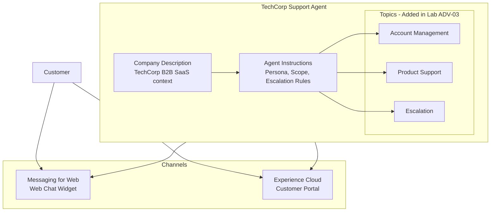

# Lab ADV-02 — Build Your First Service Agent

## Learning Objectives
- Create a new Agentforce Service Agent from scratch rather than cloning a template
- Understand what Agent Instructions are and why they function like a job description for the LLM
- Write effective Company Description and Agent Instructions that produce predictable, scoped behavior
- Configure the agent for both Messaging for Web and Experience Cloud channels
- Understand the difference between agent-level and topic-level instructions
- Preview and interact with a live agent in the Agent Builder test console

---

## Concept Deep Dive: What Is a Service Agent and How Do You Define Its Behavior?

### The Service Agent Mental Model

A Service Agent is an Agentforce agent type purpose-built for inbound customer support. Its job is to handle customer inquiries autonomously — answering questions, looking up account and case data, creating support cases, and knowing when to escalate to a human.

Think of a Service Agent as a new employee on your support team. On day one, that employee needs three things before they can do their job effectively:

1. **Context about the company** — What does TechCorp sell? Who are its customers? What's the general tone we use with customers?
2. **A job description** — What is this employee responsible for? What are they NOT supposed to handle? What should they do when something is outside their scope?
3. **Skills and tools** — What systems can they access? What actions can they take?

In Agentforce, these map directly to:
1. **Company Description** — Free-form text describing the organization, its products, its customer base
2. **Agent Instructions** — Natural language directives defining the agent's persona, scope, behavior rules, and escalation triggers
3. **Topics and Actions** — The specific domains and capabilities the agent can invoke

### New Agent vs Cloning a Template

When you click **New** in the Agents list, Salesforce gives you two paths:

**Start from a Template** — Use a pre-built agent type (Service Agent, SDR Agent, etc.) as a starting point. The template comes with pre-built Topics, pre-configured standard Actions, and sample Instructions. This is the faster path for standard use cases.

**Start from Scratch** — Begin with an empty agent and add everything manually. This gives you full control over every topic name, description, and instruction from the first line.

For this lab, you will use the Service Agent template type, which gives you the correct agent type classification and a minimal set of defaults to work from — but you will write all the Instructions yourself rather than accepting the defaults. This is the recommended approach for understanding what each field actually does.

### What Are Agent Instructions?

Agent Instructions are the most important configuration you will write. They are a block of natural language text — anywhere from 3 sentences to 30 bullet points — that defines how the LLM should behave at all times, regardless of which topic is active.

Agent Instructions are injected into every LLM system prompt, every turn. They are persistent context. Think of them as the employee handbook the agent reads before every conversation.

Good Agent Instructions define:

- **Identity** — "You are TechCorp's virtual support assistant."
- **Scope** — "You help with account management, billing questions, and product support. You do NOT provide legal advice, make pricing guarantees, or discuss competitor products."
- **Tone and persona** — "Be professional, concise, and empathetic. Acknowledge customer frustration before jumping to solutions."
- **Escalation triggers** — "If a customer expresses extreme frustration (uses words like 'lawsuit', 'fraud', 'cancel forever'), immediately offer to transfer to a senior support specialist."
- **Hard constraints** — "Never share another customer's account data. Never make commitments outside your authority. If unsure, say you will look into it rather than guessing."

### Why Agent Instructions Matter More Than You Think

The LLM has no built-in knowledge of your company, your policies, or your customers. Every time a conversation starts, it begins from a blank slate. Agent Instructions are how you encode your organization's knowledge and behavioral expectations into the LLM's runtime context.

A common mistake is writing vague instructions: "Be helpful and professional." This gives the LLM no actionable guidance and produces inconsistent behavior. Specific instructions produce consistent behavior. Compare:

**Weak:** "Escalate to a human when needed."

**Strong:** "Escalate to a human agent when: (1) the customer explicitly requests a human, (2) the customer mentions account compromise or fraud, (3) the customer is unable to resolve their issue after 3 interactions, or (4) the topic is outside your defined scope. When escalating, say: 'I'm connecting you with a specialist who can help. One moment please.'"

The second version leaves no ambiguity. The LLM follows it reliably because it is specific, enumerable, and includes the exact language to use.

### The Company Description Field

The Company Description is distinct from Agent Instructions. It is background context, not behavioral rules. It answers the question: "What company does this agent represent?"

This field is typically 2-5 sentences. It tells the LLM:
- What the company does
- Who its customers are
- Any product/service terminology the LLM should understand

Example: "TechCorp is a B2B SaaS company that sells Sales Cloud and Service Cloud implementation services to mid-market and enterprise customers. Our customers are Salesforce administrators, sales operations managers, and IT directors. We offer managed services, professional services, and a 24/7 support portal."

This context is crucial. Without it, if a customer asks "What does TechCorp sell?", the LLM would have no idea and might either hallucinate an answer or say it doesn't know.

---

## Architecture Overview



---

## Prerequisites
- Completed Lab ADV-01 orientation
- System Administrator access or Einstein Agent Manager permission set
- Agentforce license active in the org
- (Optional) An Experience Cloud site already created if you want to test that channel

---

## Lab Setup

No data setup is required before this lab. You will configure everything in the UI. If you want to use the Messaging channel fully, ensure Messaging for In-App and Web is enabled:

**Path:** Setup → Quick Find: **Messaging Settings** → confirm "Messaging for In-App and Web" shows as enabled. If not, enable it before proceeding to the channel configuration steps.

---

## Step-by-Step Instructions

### Step 1 — Navigate to the Agents List

**Path:** Setup → Quick Find: **Agents** → click **Agents** under Agentforce

You should see the Agents list. If any agents exist from previous labs or default setup, they will appear here. You are creating a new one.

### Step 2 — Click New Agent

Click the **New Agent** button (top right of the Agents list page).

A wizard or modal appears. You will be prompted to select an agent type. Select **Service Agent**.

Note: The agent type determines the template defaults and the license type consumed. Service Agent uses the Agentforce for Service license. If you see a different list of types based on your org's licenses, that is expected.

### Step 3 — Name the Agent

In the agent creation wizard:

- **Agent Label:** `TechCorp Support Agent`
- **Agent API Name:** Auto-populates as `TechCorp_Support_Agent` — leave as is

Click **Next** or **Create** (depending on your org version the wizard may be one-page or multi-step).

The agent is created and you are dropped into **Agent Builder**.

### Step 4 — Enter the Company Description

In Agent Builder, look for the **Overview** tab or an **Agent Details** section in the left panel. Click it.

Find the **Company Description** field. Click to edit it. Enter the following:

```
TechCorp is a B2B SaaS company selling Sales Cloud and Service Cloud 
implementation services to mid-market and enterprise customers across 
North America. Our products include managed services packages, 
professional services engagements, and 24/7 technical support. 
Our customers are Salesforce administrators, sales operations leaders, 
and CRM administrators who depend on TechCorp's implementations to run 
their business-critical processes.
```

This gives the LLM essential context about who TechCorp is and who its customers are.

### Step 5 — Write the Agent Instructions

Still in the Overview/Details section, find the **Agent Instructions** field. This is the most important field you will fill in during this lab.

Clear any default text and enter the following:

```
You are TechCorp's virtual support assistant, designed to help customers 
with account management, billing questions, product support, and technical 
troubleshooting.

Scope and Boundaries:
- You CAN help with: account information lookups, password resets, billing 
  inquiries, case creation, product how-to questions, known issue status updates.
- You CANNOT: modify pricing, grant refunds over $500, access data from 
  other customer accounts, make legal commitments, or discuss competitor products.
- If asked about something outside your scope, say: "That's outside what I'm 
  able to help with directly. I can connect you with the right team."

Tone and Persona:
- Be professional, warm, and concise. Aim for responses under 150 words unless 
  a detailed explanation is genuinely necessary.
- Acknowledge frustration before offering solutions. If a customer expresses 
  frustration, begin your response with empathy before diving into the fix.
- Never be dismissive. Every question is valid.

Escalation Rules:
- Escalate to a human agent immediately if: the customer mentions account 
  compromise, fraud, data breach, or legal action.
- Escalate if the customer explicitly asks for a human agent.
- Escalate if the same issue has not been resolved after 3 conversation turns.
- When escalating, use this language: "I'm connecting you with a TechCorp 
  specialist who can give this the attention it deserves. One moment please."

Data Handling:
- Always confirm the customer's identity (email or account ID) before 
  sharing any account-specific information.
- Never display another customer's data. If data looks wrong, offer to 
  re-verify identity.
```

Click **Save**.

### Step 6 — Review What You Just Configured

Before moving forward, read your instructions back as if you are the LLM seeing them for the first time. Ask yourself:
- Are the scope boundaries clear? Can you tell what IN scope means vs what is NOT?
- Are the escalation triggers specific enough that the LLM won't second-guess them?
- Is the tone directive specific? "Professional and warm" gives more guidance than just "professional."

This self-review practice is how professional Agentforce builders improve instruction quality.

### Step 7 — Test the Agent in the Preview Panel

The center panel of Agent Builder contains a **Conversation Preview** window. If the agent is currently Inactive, toggle the **Status** switch at the top to **Active** and click **Save**.

In the preview window, type the following messages one at a time and observe the responses:

**Test 1:** `Hi, I need help with my account.`
Expected: The agent greets you and asks for identifying information (email or account ID) per the instructions you wrote.

**Test 2:** `What is TechCorp's refund policy?`
Expected: The agent should say it cannot make commitments about refunds over $500 and offer to connect with the right team — because you explicitly scoped this out.

**Test 3:** `I'm really frustrated, this is the third time I've had this issue.`
Expected: The agent should acknowledge frustration before offering a solution. Check whether it follows the empathy instruction.

Note the responses. They may not be perfect — instruction tuning is iterative. You will refine instructions in later labs.

### Step 8 — Configure the Messaging for Web Channel

**Path:** In Agent Builder, look for a **Channels** tab or button. Alternatively: Setup → Quick Find: **Messaging Settings** → **Messaging for In-App and Web**

In Messaging Settings:
1. Click **New** to create a new messaging configuration (or select an existing one if present)
2. Set the **Messaging Channel Name:** `TechCorp Support Chat`
3. Under **Agent**, select your **TechCorp Support Agent** from the dropdown
4. Toggle **Active** to enabled
5. Click **Save**

After saving, the channel configuration page shows an **Embed Code** section. This JavaScript snippet is what you would paste into your website's HTML to display the chat widget. Do not deploy it yet — you will do that in Lab ADV-08.

### Step 9 — Understand the Experience Cloud Channel Option

**Path:** Setup → Quick Find: **Digital Experiences** → **All Sites** (or Experiences → Builder for an existing site)

If you have an Experience Cloud site, you can deploy the agent there:
1. Open Experience Builder for your site
2. Navigate to the **Chat** component settings
3. Under **Agentforce**, select your TechCorp Support Agent
4. Publish the site

For the purposes of this lab, understanding the path is sufficient. Full Experience Cloud deployment is covered in Lab ADV-08.

### Step 10 — Verify the Agent Configuration Summary

Back in Agent Builder Overview, confirm:
- Agent Name: TechCorp Support Agent
- Status: Active
- Company Description: filled in (not empty)
- Agent Instructions: filled in with your scoped instructions
- Topics: currently empty (you will add Topics in Lab ADV-03)
- Channel: Messaging for Web channel associated

Take a screenshot of the Overview panel for your notes. This is the baseline state you will build on across the remaining labs.

### Step 11 — Understand What the Agent Cannot Do Yet

With no Topics configured, send this message in the preview panel:

`I need to reset my password.`

The agent will attempt to help, but without a specific Topic instructing it how to look up accounts or trigger a password reset Flow, it will give a generic response. This illustrates the critical role Topics play — they are not just organization; they are the mechanism through which actions become available to the agent.

You will fix this in Lab ADV-03.

---

## What You Built

You created the TechCorp Support Agent from scratch — a Service Agent with a specific Company Description, detailed Agent Instructions covering scope, persona, escalation triggers, and data handling rules. You configured it for the Messaging for Web channel. The agent can hold conversations and responds according to your instructions, but has no Topics or Actions yet. Labs ADV-03 through ADV-07 will add those layers.

---

## Checkpoint Questions

1. What is the difference between Company Description and Agent Instructions?
2. Why is it important to write specific escalation triggers rather than general ones?
3. What happens when you try to deploy an agent that has no Topics configured?
4. Which permission set must an admin have to create and edit agents in Setup?
5. Can a single Agentforce agent be deployed to multiple channels simultaneously?

---

## Common Errors & Troubleshooting

**Issue:** Agent Status toggle is greyed out and cannot be activated
**Fix:** Check that the Company Description and at least a minimal Agent Instructions entry are filled in. Some org versions require at least one Topic before activation. Also verify you have the Einstein Agent Manager permission set.

**Issue:** Preview panel shows no response to messages
**Fix:** Ensure Status is set to Active and saved. If Active but still no response, check the org's Einstein feature settings — if Agentforce generative AI was recently enabled, allow 15-30 minutes for propagation.

**Issue:** Messaging Settings page shows no option to assign an Agentforce agent
**Fix:** Your org may be running the legacy Messaging configuration. Ensure you are using "Messaging for In-App and Web" (the Enhanced Messaging product), not the legacy Messaging product. They have different Setup paths.

**Issue:** The agent ignores the scope boundaries and tries to answer out-of-scope questions
**Fix:** Your scope instructions may be too vague. Rewrite them with explicit enumerated lists of what IS and IS NOT allowed. The LLM responds better to lists than to prose for constraint-setting.

**Issue:** Agent Instructions changes don't seem to take effect in the preview
**Fix:** Always click **Save** after editing Instructions. The preview panel does not auto-refresh. After saving, clear the preview conversation history (there should be a Reset Conversation button) and start a fresh test.

---

## Exam Tips

- The exam distinguishes between Company Description (context) and Agent Instructions (behavioral rules). Know which field is which and what each is used for.
- Agent Instructions are injected into every LLM prompt, every turn. Topic Instructions are only injected when that topic is active. This layered injection is a common exam scenario.
- "What should you configure to prevent an agent from discussing competitor products?" — The answer is Agent Instructions, not Topic Instructions, because this is a global constraint that should apply regardless of which topic is active.
- Know that an agent with no Topics will still respond using its Agent Instructions and the LLM's general capabilities — it just won't be able to invoke Actions, because Actions are attached to Topics.
- Channel configuration lives in Messaging Settings (for chat channels), not inside Agent Builder. Agent Builder lets you associate channels, but the channel deployment itself is managed in its own Setup area.
- A Service Agent with no actions configured will never query Salesforce data — it only uses the LLM and whatever information the customer provides in the chat. Actions are the bridge to CRM data.
