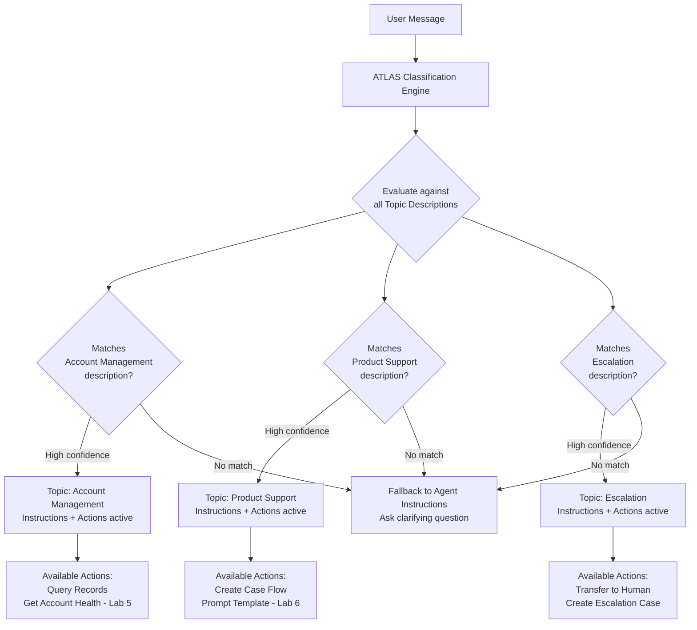

# Lab ADV-03 — Topics and AI Classification

## Learning Objectives
- Understand what a Topic is and how it functions as a scoped conversation domain
- Explain how the ATLAS engine classifies user intent and selects the correct Topic
- Write Topic descriptions and instructions that produce accurate, consistent classification
- Understand the difference between Topic-level instructions and Agent-level instructions
- Create three Topics on the TechCorp Support Agent and observe classification in the preview panel
- Learn how the "scope" mechanism prevents the agent from acting outside defined topics

---

## Concept Deep Dive: Topics and How the ATLAS Engine Classifies Intent

### What Is a Topic?

If the Agent Instructions are the job description for the whole agent, a Topic is the specific competency area within that job. A Topic is a scoped domain of conversation — a named boundary that says: "These kinds of requests belong here, and when here, these instructions apply and these actions are available."

Think of Topics like departments in a company. When you call a bank, you might be routed to "Account Services," "Loan Origination," or "Fraud Department." Each department has specialized knowledge, different authority levels, and different tools. Topics work the same way.

Every Agentforce agent can have multiple Topics. Each Topic has:
- **A name** — A short label (e.g., "Account Management")
- **A description** — The classification prompt: describes what kinds of conversations belong to this topic
- **Instructions** — What the LLM should DO within this topic: what to check first, how to respond, which action to call in which situation
- **Actions** — The specific capabilities available only within this topic

### How Classification Works: The ATLAS Intent Routing Engine

When a user sends a message, ATLAS does not randomly pick a topic. It runs a classification process using the LLM:

1. **The incoming message** plus the conversation history is assembled
2. **All Topic descriptions** from the agent's configuration are compiled into the context
3. The LLM evaluates the message against each Topic description and selects the best match — the topic whose description most accurately describes the user's intent
4. If no topic is a confident match, the agent either uses the default/general behavior from Agent Instructions or asks a clarifying question

This means: **your Topic descriptions are classification prompts.** The LLM reads them to decide routing. Vague descriptions lead to misrouting. Specific, clear descriptions lead to accurate routing.

### Writing Good Topic Descriptions

A Topic description is NOT a marketing blurb. It is a routing signal. It should answer the question: "What kinds of user messages belong in this topic?"

Principles:
- **Be concrete, not abstract.** Instead of "Handles account questions," write "Handles requests about account information, password resets, billing statements, and updating contact details."
- **Use the language customers actually use.** If customers say "I can't log in" more than "I need password assistance," include that phrasing.
- **Enumerate the types of requests.** Bullet-like descriptions in prose form help the LLM match multiple variants.
- **Avoid overlap between topics.** If two topics could both claim ownership of a message type, the LLM will make inconsistent routing decisions.

Example of a weak description: "This topic handles customer account issues."

Example of a strong description: "This topic handles requests where customers need to access, update, or verify their TechCorp account. Includes: viewing account details, resetting passwords, updating billing information, changing contact email, understanding invoice charges, and confirming subscription status."

### Writing Good Topic Instructions

Once a message is routed to a topic, the Topic Instructions are activated. These are behavioral rules specific to this domain. They tell the LLM:
- What to do first (e.g., "Always verify account ownership before sharing any data")
- How to use the available actions (e.g., "Call the Query Records action to retrieve the customer's recent cases before answering questions about case history")
- How to handle edge cases specific to this domain
- When to escalate (topic-specific triggers, in addition to global escalation triggers in Agent Instructions)

Topic Instructions are additive with Agent Instructions — both are in context simultaneously. Agent Instructions set the global baseline; Topic Instructions add the domain-specific layer on top.

### The Scope Mechanism: Why It Matters

"Scope" in Agentforce is the mechanism by which the agent is constrained to its defined Topics. When a user asks about something that does not match any Topic description, the agent should:
- State it cannot help with that specific request
- Offer to connect with a human or redirect
- NOT attempt to answer using general LLM knowledge outside the defined scope

Without clear scope, agents can "hallucinate scope" — confidently answer questions about domains they were never configured for, potentially giving wrong or unauthorized information. Scope discipline is a security and quality concern.

The clearer your Topic descriptions and Agent Instructions' "cannot do" list, the tighter your agent's scope.

### How Multiple Topics Interact

When an agent has multiple Topics, the classification runs across all of them simultaneously. The LLM reads all topic descriptions and picks the best match.

Common patterns:
- **Conversation pivots** — A customer starts in Account Management asking about billing but then pivots to a product question. ATLAS re-classifies on each turn, so the next message will route to Product Support and the Product Support instructions and actions become active.
- **Ambiguous messages** — "I have an issue" could match multiple topics. Good descriptions and a clear escalation topic help. The agent should ask a clarifying question rather than guess.
- **The Escalation Topic** — A best practice is to have an explicit Escalation topic that catches frustrated customers, complex issues, and explicit human requests. Without it, escalation behavior is handled only by Agent Instructions, which is less reliable.

---

## Architecture Overview



---

## Prerequisites
- Completed Lab ADV-02: TechCorp Support Agent exists with Company Description and Agent Instructions filled in
- Agent is in Active status

---

## Lab Setup

No additional setup data is required. You will create Topics entirely through the Agent Builder UI. Have the Agent Instructions you wrote in Lab ADV-02 open in another tab for reference — you will write Topic Instructions that complement them.

---

## Step-by-Step Instructions

### Step 1 — Open the TechCorp Support Agent in Agent Builder

**Path:** Setup → Quick Find: **Agents** → click **TechCorp Support Agent**

You land in Agent Builder. Confirm the agent status shows Active.

### Step 2 — Navigate to the Topics Panel

In the left panel of Agent Builder, look for a **Topics** tab or a **+ New Topic** button. Click it to open the Topics management area.

You should see an empty list (no topics yet) or a prompt to add your first topic.

### Step 3 — Create Topic 1: Account Management

Click **New Topic** (or **+ Add Topic**).

A form appears. Fill in the following:

**Topic Label:** `Account Management`

**Topic API Name:** Auto-populates as `Account_Management` — leave as is.

**Topic Description** (this is the classification prompt — write it carefully):
```
This topic handles all requests related to the customer's TechCorp account. 
Use this topic when a customer asks about: viewing their account information, 
resetting or recovering their password, updating billing details or payment 
methods, understanding their invoice or subscription charges, changing their 
contact email address, verifying their subscription status or tier, or asking 
general questions about what is included in their account. Also use this topic 
when a customer cannot log in or is having authentication issues.
```

**Topic Instructions** (what the LLM does once this topic is active):
```
When this topic is active:
1. Always verify account ownership before sharing any account-specific data. 
   Ask for the customer's email address or account ID at the start of the 
   conversation if they have not already provided it.
2. Use the Query Records action to look up the customer's Account record by 
   email before answering questions about account details, billing, or cases.
3. For password resets: inform the customer to use the "Forgot Password" link 
   on the TechCorp portal login page. Do not attempt to reset passwords directly.
4. For billing questions: retrieve the Account record and describe the 
   subscription type and billing cycle. If the customer disputes a charge, 
   log a case and escalate to the billing team.
5. If account data cannot be found for the provided email, say: "I was unable 
   to locate an account with that email. Could you double-check the address or 
   provide your account ID?"
6. Never share account data from a different customer's record.
```

Click **Save**.

### Step 4 — Create Topic 2: Product Support

Click **New Topic** again.

**Topic Label:** `Product Support`

**Topic Description:**
```
This topic handles all requests related to TechCorp's products, including 
Sales Cloud and Service Cloud implementations. Use this topic when a customer 
asks about: how to use a specific feature, reporting a bug or unexpected 
behavior, requesting a workaround for a known issue, asking about recent 
product updates or release notes, troubleshooting an integration, or asking 
for best practice guidance on using their TechCorp implementation. Also use 
this topic when a customer says something is "not working" without specifying 
whether it is an account issue or a product issue.
```

**Topic Instructions:**
```
When this topic is active:
1. Ask clarifying questions to understand the scope of the issue: Which product 
   (Sales Cloud or Service Cloud)? Which specific feature or area? What is the 
   customer seeing vs. what they expect to see?
2. If the issue sounds like a product bug, offer to create a support case. 
   Use the Create Support Case Flow action to log the case with the details 
   provided in the conversation.
3. For known issues, check if the issue matches a documented known issue or 
   recent release change. If you cannot confirm, be transparent: "I don't have 
   specific release notes in front of me, but let me log this so our product 
   team can investigate."
4. For how-to questions, provide step-by-step guidance. Keep steps numbered 
   and concise. Offer to create a case if the customer cannot achieve the 
   expected outcome following the guidance.
5. If the issue is beyond what you can resolve in chat (requires backend 
   investigation, environment-specific debugging, or a Salesforce org health 
   check), escalate to the technical support team.
```

Click **Save**.

### Step 5 — Create Topic 3: Escalation

Click **New Topic** again.

**Topic Label:** `Escalation`

**Topic Description:**
```
This topic handles situations where the customer needs to be connected with a 
human TechCorp specialist. Use this topic when: the customer explicitly asks 
to speak with a person or human agent, the customer expresses extreme 
frustration or uses language indicating they have been trying to resolve an 
issue for a long time, the customer mentions legal action, data loss, account 
compromise, fraud, or a business-critical system outage, the issue is beyond 
the scope of the Account Management and Product Support topics, or the 
conversation has been circling without resolution for more than three turns.
```

**Topic Instructions:**
```
When this topic is active:
1. Acknowledge the customer's situation empathetically before taking action. 
   Do not immediately transfer without acknowledgment.
2. Use this acknowledgment language: "I completely understand this is 
   frustrating, and I want to make sure you get the right help."
3. Inform the customer you are escalating: "I'm connecting you with a TechCorp 
   specialist now. They'll have full visibility into our conversation."
4. If a Transfer to Human action is available, invoke it immediately after 
   the acknowledgment.
5. If Transfer to Human is not available (e.g., outside business hours), say: 
   "Our specialists are currently unavailable, but I'll create a priority case 
   for you right now and ensure someone follows up within 2 business hours." 
   Then create a high-priority case with a note marking it as an escalation.
6. Log all relevant context in the case notes so the human specialist does not 
   need to ask the customer to repeat information.
```

Click **Save**.

### Step 6 — Verify All Three Topics Appear in the Topics List

In the left panel, you should now see three topics listed:
- Account Management
- Product Support
- Escalation

Click each one to confirm the descriptions and instructions saved correctly. If any text is truncated or missing, edit and re-save.

### Step 7 — Test Topic Classification: Account Management Routing

In the Conversation Preview panel (center), click **Reset Conversation** if any prior test messages exist.

Type: `I need to see my current billing information.`

Observe the response. After the response, look for a **Topic indicator** showing which topic was activated (some org versions show this in the debug panel). The Account Management topic should have been selected.

Check: Did the agent ask for the customer's email or account ID before proceeding? If so, your Topic Instructions are working.

### Step 8 — Test Topic Classification: Product Support Routing

In the same preview panel, click **Reset Conversation** (start fresh — each conversation starts with a blank classification history).

Type: `The reporting dashboard in my Sales Cloud implementation isn't loading. It was fine yesterday.`

Observe: the agent should activate the Product Support topic and begin asking clarifying questions about which feature, what they're seeing, etc.

### Step 9 — Test Topic Classification: Escalation Routing

Reset the conversation. Type:

`I have been calling for two weeks about this same problem and nobody is helping me. I am considering cancelling our entire contract.`

Observe: the agent should route to the Escalation topic, acknowledge the frustration, and offer to connect with a human specialist. It should NOT jump into a technical troubleshooting flow.

### Step 10 — Test Ambiguous Routing

Reset the conversation. Type:

`I have an issue.`

Observe: this is deliberately vague and matches multiple topics. The agent should ask a clarifying question to narrow down the domain. If it picks a specific topic without clarifying, your topic descriptions may have too much overlap. Review and tighten the descriptions.

### Step 11 — Test Out-of-Scope Routing

Reset the conversation. Type:

`Can you tell me which CRM I should use — Salesforce or HubSpot?`

Observe: this is outside all three Topics (and you wrote a constraint in Agent Instructions about not discussing competitors). The agent should decline to answer this comparison question and stay within scope.

### Step 12 — Adjust Topic Descriptions Based on Test Results

After running the above tests, note any misclassifications:
- If "I can't log in" routes to Product Support instead of Account Management, add "login issues" and "authentication problems" to the Account Management description
- If explicit human requests route to Account Management, strengthen the Escalation description with more explicit phrases
- If ambiguous messages pick the wrong topic, review the overlap between topic descriptions

Classification tuning is iterative. Each test reveal tells you where to strengthen descriptions.

---

## What You Built

You added three Topics to the TechCorp Support Agent: Account Management, Product Support, and Escalation. Each has a carefully written description (used for classification routing) and instructions (used for in-topic behavior). You tested classification in the preview panel and observed how ATLAS routes messages to the correct topic. The agent now has organizational structure — but still cannot take actions against Salesforce data. That comes in Lab ADV-04.

---

## Checkpoint Questions

1. What component of a Topic does the ATLAS engine use to classify incoming messages?
2. What happens when no Topic description matches the user's message with confidence?
3. Why is having a dedicated Escalation Topic a best practice, rather than relying on Agent Instructions alone?
4. If Account Management and Product Support both have "login issues" in their descriptions, what will likely happen?
5. Are Topic Instructions visible to the LLM at all times, or only when that specific Topic is active?

---

## Common Errors & Troubleshooting

**Issue:** Agent keeps routing all messages to the first topic regardless of content
**Fix:** The first topic's description is too broad and is capturing everything. Narrow the description to specific, concrete request types. Ensure later topics have equally specific descriptions so the LLM has real alternatives to choose from.

**Issue:** Escalation topic never activates even when you type "I want to speak to a human"
**Fix:** The Escalation topic description does not explicitly include that phrasing. Edit the description to include: "the customer asks to speak with a human agent, person, or real representative."

**Issue:** Agent asks for email/account verification even for simple product how-to questions
**Fix:** The account verification instruction is in Account Management's Topic Instructions. Check whether it's also accidentally in Agent Instructions (global). If so, move it to Account Management only. Topic-level instructions should not bleed into other topics.

**Issue:** Reset Conversation button is not visible in the preview panel
**Fix:** Try refreshing the Agent Builder page. In some org versions, the preview resets automatically after navigating away and back. Alternatively, close and reopen Agent Builder.

**Issue:** Topic saved but description does not appear when opening the topic
**Fix:** Some org versions have a character limit on topic descriptions. If your description exceeds ~1,500 characters, truncation may occur. Keep descriptions focused and within the limit, or test by saving progressively longer versions until you find the limit.

---

## Exam Tips

- The exam frequently tests the distinction between the Topic Description (used for classification) and Topic Instructions (used for in-topic behavior). Know which field does what.
- "The agent is routing billing questions to Product Support instead of Account Management" — the fix is always to update the Topic Description of Account Management to explicitly include billing, AND to check whether Product Support's description accidentally includes billing-related terms.
- Scope enforcement is primarily a function of Agent Instructions' "cannot do" constraints, NOT of Topic descriptions. Topic descriptions tell the agent what to route; Agent Instructions tell it what it's allowed to do overall.
- A common exam distractor: "Configure a Topic for every possible user intent." This is incorrect — Topics should represent domains, not individual question types. One well-written topic with good instructions handles dozens of variations.
- The ATLAS classification process reads ALL topic descriptions on every turn to find the best match. This means a topic with a vague description will "compete" with well-written topics and win sometimes by accident. Every description should be specific.
- Know that Topics can be enabled and disabled individually without deleting them. This is useful for seasonal topics or topics being tested before going live.
