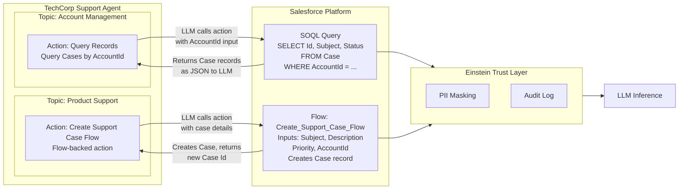

# Lab ADV-04 — Standard and Flow-Backed Actions

## Learning Objectives
- Understand what an Action is in Agentforce context and how it functions as a function call
- Identify the four types of Agentforce Actions: Standard Salesforce, Flow, Apex, and Prompt Template
- Explain the difference between Standard Actions and Flow Actions, and when to use each
- Understand how the LLM decides which action to invoke (based on action description)
- Add a Query Records standard action to the Account Management topic
- Build a Flow-backed action for case creation and add it to the Product Support topic
- Test both actions in the Agent Builder preview panel

---

## Concept Deep Dive: Agentforce Actions

### What Is an Action?

An Agentforce Action is a capability the agent can invoke during a conversation. Without Actions, the agent is a sophisticated chatbot — it can talk intelligently based on its instructions, but it cannot reach into Salesforce, create records, query data, run business logic, or call external APIs. Actions are the bridge from conversation to doing.

The mental model: Actions are like the tools a human support agent has on their screen. They can search for an account, open a case form, look up an order. An Agentforce agent has the same concept — a set of defined tools it can call when needed.

Technically, Actions work through **LLM function-calling**. This is a widely-used AI capability where:
1. The LLM is given a list of available functions (actions) with their names, descriptions, and parameter schemas
2. When the LLM determines that an action is needed to fulfill the request, it generates a structured JSON payload matching the action's parameter schema
3. Salesforce executes the action (queries a record, runs a Flow, etc.)
4. The result is returned to the LLM as additional context
5. The LLM incorporates the result into its response

This loop is transparent to the user — they see only the final natural language response, not the underlying action call.

### The Critical Role of the Action Description

Every Action has a Description field. This is the most important field on any action configuration. It is the text the LLM reads at runtime to decide whether and when to invoke that action.

The Action Name is just a label for humans. The Action Description is what the LLM reads.

A weak description: `Queries Case records.`

A strong description: `Query recent support cases for a customer account. Call this action when a customer asks about their open tickets, case history, support request status, or whether their reported issue has been logged. Input the customer's AccountId obtained from their Account record.`

The strong description tells the LLM three things: what the action returns, when to invoke it, and what input it needs. Without this specificity, the LLM may invoke the action at the wrong time or not invoke it when it should.

### The Four Action Types

**1. Standard Salesforce Actions** — Pre-built actions provided by Salesforce. You configure them with SOQL queries or record type selections but don't write code. Examples:
- Query Records — runs a SOQL query and returns records
- Create Record — creates a new Salesforce record
- Update Record — updates an existing record
- Send Email — sends an email via Salesforce
- Get Details of Agentforce Conversation — returns conversation metadata
- Transfer to Human Agent — triggers the human handoff flow

Standard Actions are the fastest to configure and handle the most common CRUD operations.

**2. Flow Actions** — Backed by a Salesforce Flow. You build any Flow you want (Screen Flow, Autolaunched Flow), expose it as an Agent Action, and the agent can invoke it during a conversation. Flow Actions are the recommended approach when you need business logic that an admin (not a developer) should own and maintain. Best for: multi-step record creation, complex validation, sending notifications, integrating with external systems via HTTP callouts.

**3. Apex Actions** — Backed by an Apex class with the `@InvocableMethod` annotation. When you need logic too complex or performance-sensitive for a Flow (bulk operations, complex calculations, external API calls with custom auth), Apex is the right tool. Covered in depth in Lab ADV-05.

**4. Prompt Template Actions** — Backed by a Prompt Builder template. The action sends data to the LLM with a specific prompt template and returns generated text. Used when you want the agent to generate structured content (summaries, emails, analyses) using grounded Salesforce data. Covered in Lab ADV-06.

### When to Use Flow vs Apex

The guiding principle: **use Flow unless you can't.** Flow keeps logic in the admin layer, making it maintainable without a developer. Apex is for when you need:
- Bulk record operations
- Complex conditional logic that becomes unmanageable in Flow
- External API calls with custom authentication headers
- Performance-sensitive operations that would time out in Flow
- Math-heavy calculations (health scores, risk calculations, complex scoring)

---

## Architecture Overview



---

## Prerequisites
- Completed Lab ADV-02 (TechCorp Support Agent with Agent Instructions)
- Completed Lab ADV-03 (Account Management and Product Support topics created)
- System Administrator access or permission to create Flows and Agent Actions

---

## Lab Setup

You will build a Flow in this lab. Before starting, confirm that Flow Builder is accessible:

**Path:** Setup → Quick Find: **Flows** → confirm you can open the Flows list and click **New Flow**

No test data records are required for the lab steps themselves, though you'll want at least one Account record in your org to fully test the Query Records action.

---

## Step-by-Step Instructions

### Part A — Standard Action: Query Records on Account Management

### Step 1 — Navigate to Account Management Topic

**Path:** Setup → Agents → TechCorp Support Agent → Agent Builder → Topics panel → click **Account Management**

You see the Account Management topic configuration on the right side.

### Step 2 — Add a New Action to Account Management

Look for an **Actions** section within the Account Management topic view. Click **Add Action** or the **+** icon.

A dialog or page appears asking what type of action to add. Select **Standard Salesforce Action**.

### Step 3 — Configure the Query Records Action

From the standard actions list, select **Query Records**.

Fill in the configuration:

**Action Label:** `Get Customer Cases`

**Action API Name:** Auto-populates as `Get_Customer_Cases`

**Action Description** (the LLM reads this — write it carefully):
```
Retrieve open and recent support cases for a customer's account. Call this 
action when a customer asks about their support tickets, case history, 
open issues, or the status of a previously reported problem. You need the 
customer's AccountId to call this action — retrieve it from their Account 
record first if you do not already have it.
```

**Object:** `Case`

**Filter Criteria:**
- Field: `AccountId`
- Operator: `Equals`
- Value: Set this as a dynamic input — click the input binding option and name it `AccountId`. This tells the agent that AccountId must come from a conversation variable.

**Fields to Return:** Select: `Id`, `Subject`, `Status`, `Priority`, `CreatedDate`, `Description`

**Max Records:** `10`

**Sort By:** `CreatedDate` (Descending — most recent first)

Click **Save**.

### Step 4 — Write Topic Instructions That Reference This Action

In the Account Management topic's **Instructions** field, update the instructions to include specific guidance about when to call this action (add to the existing instructions from Lab ADV-03):

Append this to the existing instructions:
```
When a customer asks about their support cases or tickets: first retrieve their 
Account record by email using the Query Records action for Accounts, then use 
the Get Customer Cases action with the AccountId to retrieve their recent cases. 
Summarize the results: how many open cases, the subject of the most recent one, 
and its status. Do not read out all case IDs verbatim — give a plain English summary.
```

Click **Save** on the topic.

### Step 5 — Test the Query Records Action in Preview

Ensure you have at least one Account in your org (you can create a quick test account via App → Accounts → New).

In the Conversation Preview panel, reset the conversation and type:

`Can you show me the support cases on my account? My email is test@techcorp.com`

The agent should:
1. Acknowledge it needs to look up the account
2. Invoke the Query Records action for the Account (or ask for more info)
3. Return a summary of cases (if any exist for that account)

If no cases exist, the agent should respond that no open cases were found.

---

### Part B — Flow Action: Create Support Case

### Step 6 — Build the Flow: Create_Support_Case_Flow

**Path:** Setup → Quick Find: **Flows** → click **New Flow**

In the New Flow dialog:
- Select **Autolaunched Flow** (No Trigger)
- Click **Create**

You are now in Flow Builder.

### Step 7 — Define Flow Input Variables

Click the **Manager** tab (or the Variables icon in the left panel). Add four Input Variables:

| Variable Name | Data Type | Input/Output | Required |
|---|---|---|---|
| `Subject` | Text | Input | Yes |
| `Description` | Text | Input | Yes |
| `Priority` | Text | Input | Yes |
| `AccountId` | Text | Input | Yes |

Also add one **Output Variable:**
| Variable Name | Data Type | Input/Output |
|---|---|---|
| `CaseId` | Text | Output |

### Step 8 — Add a Create Records Element

In the Flow canvas, click **+ Add Element** → **Create Records**

Configure it:
- **Label:** `Create Support Case`
- **API Name:** `Create_Support_Case`
- **How many records to create:** One
- **Object:** `Case`
- **Field Mapping:**
  - `Subject` → `{!Subject}`
  - `Description` → `{!Description}`
  - `Priority` → `{!Priority}`
  - `AccountId` → `{!AccountId}`
  - `Status` → `New` (hardcoded)
  - `Origin` → `Chat` (hardcoded)

- **Store the record's ID in:** Select the `CaseId` output variable

Connect the **Start** element to the **Create Support Case** element.

### Step 9 — Save and Activate the Flow

Click **Save**:
- **Flow Label:** `Create Support Case Flow`
- **Flow API Name:** `Create_Support_Case_Flow`
- **Description:** `Creates a new support Case from an Agentforce chat conversation. Used by the TechCorp Support Agent Product Support topic.`

Click **Activate**. The flow must be Active to be available as an Agent Action.

### Step 10 — Create an Agent Action from the Flow

**Path:** Setup → Quick Find: **Agent Actions** (or in Agent Builder, navigate to Product Support topic → Add Action → Flow Action)

If using the standalone Agent Actions path:
1. Click **New Agent Action**
2. **Reference Type:** Salesforce Flow
3. **Flow:** Select `Create Support Case Flow`
4. **Action Label:** `Create Support Case`
5. **Action Description:**
   ```
   Create a new support case in Salesforce for a customer's reported issue. 
   Call this action when a customer describes a product bug, unexpected behavior, 
   feature malfunction, or integration error that needs to be logged and tracked. 
   Collect: Subject (brief description of the issue), Description (detailed 
   account of what happened and steps to reproduce), Priority (High/Medium/Low 
   based on business impact), and the customer's AccountId before calling this action.
   ```
6. Map inputs:
   - `Subject` → marked as "Collected from conversation"
   - `Description` → marked as "Collected from conversation"
   - `Priority` → marked as "Collected from conversation"
   - `AccountId` → marked as "Collected from conversation"
7. Click **Save**

### Step 11 — Add the Flow Action to the Product Support Topic

**Path:** Agent Builder → Topics → Product Support → Actions section → **Add Action**

Select the **Create Support Case** action you just created.

Review the action description shown on the Product Support topic. Confirm it reads clearly.

Update the Product Support topic instructions to include:
```
When a customer confirms they want to log a support case: collect the Subject 
(a brief one-sentence description of the issue), Description (detailed explanation 
including what they tried and what happened), and Priority (ask if this is 
blocking their work: High = system down/blocking, Medium = workaround exists, 
Low = minor inconvenience). Then call the Create Support Case action. Confirm 
the case was created by sharing the Case ID with the customer.
```

### Step 12 — Test the Flow Action in Preview

Reset the conversation. Type:

`I want to report a bug. The Reports dashboard crashes every time I filter by date range.`

The agent should:
1. Acknowledge the issue
2. Route to Product Support topic
3. Begin collecting the required inputs (Subject, Description, Priority)
4. Invoke the Create Support Case Flow once all inputs are gathered
5. Confirm the case was created and provide the Case ID

You can verify by checking the Cases list in your org (**App Launcher → Service → Cases**) to confirm the record was created.

---

## What You Built

You added two Actions to the TechCorp Support Agent. Part A: a Standard Query Records action on Account Management that retrieves Case records for a customer's account by AccountId. Part B: an Autolaunched Flow called Create_Support_Case_Flow, exposed as an Agent Action on the Product Support topic, that creates a Case with details collected from the conversation. You tested both in the preview panel and verified the flow actually created a record in Salesforce.

---

## Checkpoint Questions

1. What does the LLM read to decide when to invoke an action — the Action Name or the Action Description?
2. What is the key advantage of using a Flow Action over an Apex Action for case creation?
3. In the Query Records standard action, what does setting the AccountId as a "dynamic input" mean?
4. Why must an Autolaunched Flow be Active before it can be used as an Agent Action?
5. Name all four types of Agentforce Actions.

---

## Common Errors & Troubleshooting

**Issue:** Flow Action does not appear in the "Add Action" dialog in Agent Builder
**Fix:** The Flow is not Activated. Go to Setup → Flows, find `Create_Support_Case_Flow`, and confirm its status is Active (not Draft). Only active flows appear as available Agent Actions.

**Issue:** Agent collects all the inputs but does not call the action — just responds in text
**Fix:** The Action Description is not clear enough about when to invoke the action. Rewrite it to explicitly say "Call this action once Subject, Description, Priority, and AccountId have all been collected." The LLM needs explicit trigger instructions in the description.

**Issue:** Query Records action returns an error about missing AccountId
**Fix:** The AccountId input binding in the Query Records configuration is not connected to a conversation variable. The agent has no way to pass the AccountId because it hasn't retrieved the Account record first. Update the Account Management topic instructions to explicitly say: retrieve Account by email first, extract AccountId, then call Get Customer Cases.

**Issue:** Case record is created but has blank fields
**Fix:** The Flow input variables are not mapped correctly. Open the Flow in Setup → Flows → Edit, and verify the Create Records element maps `{!Subject}`, `{!Description}`, `{!Priority}`, and `{!AccountId}` to the corresponding Case fields.

**Issue:** Agent asks for Priority but doesn't understand customer's answer ("it's really urgent")
**Fix:** Add instructions in the Topic to translate plain language priority into the required values: "Interpret 'urgent', 'blocking', or 'system is down' as High. Interpret 'needs to be fixed but I have a workaround' as Medium. Interpret 'minor' or 'cosmetic' as Low. Clarify with the customer before calling the action if priority is unclear."

---

## Exam Tips

- The exam commonly asks "What should you use if you want an admin (not a developer) to be able to maintain the action logic?" — the answer is always Flow Action, not Apex.
- Know that Standard Actions (Query Records, Create Record, Update Record) require zero code but are limited to CRUD operations with basic filtering. Complex multi-object logic or external API calls require Flow or Apex.
- "The agent is retrieving the wrong records" — nearly always an Action Description issue. The LLM is calling the wrong action because the description doesn't differentiate it from another action clearly enough.
- Autolaunched Flows (no trigger) are used for Agent Actions, not Screen Flows. Screen Flows require a user interface context that chat conversations don't have. Some exam questions test this distinction.
- The Action Description is part of the LLM's tool-calling context. It is NOT shown to end users. End users only see the agent's final natural language response.
- An action must be added to a specific Topic — it is not available agent-wide by default. If the same action is needed in two topics, add it to both.
