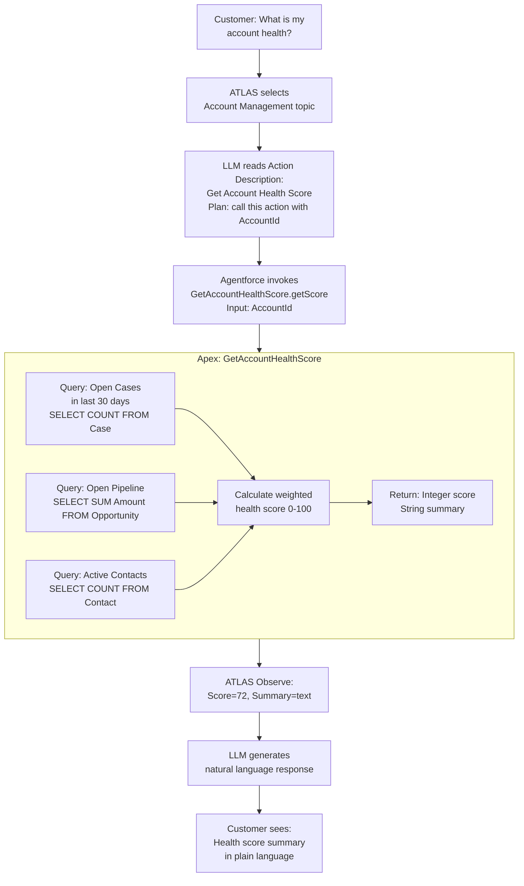

# Lab ADV-05 — Building Custom Apex Actions for Agentforce

## Learning Objectives
- Understand why and when to use Apex Actions over Flow Actions
- Learn the `@InvocableMethod` annotation pattern and its requirements for Agentforce
- Understand how Agentforce calls Apex (function-calling with typed I/O)
- Write best-practice Apex with proper bulkification, error handling, and focused scope
- Build the `GetAccountHealthScore` Apex class and expose it as an Agentforce Action
- Add the action to the Account Management topic with appropriate call-time instructions

---

## Concept Deep Dive: Apex Actions in Agentforce

### Why Apex When Flow Exists?

Salesforce's guidance is clear: use Flow when you can. Flows are declarative, maintainable by admins, and require no deployment. But some requirements genuinely exceed what Flow can handle cleanly:

**Computation-heavy logic** — Calculating a health score, a risk rating, or a churn likelihood requires multi-variable math across related objects. Flow can do basic math, but complex algorithms with multiple queries and weighted formulas become unmaintainable in Flow's visual canvas.

**Bulk operations** — If your action might need to process multiple records efficiently (even if the agent calls it one at a time, Salesforce platform best practice is to bulkify), Apex handles this cleanly.

**External callouts with custom auth** — Flow's HTTP callout action works for simple REST calls, but if you need OAuth 2.0 token refresh, custom header signing, or complex request/response parsing, Apex is the right tool.

**Cross-object queries with complex joins** — SOQL in Apex can use subqueries and aggregate functions that are unavailable or cumbersome in Flow.

For this lab's use case — calculating an account health score by querying Cases, Opportunities, and Contacts and computing a weighted score — Apex is clearly the right choice. The logic spans three objects, uses aggregate queries, and involves a calculation the LLM should not do itself (the LLM would approximate; Apex computes exactly).

### The @InvocableMethod Annotation

For a method to be callable by Agentforce (and also by Flow, Process Builder, and REST API), it must be annotated with `@InvocableMethod`. The annotation has several important attributes:

```apex
@InvocableMethod(
    label='Get Account Health Score'
    description='Calculate and return a health score for a customer account based on recent case volume, open opportunity pipeline, and contact engagement.'
    category='Account'
)
```

Key rules:
- The method must be `public static`
- It must accept a `List<>` of a request type — even if you only ever pass one item (this is the bulkification requirement)
- It must return a `List<>` of a result type — again, even for single records
- The `description` attribute is crucial: this is what Agentforce uses to decide when to call the action. Treat it like an Action Description — specific and directive.

### Input and Output Types

Because `@InvocableMethod` must accept and return lists, you define typed wrapper classes:

```apex
public class Request {
    @InvocableVariable(required=true)
    public String accountId;
}

public class Result {
    @InvocableVariable
    public Integer healthScore;
    
    @InvocableVariable
    public String summary;
    
    @InvocableVariable
    public Boolean success;
    
    @InvocableVariable
    public String errorMessage;
}
```

`@InvocableVariable` marks class properties as inputs or outputs that Flow and Agentforce can map to. The `required=true` attribute enforces that the input must be provided.

### The description Attribute vs the Agent Builder Description

There are two places a description lives for an Apex Action:

1. **`@InvocableMethod(description=...)`** — Defined in code. This is the default description surfaced in Agent Builder when you create the action from this class.

2. **Agent Builder Action Description field** — Once the action is created in Agent Builder, you can override the description there. This is what the LLM reads at runtime.

Best practice: write a solid description in both places. The code annotation serves as documentation for developers. The Agent Builder field is the operational description for the LLM.

### Bulkification Best Practice

Even though Agentforce calls your action with a single record at a time (one conversation turn, one health score request), always write the method to handle a list:

```apex
public static List<Result> getAccountHealthScore(List<Request> requests) {
    List<Result> results = new List<Result>();
    // Process all items in the list
    for (Request req : requests) {
        // process each one
        results.add(processOne(req));
    }
    return results;
}
```

This matters because: (1) it's required by the annotation, (2) if the same method is later used in a bulk Flow context it will work correctly, and (3) it forces you to think about governor limits per-iteration rather than assuming a single call.

### Error Handling Philosophy

Agentforce actions should never throw unhandled exceptions into the LLM context. If your Apex fails, the LLM should receive a graceful error result it can communicate to the user rather than a system exception that crashes the conversation.

Use try/catch blocks and return error information in the result:

```apex
try {
    // your logic
    result.success = true;
} catch (Exception e) {
    result.success = false;
    result.errorMessage = 'Unable to calculate account health at this time: ' + e.getMessage();
    result.healthScore = -1;
    result.summary = 'Health score unavailable.';
}
```

The LLM can then say: "I tried to retrieve your account health score but encountered a technical issue. I'll create a case for our team to look into it."

---

## Architecture Overview



---

## Prerequisites
- Completed Labs ADV-02 and ADV-03 (TechCorp Support Agent with Account Management topic)
- Developer Console or VS Code with Salesforce Extension Pack for Apex development
- Account records with related Cases, Opportunities, and Contacts in your org for realistic testing

---

## Lab Setup

Create at least one Account with:
- 2-3 related Cases (some open, some closed)
- 1-2 related Opportunities
- 2-3 related Contacts

**Quick path:** App Launcher → Accounts → New → fill in Account Name → Save. Then create Cases, Opportunities, and Contacts related to it via the related lists. This gives realistic test data for the health score calculation.

---

## Step-by-Step Instructions

### Step 1 — Open Developer Console or VS Code

**Option A — Developer Console:**
Setup → top right username menu → **Developer Console** → File → New → Apex Class

**Option B — VS Code:**
Open your Salesforce project. In `/force-app/main/default/classes/`, create two new files: `GetAccountHealthScore.cls` and `GetAccountHealthScore.cls-meta.xml`

### Step 2 — Write the Apex Class

Create a new Apex class with the following complete code:

```apex
/**
 * GetAccountHealthScore
 * 
 * Agentforce Apex Action that calculates a customer account health score.
 * Called when a customer asks about their account health or relationship status.
 * 
 * Health Score Components (0-100):
 *   - Open Case Penalty: -5 points per open case in last 30 days (max -40)
 *   - Pipeline Score: +20 if open opportunity pipeline > $0
 *   - Pipeline Value Score: +20 if open pipeline > $10,000
 *   - Contact Engagement Score: +10 per active contact (max +20)
 *   - Base Score: 50 points baseline
 */
public with sharing class GetAccountHealthScore {

    // ── Input / Output wrappers ──────────────────────────────────────────────

    public class Request {
        @InvocableVariable(
            required=true
            label='Account ID'
            description='The Salesforce Account Id (15 or 18 character) for the customer account to score.'
        )
        public String accountId;
    }

    public class Result {
        @InvocableVariable(label='Health Score')
        public Integer healthScore;

        @InvocableVariable(label='Summary')
        public String summary;

        @InvocableVariable(label='Open Case Count')
        public Integer openCaseCount;

        @InvocableVariable(label='Open Pipeline Value')
        public Decimal openPipelineValue;

        @InvocableVariable(label='Active Contact Count')
        public Integer activeContactCount;

        @InvocableVariable(label='Success')
        public Boolean success;

        @InvocableVariable(label='Error Message')
        public String errorMessage;
    }

    // ── Invocable Entry Point ────────────────────────────────────────────────

    @InvocableMethod(
        label='Get Account Health Score'
        description='Calculate and return a health score (0-100) for a customer account based on open support case volume in the last 30 days, open opportunity pipeline value, and active contact count. Returns the numeric score and a plain-language summary. Call this when a customer asks about their account health, relationship status, or how they are doing as a TechCorp customer.'
        category='Account'
    )
    public static List<Result> getScore(List<Request> requests) {
        List<Result> results = new List<Result>();

        for (Request req : requests) {
            Result r = new Result();
            try {
                r = calculateHealthScore(req.accountId);
                r.success = true;
            } catch (Exception e) {
                r.success = false;
                r.healthScore = -1;
                r.summary = 'Account health score is currently unavailable.';
                r.errorMessage = 'Error calculating health score: ' + e.getMessage();
            }
            results.add(r);
        }

        return results;
    }

    // ── Core Calculation Logic ───────────────────────────────────────────────

    private static Result calculateHealthScore(String accountId) {
        Result r = new Result();

        // Validate input
        if (String.isBlank(accountId)) {
            r.success = false;
            r.healthScore = -1;
            r.summary = 'No account ID provided.';
            r.errorMessage = 'accountId is required and cannot be blank.';
            return r;
        }

        Id accId;
        try {
            accId = (Id) accountId;
        } catch (Exception e) {
            r.success = false;
            r.healthScore = -1;
            r.summary = 'Invalid account ID format.';
            r.errorMessage = 'The provided accountId is not a valid Salesforce Id.';
            return r;
        }

        // ── Query 1: Open Cases in last 30 days ──────────────────────────────
        Date thirtyDaysAgo = Date.today().addDays(-30);
        List<AggregateResult> caseAgg = [
            SELECT COUNT(Id) caseCount
            FROM Case
            WHERE AccountId = :accId
              AND IsClosed = false
              AND CreatedDate >= :thirtyDaysAgo
            WITH SECURITY_ENFORCED
            LIMIT 1
        ];
        Integer openCases = (Integer) caseAgg[0].get('caseCount');

        // ── Query 2: Open Opportunity Pipeline ──────────────────────────────
        List<AggregateResult> oppAgg = [
            SELECT SUM(Amount) pipelineValue, COUNT(Id) oppCount
            FROM Opportunity
            WHERE AccountId = :accId
              AND IsClosed = false
            WITH SECURITY_ENFORCED
            LIMIT 1
        ];
        Decimal pipeline = (Decimal) oppAgg[0].get('pipelineValue');
        if (pipeline == null) pipeline = 0;
        Integer openOpps = (Integer) oppAgg[0].get('oppCount');

        // ── Query 3: Active Contacts ─────────────────────────────────────────
        List<AggregateResult> contactAgg = [
            SELECT COUNT(Id) contactCount
            FROM Contact
            WHERE AccountId = :accId
              AND HasOptedOutOfEmail = false
            WITH SECURITY_ENFORCED
            LIMIT 1
        ];
        Integer activeContacts = (Integer) contactAgg[0].get('contactCount');

        // ── Score Calculation ────────────────────────────────────────────────
        Integer score = 50; // baseline

        // Case penalty: -5 per open case, max -40
        Integer casePenalty = Math.min(openCases * 5, 40);
        score -= casePenalty;

        // Pipeline bonus
        if (pipeline > 0) score += 20;
        if (pipeline > 10000) score += 20;

        // Contact engagement bonus: +10 per contact, max +20
        Integer contactBonus = Math.min(activeContacts * 10, 20);
        score += contactBonus;

        // Clamp to 0-100
        score = Math.max(0, Math.min(100, score));

        // ── Build Summary ────────────────────────────────────────────────────
        String rating;
        if (score >= 80) {
            rating = 'Excellent';
        } else if (score >= 60) {
            rating = 'Good';
        } else if (score >= 40) {
            rating = 'Needs Attention';
        } else {
            rating = 'At Risk';
        }

        String summary = 'Account Health Score: ' + score + '/100 (' + rating + '). '
            + 'Open cases (last 30 days): ' + openCases + '. '
            + 'Open opportunities: ' + openOpps
            + (pipeline > 0 ? ' ($' + pipeline.setScale(0).format() + ' pipeline)' : '') + '. '
            + 'Active contacts: ' + activeContacts + '.';

        // ── Populate Result ──────────────────────────────────────────────────
        r.healthScore = score;
        r.summary = summary;
        r.openCaseCount = openCases;
        r.openPipelineValue = pipeline;
        r.activeContactCount = activeContacts;

        return r;
    }
}
```

### Step 3 — Write the Test Class

In Developer Console or VS Code, create `GetAccountHealthScoreTest.cls`:

```apex
@isTest
private class GetAccountHealthScoreTest {

    @TestSetup
    static void makeData() {
        Account acc = new Account(Name = 'Test Account', Industry = 'Technology');
        insert acc;

        // 2 open cases
        List<Case> cases = new List<Case>{
            new Case(AccountId = acc.Id, Subject = 'Open Case 1', Status = 'New'),
            new Case(AccountId = acc.Id, Subject = 'Open Case 2', Status = 'Working')
        };
        insert cases;

        // 1 open opportunity with pipeline
        Opportunity opp = new Opportunity(
            AccountId = acc.Id,
            Name = 'Test Renewal',
            StageName = 'Proposal/Price Quote',
            CloseDate = Date.today().addDays(30),
            Amount = 15000
        );
        insert opp;

        // 2 active contacts
        List<Contact> contacts = new List<Contact>{
            new Contact(AccountId = acc.Id, LastName = 'Alpha', HasOptedOutOfEmail = false),
            new Contact(AccountId = acc.Id, LastName = 'Beta', HasOptedOutOfEmail = false)
        };
        insert contacts;
    }

    @isTest
    static void testHealthScoreCalculation() {
        Account acc = [SELECT Id FROM Account LIMIT 1];

        GetAccountHealthScore.Request req = new GetAccountHealthScore.Request();
        req.accountId = acc.Id;

        Test.startTest();
        List<GetAccountHealthScore.Result> results = GetAccountHealthScore.getScore(
            new List<GetAccountHealthScore.Request>{ req }
        );
        Test.stopTest();

        System.assertEquals(1, results.size());
        GetAccountHealthScore.Result r = results[0];
        System.assert(r.success, 'Expected success=true, got: ' + r.errorMessage);
        System.assert(r.healthScore >= 0 && r.healthScore <= 100,
            'Score out of range: ' + r.healthScore);
        System.assertEquals(2, r.openCaseCount);
        System.assertEquals(2, r.activeContactCount);
        System.assert(r.openPipelineValue > 0);
    }

    @isTest
    static void testBlankAccountId() {
        GetAccountHealthScore.Request req = new GetAccountHealthScore.Request();
        req.accountId = '';

        List<GetAccountHealthScore.Result> results = GetAccountHealthScore.getScore(
            new List<GetAccountHealthScore.Request>{ req }
        );

        System.assertEquals(false, results[0].success);
        System.assertEquals(-1, results[0].healthScore);
    }

    @isTest
    static void testInvalidAccountId() {
        GetAccountHealthScore.Request req = new GetAccountHealthScore.Request();
        req.accountId = 'NOTANID';

        List<GetAccountHealthScore.Result> results = GetAccountHealthScore.getScore(
            new List<GetAccountHealthScore.Request>{ req }
        );

        System.assertEquals(false, results[0].success);
    }
}
```

### Step 4 — Save and Run Tests

**Developer Console path:** File → Save → Test → New Run → select `GetAccountHealthScoreTest` → Run

Confirm all three test methods pass (green checkmarks). If any fail, check the error details in the Tests tab.

A 100% code coverage is not required, but aim for at least 75% to satisfy Salesforce deployment requirements.

### Step 5 — Create the Agent Action from the Apex Class

**Path:** Setup → Quick Find: **Agent Actions** → **New Agent Action**

- **Reference Type:** Apex
- **Apex Class:** `GetAccountHealthScore`
- **Apex Method:** `getScore`
- Salesforce auto-populates the action name and description from the annotation

Review the auto-populated **Action Description**. It should match what you wrote in the `@InvocableMethod` annotation. If needed, edit it in the UI to be clearer.

**Input Mapping:**
- `accountId` — mark as "Collected from Conversation" (the agent will extract AccountId from prior conversation context or query it fresh)

**Output Mapping:**
- `healthScore` — Output to LLM context
- `summary` — Output to LLM context (this is the main one the LLM will use in its response)
- `success` — Output to LLM context
- `errorMessage` — Output to LLM context (so the LLM can handle errors gracefully)

Click **Save**.

### Step 6 — Add the Action to the Account Management Topic

**Path:** Agent Builder → Account Management topic → Actions → **Add Action** → select **Get Account Health Score**

The action appears in the Account Management topic's action list.

Update the Account Management topic instructions to add:
```
When a customer asks about their account health, relationship status, or how 
they are doing as a TechCorp customer: retrieve their Account record by email 
to get the AccountId, then call the Get Account Health Score action. Use the 
summary returned by the action to explain the score in plain language. If the 
score is below 40 (At Risk), proactively offer to connect them with their 
Customer Success Manager.
```

### Step 7 — Test in the Preview Panel

Reset the conversation. Type:

`Can you tell me how our account is doing? We're the team at test@techcorp.com`

The agent should:
1. Ask for the email (or use the provided one) to look up the Account
2. Invoke the Get Account Health Score action with the AccountId
3. Return a response like: "Your account health score is 72/100 (Good). You have 2 open cases from the last 30 days, an open opportunity in the pipeline, and 2 active contacts."

If you do not have test data, the response will reflect zeros. Verify by checking that the Apex method was actually called (some org versions show the action call in the debug panel).

---

## What You Built

You wrote a full Apex class (`GetAccountHealthScore`) with the `@InvocableMethod` annotation, querying three related objects (Cases, Opportunities, Contacts), calculating a weighted health score, and returning a typed result. You wrote and ran a test class to verify the logic. You created an Agentforce Action from the Apex class and added it to the Account Management topic with instructions guiding when and how to call it.

---

## Checkpoint Questions

1. Why must an `@InvocableMethod` accept and return `List<>` types even when only processing one record?
2. What is the difference between the `@InvocableMethod(description=...)` attribute and the Action Description in Agent Builder?
3. When should you choose Apex over Flow for an Agent Action?
4. What happens to the conversation if your Apex action throws an unhandled exception?
5. What does `WITH SECURITY_ENFORCED` do in a SOQL query, and why should you use it in Agentforce Apex?

---

## Common Errors & Troubleshooting

**Issue:** Apex class does not appear in the Agent Actions "New Agent Action" Apex class selector
**Fix:** The class must be `public with sharing` (or `public without sharing`) — not `private`. It must have at least one method annotated with `@InvocableMethod`. Also confirm the class is saved and compiled without errors in Developer Console.

**Issue:** Test class fails with "System.QueryException: List has no rows for assignment"
**Fix:** Your test data setup (@TestSetup) may not be creating records correctly. Add `System.debug()` statements or use the Developer Console query editor to verify the test account and related records exist after TestSetup.

**Issue:** Agent calls the action but returns a null summary
**Fix:** The output variable `summary` is not mapped in the Agent Action configuration. Go to Setup → Agent Actions → edit the action → ensure `summary` is included in the output mappings and marked as available to the LLM context.

**Issue:** Health score is always 50 (only baseline, no adjustments)
**Fix:** The SOQL queries are not finding related records. Verify your test Account's Id is actually the parent of the Cases and Opportunities — check the AccountId field on those records. Also check that Cases are not `IsClosed = true`.

**Issue:** "WITH SECURITY_ENFORCED causes a SecurityException in test context"
**Fix:** Ensure your running user in tests has read access to Case, Opportunity, and Contact objects. If using a restricted profile in tests, either use `@SeeAllData` (not recommended) or ensure the test profile has the appropriate field-level security. Alternatively, temporarily remove `WITH SECURITY_ENFORCED` while debugging.

---

## Exam Tips

- The exam distinguishes `@InvocableMethod` from `@AuraEnabled` — `@AuraEnabled` exposes methods to Lightning components; `@InvocableMethod` exposes methods to Flow, Process Builder, and Agentforce. Know which annotation is for which purpose.
- "A customer's Apex-backed action sometimes returns incorrect results when multiple conversations run concurrently" — this is a bulkification/governor limit scenario. The answer involves ensuring proper list-based processing rather than using static state between calls.
- Know that `WITH SECURITY_ENFORCED` enforces field-level security at query time — if the running user doesn't have read access to a queried field, the query throws an exception. This is a security best practice in Agentforce where the running user may vary.
- The `description` attribute in `@InvocableMethod` is used by Agentforce to populate the default action description. It can be overridden in Agent Builder. Know this two-layer pattern.
- Apex callouts (HTTP calls to external systems) cannot be made synchronously within an `@InvocableMethod` in the same transaction as DML operations. You need to use a `@future(callout=true)` or a Queueable pattern. This is a common exam limitation scenario.
- Apex test coverage must be at least 75% overall for deployment to production, but individual classes should aim for higher. Agent Action Apex classes are no different from any other Apex in this regard.
