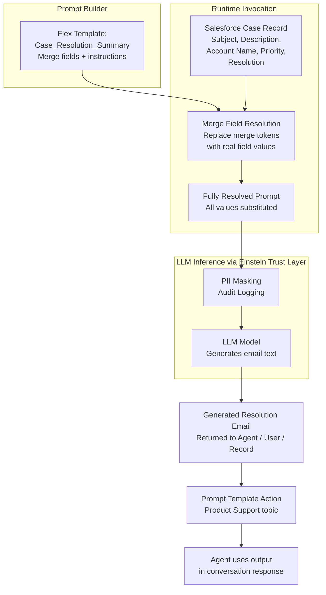

# Lab ADV-06 — Prompt Templates and Grounding with Salesforce Data

## Learning Objectives
- Understand what a Prompt Template is and how it differs from agent instructions
- Explain grounding and why it matters for AI accuracy (the antidote to hallucination)
- Identify the four Prompt Template types and when to use each
- Understand how merge fields pull live Salesforce data into LLM prompts
- Build a Flex Prompt Template for case resolution summaries with real merge fields
- Test the template in Prompt Builder with a real Case record
- Create a Prompt Template Action and add it to the Product Support topic

---

## Concept Deep Dive: Prompt Templates and Grounding

### What Is Grounding?

Grounding is the practice of providing a large language model with factual, real-world data as part of its prompt, so it generates responses based on that data rather than its general training knowledge.

Why this matters: LLMs are trained on static datasets. They have no idea what happened in your customer's account last Tuesday. If you ask an LLM "Was the customer's issue resolved?" without giving it the actual Case record, it will either refuse to answer or — worse — make something up. This is hallucination.

Grounding solves this by injecting real data into the prompt at the moment of inference:
- "Here is the case: Subject = 'Dashboard not loading', Status = 'Closed - Resolved', Resolution = 'Cleared browser cache'. Now write a professional resolution email."

The LLM is working with facts, not imagination. The response will accurately reflect the actual case details.

In Agentforce, grounding happens in two primary ways:
1. **Standard and Apex Actions** — The action queries Salesforce and returns data, which becomes context for the LLM's next response (this is what you built in Labs ADV-04 and ADV-05)
2. **Prompt Templates** — A reusable prompt structure with merge fields that pull live Salesforce record data at the moment the template is invoked

### What Is a Prompt Template?

A Prompt Template is exactly what it sounds like: a pre-written prompt with placeholders. Think of it as an email template (like Salesforce Email Templates) but for AI-generated content.

Where an email template has merge fields like `{!Contact.FirstName}`, a Prompt Template has merge fields like `{!$Record:Case.Subject}` — and instead of just inserting text, it sends the entire prompt to an LLM and returns the LLM's generated output.

The workflow:
1. You define the template once (structure + merge fields + instructions)
2. At runtime, merge fields resolve to real Salesforce record values
3. The fully resolved prompt is sent to the LLM
4. The LLM returns generated content (an email, a summary, an analysis)
5. The result is surfaced to the user in the conversation or stored in a field

### The Four Template Types

**Sales Email** — Generates a personalized outreach email for a sales prospect. Uses Account and Opportunity merge fields. Used by Sales agents and SDR agents.

**Field Generation** — Generates content for a specific Salesforce field (like an auto-generated case summary, or a product description). Invoked via a field's "Einstein" icon or via automation.

**Flex Template** — A general-purpose template for any use case. You define the inputs, the prompt structure, and the output. This is the most versatile type and the one used in this lab.

**Record Summary** — Generates a narrative summary of a Salesforce record. Pre-configured to pull related list data and produce a readable account/case/opportunity summary.

### Merge Fields in Prompt Templates

Prompt Builder has three categories of merge fields:

**`{!$Record:Object.Field}`** — Pulls a field value from the context record. When the template is invoked on a specific Case, `{!$Record:Case.Subject}` resolves to that case's subject line.

**`{!$Input:VariableName}`** — Pulls from a dynamic input variable passed to the template at invocation time. Used when the template needs information that isn't on a single record (like the agent's company name, or a topic provided by the user).

**`{!$RelatedList:ObjectRelationship.Field}`** — Pulls related list data (e.g., all Cases related to an Account). Useful for summary templates.

### Prompt Builder vs Direct Agent Instructions

When should you use a Prompt Template vs just writing instructions in the Agent?

| Use Case | Prompt Template | Agent Instructions/Topic Instructions |
|---|---|---|
| Generate a structured email for a specific record | Yes — merge fields pull record data | No — instructions can't merge live data |
| Set agent's tone and persona | No | Yes — this is behavioral, not content |
| Summarize a Case record with real field values | Yes — Field Generation or Flex template | No — LLM would have to be told the data manually |
| Tell the agent when to escalate | No | Yes — this is a behavioral rule |
| Generate a proposal based on Opportunity fields | Yes — Sales Email or Flex template | No |

The rule of thumb: if you need real Salesforce data incorporated into generated content, use a Prompt Template. If you're configuring behavior, use Instructions.

### The Grounding-Hallucination Trade-off

Without grounding: "Write a resolution email for the customer." The LLM invents case details, possibly getting them wrong.

With grounding: "Write a resolution email for the customer. Here is the case data: [actual case fields]." The LLM writes a response anchored to real facts.

Prompt Templates are the mechanism for systematic grounding. Every merge field that resolves to a real record value is one fewer fact the LLM has to generate from imagination.

---

## Architecture Overview



---

## Prerequisites
- Completed Lab ADV-02 (TechCorp Support Agent)
- Completed Lab ADV-03 (Product Support topic created)
- At least one Case record in the org with Subject, Description, and Account populated
- Einstein Generative AI enabled in Setup

---

## Lab Setup

Create a test Case record with rich data:

**Path:** App Launcher → Service → Cases → New

Fill in:
- **Subject:** `Reports dashboard crashes when filtering by date range`
- **Description:** `Customer reported that clicking the date filter on the main Reports dashboard causes the entire page to reload and show an error message: "Error loading component". Issue started after the Spring '25 release update. Customer is using Chrome 124.`
- **Priority:** `High`
- **Status:** `Closed`
- **Account:** (select any account in your org)
- **Resolution:** `Root cause identified as a browser cache conflict with the new dashboard framework. Resolution: clear browser cache and cookies, then refresh. Issue resolved for affected users.` (put this in the Description or Internal Comments if your org has that field)

Save the Case. Note the Case ID — you'll use it in the test step.

---

## Step-by-Step Instructions

### Step 1 — Navigate to Prompt Builder

**Path:** Setup → Quick Find: **Prompt Builder** → click **Prompt Builder**

You land on the Prompt Builder home page showing existing templates (if any). Prompt Builder is the dedicated UI for creating and testing Prompt Templates.

### Step 2 — Create a New Flex Template

Click **New Prompt Template**.

In the creation dialog:
- **Template Type:** Flex Template
- **Template Name:** `Case Resolution Summary`
- **Template API Name:** Auto-populates as `Case_Resolution_Summary`
- **Description:** `Generates a professional resolution email for a customer based on a Salesforce Case record. Used by the TechCorp Support Agent to compose resolution emails in the Product Support topic.`

Click **Next** or **Create**.

You are now in the Prompt Builder editor.

### Step 3 — Configure the Input Resources

Before writing the template, define what data this template needs:

In the **Resources** panel (left side of Prompt Builder):
1. Click **Add Resource**
2. Select **Salesforce Record**
3. **Object:** Case
4. **Resource Name:** `Case` (becomes the prefix in merge fields)
5. Click **Confirm**

This makes all Case fields available as merge fields: `{!$Record:Case.Subject}`, `{!$Record:Case.Description}`, `{!$Record:Case.Account.Name}`, `{!$Record:Case.Priority}`, `{!$Record:Case.Status}`, etc.

Also add an Input Variable for the company name:
1. Click **Add Resource** → **Input**
2. **Variable Name:** `Company_Name`
3. **Data Type:** Text
4. **Default Value:** `TechCorp`
5. Click **Confirm**

### Step 4 — Write the Prompt Template

In the main text editor area of Prompt Builder, clear any default text and enter the following:

```
You are a professional customer support specialist at {!$Input:Company_Name}.

A support case has been resolved. Please write a clear, professional, and 
empathetic resolution email to send to the customer.

Case Details:
- Case Subject: {!$Record:Case.Subject}
- Original Issue Description: {!$Record:Case.Description}
- Customer Account: {!$Record:Case.Account.Name}
- Priority: {!$Record:Case.Priority}
- Status: {!$Record:Case.Status}

Email Requirements:
1. Open with a brief empathetic acknowledgment that this issue affected their work
2. Clearly state that the issue has been resolved
3. Explain the root cause in plain, non-technical language (1-2 sentences maximum)
4. Provide the resolution steps the customer should follow, if any action is required on their end
5. Invite them to reply if the issue persists or if they have questions
6. Close with a professional sign-off from the TechCorp Support Team
7. Keep the email under 250 words
8. Do not use technical jargon unless the customer's description indicates they are technical
9. Do not invent details not present in the case description

Write only the email body (no subject line needed). Start with "Hi [Customer Name]," — 
use a placeholder since you may not have the contact's name.
```

### Step 5 — Test the Template with a Real Case Record

In the Prompt Builder editor, look for a **Preview** or **Test** panel (usually at the bottom or right side).

In the preview:
1. For the **Case** resource: click **Select Record** and choose the test Case you created in Lab Setup
2. For `Company_Name`: confirm it shows `TechCorp` (the default) or type a value
3. Click **Generate** or **Preview**

The Prompt Builder sends your resolved prompt (with all merge fields substituted) to the LLM and displays the generated output.

Review the output:
- Does it acknowledge the specific issue (dashboard crashing)?
- Does it explain the resolution (cache clearing)?
- Is it under 250 words?
- Does it sound professional and empathetic?

If the output is off, adjust the template instructions in Step 4. Common fixes:
- If too technical: add "explain in plain English, no Salesforce jargon"
- If too long: make the word count limit more prominent ("IMPORTANT: keep under 200 words")
- If missing resolution steps: check that your Case's Description field has the resolution text in it

### Step 6 — Save the Template

Once the preview output looks good, click **Save** (or **Activate** if prompted — Prompt Templates need to be Active to be available as Agent Actions).

Confirm the template shows as Active in the Prompt Builder templates list.

### Step 7 — Create an Agent Action from the Prompt Template

**Path:** Setup → Quick Find: **Agent Actions** → **New Agent Action**

- **Reference Type:** Prompt Template
- **Prompt Template:** Select `Case Resolution Summary`
- **Action Label:** `Generate Case Resolution Email`
- **Action Description:**
  ```
  Generate a professional case resolution email using the details from a 
  resolved Salesforce Case record. Call this action when a customer asks for 
  a resolution summary email, when a case has been marked resolved and the 
  customer wants confirmation, or when a support representative asks for help 
  drafting a resolution message. You need the Case record as input.
  ```
- **Input Mapping:** Map the Case resource to a Case ID that the agent will provide from conversation context

Click **Save**.

### Step 8 — Add the Action to the Product Support Topic

**Path:** Agent Builder → Product Support topic → Actions → **Add Action** → select **Generate Case Resolution Email**

Update Product Support topic instructions to include:
```
When a customer asks for a summary email of a resolved issue, or when you have 
just logged a case and the customer asks for a written confirmation of the 
resolution steps: use the Generate Case Resolution Email action. You will need 
the Case record — retrieve it using its Case ID. Share the generated email 
text directly in the chat for the customer to review. Offer to log it as a 
case comment as well.
```

### Step 9 — Test in the Preview Panel

Reset the conversation. Type:

`My case was just closed. Can you send me a summary email of what was resolved? The Case ID is [your test case ID].`

The agent should:
1. Route to Product Support
2. (Optionally) look up the Case by ID using Query Records
3. Invoke the Generate Case Resolution Email action with the Case
4. Return the generated email text in the chat

---

## What You Built

You created a Flex Prompt Template called `Case_Resolution_Summary` in Prompt Builder with merge fields pulling live Case data (Subject, Description, Account Name, Priority, Status). You tested it with a real Case record and tuned the output. You then created a Prompt Template Action and added it to the Product Support topic, so the agent can now generate professional resolution emails on demand using grounded Salesforce data.

---

## Checkpoint Questions

1. What is the difference between grounding and hallucination in the context of LLM responses?
2. What are the four Prompt Template types? When would you use a Flex template vs a Record Summary template?
3. What does `{!$Record:Case.Subject}` do at runtime?
4. Why would you use a Prompt Template instead of writing the generation instruction directly in Agent Instructions?
5. A Prompt Template must be in what status before it can be used as an Agent Action?

---

## Common Errors & Troubleshooting

**Issue:** Merge fields show as literal text (not substituted) in the preview
**Fix:** Merge fields are only substituted when you provide a real record in the preview test. Ensure you clicked "Select Record" and chose a real Case record before clicking Generate. Also check that the merge field syntax is exactly `{!$Record:Case.Subject}` — a typo in the object or field name will silently fail.

**Issue:** Generated email mentions details not in the Case record
**Fix:** The LLM is filling in gaps from its training knowledge (hallucinating). Add an explicit instruction: "Do not include any information not present in the Case Details above. If information is missing, say it is unavailable rather than inventing it."

**Issue:** The Prompt Template does not appear in Agent Actions → New → Prompt Template selector
**Fix:** The template is in Draft status. Go back to Prompt Builder, open the template, and set it to Active.

**Issue:** Template generates a good preview but the agent's response doesn't use the generated text
**Fix:** The action output is not mapped to the LLM context. When creating the Agent Action from the template, ensure the output (the generated text) is marked as available to the LLM in the output mappings. The agent needs to be able to "see" the generated email to share it in the conversation.

**Issue:** Template preview shows "LLM service unavailable"
**Fix:** Einstein Generative AI may be temporarily unavailable. Try again after a few minutes. If persistent, check Setup → Einstein Features and ensure generative AI is toggled on.

---

## Exam Tips

- The exam distinguishes between the four template types. Know that Flex is for custom use cases, Sales Email is for outreach, Field Generation is for field population, and Record Summary is for narrative summaries of records.
- "An agent is generating case summaries that include incorrect details" — the answer is that the template is not using merge fields (not grounded) and the LLM is hallucinating. The fix is to add merge fields pulling real Case data.
- Prompt Templates are reusable across agents and also in automation (Flows can invoke Prompt Template actions). Know that they are not exclusive to Agentforce.
- The `{!$Input:VariableName}` merge field type is for runtime inputs, not record fields. Common exam question: "A template needs the user's name but it's not on the record" — use an Input variable, not a record merge field.
- Prompt Templates go through the Einstein Trust Layer — PII masking applies before the prompt is sent to the LLM. If a Case description contains an SSN, it is masked before leaving Salesforce. Know this as a Trust Layer feature.
- A Prompt Template Action has its own description (used by the LLM to decide when to call it), separate from the template description (used by humans to understand what the template does). Both matter but for different audiences.
