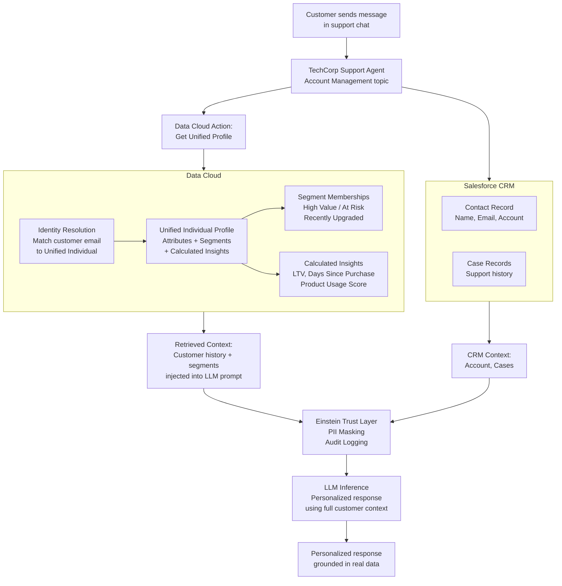

# Lab ADV-07 — Data Cloud Grounding for Agentforce

## Learning Objectives
- Understand what "grounding with Data Cloud" means and why it produces richer, more personalized responses than CRM-only grounding
- Explain the technical mechanism of Data Cloud Actions (retrieval-augmented generation)
- Distinguish between a Salesforce CRM Contact record and a Data Cloud Unified Individual Profile
- Configure Data Cloud Actions in the Agentforce Account Management topic
- Write Topic Instructions that leverage unified profile data in agent responses
- Understand consent, privacy, and Einstein Trust Layer considerations for Data Cloud grounding

---

## Concept Deep Dive: Data Cloud Grounding

### Why CRM Data Is Not Enough

A standard Salesforce Contact record is a snapshot — it has a name, email, phone number, account, and maybe a few custom fields. It represents what your sales or support team has manually entered or synced from a few integrated systems.

But who your customer really IS extends far beyond that record. They have:
- A purchase history across multiple channels (online, in-store, via partner)
- A browsing history on your website (what they looked at, how long they stayed)
- An engagement history with your marketing emails
- Support ticket history from multiple systems (Salesforce Cases, but maybe also Zendesk or Jira)
- Behavioral segments (high-value customer, at-churn-risk, recently upgraded)
- Calculated attributes (lifetime value, days since last purchase, product usage score)

This data lives in Data Cloud as a **Unified Individual Profile** — a synthesized, consolidated view of a customer across all these data sources. Where a CRM Contact has 5-10 meaningful fields, a Unified Individual may have 50-100 enriched attributes.

When you ground an Agentforce agent with Data Cloud, you give it access to this full picture. The agent can personalize responses based on a customer's actual history, not just what's in their CRM record.

### What Data Cloud Grounding Enables

Consider two conversations:

**Without Data Cloud grounding:**
Customer: "What offers do you have for loyal customers?"
Agent: "We have several plans available. Would you like me to describe them?"
(Generic, impersonal — the agent has no idea this person has been a customer for 7 years and has a $50k annual contract.)

**With Data Cloud grounding:**
Customer: "What offers do you have for loyal customers?"
Agent: "Based on your account, you've been a TechCorp customer since 2018 and are in our Enterprise tier. Customers with your profile often benefit from our Expansion Pack, which adds 3 additional user seats and advanced analytics. Would you like to learn more?"
(Specific, personalized — the agent retrieved the customer's Data Cloud profile including their loyalty segment and product tier.)

The difference is grounding. The first agent has only a Contact record. The second has a Unified Profile with enriched attributes.

### Technical Mechanism: Data Cloud Actions and RAG

Data Cloud grounding in Agentforce works through a pattern called **Retrieval-Augmented Generation (RAG)**:

1. **Retrieve** — When the agent needs customer context, it invokes a Data Cloud Action. The action queries Data Cloud's identity resolution layer to find the Unified Individual matching the customer (by email, phone, or cookie ID), then retrieves their profile attributes.

2. **Augment** — The retrieved profile data is injected into the LLM's context alongside the conversation history and agent instructions. The LLM now "sees" the customer's full history.

3. **Generate** — The LLM generates a response that incorporates the retrieved data. Because the data comes from Data Cloud rather than the LLM's training, there is no hallucination of customer-specific facts.

The key Data Cloud Action is **Get Unified Profile** — it returns a structured object representing the Unified Individual's attributes, segment memberships, and calculated insights.

### Unified Individual vs CRM Contact

| Dimension | CRM Contact | Data Cloud Unified Individual |
|---|---|---|
| Source | Manually entered or synced from one system | Synthesized from all connected data sources |
| Typical field count | 10-20 | 50-200+ |
| Behavioral data | Rarely | Yes — browsing, email engagement, purchase patterns |
| Segment membership | No (separate Campaign Members) | Yes — real-time segment resolution |
| Calculated insights | No | Yes — LTV, churn score, propensity scores |
| Identity resolution | Email + AccountId only | Multi-identity (email, phone, cookie, loyalty ID) |
| Update frequency | When a rep updates it | Near real-time via streaming or batch |
| AI use case | Standard CRM queries | Personalization, propensity, next best action |

### Consent and Privacy Considerations

Data Cloud stores enriched customer data, including behavioral data that customers may have varying consent levels for. Before grounding an agent with Data Cloud:

- **Consent Model** — Data Cloud enforces consent at the data point level. If a customer opted out of marketing data collection, their browsing data may not be available in their profile even if their CRM contact record is.
- **Purpose-Based Consent** — Data Cloud supports consent purposes (marketing, analytics, support). Ensure the agent's use of profile data matches the consent purpose the data was collected under.
- **Einstein Trust Layer** — All data passing through Agentforce (including Data Cloud profile data sent to the LLM) passes through the Einstein Trust Layer, which applies PII masking before sending data to the LLM inference service.
- **Data Residency** — Know where your LLM inference runs. Salesforce's default LLM inference for Agentforce uses Azure OpenAI, which has regional deployments. Data sent to the LLM is subject to the Trust Layer's zero-data-retention agreement with Microsoft.

The practical implication: you should document what Data Cloud attributes your agent uses and confirm that the consent model supports those uses in support/service conversations.

---

## Architecture Overview



---

## Prerequisites
- Completed Lab ADV-02, ADV-03 (TechCorp Support Agent with Account Management topic)
- Data Cloud provisioned in the org (requires Salesforce Data Cloud license or Data Cloud trial)
- At least one Unified Individual with segment memberships in Data Cloud
- Data ingestion source (e.g., CRM connector) configured so the Contact record maps to a Data Cloud profile

---

## Lab Setup

### Verify Data Cloud Provisioning

**Path:** App Launcher → search for **Data Cloud** → click **Data Cloud**

If Data Cloud opens to its home page, you're provisioned. If you get a "not licensed" error, you need to enable the Data Cloud trial or free tier from Setup.

### Create Sample Unified Profile Data

For a realistic test, your Data Cloud environment should have:
- At least one Unified Individual record linked to a Contact in your org
- That Unified Individual should be in at least one Segment (e.g., "High Value Customers" or "At Churn Risk")
- If you are in a fresh Data Cloud trial, use Data Cloud's sample data ingestion to create test profiles

**Path (to check):** Data Cloud → Profiles → Unified Individuals → verify at least one record with segment membership exists

---

## Step-by-Step Instructions

### Step 1 — Navigate to Agent Builder

**Path:** Setup → Quick Find: **Agents** → click **TechCorp Support Agent** → Agent Builder

Confirm the agent is Active and the Account Management topic exists.

### Step 2 — Navigate to the Account Management Topic

In the left panel, click **Account Management** to open its configuration.

You will add a Data Cloud Action alongside the existing Query Records and Get Account Health Score actions.

### Step 3 — Add the Data Cloud Action

In the Account Management topic's Actions section, click **Add Action**.

In the action type selector, look for **Data Cloud** or **Unified Profile** as an action category.

Select **Get Unified Profile** (this is the standard Data Cloud Action for retrieving a Unified Individual's profile).

If you do not see a Data Cloud action category, navigate to: Setup → Quick Find: **Agent Actions** → **New Agent Action** → **Reference Type: Data Cloud Action** → select **Get Unified Profile**

Configure the action:
**Action Label:** `Get Customer Unified Profile`

**Action Description:**
```
Retrieve the customer's full unified profile from Data Cloud, including their 
purchase history, segment memberships, calculated lifetime value, and behavioral 
attributes. Call this action when a customer asks about personalized offers, 
their relationship history with TechCorp, account status beyond basic CRM data, 
or when you want to understand the full context of who this customer is before 
responding to a sensitive issue. Input the customer's email address to retrieve 
their profile.
```

**Input:** Map `customerEmail` to a conversation variable (the email the customer provides in the chat)

**Output:** Map all available profile attributes to LLM context

Click **Save**.

### Step 4 — Update Account Management Topic Instructions

Edit the Account Management topic instructions to add Data Cloud grounding guidance:

Append to the existing instructions:
```
When a customer asks about their relationship history, personalized 
recommendations, loyalty status, or when their request involves understanding 
their full history with TechCorp (not just their CRM record):
1. Retrieve their email address (confirm they've already provided it or ask)
2. Call the Get Customer Unified Profile action using their email
3. Review their segment memberships: if they are in "High Value Customers" or 
   "Enterprise Tier", acknowledge their status and prioritize their request
4. If they are in "At Churn Risk" segment, escalate to a Customer Success 
   Manager proactively — do not wait for them to express frustration
5. Use their Data Cloud profile attributes (LTV, purchase history, product 
   usage) to personalize your response — do not treat them as a generic customer
6. Do not expose raw segment names or calculated scores to the customer 
   (e.g., do not say "You are in the At Churn Risk segment"). Use the 
   information to guide your behavior, not to describe your classification 
   of them.
```

Click **Save**.

### Step 5 — Understand the Consent Check

Before deploying this configuration to production, confirm the consent chain:

**Path:** Data Cloud → Setup → Consent Management → **Consent API Policies**

Verify that:
- A "Support" or "Service" consent purpose exists
- The data attributes you are pulling (segments, LTV, purchase history) are associated with a consent purpose that covers their use in support conversations
- Customers who have opted out of data collection do not have those attributes available

In a test environment with sample data this step is informational. In a production deployment, this check is required.

### Step 6 — Configure the Einstein Trust Layer Audit Review

**Path:** Setup → Quick Find: **Einstein Trust Layer** → click **Audit Trail** or **Einstein Activity**

The Einstein Trust Layer logs every LLM call made through Agentforce. For Data Cloud-grounded calls, the log should show:
- The prompt sent to the LLM (with PII masked)
- Which Data Cloud attributes were included in the prompt
- The LLM's response
- The masking operations applied

Review a few entries to understand what data is actually being sent to the LLM. This is critical for compliance and privacy reviews.

### Step 7 — Test Data Cloud Grounding in Preview

Reset the Conversation Preview. Type:

`Hi, I'm wondering if there are any offers or upgrades appropriate for a customer like me. My email is unified-test@techcorp.com` (use an email that matches a Unified Individual in your Data Cloud)

The agent should:
1. Confirm receipt of the email
2. Invoke the Get Customer Unified Profile action
3. Review the returned profile, check segment memberships
4. Return a personalized response based on the profile data (e.g., acknowledging their tenure, suggesting relevant upgrades, or escalating if they're at churn risk)

If the action returns no profile (email doesn't match a Unified Individual), the agent should gracefully fall back to CRM data only: "I couldn't find additional profile information. Let me look up your account record directly."

### Step 8 — Test the Churn Risk Escalation Path

If you have a test profile in the "At Churn Risk" segment:

Reset the conversation. Type the email associated with that profile.

The agent should retrieve the profile, identify the churn risk segment membership, and proactively offer to connect the customer with a Customer Success Manager — without the customer asking for it and without mentioning the segment name.

This is the power of Data Cloud grounding: the agent acts on data the customer didn't explicitly share in the conversation.

### Step 9 — Review the Difference in Response Quality

Run two parallel tests in the preview:
1. **Without Data Cloud action:** Ask a general account question. Note the response.
2. **With Data Cloud action invoked:** Ask the same question with a rich unified profile. Note the difference in specificity and personalization.

Write down 2-3 specific differences. This exercise clarifies the value proposition of Data Cloud grounding for exam prep and for real-world Agentforce design conversations.

---

## What You Built

You added a Data Cloud **Get Unified Profile** action to the Account Management topic, wrote instructions telling the agent when to retrieve and use the unified profile, and tested the grounding difference between CRM-only and Data Cloud-augmented responses. You also explored the Einstein Trust Layer audit trail and understood the consent model requirements for production deployments.

---

## Checkpoint Questions

1. What is the key difference between a Salesforce CRM Contact and a Data Cloud Unified Individual?
2. What does RAG stand for and how does it apply to Data Cloud grounding in Agentforce?
3. Why should the agent NOT expose raw segment names (like "At Churn Risk") to customers?
4. What is the Einstein Trust Layer, and what does it do to PII before sending data to the LLM?
5. A customer opted out of marketing data collection. Will their Data Cloud profile still be available for support-context queries? What determines this?

---

## Common Errors & Troubleshooting

**Issue:** "Get Unified Profile" action does not appear in the Agent Actions type selector
**Fix:** Data Cloud must be provisioned and the Data Cloud Connector for Agentforce must be enabled. Path: Setup → Quick Find: **Data Cloud** → check if the Agentforce integration feature is toggled on. If Data Cloud is not licensed, this action type will not be available.

**Issue:** Action returns no profile for a known email
**Fix:** The email in the chat does not match the identity resolution key in Data Cloud. Data Cloud identity resolution uses specific match rules — email must match exactly (case-sensitive in some orgs). Try the exact email format stored in Data Cloud Profiles.

**Issue:** Agent returns personalized information that is correct but the customer says they never shared that with TechCorp
**Fix:** This is a disclosure concern, not a technical error. Update Topic Instructions to guide the agent to use profile data to inform its behavior without explicitly citing data sources the customer didn't knowingly provide. The agent should personalize without over-explaining how it knows what it knows.

**Issue:** Einstein Trust Layer audit shows full PII in the log
**Fix:** PII masking in the Trust Layer is configured per field type. Go to Einstein Trust Layer settings and ensure email, phone, and sensitive attribute fields are included in the masking configuration. Some custom Data Cloud attributes may need to be explicitly flagged for masking.

**Issue:** Data Cloud action takes too long and the conversation feels slow
**Fix:** Data Cloud profile retrieval adds latency. Optimize by calling it selectively (only when profile data is genuinely needed) rather than on every conversation turn. Update Topic Instructions to call the action only for specific high-value scenarios, not for routine account questions.

---

## Exam Tips

- The exam distinguishes Data Cloud grounding from standard CRM record grounding. Know that Data Cloud provides a "Unified Individual Profile" with behavioral data, segments, and calculated insights — not just CRM fields.
- "RAG" (Retrieval-Augmented Generation) is the architectural pattern underlying Data Cloud grounding. Expect questions that test whether you understand why RAG reduces hallucination: because the LLM is given facts to work from rather than having to generate them.
- Consent is a first-class concept for Data Cloud. Know that Data Cloud enforces purpose-based consent and that not all profile attributes are available for all use cases. A customer's marketing opt-out does not mean their support history is blocked.
- The Einstein Trust Layer applies to ALL Agentforce LLM calls including Data Cloud-grounded ones. PII masking happens BEFORE data leaves Salesforce infrastructure. This is a frequently tested Trust Layer fact.
- Know that Data Cloud Actions are a distinct category from Standard Actions, Flow Actions, and Apex Actions. They appear as a separate type in the Agent Actions setup.
- A common exam distractor: "To use Data Cloud grounding you must build a custom Flow to query Data Cloud." This is false — the pre-built Data Cloud Actions handle this natively. Flows are not required for basic unified profile retrieval.
