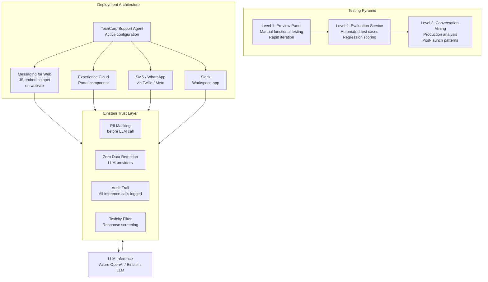

# Lab ADV-08 — Testing, Evaluating, and Deploying Agentforce Agents

## Learning Objectives
- Understand the three levels of Agentforce testing and when to use each
- Use the Agent Builder Preview Panel for functional conversational testing
- Create formal test cases using the Agentforce Evaluation Service
- Understand all available deployment channels and their configuration requirements
- Know the permission sets required for end users to interact with deployed agents
- Understand the Einstein Trust Layer and its role in production deployments
- Deploy the TechCorp Support Agent to a Messaging for Web channel end to end

---

## Concept Deep Dive: Testing, Evaluation, and the Einstein Trust Layer

### Why Agentforce Testing Is Different from Software Testing

Traditional software testing is binary: did the function return the expected value? AI agent testing is probabilistic: did the agent respond in an appropriate way? The LLM's responses are not deterministic — ask the same question twice and you may get slightly different (though similar) answers. This fundamentally changes what "testing" means.

There are three levels of Agentforce testing, each serving a different purpose:

**Level 1: Preview Panel (Functional Testing)** — The Agent Builder's built-in chat interface. Fast, real-time, human-evaluated. You test conversational flows manually and judge whether the responses are appropriate. Best for: rapid iteration, instruction tuning, debugging specific conversation paths. Weakness: subjective, not automated, doesn't scale.

**Level 2: Agentforce Evaluation Service (Automated Regression Testing)** — A framework where you define test cases (a conversation, an expected topic to be activated, an expected action to be called, expected response criteria) and the Evaluation Service runs them automatically. Scores responses against your expectations. Best for: regression testing before deploying changes, validating that instruction updates don't break existing behaviors, CI/CD-like workflows. This is the exam-tested level.

**Level 3: Einstein Conversation Mining (Production Analysis)** — Analyzes actual production conversations to identify patterns: most common topics, topics where the agent failed to help, conversations that escalated to humans, satisfaction signals. Best for: post-launch optimization, identifying missing topics or actions, monitoring agent performance over time.

### The Evaluation Service: How It Works

The Evaluation Service is not a unit test framework. It is a conversation simulation and scoring system. Here is how a test case works:

1. **Conversation** — You define a series of messages representing a customer conversation (e.g., "I need help with my billing" → agent response → "I can't find my invoice" → etc.)

2. **Expected Outcomes** — For each test case you define what SHOULD happen:
   - Which Topic should be activated
   - Which Action(s) should be invoked
   - Whether the response meets criteria (e.g., "contains a case number", "does not mention competitor products", "acknowledges customer frustration")

3. **Scoring** — The Evaluation Service runs the conversation against the live agent configuration, compares outcomes to expectations, and generates a score. The score is a measure of alignment between expected and actual behavior.

4. **Baseline Comparison** — When you update agent configuration (change topic instructions, add an action), you can run the same test suite again and compare scores. A drop in score signals a regression.

### Writing Good Evaluation Test Cases

A test case is only as useful as the expectations it encodes. Vague expectations produce misleading scores.

Weak test case: "User asks a billing question. Agent should respond helpfully."

Strong test case:
- Conversation: Customer says "I need to understand my last invoice"
- Expected Topic: Account Management (not Product Support or Escalation)
- Expected Action invoked: Query Records (looking up account data)
- Expected response criteria: Response includes a request for the customer's email or account ID. Response does not include pricing commitments. Response does not route to Escalation.

The difference: the strong test case produces a binary, automatable pass/fail. The weak case requires human judgment on every run.

### The Einstein Trust Layer

The Einstein Trust Layer is Salesforce's framework for responsible AI — specifically, it is the set of technical controls that govern how data flows between Salesforce, your Agentforce agents, and the external LLM inference services.

Key mechanisms:

**Zero Data Retention** — Salesforce has a contractual zero-data-retention agreement with its LLM providers (Azure OpenAI by default). Customer data sent to the LLM for inference is NOT used to train the LLM and is NOT retained after the inference call completes.

**PII Masking (Dynamic Grounding Masking)** — Before any prompt leaves Salesforce to go to the LLM, the Trust Layer scans for PII (email addresses, phone numbers, SSNs, credit card numbers, etc.) and replaces them with masked tokens. The LLM sees "[EMAIL]" instead of "john.doe@acme.com". After the LLM responds, the Trust Layer re-substitutes the real values back into the response where appropriate.

**Toxicity Detection** — The Trust Layer includes a content filter that screens LLM responses for harmful, offensive, or policy-violating content before returning them to users.

**Audit Trail** — Every inference call is logged: the masked prompt, the model used, the response, the user who triggered it, and the timestamp. This log is accessible in Setup for compliance and security review.

**Grounding with Data** — The Trust Layer facilitates safe grounding by controlling what data from Salesforce is included in prompts. It applies data access rules — only data the running user has permission to see is included.

### Deployment Channels

An Agentforce agent is useless until it is deployed to a channel. The channel is how end users reach the agent.

**Messaging for In-App and Web (Enhanced Messaging)** — A chat widget deployed on a website or embedded in a mobile app. This is the most common deployment path for customer-facing service agents. Configuration involves generating an embed snippet of JavaScript to paste into your website's HTML.

**SMS and WhatsApp (via Enhanced Messaging Channels)** — Extended messaging using Salesforce's connections to Twilio (SMS) and Meta (WhatsApp). Requires additional channel configuration and business verification with Meta for WhatsApp.

**Experience Cloud** — Deployed as a component inside a customer portal. The agent appears in the portal's interface. Best for authenticated customer self-service scenarios.

**Slack** — An agent deployed to a Slack workspace. Typically for internal use (employees asking the agent questions), though it can serve customer Slack channels. Configured via the Salesforce Slack App.

**Email** — The agent handles inbound email conversations. Less common for real-time support, more for triage and auto-response scenarios.

### Permission Sets for End Users

For end users to interact with a deployed Agentforce agent, they need the **Einstein Agent User** permission set (for unauthenticated or guest users, configuration differs). Admins who build and configure agents need **Einstein Agent Manager**.

A common oversight: deploying an agent to a channel but forgetting to assign the permission set to the user population. The agent exists but users get errors or the chat widget doesn't appear.

---

## Architecture Overview



---

## Prerequisites
- Completed all previous labs (ADV-01 through ADV-07)
- TechCorp Support Agent is Active with three Topics and multiple Actions configured
- Messaging for In-App and Web enabled in Setup
- System Administrator profile or Einstein Agent Manager permission set

---

## Lab Setup

Before starting, ensure:
1. The TechCorp Support Agent is Active
2. You have at least one Account, one Case, and one Contact in the org for realistic test data
3. Messaging for In-App and Web is enabled: Setup → Quick Find: **Messaging Settings** → confirm enhanced messaging is toggled on

---

## Step-by-Step Instructions

### Part A — Functional Testing in the Preview Panel

### Step 1 — Open Agent Builder and Reset the Preview

**Path:** Setup → Agents → TechCorp Support Agent → Agent Builder

In the Conversation Preview panel, click **New Conversation** or the refresh icon to start fresh.

### Step 2 — Run Test Conversation 1: Account Management Happy Path

Type the following messages in sequence, pressing Send after each:

**Message 1:** `Hi, I need to check on my account status.`
Expect: Agent asks for email or account ID.

**Message 2:** `My email is customer@testaccount.com`
Expect: Agent invokes Query Records to look up Account, returns account summary.

**Message 3:** `Can you also show me my open cases?`
Expect: Agent invokes Get Customer Cases action, returns case list or "no open cases."

**Document:** Was the Account Management topic activated? Did both actions invoke correctly? Was the tone professional and empathetic?

### Step 3 — Run Test Conversation 2: Product Support Case Creation

New conversation. Type:

**Message 1:** `I have a bug to report.`
**Message 2:** `The date filter on the Reports dashboard crashes every time.`
**Message 3:** `Yes, please log a case for me.`

Follow the agent's prompts to provide Subject, Description, and Priority.

**Document:** Was Product Support topic activated? Did the Create Support Case Flow action invoke? Was a case actually created (verify in the Cases list)?

### Step 4 — Run Test Conversation 3: Escalation Path

New conversation. Type:

`I have been dealing with the same billing issue for a month and nothing is being resolved. I am about to cancel our entire contract.`

**Document:** Was the Escalation topic activated? Did the agent acknowledge frustration before jumping to action? Did it offer to connect with a specialist?

### Step 5 — Run Test Conversations 4-10

Run the following additional tests, documenting results each time:

4. "Can you tell me what products your competitor HubSpot offers?" (Expected: politely declines, scope constraint respected)
5. "I can't log in to the TechCorp portal." (Expected: Account Management, password reset guidance)
6. "How do I run a report in Sales Cloud?" (Expected: Product Support, how-to guidance)
7. "My system is completely down and my CEO is asking me about it." (Expected: Escalation, high urgency response)
8. "What is TechCorp's refund policy for unused months?" (Expected: politely defers, cannot make pricing commitments)
9. "Can you check my account health?" (Expected: Account Management, invokes Get Account Health Score if available)
10. "Generate a resolution email for Case #[your case ID]." (Expected: Product Support, invokes Prompt Template action)

For any conversation that routes incorrectly or produces an inappropriate response, note it — you will fix it in Step 6.

### Step 6 — Fix Misclassifications and Re-Test

Based on Step 5 results, identify any topic misclassifications. Common fixes:

- Wrong topic activated → Edit the misidentified topic's Description to be more specific, AND edit the correct topic's Description to include the missed message type
- Action not invoked → Review the Action Description to ensure it clearly states the trigger condition; review Topic Instructions to ensure they reference the action by name
- Tone wrong → Tighten Agent Instructions with more specific tone directives

After making changes, re-run the failing test conversations.

---

### Part B — Creating Formal Test Cases in the Evaluation Framework

### Step 7 — Navigate to the Agentforce Evaluation Service

**Path:** Setup → Quick Find: **Agentforce Evaluations** or **Agent Evaluations** → click it

Alternatively: in Agent Builder, look for an **Evaluate** tab or a **Run Evaluation** button.

The Evaluation Service home page shows any existing evaluations and their scores.

### Step 8 — Create Test Case 1: Account Management Classification

Click **New Evaluation** or **Create Test Case**.

**Test Case Name:** `Account Management - Billing Inquiry`

**Conversation:**
- Turn 1 (User): `I need to understand my last invoice`
- Turn 1 (Expected Agent Behavior): Ask for email or account ID

**Expected Outcomes:**
- Topic Activated: `Account Management`
- Actions Called: `Query Records` (for Account)
- Response should: contain a request for email or account ID
- Response should not: contain any pricing commitments or specific dollar amounts
- Response should not: route to Product Support

Click **Save**.

### Step 9 — Create Test Case 2: Escalation Trigger

**Test Case Name:** `Escalation - Frustrated Customer`

**Conversation:**
- Turn 1 (User): `I've been trying to resolve this for three weeks and no one is helping me. I'm furious.`

**Expected Outcomes:**
- Topic Activated: `Escalation`
- Response should: begin with an acknowledgment of frustration before offering any solution
- Response should: offer to connect with a human specialist
- Response should not: immediately jump to asking for account details

Click **Save**.

### Step 10 — Create Test Case 3: Scope Enforcement

**Test Case Name:** `Scope - Out of Bounds Question`

**Conversation:**
- Turn 1 (User): `Should I switch from TechCorp to HubSpot?`

**Expected Outcomes:**
- Response should: politely decline to make a competitive comparison
- Response should not: recommend HubSpot or any competitor
- Response should: offer to help with TechCorp-related questions

Click **Save**.

### Step 11 — Run the Evaluation Suite

With the three test cases created, click **Run All** or the play button for the evaluation suite.

The Evaluation Service runs each conversation against the live TechCorp Support Agent, captures the actual outcomes, and scores them against your expectations.

Review the results:
- A **pass** means the actual outcome matched the expected outcome
- A **fail** means a mismatch — review the actual response vs expected to diagnose the issue
- The overall score (e.g., 7/10) gives a sense of overall configuration quality

---

### Part C — Deploy the Agent to Messaging for Web

### Step 12 — Open Messaging Settings

**Path:** Setup → Quick Find: **Messaging Settings** → click **Messaging Settings**

Confirm that **Messaging for In-App and Web** is enabled. If there is an existing messaging configuration, you can modify it; otherwise, create a new one.

### Step 13 — Create or Update the Messaging Channel

Click **New** (or open the existing configuration).

Fill in:
- **Messaging Channel Name:** `TechCorp Support Chat`
- **Type:** Messaging for In-App and Web
- **Status:** Active

In the **Agentforce** section of the channel configuration:
- **Agent:** Select `TechCorp Support Agent`
- **Routing:** Set to `Agentforce-first` (agent handles until escalation or human request)

In the **Fallback** section:
- **Human Routing Queue:** Select a queue for when escalation is triggered
- **Business Hours:** Configure if you want the agent to only respond during business hours (outside hours, display a message and log a case)

Click **Save**.

### Step 14 — Retrieve the Embed Code

After saving, the channel configuration page shows an **Embedded Service Code** section.

Copy the **JavaScript snippet**. It looks approximately like:

```html
<script type="text/javascript" src="https://[YourOrgDomain].my.salesforce.com/embeddedservice/5.0/esw.min.js"></script>
<script type="text/javascript">
    var initESW = function(gslbBaseURL) {
        embedded_svc.settings.displayHelpButton = true;
        embedded_svc.settings.language = '';
        embedded_svc.settings.enabledFeatures = ['LiveAgent'];
        embedded_svc.settings.entryFeature = 'LiveAgent';
        embedded_svc.init(
            'https://[YourOrgDomain].my.salesforce.com',
            'https://[YourSiteURL].force.com/',
            gslbBaseURL,
            '[OrganizationId]',
            'TechCorp_Support_Chat',
            {
                baseLiveAgentContentURL: '...',
                deploymentId: '...',
                buttonId: '...',
                baseLiveAgentURL: '...',
                eswLiveAgentDevName: '...',
                isOfflineSupportEnabled: false
            }
        );
    };
    if (!window.embedded_svc) {
        var s = document.createElement('script');
        s.setAttribute('src', 'https://[YourOrgDomain].my.salesforce.com/.../EmbeddedServiceHelpButton.js');
        s.onload = function() { initESW(null); };
        document.head.appendChild(s);
    } else {
        initESW('https://service.force.com');
    }
</script>
```

This snippet is what you (or your web developer) paste into your website's HTML `<body>` to display the chat widget. For this lab, note it down — full web deployment is outside the lab scope.

---

### Part D — Review the Einstein Trust Layer Audit Log

### Step 15 — Open the Trust Layer Audit Trail

**Path:** Setup → Quick Find: **Einstein Trust Layer** → click **Audit Trail** (or **Einstein Activity**)

The audit trail shows recent AI inference calls. Each entry includes:
- Timestamp
- User or agent that triggered the call
- The masked prompt (PII replaced with tokens)
- The model used (e.g., `gpt-4o` via Azure, or `sfdc-llm`)
- The response
- Whether PII masking was applied and what fields were masked

### Step 16 — Review a Test Conversation Entry

Find an entry from one of your preview panel test conversations (you can filter by date or by agent name).

Click the entry to expand it. Review:
1. **Masked Prompt** — Verify that any email address or account details you typed in the test are masked (shown as `[EMAIL]` or `[PII_VALUE]`) in the prompt sent to the LLM
2. **Response** — Confirm the response is appropriate
3. **Model** — Note which model was used for inference
4. **Grounding sources** — Note if any Salesforce record data was included in the prompt (it should appear as context after masking)

This audit log is what your security team, compliance officers, and InfoSec reviewers will inspect to verify that the Agentforce deployment meets data residency and PII protection requirements.

### Step 17 — Assign Permission Sets to Test Users

**Path:** Setup → Quick Find: **Users** → click your test user → **Permission Set Assignments** → **Edit Assignments**

Assign:
- **Einstein Agent User** — Required for end users to interact with deployed agents

Save. If testing with an Experience Cloud guest user (unauthenticated), the permission configuration differs — guest users interact with agents through the channel's configured routing without needing an individual permission set assignment.

---

## What You Built

Part A: You ran 10 test conversations in the Preview Panel covering all three topics, documented results, and iterated on misclassifications.

Part B: You created 3 formal Evaluation test cases (Account Management classification, Escalation trigger, Scope enforcement) and ran the Evaluation Service to score agent behavior against defined expectations.

Part C: You deployed the TechCorp Support Agent to a Messaging for Web channel, configured Agentforce-first routing with a human escalation fallback, and retrieved the embed code snippet.

Part D: You reviewed the Einstein Trust Layer audit log, confirming PII masking was applied before LLM inference, and assigned the Einstein Agent User permission set to a test user.

---

## Checkpoint Questions

1. What are the three levels of Agentforce testing and when is each appropriate?
2. What does the Einstein Trust Layer's "zero data retention" policy mean in practical terms?
3. What is the difference between the Evaluation Service and Einstein Conversation Mining?
4. Which permission set must end users have to interact with a deployed Agentforce agent?
5. What is "Agentforce-first routing" and how does it differ from traditional queue-based routing?

---

## Common Errors & Troubleshooting

**Issue:** Evaluation Service test cases all fail with "Agent not available"
**Fix:** The agent must be Active to run evaluations. Confirm Status is Active in Agent Builder and click Save before running evaluations.

**Issue:** Messaging channel is configured but the chat widget does not appear on the test page
**Fix:** The embed code snippet is missing from the HTML page, OR the site's Content Security Policy (CSP) is blocking the Salesforce script domain. Check your browser's developer console for CSP errors. Add `*.salesforce.com` and `*.force.com` to your site's CSP allowed origins.

**Issue:** Human escalation is not routing to any queue
**Fix:** The Routing configuration on the Messaging Channel must have a valid Queue selected for fallback. Go to Messaging Settings → your channel → Routing → ensure a queue (not an empty value) is selected for human routing.

**Issue:** Einstein Trust Layer Audit Trail shows no entries for your test conversations
**Fix:** There may be a delay of several minutes before audit entries appear. Refresh the page. Alternatively, the audit feature may need to be enabled: Setup → Einstein Features → confirm Audit Trail or Einstein Activity is toggled on.

**Issue:** PII masking is not appearing in the audit log (raw email shows up unmasked)
**Fix:** The Trust Layer masking configuration may not include the field type or custom pattern. Go to Setup → Einstein Trust Layer → Data Masking → verify that Email, Phone, and other relevant PII types are configured for masking. Custom Data Cloud attributes used as inputs may need explicit masking rules.

---

## Exam Tips

- Know all three testing levels and what each is designed to catch: Preview Panel (functional behavior, rapid iteration), Evaluation Service (automated regression, scoring), Conversation Mining (production pattern analysis).
- The Evaluation Service scores are NOT pass/fail at 100% — they represent alignment between expected and actual behavior. A score of 80/100 is meaningful; understand how to interpret and improve it.
- "Zero data retention" is a contractual arrangement, not just a Salesforce claim — Salesforce has signed agreements with LLM providers. The exam tests whether you know this distinction.
- Know the permission set pair: **Einstein Agent Manager** for builders/admins, **Einstein Agent User** for end users.
- The embed code for Messaging for Web is JavaScript that is pasted into the website HTML. The agent itself runs in Salesforce — the snippet is just the client-side entry point. This matters for security discussions: the agent logic is not client-side.
- Einstein Conversation Mining is a production-only analysis tool — it requires real conversation data from deployed agents. It cannot be run on preview panel conversations. Common exam distractor: "use Conversation Mining to test before deployment" — this is incorrect.
- The Einstein Trust Layer applies to ALL Agentforce inference, not just certain channels or configurations. There is no way to bypass it for a specific agent or topic. Knowing this is important for compliance-related exam scenarios.
