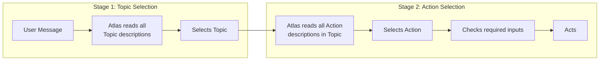
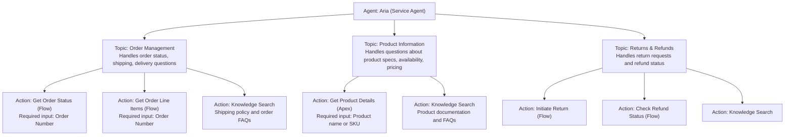
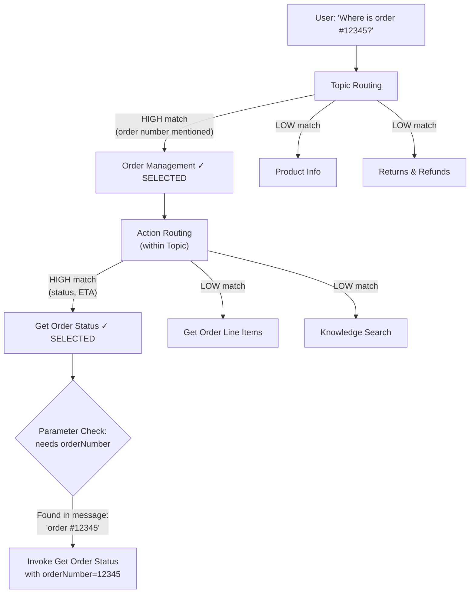

# Topics and Actions

## Exam Domain
Building Agentforce Agents — ~25% of exam weight (heaviest section)

## Core Concepts

### What Topics Are
A **Topic** is a named, described conversation domain. It tells Atlas what category of request belongs here and which Actions are available for it. Every Agent must have at least one Topic. Topics are the first routing layer.

A Topic has:
- **Label:** A short identifier (displayed in Studio)
- **Description:** Natural language text Atlas reads to route messages to this Topic — this is critical
- **Actions:** The operations Atlas can perform when this Topic is active

### Topic Description Best Practices
The description is the routing engine. Write it as three components:

**What it handles:**
> "This topic handles customer inquiries about order status, shipping, and delivery estimates."

**When to activate (trigger scenarios):**
> "Activate when a customer asks where their order is, when it will arrive, why shipping is delayed, or mentions a specific order number."

**Explicit exclusions (when NOT to use):**
> "Do NOT use for returns, refunds, billing disputes, or product availability questions."

The exclusions are the most commonly skipped part and the most commonly tested on the exam. Without exclusions, overlapping Topics fight over ambiguous messages.

### What Actions Are
An **Action** is an operation Atlas can execute. Actions live inside Topics. When Atlas selects a Topic, it then chooses which Action to invoke based on a second semantic match.

Four Action types:

| Action Type | What It Calls | Requires |
|-------------|--------------|---------|
| **Flow Action** | Autolaunched Flow | Flow must be Active; input vars "Available for Input"; output vars "Available for Output" |
| **Apex Action** | @InvocableMethod | Method must be @InvocableMethod; inputs/outputs declared as InvocableVariable |
| **Prompt Template Action** | Flex Prompt Template | Template must be Active; only Flex type supported |
| **Knowledge Search Action** | Einstein Knowledge | Knowledge base must be enabled; relevance threshold set |

### Action Description Best Practices
Same three-component format as Topics, but at the Action level:

**What it does:**
> "Retrieves the current status and estimated delivery date for a customer's order."

**When to call it:**
> "Call this when the customer asks where their order is, when it will arrive, or for shipping tracking information."

**Required inputs:**
> "Requires the order number. Ask the customer for their order number if not already provided."

The required inputs line is how Atlas knows to extract a parameter from conversation or ask a clarifying question if it's missing.

### The Two-Stage Routing Summary

This two-stage architecture means you can have many total Actions across the agent without congesting any single routing decision. Each Topic acts as a namespace.

### Topic Scope Design Principles
- **3–7 Topics per agent** is the recommended range (Salesforce guidance)
- Keep Topics narrow enough that an outsider reading the description would know exactly what goes in it and what doesn't
- If you can't explain a Topic's scope in 2–3 sentences, it's too broad
- Good test: If you have two Topics whose descriptions could apply to the same message, rewrite one or merge them

### Adding Knowledge Search Action
Knowledge Search is a standard Action type — you add it to a Topic just like any other Action. When Atlas invokes it, it retrieves relevant Knowledge articles and uses them to ground the response. Every Topic that involves answering factual questions about your products/policies should have a Knowledge Search Action.

## PTA / SA Relevance

### How Partners Should Scope Topics
The Topic scoping conversation is usually the most important design session in an Agentforce project. Method:
1. Pull 500–1000 recent customer service transcripts
2. Cluster by topic/category
3. Top 5–7 clusters become your Topics (they should cover 60–70% of volume)
4. Build Actions for the operations within each cluster
5. Long-tail edge cases: either add an "Other" Topic with a Knowledge Search fallback or leave them for human agents

### Topic Description Failure Patterns in Production
From real implementations:
- **"Handles all customer service questions"** — useless; matches everything
- **"Customer order inquiry"** without exclusions — routes returns and billing too; fight with other Topics
- **Jargon-heavy descriptions** — "Manages SFDC Order Object queries" — Atlas understands natural language better than object names; write as a customer would speak

### Multi-Action Patterns Per Topic
It's common to have multiple Actions in one Topic working together:
- **Knowledge Search Action:** for policy/FAQ answers
- **Flow Action:** for data lookup (order status, account details)
- **Prompt Template Action:** for synthesizing/summarizing after data retrieval

Atlas can invoke these in sequence within one turn. Common pattern: Flow Action gets data → Prompt Template Action formats a personalized summary.

### Action Granularity Decision
A common design question: should you build one big Flow that does everything, or several small Flows each as a separate Action?

**Multiple small Actions preferred when:**
- The operations are distinct and separately useful
- You want Atlas to choose which operation fits the request
- Each operation has different required inputs

**One larger Flow preferred when:**
- The operations must always run in sequence
- You want reliability over routing flexibility (fewer routing decisions = fewer routing errors)
- The operations are too granular to describe individually in Atlas-meaningful terms

## Architecture

### Topic-Action Hierarchy in Practice

**Limitations:**
- Recommended 3–7 Topics maximum per agent; more degrades routing quality
- More than 10–12 Actions per Topic creates description collision risk
- Every Action description + Topic description consumes context window tokens at runtime
- Actions must be in a Topic to be callable — standalone Actions not visible to Atlas

### Action Type Requirements Matrix

| Action Type | Required Config |
|---|---|
| **Flow Action** | Autolaunched Flow (NOT Screen Flow); Flow status: Active; Input vars: "Available for Input" checked; Output vars: "Available for Output" checked |
| **Apex Action** | @InvocableMethod annotation; @InvocableVariable for each input/output; required=true or required=false; Method accessible to agent's running user |
| **Prompt Template Action** | Template type: Flex (not Field Gen, not Record Summary); Template status: Active; Template exposed as Agentforce Action in Builder |
| **Knowledge Search Action** | Einstein Knowledge enabled; At least one Knowledge base active; Relevance threshold configured (0.5–0.6 recommended) |

**Limitations:**
- Screen Flows CANNOT be Agent Actions — most common implementation blocker
- Flow must be Active to appear in Action picker — Draft Flows don't show up
- Only Flex Prompt Templates work as Actions — Field Generation, Record Summary, Sales Email are not callable by Atlas
- Knowledge Search result count is bounded — typically max 3 articles returned per search (configurable)

### Atlas Two-Stage Routing Detail

## Key Facts to Memorize
- Topics = conversation domains; Actions = operations within Topics
- Topic description: What / When to activate / Explicit exclusions
- Action description: What it does / When to call / Required inputs
- Four Action types: Flow, Apex, Prompt Template (Flex only), Knowledge Search
- **Flow must be Autolaunched** — Screen Flows cannot be Actions
- Flow must be **Active** to appear in the Action picker
- Input variables must have "Available for Input" checked
- Output variables must have "Available for Output" checked
- Recommended: 3–7 Topics per agent
- Two-stage routing: Topic first, Action within Topic second

## Customer Advisory Tips
- **Topic scoping workshop:** Run a 2-hour session with the customer's subject matter experts. Review recent transcript samples together. Identify the natural clusters. These are your Topics. Don't let engineers define Topics in isolation — the best Topics come from people who understand the customer's language.
- **Description peer review:** Have a non-technical team member read each Topic and Action description. If they can't tell from the description exactly when that Topic or Action would activate, rewrite it.
- **Exclusions save projects:** The "Do NOT use for" clause in Topic descriptions prevents the most common misrouting scenarios. Every Topic description should have at least one exclusion that distinguishes it from adjacent Topics.
- **Actions are not microservices:** Some developers want to build dozens of atomic Actions (one per CRM field). Don't. Build Actions at the level of "things a customer might ask for in one request." If the customer would never ask for just one sub-step, it shouldn't be its own Action.

## Exam Traps
- Thinking any type of Prompt Template works as an Action — only **Flex** templates are callable by Atlas as Actions
- Thinking a Draft Flow appears in the Action picker — it must be **Active**
- Confusing Topic (conversation domain) with Action (invocable operation) — questions often test whether you know which layer to put something in
- Topic descriptions without exclusions — the exam loves to test the consequence of missing exclusion clauses (routing ambiguity)
- Forgetting that Flow input variables need "Available for Input" checked — the Flow may exist and be Active but Atlas still can't pass inputs if this isn't set

## Practice Questions
**Q:** A developer adds a Screen Flow as a Flow Action to an Agentforce Topic. What happens during testing?
**A:** The Flow cannot be used as an agent Action. Screen Flows are not supported — only Autolaunched Flows can be agent Actions.

**Q:** An Atlas agent correctly selects the Order Management Topic but then consistently picks the wrong Action within it. What is the most likely cause?
**A:** The Action descriptions within the Topic are too similar or vague. Rewrite Action descriptions with more specific "when to call" language and explicit distinctions between similar Actions.

**Q:** Which of the following is a valid Agentforce Action type?
A) Screen Flow  B) @Future Apex  C) Flex Prompt Template  D) Batch Apex
**A:** C — Flex Prompt Template. Screen Flows don't work as agent Actions. @Future and Batch Apex aren't invocable via @InvocableMethod. Only Flex Prompt Templates work as Prompt Template Actions.

**Q:** A Topic for "Billing Questions" keeps also handling return requests. What should the developer add to the Topic description?
**A:** An explicit exclusion: "Do NOT use for return requests or refund inquiries." The exclusion tells Atlas when NOT to route to this Topic.
