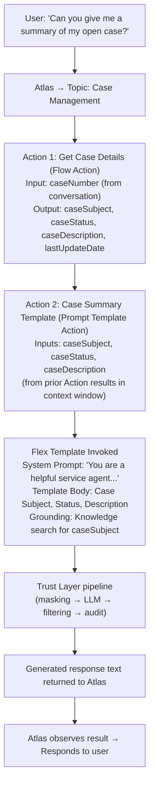
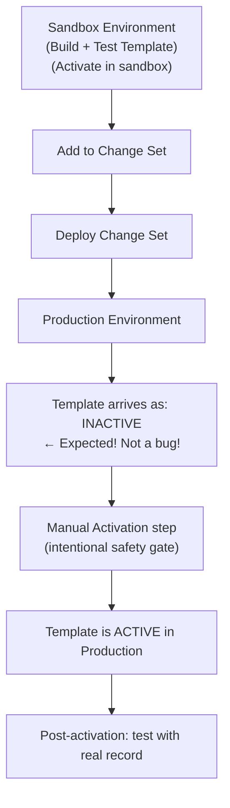

# Advanced Prompt Templates — Merge Fields, Grounding, and Deployment

## Exam Domain
Prompt Builder & Templates — ~20% of exam weight

## Core Concepts

### Merge Field Syntax
Every dynamic value in a template is inserted via a merge field. The syntax is strict:
```
{!ObjectName.FieldName}
```

The **exclamation point is required**. Missing it means the merge field renders as literal text instead of resolving to a value. This is the most common Prompt Builder error.

Examples:
```
{!Case.Subject}          ← Case subject field
{!Case.Account.Name}     ← Related Account name (parent lookup)
{!Contact.Email}         ← Contact email
{!customParam}           ← Custom input parameter you defined
```

### Custom Input Parameters
Flex templates support **custom input parameters** — variables you define that the caller (agent, Flow, Apex) passes in at runtime. These are used for:
- Dynamic context from the conversation
- Data that's not available from a Salesforce record merge field
- Values computed elsewhere before the template is invoked

In the template body, reference them as: `{!parameterName}`
When calling from Agentforce, the Action description tells Atlas what value to pass.

### Related List Limitation
A merge field can pull in a **single field value** from a related parent record (e.g., `{!Case.Account.Name}`) but **cannot directly pull a related list** (e.g., all related contacts on an account, all line items on an order).

**Workaround for related list data:**
1. Build an Autolaunched Flow that queries the related list and concatenates it into a single text string
2. Call the Flow as a pre-processing Action before the Prompt Template Action
3. Pass the result text as a custom input parameter to the template

Example: "All open cases for this account" → Flow queries related Cases → formats as text → passes `{!openCases}` to Flex template.

### Grounding Within a Template
Templates can include a grounding query directly in their definition. When the template is invoked:
1. The grounding query runs first (searches Knowledge or Data Cloud)
2. Retrieved content is inserted into the assembled prompt
3. LLM generates a response grounded in the retrieved content

The grounding query can itself use merge fields to make the search dynamic:
```
Knowledge Search: {!Case.Subject}
```
This searches Knowledge articles using the Case Subject as the search query — a dynamic, contextual grounding search.

### Testing Workflow
1. **In Prompt Builder:** Select a test record → click Generate → verify output quality
2. Iterate on System Prompt and Template Body until output quality is acceptable across 5–10 test records
3. **Activate the template**
4. **In Agentforce Studio:** Add the Flex template as a Prompt Template Action to a Topic
5. **In Conversation Simulator:** Test the full end-to-end: user message → Atlas routes → calls Action → template invoked → response generated

Test both layers separately. Prompt Builder testing is for template quality; simulator testing is for routing and integration.

### Deployment: Change Sets and Sandbox-to-Prod
This is a specific exam trap: **Prompt Templates arrive INACTIVE after deployment via Change Set.**

The deployment sequence:
1. Build and activate template in sandbox
2. Add template to Change Set
3. Deploy Change Set to production
4. **Template is INACTIVE in production** — this is expected behavior, not a bug
5. Manually activate in production (review and confirm intentionally)

Why: Salesforce requires a deliberate activation step in production so that an AI template can't go live accidentally. This is a safety measure.

**Pre-deployment checklist for Prompt Templates:**
- Template tested with representative records in sandbox
- System Prompt reviewed and approved
- Custom input parameters documented
- Trust Layer audit log confirmed active
- Post-deployment: activate manually in production
- Post-activation: test with one real record in production before announcing to users

### Common Merge Field Errors and Fixes
| Error | Cause | Fix |
|-------|-------|-----|
| Field renders as literal text | Missing `!` in merge field | Change `{Case.Subject}` to `{!Case.Subject}` |
| Field renders as empty | Field is null on the test record | Use a test record where the field has a value; or add null handling |
| Related lookup field returns error | Lookup field is null (no related record) | Ensure related record exists on test record |
| Custom parameter not resolving | Parameter name mismatch | Check parameter name matches exactly (case-sensitive) |
| Template body changes don't appear | Old cached version being tested | Refresh Prompt Builder page after saving |

## PTA / SA Relevance

### Partner Deployment Checklist for Prompt Templates
This is a real deliverable to create for customers going from sandbox to production:

```
Pre-deployment:
[ ] All templates tested with 10+ records covering edge cases
[ ] System Prompts reviewed by legal/compliance
[ ] Custom input parameters documented with expected formats
[ ] Change Set created with templates + any dependencies (Flow, Knowledge)
[ ] Stakeholder sign-off received

Deployment:
[ ] Change Set deployed to production
[ ] Verify templates arrived in production (Setup → Prompt Builder)
[ ] Confirm templates show INACTIVE status (expected)

Post-deployment:
[ ] Activate each template one by one
[ ] Test each activated template with a production record
[ ] Verify audit log entries being created
[ ] Monitor for 24 hours post-activation
```

### Grounding Strategy in Prompt Templates
For enterprise customers building complex Flex templates:
- **Simple factual response:** Ground via Knowledge Search within the template (dynamic search based on merge field)
- **Customer-specific synthesis:** Use Flow pre-processing to gather data from multiple objects, pass as custom params, use template for natural language synthesis
- **Personalized + factual:** Combine: Flow gathers customer data → passes as params; template body includes both customer data params and Knowledge grounding

The most powerful pattern: Flex template with both custom input parameters (customer-specific data) and Knowledge grounding (policy/product facts). The LLM synthesizes both into a personalized, accurate response.

### Advanced Parameter Patterns
For enterprise implementations:
- Pass JSON-structured data as a single text parameter (allows complex data without multiple params)
- Use a "context accumulator" Flow that builds up a rich context string from multiple queries and passes it as one parameter
- Build parameter validation in the Flow that calls the template — check for nulls, format strings, handle missing data before it reaches the LLM

## Architecture

### Full Flex Template Invocation Flow (Agent Context)


**Limitations:**
- Each Prompt Template Action = one LLM call = additional latency (~1–2 seconds typical)
- Context window for the LLM call must fit: System Prompt + Template Body + Grounding results + input parameter values
- Template cannot call another template — no template chaining
- Custom parameters must be primitive text/number — cannot pass complex object graphs

### Merge Field Syntax Reference
```
Standard field:
    {!ObjectName.FieldName}
    {!Case.Subject}
    {!Account.Name}

Parent lookup:
    {!ObjectName.ParentLookup.FieldName}
    {!Case.Account.Name}        ← Account Name from Case's Account lookup
    {!Contact.Account.Industry} ← Account Industry from Contact's Account

Custom input parameter:
    {!parameterName}
    {!additionalContext}
    {!customerHistory}

Date/time formatting (formula-style):
    {!Case.CreatedDate}  ← raw date/time value
```

**Limitations:**
- Maximum 2 levels of relationship traversal in merge fields (object.parent.field)
- Related lists (child records) cannot be directly merged — use Flow pre-processing
- Merge fields in grounding queries are supported (dynamic search) — key feature for contextual Knowledge retrieval
- Null values in merge fields render as empty string — design template body to handle gracefully

### Sandbox-to-Prod Deployment Path


**Limitations:**
- Dependencies not automatically included — if template relies on a Flow or Knowledge category, include those in the Change Set too
- Activation in production must be done by a user with Prompt Template Activate permission
- Rollback: deactivate the template in production; no automated rollback mechanism

## Key Facts to Memorize
- Merge field syntax: **`{!ObjectName.FieldName}`** — exclamation point required
- Related lists cannot be directly merged — use Flow to pre-process and pass as text parameter
- Templates deploy via Change Set and arrive **INACTIVE** in production — must manually activate
- Grounding within a template: search query can use merge fields for dynamic search
- Custom input parameters declared in template, referenced as `{!parameterName}`
- Testing sequence: Prompt Builder first → Agentforce simulator second
- Maximum relationship traversal in merge fields: 2 levels (object.parent.field)

## Customer Advisory Tips
- **The INACTIVE deployment trap is the #1 production incident:** Brief the customer's deployment team explicitly: "After deploying a template via Change Set, you MUST activate it manually in production. It will not be active automatically." Put this in the runbook.
- **Build a template test record set:** Create a set of 10–15 records that represent your full range of scenarios (empty fields, long descriptions, special characters, null lookups). Test every template against this set before deployment.
- **Parameter documentation is a deliverable:** For every Flex template with custom input parameters, document what each parameter expects (type, format, max length, whether nullable). This prevents integration bugs when other teams call the template from Flows or Apex.
- **Template versioning:** Salesforce doesn't have built-in template versioning. Use a naming convention (e.g., "CaseSummaryV2") and keep old versions inactive rather than deleting. Enables rollback if needed.

## Exam Traps
- Templates arrive **INACTIVE** after Change Set deployment — this is expected, not a deployment error
- Wrong merge field syntax (`{Case.Subject}` without `!`) produces silent failure — field renders blank
- Related list data (e.g., list of child records) cannot be pulled via merge field — requires Flow pre-processing
- Thinking you can chain Flex templates (call one template from another) — not supported
- Confusing Prompt Builder testing (template quality) with simulator testing (routing and agent behavior)

## Practice Questions
**Q:** A developer deploys a Flex Prompt Template to production via Change Set. An end user tries to use the template and gets an error that it's inactive. What must be done?
**A:** Manually activate the template in production. Templates arrive INACTIVE after Change Set deployment by design. Go to Prompt Builder in production → select the template → Activate.

**Q:** A template body contains the text `{Case.Subject}`. During testing, the Case Subject appears as literal text "{Case.Subject}" instead of the actual value. What is wrong?
**A:** Missing exclamation point. The correct syntax is `{!Case.Subject}`. Without `!`, the text is treated as a literal string, not a merge field.

**Q:** A template needs to include a formatted list of the last 5 orders for a customer's account. How should this be implemented?
**A:** Build an Autolaunched Flow that queries the last 5 Orders for the account and formats them as a text string. Pass this text as a custom input parameter to the Flex template. Merge fields cannot directly reference related lists.

**Q:** Where should a developer test a Prompt Template's output quality before connecting it to an Agentforce agent?
**A:** In Prompt Builder, using the built-in Generate/Preview interface with test records. Test template quality in Prompt Builder first, then test the end-to-end agent behavior in the Agentforce conversation simulator.
