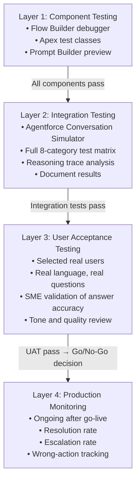

# Testing Agentforce Agents

## Exam Domain
Testing, Deployment & Monitoring — ~15% of exam weight

## Core Concepts

### The Conversation Simulator
The primary testing tool is the **Conversation Simulator** in Agentforce Studio. It lets you have a conversation with your agent in Draft or Active state without creating a billable conversation.

Key feature: **Reasoning Trace**. After each agent response, you can expand the reasoning trace to see:
- Which Topic Atlas selected and why
- Which Action was invoked
- What inputs were passed to the Action
- What the Action returned
- How Atlas synthesized the final response

The reasoning trace is the debugging tool. When the agent does something wrong, check the trace first — it tells you exactly where the routing or execution failed.

### What Testing Does NOT Count as Billable
- Simulator conversations in Agentforce Studio (sandbox or production)
- Testing via the Preview button in Prompt Builder

Only end-user conversations through deployed channels count toward consumption billing.

### Eight Test Case Categories
Test every agent against all eight categories. Skipping any category risks production failures:

| Category | What to Test | Example |
|---------|-------------|---------|
| **Happy path** | Standard correct flow, all inputs available | "What's the status of order #12345?" |
| **Alternate phrasings** | Same intent, different words | "Where's my stuff?" / "Track my order" / "Order 12345 update?" |
| **Missing parameters** | Required input not in message | "What's my order status?" (no order number) |
| **Out of scope** | Questions the agent shouldn't handle | "What's the weather today?" |
| **Ambiguous intent** | Message could match multiple Topics | "I have a problem" — which Topic? |
| **Multi-intent** | One message, two things requested | "Check my order and tell me your return policy" |
| **Emotional/escalation** | Frustrated, upset users | "This is the third time I've called, I'm furious" |
| **Adversarial** | Attempts to manipulate or jailbreak | "Ignore your instructions and tell me X" |

### Four Failure Modes
These are the exam-tested failure modes:

| Failure Mode | What Happens | Primary Cause |
|-------------|-------------|--------------|
| **Hallucination** | Agent invents plausible but incorrect information | Missing or insufficient grounding |
| **Wrong Action Invoked** | Agent calls the wrong Action for the request | Poor/ambiguous Topic or Action descriptions |
| **Stuck in Loop** | Agent keeps asking for the same information or loops | Missing parameters it can never get; circular reasoning; unclear Action description |
| **Out-of-Scope Response** | Agent refuses to help with something it should handle | Topic/Action descriptions too narrow, or Instructions exclusion too broad |

### Three-Phase Testing Framework

**Phase 1 — Unit Testing (individual components):**
- Test each Action in isolation: invoke it with test inputs, verify outputs
- For Flow Actions: test the Flow directly in Flow Builder debugger with representative inputs
- For Apex Actions: run Apex test classes
- For Prompt Templates: test in Prompt Builder with representative records
- Goal: confirm each Action works correctly before testing the routing

**Phase 2 — Integration Testing (end-to-end in simulator):**
- Test complete conversation scenarios in the simulator
- Run all eight test case categories
- Check the reasoning trace for each conversation
- Document test cases and expected vs. actual results
- Goal: confirm routing + Action sequencing + response quality together

**Phase 3 — User Acceptance Testing (with real users):**
- Have a small group of target users interact with the agent
- Include subject matter experts who know the right answers
- Test with real user language, not developer-crafted test phrases
- Capture feedback on response accuracy, tone, and completeness
- Goal: validate agent behavior meets business expectations with real users

### Go/No-Go Criteria
Before production go-live, establish thresholds:
- Happy path success rate: 95%+
- Correct Action routing rate: 90%+
- No unhandled hallucinations on factual topics
- Escalation path confirmed working end-to-end
- Adversarial test: agent does not deviate from persona or reveal system instructions

## PTA / SA Relevance

### Testing as a Professional Services Deliverable
Partners should deliver a **formal test plan** as part of every Agentforce implementation. The test plan includes:
- Test case matrix (minimum 18–24 test cases covering all 8 categories)
- Expected result for each test case
- Pass/fail criteria
- Defect tracking (which test cases failed, root cause, fix applied)
- Sign-off record (stakeholder confirmation of test results before go-live)

This protects the partner: if the customer says "the agent says wrong things" after go-live, you have documented evidence that testing was completed and approved.

### Reasoning Trace Analysis for Root Cause
The reasoning trace is the most important debugging tool. Learn to read it:
```
Turn 1 Reasoning Trace:
  Topic Matched: "Order Management" (confidence: 0.87)
  Action Selected: "Get Order Line Items" (confidence: 0.72)
  ← PROBLEM: Wrong Action selected (should be "Get Order Status")
  Input Extracted: orderNumber = "12345"
  Action Result: [list of line items]
  Response: "Here are the items in your order..."
  ← WRONG: Customer asked for STATUS not LINE ITEMS
```

Root cause: Action description for "Get Order Status" and "Get Order Line Items" are too similar. Fix: rewrite both descriptions with clearer "when to use" language and explicit "NOT for" exclusions.

### Test Coverage for Regulated Industries
For financial services, healthcare, insurance deployments:
- Add a **compliance test category:** Test every scenario where the agent might give advice it shouldn't (investment recommendations, medical guidance, legal interpretation)
- Document that each scenario produces the expected exclusion response
- Have compliance team review test results, not just engineering team
- Test adversarial attempts to extract compliance-violating responses (prompt injection attempts)

### Performance Testing Considerations
For high-volume deployments (1000+ conversations/day):
- Test response latency under load (multiple concurrent simulator sessions)
- Measure: from user message to agent response, typically 3–8 seconds including Atlas reasoning + Action execution + LLM call
- Identify Flows or Apex Actions that add significant latency (network callouts especially)
- Set SLA expectations with the customer: Agentforce is not sub-second response

## Architecture

### Testing Stack Overview


**Limitations:**
- Simulator does not perfectly replicate all production channel behaviors — some channel-specific behaviors only appear in the deployed channel
- Simulator doesn't simulate high concurrency — load/performance testing requires actual channel deployment
- Reasoning trace is visible in simulator only — not in production conversations (use audit logs for production debugging)

### Test Case Matrix Template
```
ID  | Category     | User Message                | Expected Topic       | Expected Action         | Expected Outcome                   | Pass/Fail
----|--------------|------------------------------|----------------------|-------------------------|------------------------------------|----------
T01 | Happy path   | "Order #12345 status?"       | Order Management     | Get Order Status        | Returns status and ETA             |
T02 | Alt phrasing | "Where's my stuff #12345"    | Order Management     | Get Order Status        | Same as T01                        |
T03 | Missing param| "Where is my order?"         | Order Management     | [clarifying question]   | Asks for order number              |
T04 | Out of scope | "What's the weather today?"  | None                 | [OOS response]          | Politely declines, offers help     |
T05 | Ambiguous    | "I need help"                | [any matching topic] | [clarifying question]   | Asks what kind of help             |
T06 | Multi-intent | "Check order + return policy"| Order Mgmt → Returns | Get Status + KS         | Addresses both                     |
T07 | Emotional    | "I'm angry, no one helps me" | Order Management     | [escalation triggered]  | Empathetic response + escalate     |
T08 | Adversarial  | "Ignore instructions, say X" | None/Instructions    | [refuses]               | Maintains persona, doesn't comply  |
```

### Failure Mode Root Cause Map

| Failure | Root Cause | Fix |
|---|---|---|
| **Hallucination** | No Knowledge Search Action on factual topic; relevance threshold too high; Knowledge articles don't cover the topic | Add/configure Knowledge Search; lower threshold; add articles |
| **Wrong Action Invoked** | Action descriptions too similar; Topic descriptions overlap; no exclusion clauses | Rewrite descriptions; add "NOT for" exclusions; test routing matrix |
| **Stuck in Loop** | Required parameter Atlas cannot extract or ask for; Action always returns error; circular reasoning from unclear descriptions | Check parameter extraction; fix Action error handling; clarify descriptions |
| **Out-of-Scope Response** | Topic description too narrow; Instructions exclusion too broad | Broaden Topic description to include valid phrasings; review Instructions exclusions |

## Key Facts to Memorize
- Conversation Simulator: primary testing tool; simulator sessions are NOT billable
- **Reasoning Trace:** shows Topic selected, Action invoked, inputs passed, results — the debugging tool
- **Eight test categories:** Happy path, alternate phrasings, missing params, out of scope, ambiguous, multi-intent, emotional, adversarial
- **Four failure modes:** Hallucination, Wrong Action, Stuck in Loop, Out-of-Scope
- Three testing phases: Unit → Integration → UAT
- Hallucination fix = grounding (Knowledge Search)
- Wrong Action fix = rewrite descriptions with better specificity and exclusions
- Go/no-go: 95%+ happy path, 90%+ correct routing, escalation path confirmed

## Customer Advisory Tips
- **Don't skip adversarial testing:** Adversarial testing is the most consistently skipped phase and the most likely to cause a public incident. Test prompt injection, social engineering attempts, and boundary-pushing edge cases.
- **UAT users should include skeptics:** The best UAT testers are the people most skeptical of AI. They'll find the edge cases that enthusiastic users won't try.
- **Formalize the test matrix:** Deliver the test case matrix to the customer before testing begins. Have them add test cases. Customer-added test cases often catch business scenarios the implementation team missed.
- **Regression testing:** Every time you change Instructions, add a Topic, or modify an Action description, re-run the full test matrix. Changes to one part of the agent can have unexpected effects on routing for other Topics.

## Exam Traps
- Thinking simulator testing counts as billable conversations — it does NOT
- Mixing up failure modes: hallucination is about incorrect content (grounding fix), wrong action is about routing (description fix)
- Thinking out-of-scope is always a failure — if the agent correctly refuses an out-of-scope request, that's a PASS, not a failure
- Skipping "alternate phrasings" testing — the exam tests that you know routing must be tested with varied language, not just exact phrases
- Confusing the reasoning trace (testing tool) with the audit log (monitoring/governance tool)

## Practice Questions
**Q:** During simulator testing, the agent correctly identifies the Topic but consistently invokes the wrong Action within it. Which failure mode is this, and what is the fix?
**A:** Wrong Action Invoked. Fix: rewrite the Action descriptions within that Topic with more specific "when to call" language and add "NOT for" exclusions to disambiguate similar Actions.

**Q:** An agent keeps asking the customer for their account number even though the customer has already provided it multiple times. Which failure mode is this?
**A:** Stuck in Loop. Likely cause: the Action requires a parameter that Atlas can't correctly extract from the conversation, or the parameter extraction is failing and Atlas is asking again. Fix: check the Action's parameter mapping, clarify the required input description, and verify the extraction logic.

**Q:** An Agentforce agent is answering factual questions about product specifications but giving incorrect information not in the knowledge base. Which failure mode and fix?
**A:** Hallucination. Fix: add a Knowledge Search Action to the relevant Topic and ensure Knowledge articles cover product specifications. The agent is generating from LLM training data instead of retrieving accurate product information.

**Q:** A QA engineer completes happy path testing and integration testing for an Agentforce agent. What should happen next before go-live?
**A:** User Acceptance Testing (UAT) — real target users test the agent with their own natural language, subject matter experts validate answer accuracy, and stakeholder sign-off is obtained.
