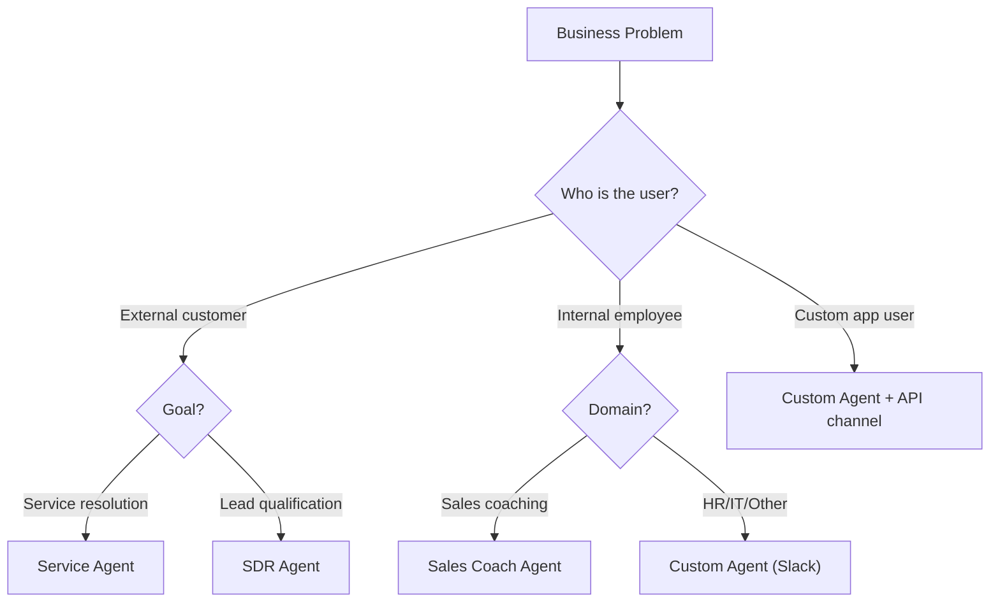
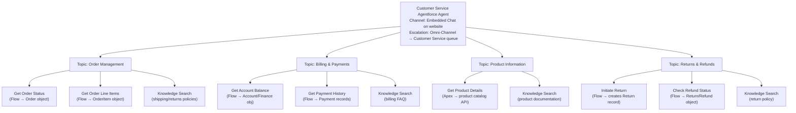

# Use Cases and Business Value

## Exam Domain
Use Cases & Business Value — ~20% of exam weight

## Core Concepts

### The Good Fit Framework — Four Qualifying Questions
Before recommending Agentforce, apply this filter. All four should be "yes":

1. **High volume?** 100s–1,000s of similar interactions per day. Low volume = poor ROI.
2. **Well-defined process?** Clear, agreeable answers exist. If human experts disagree on the right answer, the AI won't do better.
3. **Data available in Salesforce (or integrated)?** Agent needs to retrieve or act on data. No accessible data = no grounding = hallucination.
4. **Bounded scope?** Can you cover 60–70% of volume with 3–7 Topics? If the use case is infinitely variable (every interaction is different), hard to scope.

All YES → strong candidate. Any NO → investigate or redesign.

### Four Canonical Use Cases (Exam Favorites)

**1. Customer Service Deflection**
- Volume: high inbound service volume (order status, billing, FAQ)
- Template: Service Agent
- Topics: Order Management, Billing, Product Info, Returns, General FAQ
- Actions: Flow Actions for data lookup, Knowledge Search for policy/FAQ
- ROI lever: Deflects 60–80% of routine contacts, reducing cost per contact
- Key success factor: Knowledge base quality + well-defined escalation

**2. Sales Lead Qualification (SDR)**
- Volume: high inbound lead volume from marketing campaigns
- Template: SDR Agent
- Topics: Lead Qualification, Meeting Booking, Nurture Campaign
- Actions: BANT conversation flow, Salesforce Scheduler integration, Campaign membership update
- ROI lever: 9× faster lead response, more qualified pipeline, less SDR time on cold leads
- Key success factor: Clear BANT criteria, good integration with calendar/scheduling

**3. HR Employee Self-Service**
- Volume: high HR ticket volume (benefits, PTO, payroll, policy questions)
- Template: Custom Agent (internal)
- Channel: Slack
- Topics: Benefits, Time Off, Payroll/Compensation, HR Policies
- Actions: Knowledge Search (HR policies), Flow Actions (PTO balance lookup, direct manager lookup)
- ROI lever: 20–40% HR ticket deflection, faster employee answers 24/7
- Key success factor: HR Knowledge base coverage, clear escalation to HR team

**4. Field Service Scheduling**
- Volume: high volume of appointment requests, technician scheduling, work order management
- Template: Custom Agent (internal or customer-facing)
- Topics: Appointment Scheduling, Work Order Status, Technician Routing
- Actions: Flow Actions integrating FSL (Field Service Lightning), Work Order creation, calendar availability check
- ROI lever: Automated first-call scheduling, reduced dispatcher workload
- Key success factor: FSL must be implemented; scheduling logic must be in Flows

### Good Fit vs Poor Fit Examples
| Scenario | Fit | Reason |
|---------|-----|--------|
| Customer service: order status, FAQ, billing | ✓ Good | High volume, defined answers, data in Salesforce |
| Inbound lead qualification | ✓ Good | High volume, defined BANT criteria, actions in Salesforce |
| HR policy/benefits questions | ✓ Good | High volume, defined answers, Knowledge base available |
| Complex legal contract review | ✗ Poor | Requires specialized judgment; liability risk; not deterministic |
| Real-time stock trading decisions | ✗ Poor | Millisecond latency required; financial liability; regulatory risk |
| Highly specialized medical diagnosis | ✗ Poor | Liability; requires clinical judgment; regulatory constraints |
| Executive-level strategic advisory | ✗ Poor | Low volume; requires unique context and judgment |

### Use Case Anti-Patterns (Exam-Tested)
These sound like they could work but don't:

- **The Oracle:** "The agent answers any question the employee could ever have." Too broad — no bounded scope, routing becomes impossible, hallucination risk across many domains.
- **The Data Entry Clerk:** "The agent fills in all our CRM fields." Agentforce is for conversational interactions, not batch data entry. Use Flow/automation for deterministic data work.
- **The Legal Advisor:** "The agent handles all compliance inquiries." Risk of incorrect legal/financial advice at scale. Legal exclusions must be explicit; regulatory environments require human oversight for compliance advice.
- **The All-Knowing FAQ:** "The agent answers any question from any part of the business." Without scope boundaries, Topics sprawl, routing fails, and the agent becomes unreliable for everything.

### ROI Levers
| Lever | Mechanism |
|-------|-----------|
| **Cost reduction** | Each agent-resolved conversation costs less than a human-handled one (typically $0.10–0.50 vs $4–15) |
| **Scale** | Agent handles 10× volume humans can at same cost |
| **24/7 availability** | No after-hours human staffing cost; immediate response any time |
| **Consistency** | Agent always follows Instructions; no variability from agent mood, training gaps, or turnover |
| **Rep focus shift** | Human agents handle complex cases where judgment matters; routine cases automated |

## PTA / SA Relevance

### How to Run a Use Case Discovery Session
Structured approach for the first customer meeting:

1. **Process inventory (30 min):** Ask the customer to list their top 10 most common service/interaction types. Volume counts if available.

2. **Good fit filter (20 min):** For each, apply the four qualifying questions. Identify 2–3 strong candidates.

3. **Prioritization (10 min):** Among candidates, which has the best ROI potential (highest volume × most cost-per-contact)?

4. **Scope definition (20 min):** For the top candidate, define 3–5 Topics that would cover 60–70% of the use case volume.

5. **Data availability check (20 min):** For each Topic, what Actions are needed? Is the data accessible in Salesforce (or can it be integrated)?

Result: a scoped use case with defined Topics, identified data dependencies, and ROI estimate.

### Building the Business Case

**ROI calculation template:**
```
Monthly contact volume:           10,000 interactions/month
Deflection rate (conservative):   60%
Interactions deflected:           6,000 / month

Human cost per contact:           $8 (industry average for service)
Agent cost per conversation:      $0.30

Monthly savings:
  Human cost avoided:    6,000 × $8   = $48,000
  Agent cost:            6,000 × $0.30 = $1,800
  Net monthly savings:              = $46,200

Annual savings:                   = $554,400

Implementation cost (estimate):   $100,000–$200,000
Payback period:                   2.5–5 months
```

This model should be customized per customer using their actual contact volume and cost data.

### Industry Vertical Patterns

**Retail/E-commerce:** Highest Agentforce adoption. Primary use case: order status, returns, product Q&A. Service Agent template. Integration with OMS for real-time order data. 70–80% deflection rates achievable.

**Financial Services:** High regulatory sensitivity. Must start with assisted actions. Compliance review of Instructions mandatory. Zero financial advice without disclaimer. Best use cases: account inquiries (balances, statement requests), general product information (NOT advice), appointment scheduling with advisors.

**Healthcare:** PHI handling triggers HIPAA considerations. Audit logging must be enabled. Best use cases: appointment scheduling, general FAQ, provider directory, prescription refill status (if compliant). Not appropriate for clinical or diagnostic queries.

**Manufacturing/Field Service:** High-value use case: work order status, technician dispatch, appointment scheduling. Requires FSL implementation. Internal + external agent combination common.

### When Agentforce Is NOT the Answer
Advise customers honestly:
- **Fully deterministic, no NL required:** Just build the Flow/automation. Agentforce adds cost and latency for no benefit.
- **One-time or low-volume:** ROI doesn't exist below a certain volume threshold. Build the business case before recommending.
- **Liability-critical without human oversight:** Legal, medical, financial advice that exposes the customer to regulatory risk needs human review. Don't automate liability.
- **Technically unbounded scope:** If the customer says "I want it to handle anything," help them define scope first. An unbounded agent is an unreliable agent.

## Architecture

### Use Case Matching Framework


### ROI Impact Model

| | Before Agentforce | After Agentforce |
|---|---|---|
| **Contact routing** | 100% to human agents | 65% to Agentforce, 35% to humans |
| **Cost calculation** | $8 × 10,000 = $80,000/month | ($0.30 × 6,500) + ($8 × 3,500) = $29,950/month |
| **Resolution quality** | Human-dependent | Consistent agent + human fallback |
| **Availability** | Business hours only | 24/7 |
| **Monthly savings** | — | $50,050/month ($600,600/year) |

**Limitations:**
- Deflection rates vary significantly by use case quality, Knowledge base coverage, and scoping
- Agent cost per conversation varies by model and feature usage — get actual pricing from Salesforce before committing to ROI projections
- Implementation and maintenance costs must be factored into payback period
- Not all contacts that agents handle are fully resolved — some "deflected" contacts resurface as human contacts later

### Customer Service Use Case Architecture


## Key Facts to Memorize
- Four good-fit qualifiers: High volume, well-defined, data available, bounded scope
- Four canonical use cases: Customer service deflection, SDR qualification, HR self-service, Field service
- Four anti-patterns: Oracle, Data Entry Clerk, Legal Advisor, All-Knowing FAQ
- Service Agent = customers; SDR Agent = prospects; HR/Field Service = Custom Agent
- ROI levers: cost reduction, scale, 24/7, consistency
- HR agent channel = Slack (internal); Service agent channel = Embedded Chat (external)
- Agentforce is NOT appropriate for: litigation advice, clinical diagnosis, real-time financial trading

## Customer Advisory Tips
- **Use cases drive value; templates are just starting points:** Help customers think in business problems first, not template features. The template selection follows the use case analysis.
- **Avoid the kitchen-sink trap:** Customers often want to add every possible use case to the first agent. Recommend a phased approach: prove value in one focused use case (2–4 Topics), measure ROI, then expand.
- **ROI measurement should be explicit pre-launch:** Set the baseline metrics (contact volume, human cost per contact, resolution rate) before launch. Post-launch comparison without a baseline is much less compelling to executives.
- **First contact resolution is the metric that drives human staffing decisions:** If the agent truly resolves issues on first contact (not just defers them), human agent headcount can be reduced. Measure this carefully — many "deflections" actually come back as repeat contacts.

## Exam Traps
- SDR Agent qualifies prospects, not customers — SDR = Sales Development Rep (pre-sale)
- HR self-service agent = Custom Agent + Slack; NOT Service Agent (which is for customers)
- "High volume" is a necessary condition — Agentforce ROI doesn't exist for low-volume processes
- Identifying use case anti-patterns: "The Oracle" (too broad scope) is a poor fit despite sounding impressive
- Field service scheduling requires FSL — the agent doesn't build FSL from scratch; FSL must be implemented first

## Practice Questions
**Q:** A company has 5,000 inbound customer service contacts per month, 70% about order status and returns, all requiring CRM data lookup. Is this a good Agentforce use case?
**A:** Yes. It meets all four good-fit criteria: high volume (5,000/month), well-defined process (order status/returns), data available (CRM data), and bounded scope (2–3 Topics). Service Agent template with Flow Actions for data lookup and Knowledge Search for policy.

**Q:** A company wants Agentforce to "answer any question any employee could ever have." Why is this a poor use case design?
**A:** Unbounded scope — this is the "Oracle" anti-pattern. Without defined Topics, Atlas routing becomes ambiguous. The agent will be unreliable across all domains. Solution: scope to 3–7 specific, high-volume Topics for the most common employee questions.

**Q:** Which ROI lever is most significant for a 24/7 e-commerce company whose customers shop outside business hours?
**A:** 24/7 availability — the agent handles customer inquiries at any time without after-hours human staffing costs, and immediate response increases customer satisfaction.

**Q:** A financial services firm wants Agentforce to give customers personalized investment advice. Why is this a poor fit?
**A:** Legal Advisor anti-pattern — investment advice is legally regulated (requires licensed advisors), carries liability risk, and cannot be safely automated without clinical/regulatory compliance review. The correct design: agent handles general product information and schedules appointments with human advisors; investment advice excluded from agent scope.
