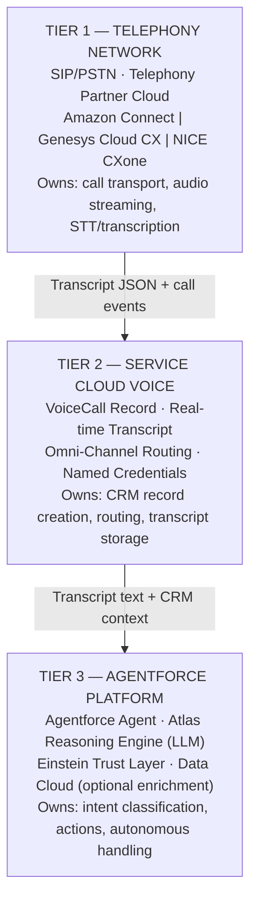

# Course 8: Agentforce Voice — Study Guide

## What This Course Covers

Agentforce Voice extends the Agentforce autonomous agent platform to phone calls. The same agent you configure for chat can now handle inbound calls, assist live agents in real time, and generate post-call summaries. This course maps directly to the **Agentforce Specialist (CRT-271)** exam — voice scenarios appear in the "Use Cases & Business Value" and "Testing, Deployment & Monitoring" domains (~35% combined).

## The Three-Layer Architecture (Memorize This First)

**Limitations:**
- Transcription happens at Tier 1/2 (telephony partner STT engine), not inside Agentforce
- AI reasoning is only as good as transcription quality from Tier 1 — bad audio cascades into bad NLP
- Each tier has distinct failure modes — always diagnose by layer
- Amazon Connect supported regions are a subset of all AWS regions; verify data residency before choosing a region
- Real-time transcription latency: typically 300–800ms end-to-end (speech → Salesforce)

## PTA / SA Relevance — Why This Architecture Matters in Real Engagements

**When a customer asks "can we put AI on our phone calls?":** The first architecture decision is which tier they're asking about. Most mean Tier 3 (autonomous AI or agent assist), but the viability depends on Tier 1 (telephony partner capability and audio quality) and Tier 2 (Service Cloud Voice license and setup). Weak audio quality upstream kills AI accuracy downstream.

**Common partner mistakes:**
- Treating Agentforce Voice as a Salesforce-only configuration — the telephony side requires equal attention
- Underestimating the Amazon Connect Contact Lens / AWS Transcribe configuration effort
- Skipping the transcription accuracy baseline before promising AI routing
- Not budgeting for telephony-side changes (Contact Flow rework, IAM permissions, SIP trunk validation)

**For a customer CX/contact center leader, frame Agentforce Voice as:** A three-layer investment — telephony modernization + CRM integration + AI — not just "adding AI to calls." The ROI comes from containment rate improvement (autonomous) and handle time reduction (agent assist), both measurable within 90 days of launch.

## Course Sections at a Glance

| Section | What I'm Learning | PTA Relevance |
|---------|-------------------|---------------|
| Section 1 — Fundamentals | What Agentforce Voice is, telephony partners, Salesforce setup | Architecture decisions for customer engagements |
| Section 2 — Building Agents | Configuring agents for voice, topics/actions, transcription | Design patterns for voice AI capabilities |
| Section 3 — Advanced | Voice Flows & IVR replacement, Agent Assist, Omni-Channel routing | Enterprise contact center modernization |
| Section 4 — Operations | Testing, monitoring/analytics, advanced use cases & ROI | Business case & governance for customers |

## Prerequisites I Should Already Know

- Agentforce agent concepts: Topics, Actions, Atlas Reasoning Engine (Course 7)
- Service Cloud fundamentals: cases, queues, Omni-Channel routing
- Einstein Trust Layer: data masking, zero-retention, audit trail
- Basic telephony: what a SIP trunk is, inbound/outbound call concepts

## Exam Context

Agentforce Voice is **not a standalone certification**. It shows up as scenario questions inside the **Agentforce Specialist (CRT-271)** exam. Typical question types:
- Identify the right telephony integration model for a business constraint
- Distinguish agent assist vs. autonomous bot for a described workflow
- Choose the correct setup step for enabling voice in Service Cloud

## Customer Advisory — Telephony Partner Selection Quick Guide

| Partner | Best Fit | Watch Out For |
|---------|----------|---------------|
| Amazon Connect | AWS-committed orgs, new deployments, deepest Salesforce integration | Region availability for data residency requirements |
| Genesys Cloud CX | Large enterprise, complex multi-country routing, existing Genesys investment | Partner-managed integration, setup differs from Amazon Connect |
| NICE CXone | Financial services, healthcare, compliance-heavy regulated industries | Third-party licensing costs, partner-managed CTI adapter |
| BYOT | Customer has major existing telephony investment (Avaya, Cisco) they cannot replace | Custom development required, customer owns integration support |
