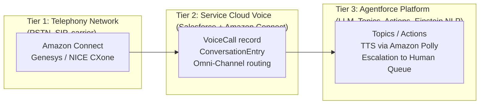
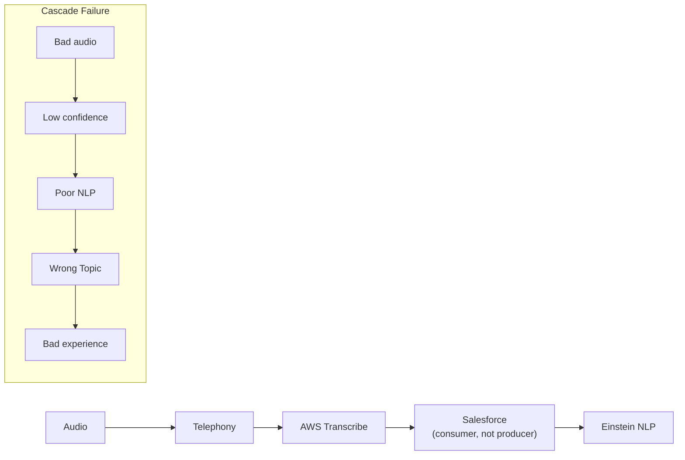
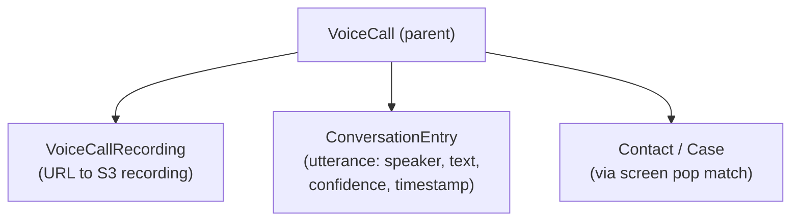

# Agentforce Voice — Exam Cheat Sheet

## Architecture in One Diagram



---

## Telephony Integration Quick Reference

| Mode | Description | Who manages it |
|---|---|---|
| Amazon Connect (managed) | Salesforce manages CTI adapter via managed package | Salesforce manages |
| Partner Telephony (BYOT) | Customer brings Genesys / NICE via Open CTI | Customer/partner manages |
| Amazon Connect ARN format | `arn:aws:connect:<region>:<account>:instance/<id>` | Copied from AWS console |

**License layers:**
- Org: Service Cloud Voice feature license (Company Information)
- User: SCV (Partner Telephony) permission set license (per agent)

---

## Voice Channel Configuration

```
Location: Agentforce Studio → [Agent] → Channels → Voice
NOT: Service Cloud Voice Setup, NOT: Omni-Channel Setup

Key settings:
  Connected Telephony → Amazon Connect integration
  Enable Agentforce Voice → ON
  Persona Name → must EXACTLY match system prompt agent name
  TTS Voice → Amazon Polly options (depend on telephony partner)
  Fallback Queue → MANDATORY
  Transfer Type → Warm (not Cold)
  Max Turns → default 20 (increase for multi-intent calls)
  Barge-in → ON by default

Changes → Draft version → must PUBLISH to take effect
```

---

## Flow Types — Voice Compatibility

| Flow Type | Voice? | Notes |
|---|---|---|
| Screen Flow | NO | Requires UI surface — no screen on a phone call |
| Autolaunched Flow | YES | Headless |
| Voice Call Flow (subtype) | YES ← use this | Has Speak, Get Input, Transfer, Pause elements |
| Scheduled Flow | NO | Not triggered by real-time events |
| Record-Triggered Flow | LIMITED | Can react to VoiceCall creation, not direct voice |

**Voice Flow elements:**
- `Speak` — inject TTS message; bypasses LLM
- `Get Input` — capture speech or DTMF; configure retries + timeout
- `Transfer` — warm (passes context) or cold (no context)
- `Pause` — timed silence; use after questions to prevent VAD false trigger
- `Decision`, `Get Record`, `Update Record`, `Subflow` — standard Flow elements work

---

## Topic Design Rules for Voice

```
BAD (written style):                    GOOD (conversational):
"This topic handles billing inquiries   "Customer says they got charged wrong,
 and dispute resolution requests."       wants to dispute a charge, or asks about
                                         their bill. Example: 'I was charged twice,'
                                         'this charge doesn't look right.'"
Rules:
  - First-person, caller's perspective
  - Include 2–5 example spoken phrases
  - No jargon, no formal language
  - Keep topics semantically distinct (no overlap)
```

---

## Action Compatibility

| Action Type | Voice? | Notes |
|---|---|---|
| Autolaunched Flow action | YES | Must be autolaunched, not Screen Flow |
| Apex action | YES | Returns text for TTS |
| Knowledge Article retrieval | YES | Plain text only — HTML will be spoken |
| External Service callout | CONDITIONAL | Latency must be <2s; add Speak wait message |
| Screen Flow | NO | Requires UI |
| Email Send actions | NO | Output is visual |
| Lightning Component actions | NO | Requires browser DOM |

---

## Key Behavioral Differences (Voice vs. Chat)

| Behavior | Voice | Chat |
|---|---|---|
| Markdown in responses | BROKEN — spoken verbatim | Supported |
| Response length | Short, conversational | Long OK |
| Barge-in | Supported (on by default) | N/A |
| Silence detection | ~3 seconds → re-prompt or disconnect | N/A |
| Error recovery | Re-prompt or DTMF fallback | Ask to rephrase |

---

## Transcription Pipeline



- `is_partial: true` — streaming (incomplete); do not act on this
- `is_partial: false` — finalized utterance; act on this
- Two-channel mode: near-100% speaker accuracy (default on Amazon Connect)
- Single-channel: ML diarization — less reliable
- Confidence ~0.75 threshold (default): below → DTMF fallback; above → process

---

## VoiceCall Object Model



- `VoiceCall.Status` values: Active, Completed, Abandoned, Error
- `ConversationEntry.Speaker`: CUSTOMER, AGENT, VOICE_BOT
- ANI lookup field: `{!$Record.CallerId}` (available in Voice Call Flow)

---

## Omni-Channel for Voice

| Concept | Value |
|---|---|
| Voice capacity cost | 100% (agent can't take other work by default) |
| Routing models | Most Available / Least Active / Skills-Based |
| Bot capacity units | Separate from human agent slots |
| ACW (After Call Work) | Timed wrap-up; returns agent to Available when timer expires |
| Skill relaxation | Removes skill requirements after N seconds if no skilled agent available |
| Queue overflow | Must be explicitly configured — no default behavior |
| Fallback Queue | MANDATORY in voice agent config |

---

## PCI / Compliance

```
Four-layer PCI compliance for voice:
1. Recording pause → Amazon Connect Contact Flow (NOT Salesforce Flow)
2. DTMF-only input for card numbers → telephony layer
3. AWS Transcribe PII redaction → removes card numbers from transcript text
4. Retention policy on VoiceCall + S3 lifecycle rules → coordinated deletion

GDPR:
- Consent prompt → before transcription starts (IVR layer)
- PII redaction → AWS Transcribe
- Right to erasure → delete VoiceCall + ConversationEntry + S3 recording
- FLS on VoiceCall fields → limit transcript access
```

---

## Analytics & Monitoring

| Feature | Type | Use For |
|---|---|---|
| ECI (Einstein Conversation Insights) | Operational | Per-call metrics, keyword alerts, out-of-scope tracking |
| ECM (Einstein Conversation Mining) | Retrospective | Batch ML analysis of historical transcripts — NOT real-time |
| Supervisor Console | Real-time | Queue depth, agent status, listen/barge/whisper |
| VoiceCall + ConversationEntry reports | Post-call | Transcripts, confidence, containment |
| WER (Word Error Rate) | STT quality | Target < 10% for production |
| MOS Score | Audio quality | Measured at telephony layer (Amazon Connect CTR) |
| Containment Rate | Primary ROI metric | Calls resolved by AI / total AI-handled calls |

---

## Setup Order (Critical for Exam)

```
1. Voice Settings (org-level enable)
2. Named Credentials (AWS authentication)
3. Voice Call Centers (link Salesforce to Amazon Connect)
4. Voice Channel (Omni-Channel service channel)
5. Routing Configuration
6. Queue
7. Presence Statuses
8. Agentforce Agent → Channels → Voice (add voice channel, configure persona)
9. Voice Call Flow (autolaunched, Voice Call subtype)
10. App Manager → add softphone widget to Lightning App
```

---

## Limitations Quick Reference

| Area | Key Limitation |
|---|---|
| Telephony | Up to 5 Amazon Connect instances per Salesforce org |
| Transcription | Language support limited — check current list; English has best accuracy |
| Screen Flow | Categorically incompatible with voice — no exceptions |
| Bot capacity | Concurrent bot call limits apply — request increase pre-launch |
| Agent changes | Draft → Publish required before changes take effect |
| Barge-in | On by default; if disabled, callers cannot interrupt |
| Screen pop | E.164 ANI format must match Contact.Phone field format |
| Data Cloud | Adds ~200–500ms latency to call setup |
| Amazon Connect | Concurrent transcription stream quotas — request increase 4–6 weeks before launch |
| MOS < 3.5 | STT accuracy degrades significantly; fix at network/device level, not Salesforce |

---

## Exam Traps Summary

- Screen Flow in voice → NEVER (use autolaunched Voice Call Flow subtype)
- Voice channel config → Agentforce Studio only (NOT Service Cloud Voice Setup)
- Persona name mismatch → agent introduces itself with wrong name
- Recording pause → Amazon Connect Contact Flow (NOT Salesforce Flow)
- Barge-in default → ON (disabling it causes callers to be unable to interrupt)
- ECI vs. ECM → ECI = operational per-call; ECM = retrospective batch (not real-time)
- is_partial: true → streaming; don't act until is_partial: false
- Out-of-scope ≠ low confidence → out-of-scope: understood but unsupported; low confidence: not understood
- Two-channel vs. single-channel → two-channel is near-100% speaker accuracy; single-channel uses imperfect ML
- Fallback queue → mandatory configuration; Salesforce warns if missing
- Agent Assist → assists human agents AFTER escalation; not available during autonomous bot interaction
- ANI format → E.164 (+1XXXXXXXXXX) from telephony; must match Contact.Phone format for screen pop
- Publishing → all agent changes require publish before taking effect
- WER < 10% → production-ready STT baseline; fix Custom Vocabulary before tuning confidence threshold
