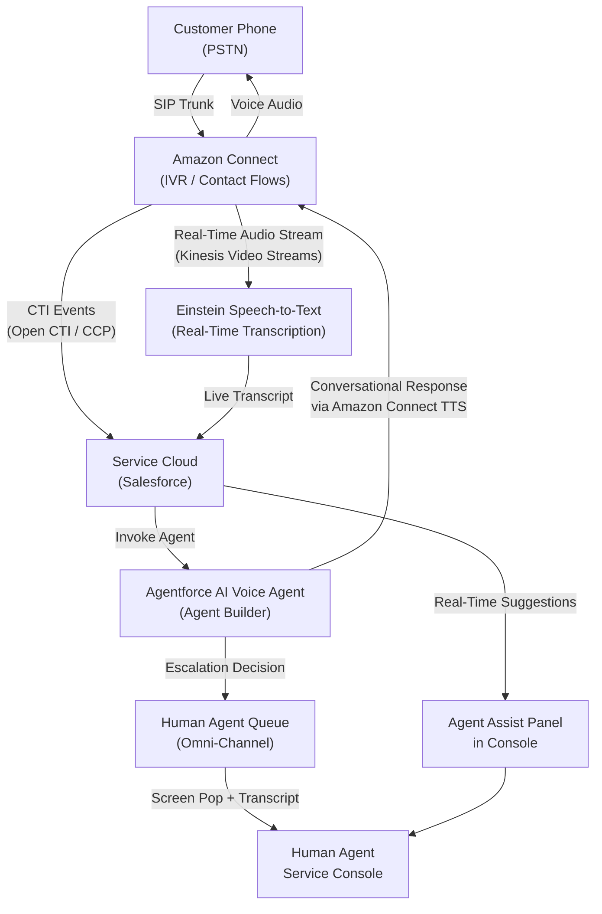

# Lab ADV-01 — Telephony Concepts and Agentforce Voice Architecture

## Learning Objectives
- Explain the PSTN and how a traditional phone call is routed end-to-end
- Describe SIP trunking and why it replaced legacy circuit-switched telephony for contact centers
- Explain what Amazon Connect is and how it integrates with Salesforce via CTI
- Differentiate the AI Voice Agent (autonomous bot) from Agent Assist (AI helper for human agents)
- Describe how Einstein Real-Time Transcription works during a live call
- Identify the license requirements and BYOT (Bring Your Own Telephony) option for non-Amazon Connect customers

---

## Concept Deep Dive: How Phone Calls Actually Work

### The PSTN — Public Switched Telephone Network

Before you can understand Agentforce Voice, you need to understand how telephone calls have worked for over 100 years. The PSTN is the global infrastructure of physical cables, microwave links, satellites, and switching equipment that carries voice calls between any two telephone numbers on Earth. When your customer picks up their landline or mobile phone and dials your support number, their call enters the PSTN.

The PSTN was originally entirely circuit-switched, meaning a dedicated physical circuit — a reserved slice of electrical capacity — was established and held open for the entire duration of your call. Think of it like reserving a lane on a highway just for your car, even while you are stopped at a traffic light. This is reliable but wasteful. Circuit switching is why long-distance calls used to be expensive: you were paying for reserved capacity across thousands of miles of copper wire.

Modern PSTN infrastructure has largely migrated to digital switching, but the concept of the PSTN as the global telephone network persists. When a customer calls a 1-800 number, that call travels across the PSTN until it reaches a point where it must hand off to the contact center platform.

### SIP — Session Initiation Protocol

SIP is the protocol that replaced circuit-switched connections between the PSTN and contact centers. SIP (Session Initiation Protocol) is a text-based signaling protocol — it describes how to set up, manage, and tear down multimedia communication sessions over IP networks. Think of SIP as the "phone dialing logic" layer, separate from the actual voice data.

A SIP trunk is a virtual phone line delivered over an internet connection. Instead of running physical copper wire from a telephone company to your contact center, a SIP provider establishes a logical channel over the internet. When a customer calls your number, the telephone company converts the PSTN call to SIP packets at their gateway and sends it across the internet to your contact center platform.

SIP carries two types of information:
- **Signaling**: who is calling, who is being called, call state (ringing, connected, on hold, terminated)
- **Media negotiation**: what audio codec to use, where to send the actual voice audio

The actual voice audio is typically carried separately by RTP (Real-Time Transport Protocol). SIP sets up the session; RTP carries the sound.

### VoIP and Why It Matters for Contact Centers

VoIP (Voice over IP) is any voice communication carried over internet protocol networks rather than the dedicated PSTN circuits. SIP is the dominant signaling protocol for VoIP in enterprise contexts. Because VoIP is just data over IP, it becomes possible to:
- Route calls through software rather than physical switching hardware
- Integrate call metadata directly with CRM data in real time
- Apply AI to the audio stream without specialized telecom hardware
- Scale capacity up or down in minutes rather than provisioning physical lines

This is the technological foundation that makes Agentforce Voice possible.

---

## Concept Deep Dive: Amazon Connect and CTI Integration

### What Amazon Connect Is

Amazon Connect is AWS's cloud-based contact center service. Salesforce chose Amazon Connect as its preferred telephony partner because:
1. Both Salesforce and AWS are cloud-native platforms with deep integration APIs
2. Amazon Connect provides real-time audio streaming (Amazon Kinesis Video Streams) that Salesforce uses for speech-to-text transcription
3. Amazon Connect's contact flow designer can invoke AWS Lambda functions, enabling the Agentforce AI agent to be called mid-call
4. The licensing model allows Salesforce to bundle a managed Amazon Connect instance into the Service Cloud Voice license

When you purchase Service Cloud Voice with Amazon Connect, Salesforce provisions an Amazon Connect instance on your behalf. You do not need an AWS account or any AWS expertise. The Amazon Connect instance is managed through Salesforce Setup.

### CTI — Computer Telephony Integration

CTI (Computer Telephony Integration) is the general term for any technology that connects a telephone system to a computer system. In the Salesforce context, CTI means the software bridge that lets Salesforce know what is happening on the phone channel, and lets phone events (call answered, call ended, DTMF digit pressed) trigger Salesforce actions (open a record, create a case, update a field).

Salesforce's CTI standard is the Open CTI framework, which defines a JavaScript API that telephony vendors implement. An Open CTI adapter is a piece of JavaScript that:
- Renders a softphone widget inside the Salesforce Service Console
- Listens to call events from the telephony platform
- Calls Salesforce Open CTI JavaScript API methods to pop records, set call data, and log activities

For Amazon Connect specifically, Salesforce ships a pre-built CTI adapter as part of the Service Cloud Voice package. Agents do not install anything locally — the softphone widget loads inside the browser-based Service Console.

### Einstein Real-Time Transcription

When Amazon Connect connects a caller to the Salesforce platform, Amazon Connect simultaneously streams the call audio to an Amazon Kinesis Video Stream. Salesforce's Einstein speech-to-text service reads this audio stream and converts it to text in near real time — typically with 1-3 seconds of latency. This transcript appears live in the agent's Service Console, flowing word by word as the conversation progresses.

The real-time transcript feeds two downstream AI capabilities:
- **Agent Assist**: AI surfaces knowledge article suggestions, next best actions, and response recommendations to the human agent during the call
- **After-Call Work auto-summarization**: when the call ends, the full transcript is processed to generate a call summary, capture key entities (account numbers, issue types), and draft a case or update an existing record

---

## Concept Deep Dive: AI Voice Agent vs Agent Assist

These two capabilities are frequently confused on the exam.

**AI Voice Agent** (also called Agentforce Voice Agent or Einstein Voice Bot in older documentation) is an autonomous AI that handles the call before a human agent is involved. The customer dials in, the IVR hands the call to the AI Voice Agent, and the AI attempts to resolve the issue entirely through conversation. If it cannot, it transfers to a human. The AI Voice Agent is configured in Agentforce Agent Builder and uses Topics and Actions just like any other Agentforce agent.

**Agent Assist** is not a bot. It is a real-time AI assistant that helps a human agent during a live call. The human agent is talking to the customer; Agent Assist reads the transcript and surfaces relevant knowledge articles, suggested responses, and next best actions in a panel in the Service Console. The customer never interacts with Agent Assist directly.

**BYOT — Bring Your Own Telephony**

Not every organization uses Amazon Connect. BYOT (Bring Your Own Telephony) is the Service Cloud Voice option that lets organizations connect a third-party telephony provider (Genesys, Avaya, Cisco, etc.) to Salesforce Voice capabilities. BYOT requires the telephony vendor to implement the Salesforce Voice API specification, and real-time transcription availability depends on whether the BYOT partner supports Salesforce's audio streaming requirements.

**License Requirements**

Service Cloud Voice requires:
- Service Cloud license (base)
- Service Cloud Voice add-on (includes Amazon Connect provisioning and Voice-specific features)
- Einstein AI features may require an additional Einstein for Service add-on depending on the edition

---

## Architecture Overview

---

## Prerequisites
- Access to a Salesforce org with Service Cloud Voice enabled (Developer Edition with Voice trial or a demo org)
- System Administrator profile
- Basic familiarity with Salesforce Setup navigation

---

## Lab Setup
No data setup required for this lab. You are navigating to observe provisioned settings and understand the architecture. No changes will be saved unless specifically instructed.

---

## Step-by-Step Instructions

### Step 1 — Navigate to Service Cloud Voice Setup
1. Click the **gear icon** (Setup) in the top-right corner of any Salesforce page.
2. In the Quick Find box, type `Service Cloud Voice`.
3. Under the **Service Cloud Voice** section in the left menu, click **Service Cloud Voice**.
4. The main Service Cloud Voice setup page loads. Observe the top section labeled **Voice Overview** which shows provisioning status.

**What to expect**: If Voice is provisioned, you will see green checkmarks next to Amazon Connect Instance, CTI Adapter, and Einstein Features. If this is a fresh org with Voice but no setup completed, some items will show warnings or "Not Configured" status.

### Step 2 — Review the Amazon Connect Instance Status
1. On the Service Cloud Voice overview page, locate the **Amazon Connect** card.
2. Click **View Details** or the Amazon Connect section header.
3. Note the **Instance URL** — this is the URL of the Amazon Connect instance that Salesforce provisioned for you. It follows the format `https://[instance-name].awsapps.com/connect/`.
4. Note the **Instance ARN** — this is the Amazon Resource Name that uniquely identifies this Connect instance in AWS. You do not need to access AWS directly; this is for reference.
5. Note the **Region** — Salesforce provisions Amazon Connect in an AWS region. US organizations are typically in `us-east-1`.

**Exam tip**: Salesforce provisions and manages the Amazon Connect instance on your behalf. You access it through Salesforce Setup, not through the AWS Console.

### Step 3 — Navigate to Contact Centers
1. In the Quick Find box, type `Contact Centers`.
2. Click **Contact Centers** under the Service Cloud Voice section.
3. The Contact Centers list page appears. A Contact Center record represents one telephony integration.
4. If a Contact Center exists, click its name to open the detail page.
5. Observe the following fields:
   - **Contact Center Name**: Human-readable identifier (e.g., "TechCorp Amazon Connect")
   - **Type**: Will show "Amazon Connect" or "Bring Your Own Telephony (Partner)"
   - **Status**: Active/Inactive
   - **Amazon Connect Instance**: Link to the provisioned instance

### Step 4 — Review Telephony Partner Options
1. On the Contact Centers list page, click **New** to start creating a contact center (you will cancel at the end; this is for exploration only).
2. On the New Contact Center page, observe the **Contact Center Type** picklist.
3. The options available are:
   - **Amazon Connect** — Salesforce-managed Amazon Connect instance; recommended for new deployments
   - **Bring Your Own Telephony (Partner)** — for certified third-party vendors
   - **Bring Your Own Telephony (Custom)** — for custom API integrations
4. Select **Amazon Connect** and observe how the form changes to show Amazon Connect-specific fields.
5. Select **Bring Your Own Telephony (Partner)** and observe the Telephony Partner picklist, which lists certified vendors.
6. Click **Cancel** — do not save.

### Step 5 — Review Einstein Voice Feature Settings
1. In Quick Find, type `Einstein for Service`.
2. Click **Einstein for Service** under the Einstein section.
3. Scroll to find the **Voice** section. The toggles here control:
   - **Real-Time Transcription**: Converts call audio to text during the call. This powers both the live transcript in the agent console and Agent Assist.
   - **After-Call Work**: Enables automatic call summarization and case updates after the call ends.
   - **Conversation Mining**: Enables the bulk analysis of call transcripts for pattern discovery.
4. Note whether each toggle is enabled or disabled. In a production org, Real-Time Transcription should be ON for Agentforce Voice to function.

### Step 6 — Review the CTI Adapter Settings
1. In Quick Find, type `CTI Adapters`.
2. Click **CTI Adapters** under the Computer Telephony section.
3. The Service Cloud Voice CTI Adapter should be listed. Click its name to open it.
4. Key fields to review:
   - **CTI Adapter URL**: This is the URL of the softphone JavaScript adapter. For Amazon Connect, it points to the Amazon Connect Contact Control Panel (CCP) endpoint.
   - **Softphone Layout Assignment**: Links this adapter to the softphone layout that determines what the agent sees.
   - **Open CTI Version**: Should be 2.0 or higher.
5. Note: You do not modify the CTI Adapter URL for Amazon Connect — Salesforce sets it automatically during Voice provisioning.

### Step 7 — Review the Softphone Layout
1. In Quick Find, type `Softphone Layouts`.
2. Click **Softphone Layouts**.
3. Click the default softphone layout (usually named "Standard" or "Voice Default Layout").
4. Observe:
   - **Call Type** sections (Inbound, Outbound, Internal) — each can have different screen pop behavior
   - **Screen Pop settings**: What Salesforce record opens automatically when a call connects
   - **Related Information**: What related records appear in the softphone panel

### Step 8 — Understand the Agentforce Voice vs Agent Assist Distinction in Setup
1. In Quick Find, type `Agentforce`.
2. Click **Agents** under the Agentforce section.
3. If any agents are configured, look for agents with **Channel = Voice**.
4. These are AI Voice Agents — bots that handle calls autonomously.
5. In a separate browser tab or window, navigate to Setup → **Agent Assist** (search "Agent Assist" in Quick Find).
6. Agent Assist settings control the real-time suggestion panel shown to human agents. This is a separate configuration from the AI Voice Agent.

### Step 9 — Review the Voice Channel License Check
1. In Quick Find, type `Company Information`.
2. Click **Company Information**.
3. Scroll to the **Licenses** section.
4. Look for entries with "Voice" in the name, such as:
   - `Service Cloud Voice with Amazon Connect` — the core Voice license
   - `Einstein for Service` — required for AI features including Real-Time Transcription
5. Note the **Used Licenses** vs **Total Licenses** counts.

---

## What You Built
In this lab, you navigated the Salesforce Setup to understand how the Agentforce Voice architecture is represented in the UI. You reviewed the Amazon Connect integration, the Contact Center object, CTI Adapter configuration, Einstein Voice feature toggles, and distinguished between the AI Voice Agent and Agent Assist. No configuration was changed — the goal was to map the theoretical architecture (PSTN → SIP → Amazon Connect → CTI → Salesforce → AI) to real Setup screens.

---

## Checkpoint Questions
1. What protocol does a SIP trunk use to carry voice call signaling from the PSTN to a contact center platform?
2. When a Salesforce admin purchases Service Cloud Voice with Amazon Connect, who manages the Amazon Connect instance?
3. What is the difference between the AI Voice Agent and Agent Assist in Agentforce Voice?
4. What AWS service does Salesforce use to stream call audio for real-time transcription?
5. What does BYOT stand for and when would a customer use it instead of Amazon Connect?

---

## Common Errors & Troubleshooting

**Error: "Amazon Connect instance not found" on the Service Cloud Voice overview page**
This means Voice provisioning did not complete. Navigate to Setup → Service Cloud Voice → Contact Centers and check for any error banners. Provisioning can take 5-15 minutes in new orgs. If it has been over 30 minutes, open a Salesforce support case referencing the org ID.

**Error: CTI Adapter URL is blank or shows an error**
The Open CTI adapter URL must point to the Amazon Connect Contact Control Panel (CCP). For Service Cloud Voice with Amazon Connect, this URL is auto-populated. If it is blank, the Voice package may not have been installed correctly. Reinstall the Salesforce for Amazon Connect package from AppExchange.

**Real-Time Transcription toggle greyed out**
This means either the Service Cloud Voice license is not provisioned, or the Einstein for Service add-on is missing. Check Company Information → Licenses for the correct licenses. Contact your AE if licenses appear to be missing.

**Agent sees no softphone widget in Service Console**
The CTI Adapter must be assigned to the Utility Bar of the relevant Lightning App. Navigate to Setup → App Manager → find the Service Console app → Edit → Utility Items → confirm the Open CTI Softphone utility item is present and points to the correct CTI Adapter.

**Caller can hear hold music but agent's console shows no incoming call**
This is typically an Omni-Channel routing issue, not a telephony issue. The call arrives in Amazon Connect but fails to route to Salesforce. Check that the Voice Channel is active, the queue has agents assigned, and the agent's Omni-Channel presence is set to "Available."

---

## Exam Tips
- The exam will test whether you know that Amazon Connect streams audio to **Kinesis Video Streams**, not to Salesforce directly — Salesforce reads from the stream.
- Remember: **AI Voice Agent = bot that talks to callers autonomously**. **Agent Assist = real-time AI helper for human agents during a call**. These are separate products with separate configurations.
- BYOT requires the telephony partner to be **certified by Salesforce** or to implement the Salesforce Voice API spec. Not every telephony vendor supports BYOT.
- Service Cloud Voice is an **add-on license** — it does not come with base Service Cloud.
- Real-Time Transcription requires the **Einstein for Service** license in addition to Service Cloud Voice.
- On the exam, if a question mentions "the CTI adapter URL," it is referring to the Open CTI configuration, not something you set in Amazon Connect.
