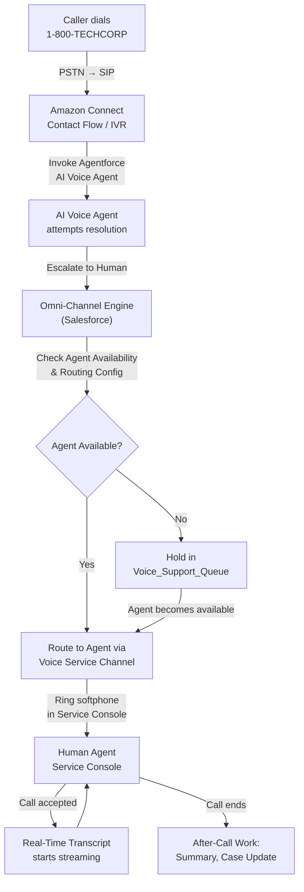

# Lab ADV-02 — Voice Channel Setup and Configuration

## Learning Objectives
- Explain the Contact Center object and what it represents in Salesforce
- Describe how phone numbers (DID, toll-free, local) are provisioned and surfaced in Salesforce
- Understand Omni-Channel routing and its role in directing calls to available agents
- Create and configure a Voice Channel in Salesforce
- Set up the Omni-Channel routing configuration, Service Channel, and Queue for voice calls
- Activate the softphone in the Service Console and verify the Omni-Channel presence

---

## Concept Deep Dive: Contact Centers and Phone Numbers

### The Contact Center Object

In Salesforce, a Contact Center is a configuration record that represents your telephony integration. It is the top-level container that ties together:
- Which telephony platform you are using (Amazon Connect, BYOT, etc.)
- Which Amazon Connect instance is associated
- The AWS region and instance credentials
- The active/inactive status of the entire telephony integration

Think of the Contact Center as the "connection point" between Salesforce and the outside telephone world. Every Voice Channel you create must be associated with a Contact Center, and every phone number ultimately routes through a Contact Center's telephony platform.

You can have multiple Contact Centers in one Salesforce org — for example, one for a North America Amazon Connect instance and one for a BYOT integration serving the APAC region.

### DID Numbers — Direct Inward Dialing

A DID (Direct Inward Dialing) number is a telephone number that routes directly to a specific destination without going through a receptionist or IVR menu hierarchy. In the contact center world, DID numbers are the numbers your customers dial to reach you.

**Local numbers** use an area code (e.g., 512-555-1234) that suggests geographic presence. They are preferred when customers in a region expect to see a local number in caller ID.

**Toll-free numbers** (800, 888, 877, 866, 855, 844, 833 in North America) are paid for by the receiving party (your company), not the caller. They have no long-distance charge for the customer. Most enterprise contact centers use toll-free numbers for their primary support lines.

When you use Service Cloud Voice with Amazon Connect, phone numbers are provisioned directly within Amazon Connect. The process is:
1. In the Amazon Connect console (accessible through Salesforce Setup), claim a phone number for your desired area code or toll-free prefix
2. Associate that phone number with an Amazon Connect Contact Flow (the IVR logic)
3. The Contact Flow routes the call — either to a queue, to the Agentforce AI Voice Agent, or elsewhere
4. Salesforce surfaces the provisioned phone number in the Voice Channel configuration

### Voice Channel Object

A Voice Channel in Salesforce is a configuration record that represents one "line" or "number" that callers can reach. A Voice Channel has:
- **Name**: Human-readable label (e.g., "TechCorp Support Line")
- **Contact Center**: Which Contact Center (telephony integration) this channel belongs to
- **Phone Number**: The DID or toll-free number associated with this channel
- **Language**: The primary language for speech recognition (affects Real-Time Transcription accuracy)
- **Real-Time Transcription**: On/Off toggle per channel
- **After-Call Work (ACW)**: On/Off toggle per channel; controls whether agents enter a post-call work state

You can have multiple Voice Channels in one org — for example, a "Billing Support" channel on a different number than "Technical Support," each routed to different queues with different agents.

---

## Concept Deep Dive: Omni-Channel Routing

### What Omni-Channel Is

Omni-Channel is Salesforce's intelligent work routing engine. It routes incoming work items — cases, chats, phone calls, messaging sessions — to the most appropriate available agent based on routing rules you define. Without Omni-Channel, work would simply arrive in a queue and agents would manually pick it up ("pull model"). With Omni-Channel, work is pushed to agents automatically based on:
- Agent availability (presence status)
- Agent skill or team membership (queue membership)
- Work item priority
- Agent workload capacity

Omni-Channel is not telephony-specific — it routes cases, chats, and calls using the same engine. But for voice calls, Omni-Channel is the mechanism that decides which human agent receives the transferred call.

### Presence Statuses

An agent must be "on" Omni-Channel to receive work. Presence Statuses define whether an agent is available to receive work, busy, on break, or offline. Agents manually change their presence status using the Omni-Channel widget in the Service Console utility bar.

For voice specifically:
- An agent must be in an **Available for Voice** presence status to receive incoming calls
- When on a call, Omni-Channel automatically sets the agent's status to reflect they are busy
- After a call ends, if After-Call Work is enabled, the agent enters an ACW state briefly before returning to Available

### Routing Configurations

A Routing Configuration defines the rules for how work items are distributed to agents within a queue:
- **Routing Model**: Least Active (route to agent with fewest open work items) or Most Available (route to agent with most capacity remaining)
- **Priority**: Numeric value; lower numbers = higher priority. A Priority 1 routing config's work items beat Priority 2 items when competing for agent capacity
- **Units of Capacity**: How many "capacity units" one of these work items consumes on an agent. A voice call might consume 100% of an agent's capacity; a chat might only consume 25%.

### Service Channels

A Service Channel defines a work item type for Omni-Channel. Before voice calls can be routed by Omni-Channel, a Service Channel for "Voice Call" must exist. Salesforce creates a default Voice Call service channel when you install Service Cloud Voice, but you can review and customize it.

### Queues

An Omni-Channel Queue (tied to a Routing Configuration) holds work items until an agent becomes available. For voice, calls waiting in a queue hear hold music from Amazon Connect. When an agent in the queue becomes available, Omni-Channel routes the call to them.

---

## Architecture Overview

---

## Prerequisites
- Service Cloud Voice license provisioned and Amazon Connect instance active (see Lab ADV-01)
- System Administrator profile
- At least one Amazon Connect phone number provisioned (demo org typically has one pre-configured)
- Service Cloud installed with at least one Lightning App using Service Console

---

## Lab Setup
Before starting:
1. Confirm the Amazon Connect Contact Center is in Active status (Setup → Contact Centers).
2. Note the Contact Center name — you will use it when creating the Voice Channel.
3. Note any existing phone number associated with the Amazon Connect instance. In a demo org, this is typically visible in the Voice Channels list or in the Amazon Connect setup screens.

---

## Step-by-Step Instructions

### Step 1 — Navigate to Voice Channels
1. Click the **gear icon** to open Setup.
2. In Quick Find, type `Voice Channels`.
3. Click **Voice Channels** under the Service Cloud Voice section.
4. The Voice Channels list page appears. Review any existing channels. In a demo org, there may be one pre-configured channel.

### Step 2 — Create a New Voice Channel
1. On the Voice Channels page, click **New**.
2. The New Voice Channel form opens. Fill in the following fields:
   - **Voice Channel Name**: `TechCorp Support Line`
   - **Contact Center**: Select the Amazon Connect contact center from the dropdown (e.g., "TechCorp Amazon Connect")
   - **Phone Number**: Select from the dropdown — this lists phone numbers provisioned in Amazon Connect. If none appear, a number must be claimed in Amazon Connect first (see Troubleshooting).
   - **Language**: `English (United States)` — this sets the speech recognition locale for Real-Time Transcription
3. Click **Next** or **Save** to proceed to the feature settings section.

### Step 3 — Enable Real-Time Transcription on the Voice Channel
1. After the initial save or on the next page of the wizard, look for the **Einstein Features** or **AI Features** section.
2. Toggle **Real-Time Transcription** to **Enabled**.
   - This tells Salesforce to process the audio stream for this channel through Einstein speech-to-text.
   - Note: This requires the Einstein for Service license. If the toggle is greyed out, check Company Information for licensing.
3. Confirm the setting and proceed.

### Step 4 — Enable After-Call Work
1. Still in the Voice Channel configuration, find the **After-Call Work** section.
2. Toggle **After-Call Work** to **Enabled**.
3. Set the **After-Call Work Time Limit**: Enter `120` seconds. This is the maximum time an agent can remain in ACW state after a call before Omni-Channel automatically returns them to Available. (A common production setting is 90-180 seconds.)
4. Click **Save**.
5. You should see the new "TechCorp Support Line" Voice Channel in the list with Status = Active.

### Step 5 — Create a Routing Configuration for Voice
1. In Quick Find, type `Routing Configurations`.
2. Click **Routing Configurations** under the Omni-Channel section.
3. Click **New**.
4. Fill in:
   - **Routing Configuration Name**: `Voice_Support_Routing`
   - **Routing Priority**: `1`
   - **Routing Model**: `Least Active`
   - **Units of Capacity**: `1.00` (voice calls typically consume the agent's full capacity)
5. Click **Save**.

### Step 6 — Create a Service Channel for Voice
1. In Quick Find, type `Service Channels`.
2. Click **Service Channels** under the Omni-Channel section.
3. Check if a Voice Call service channel already exists (it usually does after Voice installation). Look for a channel with **Salesforce Object** = `VoiceCall`.
4. If it exists, click it and note its **Developer Name** (typically `VoiceCall` or similar). No changes needed — proceed to Step 7.
5. If it does NOT exist, click **New** and fill in:
   - **Service Channel Name**: `Voice Call`
   - **Developer Name**: `VoiceCall` (auto-populated)
   - **Salesforce Object**: `Voice Call` (select from the object list)
   - **Enable Secondary Routing Priority**: Leave unchecked
   - Click **Save**

### Step 7 — Create a Queue for Voice
1. In Quick Find, type `Queues`.
2. Click **Queues** under the Users section (not the Omni-Channel section — Queues live under the Users area in Setup).
3. Click **New**.
4. Fill in:
   - **Label**: `Voice Support Queue`
   - **Queue Name**: `Voice_Support_Queue` (auto-populated)
   - **Routing Configuration**: `Voice_Support_Routing` (the configuration you created in Step 5)
   - **Send Email to Members**: unchecked
5. In the **Supported Objects** section, add `Voice Call` to the Selected Objects list.
6. In the **Queue Members** section, add yourself (your user) to the Selected Users list. In production, you would add all support agents here or use Public Groups.
7. Click **Save**.

### Step 8 — Assign the Routing Configuration to the Voice Channel (Link Queue to Channel)
1. Return to Setup → **Voice Channels**.
2. Click the **TechCorp Support Line** voice channel you created.
3. Click **Edit**.
4. Find the **Queue** field (may be labeled "Default Queue" or "Omni-Channel Queue").
5. Select `Voice Support Queue`.
6. Click **Save**.

Note: In some Salesforce releases, the queue association is done through the Amazon Connect Contact Flow configuration rather than directly on the Voice Channel record. If the Queue field is not visible on the Voice Channel, the routing is managed at the Amazon Connect side and this step can be skipped for lab purposes.

### Step 9 — Verify the Presence Status Configuration
1. In Quick Find, type `Presence Statuses`.
2. Click **Presence Statuses** under the Omni-Channel section.
3. Look for statuses that include `Voice Call` in their Service Channels. A status like "Available for Voice" should exist and have the Voice Call service channel listed.
4. If no such status exists, click **New**:
   - **Status Name**: `Available for Voice`
   - **Developer Name**: `Available_for_Voice`
   - **Status Options**: `Online`
   - **Service Channels**: Add `Voice Call`
   - Click **Save**
5. Navigate to Setup → **Profiles** (or Permission Sets), and ensure the System Administrator profile (or the Agent permission set) has this Presence Status assigned under **Enabled Service Presence Statuses**.

### Step 10 — Navigate to the Service Console and Activate Omni-Channel
1. Click the **App Launcher** (9-dot grid icon) in the top-left.
2. Search for `Service Console` and click it.
3. The Service Console app loads. Look at the bottom utility bar for the **Omni-Channel** widget (it typically shows as a colored dot or the text "Omni-Channel").
4. Click the Omni-Channel widget to expand it.
5. The presence status dropdown appears. Change your status from **Offline** to **Available for Voice** (or whichever voice-enabled status exists).
6. The widget dot turns green (or the appropriate color), indicating you are now available to receive voice calls.

### Step 11 — Verify the Softphone Widget Exists in the Console
1. Still in the Service Console, look at the utility bar at the bottom.
2. You should see the **Softphone** or **Amazon Connect** widget icon (a phone icon or "CCP" label).
3. Click it to expand the softphone panel.
4. The Amazon Connect Contact Control Panel (CCP) loads. It may show "Available" or "Offline" depending on agent status.
5. If the softphone does NOT appear in the utility bar, you need to add it: return to Setup → App Manager → Service Console app → Edit → Utility Items → Add Utility Item → Open CTI Softphone → select the Voice CTI Adapter → Save.

### Step 12 — Review the Full Configuration Chain
Before finishing, trace the full configuration chain to ensure everything is linked:
1. **Phone Number** (in Amazon Connect) → associated with a **Contact Flow** → routes to Salesforce Omni-Channel
2. **Voice Channel** (`TechCorp Support Line`) → linked to **Contact Center** → linked to **Queue** (`Voice Support Queue`)
3. **Queue** → linked to **Routing Configuration** (`Voice_Support_Routing`) → linked to **Service Channel** (Voice Call)
4. **Agents** → assigned to the Queue → assigned a Presence Status that includes Voice Call service channel

If any link in this chain is broken, inbound calls will not reach agents.

---

## What You Built
You created a complete voice routing configuration: a Voice Channel named "TechCorp Support Line" with Real-Time Transcription and After-Call Work enabled, an Omni-Channel Routing Configuration, a Voice Service Channel, and a Voice Support Queue. You activated the softphone in the Service Console and set your presence to Available. An inbound call to the provisioned phone number would now flow through Amazon Connect, into Omni-Channel, and ring the softphone for any Available agent in the Voice Support Queue.

---

## Checkpoint Questions
1. What is the relationship between a Contact Center and a Voice Channel in Salesforce?
2. What does the Routing Configuration priority number control, and what does a lower number mean?
3. What must an agent do in the Service Console before they can receive inbound voice calls?
4. After-Call Work time limit is set to 120 seconds. What happens when that time expires?
5. What Salesforce object does the Voice Call Service Channel reference?

---

## Common Errors & Troubleshooting

**"No phone numbers available" in the Voice Channel phone number dropdown**
Phone numbers must be claimed within Amazon Connect before they appear in Salesforce. Access the Amazon Connect console via Setup → Service Cloud Voice → (link to Amazon Connect console), navigate to Phone Numbers → Claim a Number, select your country and number type, and assign it to a Contact Flow. Then return to Salesforce and refresh the Voice Channel form.

**Omni-Channel widget not visible in the Service Console**
The widget is a utility item that must be manually added to the Lightning App's utility bar. Navigate to Setup → App Manager → find your Service Console app → Edit → Utility Items tab → Add Utility Item → Open CTI Softphone → save. If you see the CTI softphone but not Omni-Channel, add Omni-Channel as a separate utility item (it is a built-in utility item available in the utility item picker).

**Agent's presence status does not include Voice as a channel option**
The Presence Status must have the Voice Call Service Channel added to it. Navigate to Setup → Presence Statuses → edit the relevant status → add Voice Call to the Service Channels. Then confirm the profile or permission set has this status in its Enabled Service Presence Statuses list.

**Calls route to queue but no agent receives them**
The most common cause is that no agent has the Voice queue in their queue membership AND an available voice presence status simultaneously. Check Setup → Queues → Voice Support Queue → Queue Members list. Also verify the agents are actually in an Available (for Voice) status in the Omni-Channel widget, not just in any "online" status.

**Real-Time Transcription is enabled but no transcript appears in the console**
Confirm the Einstein for Service license is active (Setup → Company Information → Licenses). Also confirm that the Service Console layout includes the Real-Time Transcription component — navigate to Setup → Object Manager → Voice Call → Lightning Record Pages and verify the Transcript component is on the page layout.

---

## Exam Tips
- A **Contact Center** is the Salesforce object representing a telephony integration; a **Voice Channel** is the object representing one phone number/line within that Contact Center.
- After-Call Work is configured **per Voice Channel**, not globally. Different channels can have different ACW time limits.
- Omni-Channel routes calls based on **agent availability** (presence status) and **queue membership** — both must be correct for a call to route successfully.
- The **Service Channel** is the Omni-Channel concept that maps a work item type (VoiceCall object) to the routing engine. Without a Voice Service Channel, Omni-Channel cannot route calls.
- On the exam, if asked about agent capacity for voice calls, the correct answer is typically 1 unit (full capacity), since agents cannot handle a second call simultaneously.
- Real-Time Transcription is **per-channel**, can be toggled off for specific Voice Channels if transcription is not desired for certain call types.
