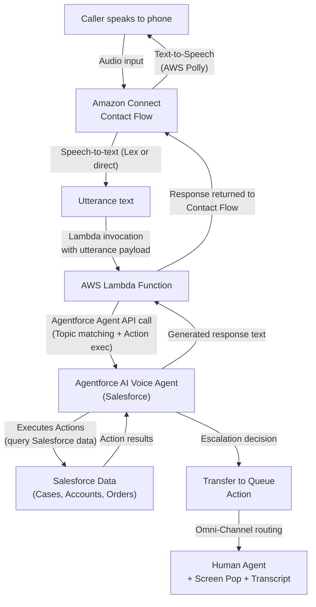
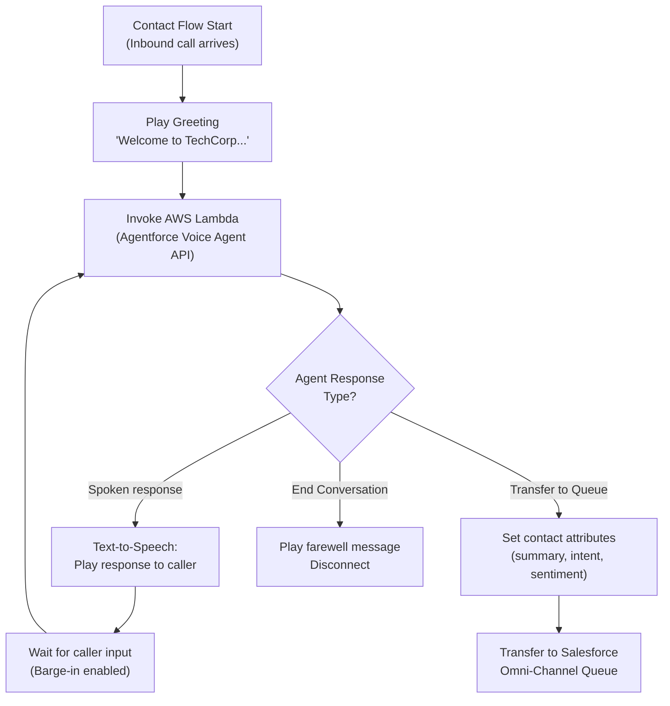

# Lab ADV-03 — Agentforce Voice Agent Design

## Learning Objectives
- Differentiate the AI Voice Agent from the Service Cloud Voice infrastructure layer
- Explain why voice-specific NLP differs from text-based agent design
- Apply voice-first design principles: short responses, spoken language, no markdown
- Design Topics specifically optimized for phone conversations
- Add the Voice channel to an Agentforce agent and understand how Amazon Connect invokes it
- Understand the conceptual flow of how a Contact Flow calls the Agentforce agent via Lambda

---

## Concept Deep Dive: The AI Voice Agent

### Voice Infrastructure vs AI Voice Agent — Two Separate Things

One of the most common sources of confusion for Agentforce Voice exam candidates is conflating two distinct layers:

**Service Cloud Voice** is the infrastructure layer. It is the plumbing: the Amazon Connect integration, the CTI adapter, the Omni-Channel routing, the softphone widget, and the real-time transcription pipeline. Service Cloud Voice makes phone calls arrive in Salesforce and enables AI capabilities on those calls.

**Agentforce AI Voice Agent** is the intelligence layer. It is an autonomous conversational agent — a bot — that actually handles the call before (and sometimes instead of) a human agent. The AI Voice Agent is configured in Agentforce Agent Builder using the same Topics, Instructions, and Actions framework as any other Agentforce agent. The key difference is that it runs over a voice channel, which imposes very specific design constraints.

You could have Service Cloud Voice without an AI Voice Agent — calls would still arrive and route to human agents, with real-time transcription and Agent Assist. The AI Voice Agent is an optional automation layer on top.

### How Voice NLP Differs from Text

Text-based agents (web chat, email, messaging) have a very different interaction model than voice agents. Understanding these differences is critical to designing effective voice topics.

**Turn-taking in voice**: In text chat, both parties can compose and revise before sending. In voice, the conversation flows in real time. The AI must detect when the caller has finished speaking (end-of-utterance detection) before it can respond. Gaps, pauses, and hesitations create ambiguity — is the caller thinking, or are they done?

**Speech disfluencies**: Human speech is full of filler words: "um," "uh," "like," "you know," "so yeah." A text-based NLP system almost never sees these. A voice NLP system sees them constantly and must ignore them when determining intent. Well-trained speech-to-text models strip common disfluencies, but the AI agent's intent recognition must still handle partial and messy utterances.

**Interruptions and barge-in**: Callers frequently interrupt the AI mid-sentence, especially when they have heard the prompt before or are impatient. The AI must support barge-in — stopping its own speech when the caller starts talking. Without barge-in, callers feel trapped in a one-sided experience.

**Short utterances**: Callers on the phone give short answers. A caller in a web chat might type "I'd like to check the status of my order from last Tuesday, order number 12345." On the phone, the same person says "Check my order." Voice topics must handle minimal-information utterances and ask targeted clarifying questions rather than expecting rich natural language input.

**DTMF fallback**: DTMF (Dual-Tone Multi-Frequency) is the technical name for the tones generated when you press the number keys on a phone keypad. Press 1, you hear a "beep" — that is a DTMF tone. Voice agents sometimes fall back to DTMF input for critical confirmations, numeric entry (account numbers, verification codes), or when speech recognition fails repeatedly. A well-designed voice agent offers DTMF as an alternative: "Say your account number or press the digits on your keypad."

### Voice-Specific Response Design

Text responses can use formatting: bullet points, headers, bold text, links. None of this works in audio. A voice agent response must be:
- **Short**: 1-3 sentences maximum per turn. Long responses cause callers to hang up.
- **Spoken-language friendly**: Contractions ("I'll" not "I will"), natural pacing, no jargon
- **No markdown**: No asterisks, no pound signs, no URLs. These get read aloud literally: "asterisk asterisk important asterisk asterisk."
- **Confirmatory**: Repeat key details back to the caller in spoken form: "Got it, I'm looking up account ending in 4-5-6-7."
- **Offering choices verbally**: "You can say Billing, Technical Support, or Account Changes."

### IVR vs AI Voice Agent

Traditional IVR (Interactive Voice Response) systems are menu trees. "Press 1 for billing. Press 2 for technical support." The IVR has no understanding of intent — it just maps keystrokes or recognized keywords to branches. If you say "I need help with my bill" to a traditional IVR, it does not understand that means "billing." It may ask you to repeat, or fail entirely.

Agentforce AI Voice Agent understands intent from natural language. A caller can say "I got a charge I don't recognize" and the agent correctly identifies this as a billing inquiry. The Topics replace IVR branches, and the agent's NLU replaces menu key mappings. This is a fundamentally different paradigm: intent-driven vs menu-driven.

### Amazon Connect Contact Flow Integration

When a caller dials your number, Amazon Connect's Contact Flow handles them. A Contact Flow is Amazon Connect's visual workflow editor — a drag-and-drop sequence of actions that runs when a call arrives. The Contact Flow is where you:
1. Play the initial greeting ("Thank you for calling TechCorp. How can I help you today?")
2. Invoke the Agentforce AI Voice Agent to handle the conversation
3. Route to Salesforce queues if escalation occurs

The Agentforce AI Voice Agent is invoked from a Contact Flow using an **AWS Lambda function**. Lambda is AWS's serverless function service. Salesforce provides (or you write) a Lambda function that calls the Agentforce agent API, passes the caller's utterance, receives the agent's response, and returns it to Amazon Connect. Amazon Connect then uses text-to-speech (AWS Polly or equivalent) to speak the response to the caller.

For the Salesforce certification exam, you need to understand this conceptual integration point: Contact Flow → Lambda → Agentforce Agent API → Lambda returns response → Contact Flow speaks response. You do not need to write Lambda code.

---

## Architecture Overview



---

## Prerequisites
- Service Cloud Voice configured (Lab ADV-01 and Lab ADV-02 completed)
- Agentforce license (Einstein for Agentforce or Agentforce for Service)
- At least one Einstein AI feature enabled (Real-Time Transcription on)
- A basic Agentforce Service Agent already exists, or you will create a new one in this lab

---

## Lab Setup
1. Confirm you have access to Agentforce Agent Builder: Setup → Agents.
2. Confirm the Einstein for Agentforce license is active under Company Information.
3. Have the Voice Channel name handy: "TechCorp Support Line" (created in Lab ADV-02).

---

## Step-by-Step Instructions

### Part A — Create or Clone the AI Voice Agent

### Step 1 — Open Agentforce Agent Builder
1. Click the **gear icon** to open Setup.
2. In Quick Find, type `Agents`.
3. Click **Agents** under the Agentforce section.
4. The Agents list page appears. You will see any existing agents.

### Step 2 — Create a New Agent for Voice
1. Click **New Agent**.
2. The New Agent wizard opens. Select the **Service Agent** template (this template pre-configures the agent for customer-facing service interactions).
3. Click **Next**.
4. Fill in:
   - **Agent Name**: `TechCorp Voice Agent`
   - **Agent API Name**: `TechCorp_Voice_Agent` (auto-populated)
   - **Description**: `AI Voice Agent that handles inbound phone calls for TechCorp Support before escalating to human agents.`
5. Click **Next** and then **Finish** or **Save** to open Agent Builder.

### Step 3 — Review the Agent Builder Canvas
1. Agent Builder opens. The canvas has three main panels:
   - **Left panel**: Topics and Actions list
   - **Center**: Conversation preview / testing area
   - **Right panel**: Properties, instructions, and settings for the selected element
2. Note the **Channels** tab or section at the top of the right panel (or in agent settings). This is where you will add the Voice channel.

### Part B — Create Voice-Optimized Topics

### Step 4 — Create the Caller Authentication Topic
1. In the left panel, click **New Topic** (or the "+" button next to Topics).
2. Fill in:
   - **Topic Label**: `Caller Authentication`
   - **Topic API Name**: `Caller_Authentication`
   - **Description**: `Verifies the caller's identity using their account number or the last 4 digits of their Social Security Number before proceeding with any account-specific requests.`
3. In the **Instructions** field (also called "Agent Instructions" or "Topic Instructions"), write voice-optimized instructions:
   ```
   Greet the caller warmly and ask for their account number to verify their identity.
   Accept the account number as spoken digits. Confirm by repeating the last 4 digits back.
   If the caller cannot provide an account number, ask for the last 4 digits of their SSN as an alternative.
   Do not read full SSN values back aloud. Only confirm the last 4 digits.
   Keep responses under 2 sentences. Use natural spoken language.
   On successful authentication, say "Great, I've verified your identity" and move to the caller's request.
   If authentication fails twice, offer to transfer to a human agent.
   ```
4. Click **Save**.

**Voice design note**: Notice the instructions explicitly say "under 2 sentences" and "natural spoken language." These are voice-first constraints. A text-based agent does not need this.

### Step 5 — Create the Billing Inquiry Topic
1. Click **New Topic** again.
2. Fill in:
   - **Topic Label**: `Billing Inquiry`
   - **Topic API Name**: `Billing_Inquiry`
   - **Description**: `Handles caller questions about their account balance, recent charges, payment history, and payment due dates.`
3. In the **Instructions** field:
   ```
   This topic handles questions about bills, charges, payments, and account balances.
   Retrieve the caller's most recent invoice and current balance using the Get Account Balance action.
   When reading monetary amounts, say "dollars" not the dollar sign. Example: say "fifty-two dollars" not "$52."
   Keep all responses to 1-2 sentences. Do not list more than 3 items in a single spoken response.
   If the caller asks about a specific charge they don't recognize, retrieve recent transactions and describe the top 3 by date.
   Offer payment options verbally: "You can pay by credit card, bank transfer, or I can connect you to billing."
   Never read out full credit card numbers or bank account numbers.
   ```
4. Click **Save**.

### Step 6 — Create the Technical Support Topic
1. Click **New Topic**.
2. Fill in:
   - **Topic Label**: `Technical Support`
   - **Topic API Name**: `Technical_Support`
   - **Description**: `Handles common technical issues including connectivity problems, login failures, and device setup assistance.`
3. In the **Instructions** field:
   ```
   Handle basic technical troubleshooting. Start by identifying the product or service the caller is having trouble with.
   Guide the caller through one troubleshooting step at a time. Wait for confirmation before proceeding.
   Steps must be simple enough to follow by listening. Do not give instructions requiring reading a screen while talking.
   Example: "First, let's restart the device. Press and hold the power button for 5 seconds. Let me know when it's restarted."
   If the issue is not resolved in 3 steps, offer to create a support case and transfer to a technical specialist.
   Do not use technical jargon. Use plain language a non-technical caller can understand.
   ```
4. Click **Save**.

### Step 7 — Create the Transfer to Human Topic
1. Click **New Topic**.
2. Fill in:
   - **Topic Label**: `Transfer to Human`
   - **Topic API Name**: `Transfer_to_Human`
   - **Description**: `Escalates the call to a live human agent when the AI cannot resolve the issue, or when the caller requests a human.`
3. In the **Instructions** field:
   ```
   Activate this topic when: the caller explicitly asks for a human agent, the caller is frustrated (elevated tone or repeated requests), the issue cannot be resolved by the AI within this conversation, or authentication fails twice.
   Before transferring, summarize the issue in one spoken sentence: "I'll transfer you to a specialist who can help with [brief issue summary]."
   Set the conversation summary field with a concise note for the human agent.
   Tell the caller approximately how long they may wait: "Current wait time is approximately [wait time] minutes."
   Do not put the caller on hold silently. Always speak before transferring.
   Use the Transfer to Queue action targeting the Voice Support Queue.
   ```
4. Click **Save**.

### Part C — Add Voice Channel to the Agent

### Step 8 — Open Agent Channels Settings
1. In Agent Builder, look for the **Channels** tab in the right panel or in the top navigation of Agent Builder.
2. If Agent Builder shows a top toolbar, look for a "Channels" or "Deployment" option.
3. Alternatively, navigate to the agent's **Settings** tab or **Properties** panel.
4. Click **Add Channel** or the "+" icon next to Channels.

### Step 9 — Add the Voice Channel
1. In the Add Channel modal or dropdown, select **Voice**.
2. A Voice channel configuration panel appears.
3. In the **Voice Channel** field, select `TechCorp Support Line` (the Voice Channel you created in Lab ADV-02).
4. Review any additional settings:
   - **Greeting message**: The first thing the AI says when the call connects. Enter: `Thank you for calling TechCorp Support. I'm your AI assistant. How can I help you today?`
   - **Fallback message**: What to say if the AI cannot understand the caller after multiple attempts. Enter: `I'm having trouble understanding. Let me connect you to a team member who can help.`
5. Click **Save** or **Add**.
6. The Voice channel now appears in the agent's channel list.

### Step 10 — Activate the Agent
1. In Agent Builder, find the **Activate** button (typically at the top right of the canvas).
2. Before activating, the builder will run a validation check. Common warnings for voice agents:
   - Topics without any Actions assigned (informational only if the topic only uses instructions)
   - Missing fallback behavior
3. Review any warnings. For this lab, click **Activate** to publish the agent.
4. The agent status changes from Draft to Active.

### Part D — Understand the Amazon Connect Contact Flow Invocation

### Step 11 — Review the Conceptual Amazon Connect Contact Flow
The following is the conceptual Contact Flow structure for invoking the Agentforce AI Voice Agent. You cannot configure this directly in Salesforce Setup — it is done in the Amazon Connect console. However, understanding it is essential for the exam.

In Amazon Connect, a Contact Flow for Agentforce would look like:



1. In Setup, navigate to **Service Cloud Voice** → **Contact Centers** → click your Contact Center.
2. Look for a link to **Open Amazon Connect** or **Manage Contact Flows**. This opens the Amazon Connect console in a new tab.
3. In the Amazon Connect console, navigate to **Routing** → **Contact Flows**.
4. Review any existing contact flows. A pre-configured demo org will have a sample flow.
5. Note the **Invoke AWS Lambda function** block type — this is the block that calls the Agentforce agent.

### Step 12 — Review After-Call Work Configuration on the Agent
1. Return to Salesforce Agent Builder (Setup → Agents → TechCorp Voice Agent).
2. In the agent properties or instructions, look for any After-Call Work or Post-Conversation settings.
3. After-call summarization is primarily controlled at the Voice Channel level (configured in Lab ADV-02), not in Agent Builder. However, the agent's instructions can instruct it to set summary fields before transferring.
4. Confirm that the Transfer to Human topic instructions include "Set the conversation summary field" — this populates data that becomes the after-call summary when the human agent finishes.

---

## What You Built
You created the TechCorp Voice Agent in Agentforce Agent Builder with four voice-optimized Topics: Caller Authentication, Billing Inquiry, Technical Support, and Transfer to Human. Each topic uses voice-first design principles: short spoken responses, no markdown, DTMF awareness, and clear escalation triggers. You added the Voice channel to the agent and linked it to the TechCorp Support Line Voice Channel. You also reviewed the conceptual Amazon Connect Contact Flow that invokes the agent via Lambda.

---

## Checkpoint Questions
1. What is the key design difference between a voice-optimized topic instruction and a text-based topic instruction?
2. Why should voice agent responses be limited to 1-3 sentences?
3. What AWS service does Amazon Connect use to invoke the Agentforce AI Voice Agent mid-call?
4. What does DTMF stand for, and when would a voice agent fall back to DTMF input?
5. How does an AI Voice Agent differ from a traditional IVR menu system?

---

## Common Errors & Troubleshooting

**Agent Activation fails with "Topic has no Actions assigned"**
Topics that only use instructions (no explicit Actions configured) may generate warnings but typically can still be activated. If it is a hard error, add at least one Action to each Topic — even a "Get Account" action added to the Billing Inquiry topic will satisfy the requirement. Instructions without Actions are valid for purely conversational topics (like Caller Authentication), but some orgs have a setting requiring at least one Action per Topic.

**Voice channel does not appear in the Channels dropdown in Agent Builder**
The Voice Channel must be in Active status (Lab ADV-02, Step 4). Also confirm the agent is of type Service Agent (not a Sales or Copilot agent type) — only Service-type agents support the Voice channel.

**Greeting message reads markdown symbols aloud**
Never use asterisks, underscores, pound signs, or brackets in any Voice agent response or greeting. Check all topic instructions for markdown formatting and remove it. Markdown is displayed as text in chat but read literally in voice: "asterisk asterisk welcome asterisk asterisk."

**Amazon Connect Contact Flow shows "Lambda invocation error"**
The Lambda function that calls the Agentforce agent API may have incorrect credentials or the Agentforce agent may not be Active. Confirm the agent is Activated in Agent Builder. Confirm the Lambda function's IAM role has permission to call the Salesforce Connected App used for agent API access.

**Barge-in not working — caller cannot interrupt the AI mid-sentence**
Barge-in is configured in Amazon Connect's text-to-speech settings within the Contact Flow, not in Salesforce. In the Amazon Connect Contact Flow, find the Play Prompt or Get Customer Input block and enable the "Barge In" option. This is an Amazon Connect configuration, not a Salesforce Agent Builder setting.

---

## Exam Tips
- The exam distinguishes **AI Voice Agent** (autonomous bot) from **Agent Assist** (real-time help for human agents). Know which is which.
- Voice agent responses must have **no markdown** — this is a hard rule, not a preference. Markdown formats are not rendered in audio.
- The Agentforce AI Voice Agent is invoked from an **Amazon Connect Contact Flow via AWS Lambda** — understand this integration point conceptually.
- **Barge-in** is an Amazon Connect setting, not a Salesforce setting. The exam may ask where it is configured.
- Voice-specific topics should be **narrow in scope** — broad topics that handle many sub-intents create long, confusing conversations that callers abandon.
- After-call summarization is controlled at the **Voice Channel level** in Salesforce Setup, not in Agent Builder.
