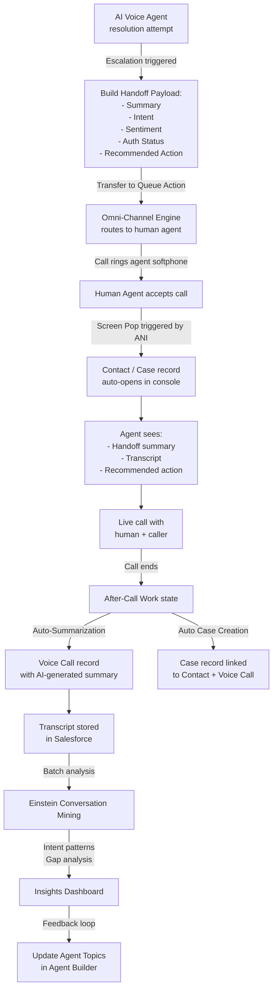

# Lab ADV-04 — Escalation, Handoff, and Voice Analytics

## Learning Objectives
- Explain warm transfer vs cold transfer and when each is used in a contact center
- Describe what data the Agentforce handoff protocol passes from the AI to the human agent
- Configure Screen Pop to automatically open the matched Salesforce record on call accept
- Enable After-Call Work auto-summarization and automatic case creation
- Navigate Einstein Conversation Mining to analyze call patterns and improve agent Topics
- Identify key voice analytics metrics: AHT, FCR, Containment Rate, Sentiment, CSAT

---

## Concept Deep Dive: Escalation and Human Handoff

### Warm Transfer vs Cold Transfer

In contact center terminology, how a call is moved from one party to another matters deeply to the customer experience.

A **cold transfer** (also called a blind transfer) is when the original party transfers the call without any conversation with the receiving party. The receiving agent or queue simply receives the call with no context about why it was transferred or what was already discussed. The customer must re-explain their situation from the beginning. Cold transfers are fast but produce poor customer experience.

A **warm transfer** (also called an attended transfer or consultative transfer) is when the transferring party stays on the line, briefs the receiving party, and then disconnects once the handoff is complete. The customer hears hold music briefly while the transfer happens, but the receiving human agent already knows who is calling, what the issue is, and what has been tried.

In the Agentforce Voice context, the AI Voice Agent always performs the equivalent of a warm transfer — not by staying on the line (it is an AI, not a human), but by populating the Salesforce record with a structured conversation summary, intent, sentiment score, and recommended next action before the call reaches the human agent. This data is immediately visible to the human agent via Screen Pop when they accept the call. The customer experience is warm (the human agent is briefed), even though the mechanism is automated.

### The Agentforce Handoff Protocol

When the AI Voice Agent determines escalation is necessary — either by explicit caller request, repeated failed attempts to resolve the issue, or a specific topic instruction — it executes a structured handoff that populates several data points before transferring.

The data passed in the handoff includes:

- **Conversation Summary**: A concise text summary of what was discussed. Generated by the AI from the full transcript or written by the topic instruction. Example: "Caller inquired about unrecognized charge of $89 on June 3rd invoice. Authentication verified via account number. Issue unresolved — charge not found in billing records."
- **Caller Intent**: The classified topic or intent that best describes why the caller called. Example: "Billing Dispute."
- **Sentiment Score**: An assessment of the caller's emotional state during the conversation (Positive / Neutral / Negative, or a numeric score). High negative sentiment is a signal for the human agent to approach the call with empathy.
- **Recommended Next Action**: What the AI suggests the human agent do first. Example: "Review invoice line items for June 3rd and escalate to billing team if charge cannot be identified."
- **Authentication Status**: Whether the caller was successfully authenticated during the AI conversation, so the human agent does not need to re-verify.
- **Call Context Fields**: Key entities captured during the conversation (account number, case number, product mentioned, etc.).

This structured handoff is what separates Agentforce Voice from a simple IVR handoff, where the only data available is the phone number and the queue the call came from.

### Screen Pop

Screen Pop is one of the highest-value features in any CTI integration. When a human agent accepts an inbound call, Screen Pop automatically opens the relevant Salesforce record in the agent's Service Console — without the agent having to search for anything.

Screen Pop works through ANI matching. ANI (Automatic Number Identification) is the technical term for caller ID — the phone number of the incoming caller. When a call arrives, Salesforce queries its records for a Contact or Account that matches the inbound ANI. If a match is found, that record's page is automatically pushed to the foreground in the Service Console.

Advanced Screen Pop options include:
- **Contact match**: Open the Contact record matching the caller's phone number
- **Account match**: Open the Account record if no direct Contact match is found
- **Case match**: If the caller has an open case, open that Case record
- **New record creation**: If no match is found, open a pre-filled New Contact or New Case form

Screen Pop is configured in the Softphone Layout settings, which define the pop behavior per call type (Inbound, Outbound, Internal) and per match scenario (Single Match, Multiple Matches, No Match).

---

## Concept Deep Dive: After-Call Work and Conversation Mining

### After-Call Work (ACW)

After-Call Work (ACW) is the period immediately after a call ends during which the agent updates records, writes case notes, and closes out call documentation — before becoming available for the next call. Omni-Channel keeps the agent in an "After-Call Work" presence state for the configured time limit.

Salesforce can automate most ACW tasks:
- **Auto-Summarization**: Generates a written summary of the call using the real-time transcript and AI analysis, populated into the Voice Call record's Summary field
- **Sentiment Score**: Calculated from the transcript and stored on the Voice Call record
- **Automatic Case Creation**: If the call is associated with an unresolved issue, a Case is automatically created and linked to the Voice Call record and the matched Contact/Account
- **Activity Logging**: A Task or Voice Call record is automatically created and linked to the Contact record, so the call is visible in the activity timeline

With well-configured ACW automation, a human agent's post-call work is reduced from 3-5 minutes to 30-60 seconds. They review the auto-generated summary, make any corrections, and confirm the case if one was created. This directly reduces Average Handle Time (AHT).

### Einstein Conversation Mining

Einstein Conversation Mining analyzes large volumes of call transcripts (typically hundreds or thousands) to find patterns that no single review would surface. It uses NLP to cluster conversations by intent, identify the most common call drivers, flag recurring unresolved issues, and highlight the top escalation triggers.

Key outputs of Conversation Mining:
- **Top Intents**: What callers are most frequently calling about. Helps prioritize which AI Voice Agent topics to build or improve.
- **Unresolved Patterns**: Calls that ended in escalation or negative sentiment clustered by topic — tells you where the AI agent is failing.
- **Escalation Drivers**: Specific phrases or scenarios that trigger escalation. If "I want to speak to a manager" spikes after a particular AI response, that response needs redesign.
- **Intent Gaps**: Common caller requests that no topic currently handles — these are new Topics to build.
- **Sentiment Trends**: Aggregate sentiment over time, by channel, by product, or by topic.

Conversation Mining feeds directly back into the AI agent improvement loop: mine patterns → identify gaps or failure points → update Agent Topics → measure improvement in the next mining cycle.

---

## Concept Deep Dive: Voice Analytics Metrics

**Average Handle Time (AHT)**: The average duration of a call from first contact to final wrap-up (including ACW). Lower AHT generally means more efficient operations, but too low can indicate agents are rushing. Target varies by industry; enterprise support targets are typically 4-8 minutes AHT.

**First Call Resolution (FCR)**: The percentage of calls fully resolved on the first contact, with no need for callback or follow-up. FCR is a primary quality metric. Higher FCR means better customer experience and lower operational cost.

**Containment Rate**: The percentage of inbound calls that are fully handled by the AI Voice Agent without escalating to a human. A 70% containment rate means 70% of callers got their issue resolved by the AI; 30% escalated. Higher containment = lower cost to serve, but only if the quality of AI resolutions is high (low containment + high CSAT > high containment + low CSAT).

**Sentiment Score**: Aggregate or per-call assessment of caller emotion. Trends over time indicate whether product or service quality is changing.

**CSAT (Customer Satisfaction Score)**: Post-call survey score asking callers to rate their experience. Often collected via an automated IVR survey immediately after the call ("Press 1 for Satisfied, Press 5 for Very Dissatisfied").

**Supervisor Features**: Real-time monitoring (supervisor can listen to live calls), whisper coaching (supervisor can speak to the agent without the caller hearing), and barge-in (supervisor joins the call as a full participant). These are Amazon Connect features surfaced through the Salesforce supervisor dashboard.

---

## Architecture Overview



---

## Prerequisites
- Labs ADV-01 through ADV-03 completed
- TechCorp Voice Agent active and deployed
- Voice Channel (TechCorp Support Line) active with ACW enabled
- At least one Voice Call record in the org (demo org should have sample data for Mining)

---

## Lab Setup
Confirm you have access to the following Setup areas before starting:
- Setup → Omni-Channel → Routing Configurations
- Setup → Softphone Layouts
- App Launcher → Service Console
- App Launcher → Einstein Conversation Mining
- App Launcher → Voice Analytics (or the Voice Analytics tab in the Service Console)

---

## Step-by-Step Instructions

### Part A — Configure the Transfer to Human Action

### Step 1 — Open the Transfer to Human Topic in Agent Builder
1. Navigate to Setup → **Agents**.
2. Click **TechCorp Voice Agent**.
3. Agent Builder opens. In the Topics list (left panel), click **Transfer to Human**.
4. The topic's instruction and actions panel opens.

### Step 2 — Add the Transfer to Queue Action
1. In the Actions section for the Transfer to Human topic, click **Add Action**.
2. Search for `Transfer to Queue` in the action library.
3. Select **Transfer to Queue**.
4. Configure the action:
   - **Queue**: `Voice Support Queue`
   - **Transfer Message** (the message spoken before transfer): `I'll connect you with a specialist now. Please hold briefly.`
5. Click **Save**.

### Step 3 — Write a Handoff Summary Prompt
1. Still in the Transfer to Human topic, locate the topic **Instructions** field.
2. Append the following to the existing instructions:
   ```
   Before executing the Transfer to Queue action, set the Call Summary field to a concise description of:
   1. Why the caller called (the primary issue or question)
   2. What was attempted or discovered during the AI conversation
   3. The recommended first step for the human agent
   Keep the summary under 3 sentences. Write it as a briefing for the human agent, not as a transcript.
   Example summary: "Caller disputes $89 charge on June 3rd invoice. Account number verified. Charge not found in recent transaction records — suggest reviewing pending adjustments in billing system."
   ```
3. Click **Save**.

### Part B — Configure Screen Pop

### Step 4 — Navigate to Softphone Layouts
1. In Quick Find, type `Softphone Layouts`.
2. Click **Softphone Layouts**.
3. Click the softphone layout assigned to your Service Console agents (typically "Standard" or "Voice Layout").
4. Click **Edit**.

### Step 5 — Configure Inbound Call Screen Pop
1. In the Softphone Layout editor, find the **Inbound Call** section.
2. Locate the **Screen Pop** settings:
   - **Screen Pop**: Select `Pop to the screen pop settings specified below` (not "No screen pop" or "Pop to the Salesforce home page")
   - **Screen pop type for single matching record**: Select `Open the record`
   - **Screen pop type for multiple matching records**: Select `Open the search page`
   - **Screen pop type for no matching records**: Select `Open a new record` with the **Object** field set to `Contact`
3. Scroll to find the **Phone Number** matching field. Confirm it is set to match the inbound ANI (calling phone number) against the Contact's **Phone** or **Mobile Phone** fields.
4. Click **Save**.

### Step 6 — Test Screen Pop Behavior (Walkthrough)
In a production environment, you would test by placing a test call. Since we are working in a demo org, trace through the logic:
1. A call comes in from phone number `+1-512-555-0177`
2. Salesforce queries Contacts where Phone = `+1-512-555-0177` or Mobile = `+1-512-555-0177`
3. If one Contact matches: that Contact record opens automatically when the agent accepts the call
4. If multiple Contacts match: the search results page opens so the agent can select the correct one
5. If no Contact matches: a New Contact form opens, pre-filled with the inbound phone number in the Phone field

The key insight: **the agent never has to search for who is calling.** The record is there the moment they answer.

### Part C — Configure After-Call Work Settings

### Step 7 — Enable Auto-Summarization on the Voice Channel
1. In Quick Find, type `Voice Channels`.
2. Click **Voice Channels**.
3. Click **TechCorp Support Line**.
4. Click **Edit**.
5. Find the **After-Call Work** section.
6. Confirm **After-Call Work** is toggled ON (configured in Lab ADV-02).
7. Find the **Einstein Auto-Summarization** toggle and set it to **Enabled**.
   - This tells Salesforce to generate an AI-written summary of the call transcript and populate it in the Voice Call record's Summary field after the call ends.
8. Find the **Sentiment Analysis** toggle and set it to **Enabled**.
   - This populates the Sentiment field on the Voice Call record with a Positive/Neutral/Negative value and score.
9. Click **Save**.

### Step 8 — Enable Automatic Case Creation for Unresolved Calls
1. Still in the Voice Channel settings for TechCorp Support Line, find the **Case Auto-Creation** section (may be labeled "Automatic Case Creation" or under the After-Call Work section).
2. Toggle **Automatic Case Creation** to **Enabled**.
3. Configure:
   - **Case Creation Trigger**: `Unresolved calls only` (creates a case only when the call was escalated or ended without an identified resolution)
   - **Case Record Type**: Select your standard support Case record type
   - **Default Case Subject**: `Inbound Voice Call — [Contact Name]` (use merge field if available, otherwise use a static label)
   - **Default Case Status**: `New`
   - **Default Case Priority**: `Medium`
4. Click **Save**.

**What this means operationally**: Every escalated call automatically creates a case. The agent opens that case after the call, reviews the AI-generated summary, adds any notes, and closes the case when resolved. No more manually creating cases from call notes.

### Part D — Explore Einstein Conversation Mining

### Step 9 — Navigate to Einstein Conversation Mining
1. Click the **App Launcher** (9-dot grid).
2. Search for `Einstein Conversation Mining`.
3. Click **Einstein Conversation Mining** to open the app.
4. The main dashboard loads. If there is demo data, you will see charts and intent clusters.

### Step 10 — Review the Top Intents Panel
1. In the Conversation Mining dashboard, find the **Top Intents** or **Call Drivers** section.
2. This panel shows the most frequent intent categories detected across all analyzed transcripts, ranked by volume.
3. Review the top 5 intents. In a demo org, typical entries might include:
   - "Billing Questions" — 32% of calls
   - "Technical Support" — 28% of calls
   - "Account Changes" — 18% of calls
   - "General Inquiry" — 12% of calls
   - "Escalation Request" — 10% of calls
4. **Action insight**: If "Billing Questions" is 32% of calls but your AI Voice Agent only has a basic Billing Inquiry topic, that is a strong signal to expand your billing topic coverage.

### Step 11 — Review Unresolved Call Patterns
1. In the Conversation Mining dashboard, find the **Unresolved Calls** or **Escalations** section.
2. This shows call conversations that ended in escalation or no resolution, clustered by common themes.
3. Look for any cluster labeled something like "Charge dispute" or "Payment not applied" — these are specific sub-intents that your AI agent is not handling.
4. Click on one cluster to drill down into example call fragments. You will see anonymized transcript excerpts that caused the escalation.
5. **Action insight**: Each unresolved cluster is a candidate for a new Topic or improved Instructions in your AI Voice Agent.

### Step 12 — Use Mining Insights to Plan New Topics
1. Based on what you see in Conversation Mining, document at least two new topics or instruction improvements that would reduce escalations:
   - Example 1: Callers asking "Why was my payment not applied?" are escalating. Create a new topic "Payment Processing Inquiry" that can look up payment status.
   - Example 2: Callers saying "I want to cancel" are escalating without a retention attempt. Update the Transfer to Human topic to offer a retention option before transferring.
2. Navigate back to Agent Builder (Setup → Agents → TechCorp Voice Agent) and add one of these improvements.

### Part E — Review the Voice Analytics Dashboard

### Step 13 — Navigate to Voice Analytics
1. Click the **App Launcher**.
2. Search for `Voice Analytics` or look for it as a tab in the Service Console app.
3. The Voice Analytics dashboard opens.

### Step 14 — Review Key Metric Panels
Explore the following panels in the Voice Analytics dashboard and note what each shows:

1. **Containment Rate panel**: Shows the percentage of calls fully handled by the AI agent vs escalated. A higher percentage indicates better AI agent performance. Look for trends over time — is containment improving after topic updates?

2. **Average Handle Time (AHT) panel**: Shows AHT by time period, broken down by AI-handled calls vs human-handled calls. Human AHT should decrease as the AI agent captures and passes better context.

3. **First Call Resolution (FCR) panel**: Shows what percentage of issues were resolved in a single call. Low FCR means customers are calling back for the same issue — a signal of poor resolution quality, not just high call volume.

4. **Sentiment Score panel**: Shows the distribution of call sentiment scores. A high proportion of Negative sentiment calls warrants investigation in Conversation Mining.

5. **CSAT panel**: If post-call surveys are configured in Amazon Connect, CSAT scores appear here. Correlate CSAT with Sentiment — they should trend together; if they diverge, investigate.

### Step 15 — Review the Supervisor Monitoring Panel
1. In the Service Console, look for a **Supervisor** tab or a **Monitoring** section (only visible to users with Supervisor permissions).
2. The Supervisor panel shows:
   - **Active calls**: All calls currently in progress, with caller wait time and current handler (AI or human)
   - **Agent status board**: All agents, their current presence status, and current call duration
   - **Whisper coaching**: Click a live call, then select "Whisper" to speak to the agent without the caller hearing
   - **Barge-in**: Click a live call, then select "Barge In" to join the call as a full participant (both caller and agent hear you)
3. Note: Whisper coaching and barge-in are Amazon Connect features surfaced in the Salesforce UI through the supervisor CTI integration.

---

## What You Built
You completed the full Agentforce Voice escalation cycle. You configured the Transfer to Human topic with a structured handoff summary, set up Screen Pop to automatically open the caller's Contact record, enabled After-Call Work auto-summarization and automatic case creation, explored Einstein Conversation Mining to identify unresolved call patterns and intent gaps, and reviewed the Voice Analytics dashboard for the key operational metrics (Containment Rate, AHT, FCR, Sentiment, CSAT).

---

## Checkpoint Questions
1. What is the difference between a warm transfer and a cold transfer, and how does Agentforce Voice simulate a warm transfer?
2. What triggers an automatic case creation when Automatic Case Creation is configured on the Voice Channel?
3. A Contact record matches the caller's ANI in Salesforce. What happens in the Service Console when the agent accepts the call?
4. What is Containment Rate, and why is it meaningful only when measured alongside CSAT?
5. What is the primary input source for Einstein Conversation Mining?

---

## Common Errors & Troubleshooting

**Screen Pop does not fire — no record opens when the agent accepts a call**
Most common cause: the Softphone Layout is not assigned to the user's profile, or the Screen Pop settings are set to "No screen pop." Verify the Softphone Layout assignment under Setup → Softphone Layouts → confirm the layout is set as Default. Also ensure the agent has the profile or permission set that has this layout assigned. Secondary cause: the caller's phone number format in Salesforce doesn't match the ANI format — e.g., Salesforce stores numbers as `5125550177` but ANI arrives as `+15125550177`. Normalize phone number formats in both Salesforce records and Amazon Connect.

**Auto-Summarization generates no summary on the Voice Call record**
Confirm Real-Time Transcription was enabled on the Voice Channel AND was on during the specific call. Auto-summarization requires a transcript. If transcription was off (agent opted out or it was toggled off), there is nothing to summarize. Also confirm the Einstein Auto-Summarization toggle is ON (Step 7) and the Einstein for Service license is active.

**Automatic Case Creation creates a case for every call, not just unresolved ones**
The Case Creation Trigger is set to "All calls" rather than "Unresolved calls only." Navigate to the Voice Channel settings → After-Call Work → Automatic Case Creation → change the trigger to "Unresolved calls only" → Save.

**Einstein Conversation Mining shows no data**
Conversation Mining analyzes existing Voice Call records with transcripts. If the org has no prior calls with transcriptions, Mining has nothing to analyze. In a demo org, check App Launcher → Voice Calls — if there are sample records, Mining should work. If the org is brand new, Mining data appears after calls are made with transcription enabled.

**Whisper coaching button is not visible in the Supervisor panel**
Whisper coaching requires a specific permission: "Voice Real-Time Supervisor Features." Confirm the Supervisor user has this permission in their Permission Set. Also confirm the call is currently active — whisper is only available on live calls, not recordings.

---

## Exam Tips
- Agentforce Voice's handoff to a human agent is equivalent to a **warm transfer** because the AI populates context (summary, intent, sentiment) before the human picks up — the human is briefed before the caller speaks.
- **Screen Pop** is configured in the **Softphone Layout**, not in Omni-Channel routing or the Voice Channel settings.
- **After-Call Work** time limit is configured on the **Voice Channel**. **Auto-summarization** is also a Voice Channel setting. Both require Einstein for Service license.
- **Einstein Conversation Mining** analyzes **transcripts** (Voice Call records with transcription data) in bulk. It is not a real-time feature — it analyzes historical data.
- **Containment Rate** alone is not a success metric. A 90% containment rate with 20% CSAT means the AI is handling calls but resolving them poorly. Always measure both together.
- **Supervisor features (whisper, barge-in)** are **Amazon Connect** features surfaced in Salesforce — they are not native Salesforce telephony capabilities.
